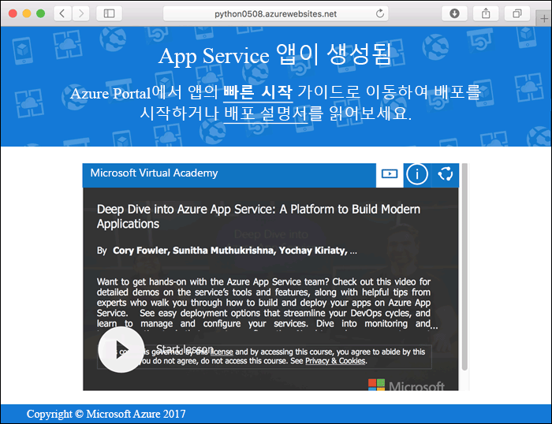

# <a name="create-a-python-web-app-in-azure"></a>Azure에서 Python 웹앱 만들기

[Azure Web Apps](app-service-web-overview.md)는 확장성 있는 자체 패치 웹 호스팅 서비스를 제공합니다.  이 빠른 시작에서는 Python 앱을 개발하고 Azure Web Apps에 배포하는 방법을 설명합니다. [Azure CLI](https://docs.microsoft.com/cli/azure/get-started-with-azure-cli)를 사용하여 웹앱을 만들고 Git을 사용하여 웹앱에 샘플 Python 코드를 배포합니다.


Mac, Windows 또는 Linux 컴퓨터를 사용하여 이 자습서의 단계를 수행하면 됩니다. 필수 구성 요소가 설치된 후 단계를 완료하는 데는 약 5분 정도 걸립니다.

[!INCLUDE [quickstarts-free-trial-note](../../includes/quickstarts-free-trial-note.md)]

## <a name="prerequisites"></a>필수 조건

이 자습서를 완료하려면 다음이 필요합니다.

* <a href="https://git-scm.com/" target="_blank">Git 설치</a>
* <a href="https://www.python.org/downloads/" target="_blank">Python 설치</a>

## <a name="download-the-sample"></a>샘플 다운로드

터미널 창에서 다음 명령을 실행하여 로컬 컴퓨터에 샘플 앱 리포지토리를 복제합니다.

```bash
git clone https://github.com/Azure-Samples/python-docs-hello-world
```

샘플 코드를 포함하는 디렉터리로 변경합니다.

```bash
cd python-docs-hello-world
```

## <a name="run-the-app-locally"></a>로컬에서 앱 실행

`pip`를 사용하여 필요한 패키지를 설치합니다.

```bash
pip install -r requirements.txt
```

Python 웹 서버에서 기본 제공을 시작하려면 터미널 창을 열고 `Python` 명령을 사용하여 응용 프로그램을 로컬로 실행합니다.

```bash
python main.py
```

웹 브라우저를 열고 `http://localhost:5000`의 샘플 앱으로 이동합니다.

이 페이지에 표시된 샘플 앱에서 **Hello World** 메시지를 볼 수 있습니다.


터미널 창에서 **Ctrl+C**를 눌러 웹 서버를 종료합니다.

[!INCLUDE [cloud-shell-try-it.md](../../includes/cloud-shell-try-it.md)]

[!INCLUDE [Configure deployment user](../../includes/configure-deployment-user.md)]

[!INCLUDE [Create resource group](../../includes/app-service-web-create-resource-group.md)]

[!INCLUDE [Create app service plan](../../includes/app-service-web-create-app-service-plan.md)]

## <a name="create-a-web-app"></a>웹앱 만들기

[!INCLUDE [Create web app](../../includes/app-service-web-create-web-app-python-no-h.md)]

새로 만든 웹앱으로 이동합니다. _&lt;앱 이름>_ 을 고유한 앱 이름으로 바꿉니다.

```
http://<app name>.azurewebsites.net
```

새로운 웹앱은 다음과 같아야 합니다.



[!INCLUDE [Push to Azure](../../includes/app-service-web-git-push-to-azure.md)]

```bash
Counting objects: 18, done.
Delta compression using up to 4 threads.
Compressing objects: 100% (16/16), done.
Writing objects: 100% (18/18), 4.31 KiB | 0 bytes/s, done.
Total 18 (delta 4), reused 0 (delta 0)
remote: Updating branch 'master'.
remote: Updating submodules.
remote: Preparing deployment for commit id '44e74fe7dd'.
remote: Generating deployment script.
remote: Generating deployment script for python Web Site
remote: Generated deployment script files
remote: Running deployment command...
remote: Handling python deployment.
remote: KuduSync.NET from: 'D:\home\site\repository' to: 'D:\home\site\wwwroot'
remote: Deleting file: 'hostingstart.html'
remote: Copying file: '.gitignore'
remote: Copying file: 'LICENSE'
remote: Copying file: 'main.py'
remote: Copying file: 'README.md'
remote: Copying file: 'requirements.txt'
remote: Copying file: 'virtualenv_proxy.py'
remote: Copying file: 'web.2.7.config'
remote: Copying file: 'web.3.4.config'
remote: Detected requirements.txt.  You can skip Python specific steps with a .skipPythonDeployment file.
remote: Detecting Python runtime from site configuration
remote: Detected python-3.4
remote: Creating python-3.4 virtual environment.
remote: .................................
remote: Pip install requirements.
remote: Successfully installed Flask click itsdangerous Jinja2 Werkzeug MarkupSafe
remote: Cleaning up...
remote: .
remote: Overwriting web.config with web.3.4.config
remote:         1 file(s) copied.
remote: Finished successfully.
remote: Running post deployment command(s)...
remote: Deployment successful.
To https://<app_name>.scm.azurewebsites.net/<app_name>.git
 * [new branch]      master -> master
```

## <a name="browse-to-the-app"></a>앱으로 이동

웹 브라우저를 사용하여 배포된 응용 프로그램으로 이동합니다.

```bash
http://<app_name>.azurewebsites.net
```

Python 샘플 코드는 Azure App Service 웹앱에서 실행 중입니다.


**축하합니다.** App Service에 첫 번째 Python 앱을 배포했습니다.

## <a name="update-and-redeploy-the-code"></a>코드 업데이트 및 다시 배포

로컬 텍스트 편집기를 사용하여 Python 앱에서 `main.py` 파일을 열고 `return` 문 옆의 텍스트를 약간 변경합니다.

```python
return 'Hello, Azure!'
```

로컬 터미널 창에서 Git의 변경 내용을 커밋한 다음 Azure에 코드 변경 내용을 푸시합니다.

```bash
git commit -am "updated output"
git push azure master
```

배포가 완료되면 [앱으로 이동](#browse-to-the-app) 단계에서 열린 브라우저 창으로 다시 전환하고 페이지를 새로 고칩니다.


## <a name="manage-your-new-azure-web-app"></a>새로운 Azure 웹앱 관리

만든 웹앱을 관리하려면 <a href="https://portal.azure.com" target="_blank">Azure Portal</a>로 이동합니다.

왼쪽 메뉴에서 **App Services**를 클릭한 다음 Azure 웹앱의 이름을 클릭합니다.


웹앱의 개요 페이지가 표시됩니다. 여기에서 찾아보기, 중지, 시작, 다시 시작, 삭제와 같은 기본 관리 작업을 수행할 수 있습니다.


왼쪽 메뉴는 앱 구성을 위한 서로 다른 페이지를 제공합니다.

[!INCLUDE [cli-samples-clean-up](../../includes/cli-samples-clean-up.md)]

## <a name="next-steps"></a>다음 단계

> [!div class="nextstepaction"]
> [Azure Web Apps에 기존 사용자 지정 DNS 이름 매핑](app-service-web-tutorial-custom-domain.md)
