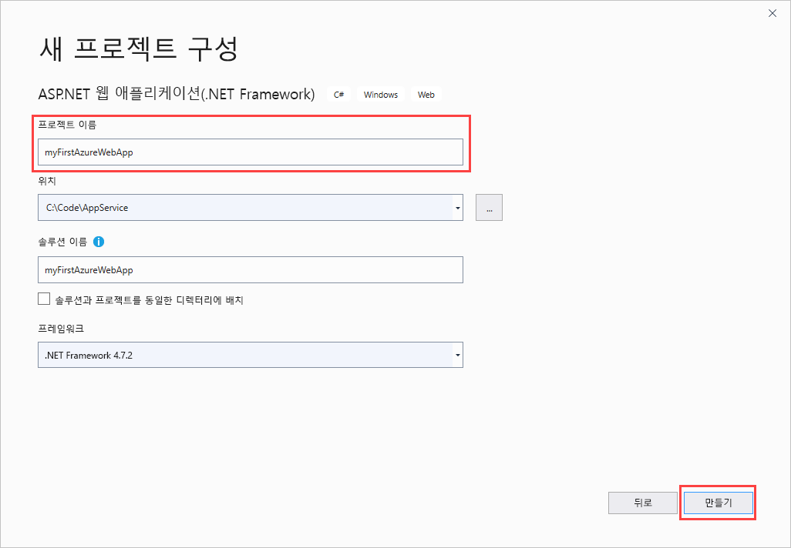
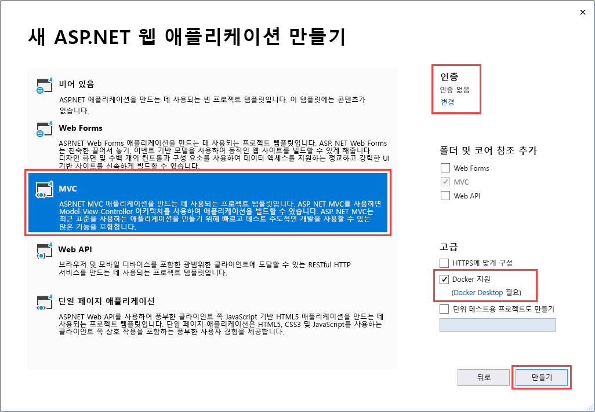
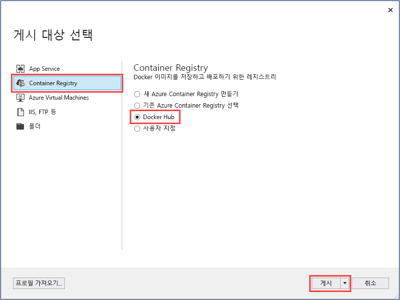
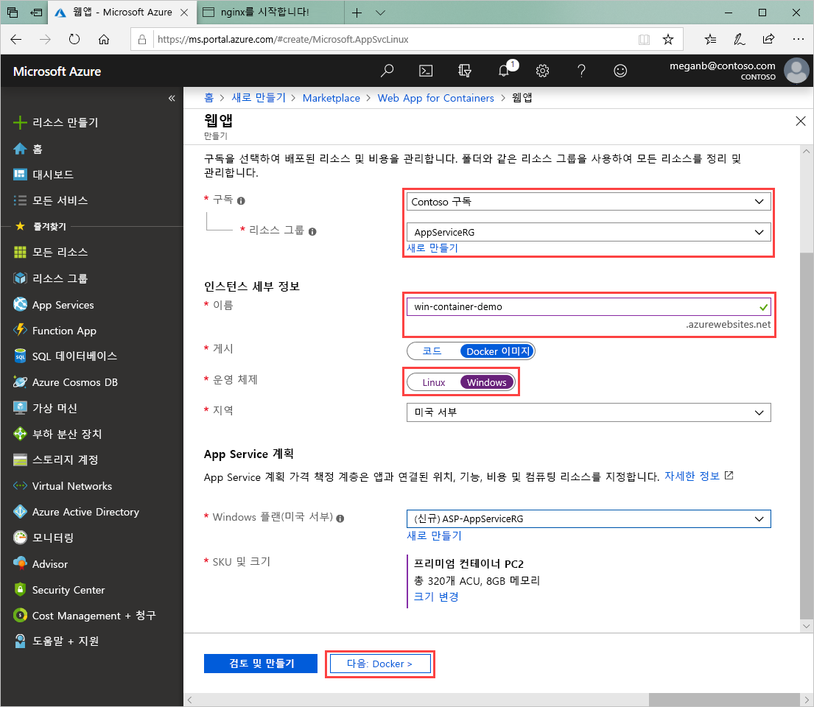
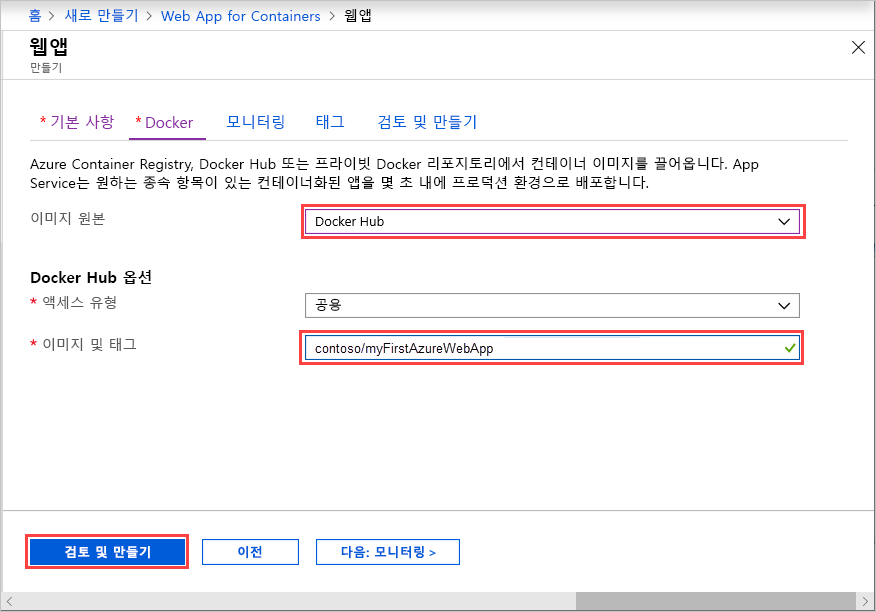

# <a name="run-a-custom-windows-container-in-azure-preview"></a>Azure에서 사용자 지정 Windows 컨테이너 실행(미리 보기)

[Azure App Service](overview.md)는 IIS에서 실행하는 ASP.NET 또는 Node.js와 같은 Windows에서 미리 정의된 애플리케이션 스택을 제공합니다. 미리 구성된 Windows 환경에서는 관리 액세스, 소프트웨어 설치, 글로벌 어셈블리 캐시 변경 등으로부터 운영 체제를 잠급니다. 자세한 내용은 [Azure App Service의 운영 체제 기능](operating-system-functionality.md)을 참조하세요. 애플리케이션에 미리 구성된 환경에서 허용하는 것보다 많은 액세스 권한이 필요한 경우 대신 사용자 지정 Windows 컨테이너를 배포할 수 있습니다.

이 빠른 시작에서는 Windows 이미지의 ASP.NET 앱을 Visual Studio의 [Docker Hub](https://hub.docker.com/)에 배포합니다. Azure App Service의 사용자 지정 컨테이너에서 앱을 실행합니다.

## <a name="prerequisites"></a>필수 조건

이 자습서를 완료하려면 다음이 필요합니다.

- <a href="https://hub.docker.com/" target="_blank">Docker 허브 계정 등록</a>
- <a href="https://docs.docker.com/docker-for-windows/install/" target="_blank">Windows용 Docker 설치</a>
- <a href="https://docs.microsoft.com/virtualization/windowscontainers/quick-start/quick-start-windows-10" target="_blank">Windows 컨테이너를 실행하도록 Docker 전환</a>
- **ASP.NET과 웹 개발** 및 **Azure 개발** 워크로드와 함께 <a href="https://www.visualstudio.com/downloads/" target="_blank">Visual Studio 2019 설치</a> Visual Studio 2019를 이미 설치한 경우:

    - **도움말** > **업데이트 확인**을 차례로 선택하여 Visual Studio에서 최신 업데이트를 설치합니다.
    - **도구** > **도구 및 기능 가져오기**를 차례로 선택하여 Visual Studio에서 워크로드를 추가합니다.

## <a name="create-an-aspnet-web-app"></a>ASP.NET 웹앱 만들기

다음 단계에 따라 ASP.NET 웹앱을 만듭니다.

1. Visual Studio를 연 다음, **새 프로젝트 만들기**를 선택합니다.

1. **새 프로젝트 만들기**에서 C#용 **ASP.NET 웹 애플리케이션(.NET Framework)** 을 찾아서 선택하고, **다음**을 선택합니다.

1. **새 프로젝트 구성**에서 애플리케이션 이름을 _myFirstAzureWebApp_으로 지정한 다음, **만들기**를 선택합니다.

   

1. 모든 종류의 ASP.NET 웹앱을 Azure에 배포할 수 있습니다. 이 빠른 시작에서는 **MVC** 템플릿을 선택합니다.

1. **Docker 지원**을 선택하고 인증이 **인증 없음**으로 설정되어 있는지 확인합니다. **만들기**를 선택합니다.

   

1. _Dockerfile_ 파일이 자동으로 열리지 않으면 **솔루션 탐색기**에서 엽니다.

1. [지원되는 부모 이미지](#use-a-different-parent-image)가 필요합니다. `FROM` 줄을 다음 코드로 바꾸고 파일을 저장하여 부모 이미지를 변경합니다.

   ```Dockerfile
   FROM mcr.microsoft.com/dotnet/framework/aspnet:4.7.2-windowsservercore-ltsc2019
   ```

1. Visual Studio 메뉴에서 **디버그** > **디버깅하지 않고 시작**을 차례로 선택하여 웹앱을 로컬로 실행합니다.

   

## <a name="publish-to-docker-hub"></a>Docker 허브에 게시

1. **솔루션 탐색기**에서 마우스 오른쪽 단추로 **myFirstAzureWebApp** 프로젝트를 클릭하고, **게시**를 선택합니다.

1. **App Service**를 선택한 다음, **게시**를 선택합니다.

1. **게시 대상 선택**에서 **Container Registry** 및 **Docker Hub**를 선택한 다음, **게시**를 클릭합니다.

   

1. Docker Hub 계정 자격 증명을 제공하고 **저장**을 선택합니다.

   배포가 완료될 때가지 기다립니다. 이제 **게시** 페이지에서 나중에 사용할 리포지토리 이름이 표시됩니다.

   

1. 나중에 사용할 수 있도록 이 리포지토리 이름을 복사해 둡니다.

## <a name="create-a-windows-container-app"></a>Windows 컨테이너 앱 만들기

1. [Azure Portal]( https://portal.azure.com)에 로그인합니다.

1. Azure Portal의 왼쪽 위 모서리에서 **리소스 만들기**를 선택합니다.

1. Azure Marketplace 리소스의 목록 위에 있는 검색 상자에서 **Web App for Containers**를 검색하고, **만들기**를 선택합니다.

1. **웹앱 만들기**에서 구독 및 **리소스 그룹**을 선택합니다. 필요한 경우 새 리소스 그룹을 만들 수 있습니다.

1. *win-container-demo*와 같은 앱 이름을 제공하고, **운영 체제**에 대해 **Windows**를 선택합니다. 완료되면 **다음: Docker**를 선택하여 계속합니다.

   

1. **이미지 원본**에 대해 **Docker Hub**를 선택하고, **이미지 및 태그**에 대해 [Docker Hub에 게시](#publish-to-docker-hub)에서 복사한 리포지토리 이름을 입력합니다.

   

    웹 애플리케이션에 대한 사용자 지정 이미지가 [Azure Container Registry](/azure/container-registry/) 또는 다른 프라이빗 리포지토리와 같이 다른 곳에 있는 경우 여기에서 구성할 수 있습니다.

1. **검토 및 만들기**를 선택한 다음, **만들기**를 선택하여 Azure에서 필요한 리소스를 만들 때까지 기다립니다.

## <a name="browse-to-the-container-app"></a>컨테이너 앱으로 이동

Azure 작업이 완료되면 알림 상자가 표시됩니다.


1. **리소스로 이동**을 클릭합니다.

1. 이 리소스의 개요에서 **URL** 옆에 있는 링크를 따릅니다.

다음 페이지의 새 브라우저 페이지가 열립니다.


기본 ASP.NET 홈 페이지가 표시될 때까지 몇 분 정도 기다렸다가 다시 시도하세요.


**축하합니다.** Azure App Service에서 첫 번째 사용자 지정 Windows 컨테이너를 실행하고 있습니다.

## <a name="see-container-start-up-logs"></a>컨테이너 시작 로그를 참조하세요.

Windows 컨테이너를 로드하는 데 다소 시간이 걸릴 수 있습니다. 진행률을 보려면 *\<app_name >* 을 앱 이름으로 대체하여 다음 URL로 이동합니다.
```
https://<app_name>.scm.azurewebsites.net/api/logstream
```

스트리밍된 로그는 다음과 같이 표시됩니다.

```
2018-07-27T12:03:11  Welcome, you are now connected to log-streaming service.
27/07/2018 12:04:10.978 INFO - Site: win-container-demo - Start container succeeded. Container: facbf6cb214de86e58557a6d073396f640bbe2fdec88f8368695c8d1331fc94b
27/07/2018 12:04:16.767 INFO - Site: win-container-demo - Container start complete
27/07/2018 12:05:05.017 INFO - Site: win-container-demo - Container start complete
27/07/2018 12:05:05.020 INFO - Site: win-container-demo - Container started successfully
```

## <a name="update-locally-and-redeploy"></a>로컬로 업데이트 및 다시 배포

1. Visual Studio의 **솔루션 탐색기**에서 **보기** > **홈** > **Index.cshtml**을 차례로 엽니다.

1. 위쪽 가까이에 `<div class="jumbotron">` HTML 태그를 찾아서 전체 요소를 다음 코드로 바꿉니다.

   ```HTML
   <div class="jumbotron">
       <h1>ASP.NET in Azure!</h1>
       <p class="lead">This is a simple app that we’ve built that demonstrates how to deploy a .NET app to Azure App Service.</p>
   </div>
   ```

1. Azure에 다시 배포하려면 **솔루션 탐색기**에서 마우스 오른쪽 단추로 **myFirstAzureWebApp** 프로젝트를 클릭하고, **게시**를 선택합니다.

1. 게시 페이지에서 **게시**를 선택하고 게시가 완료될 때까지 기다립니다.

1. App Service가 Docker 허브에서 새 이미지를 끌어오도록 하려면, 앱을 다시 시작합니다. 포털의 앱 페이지로 돌아가서 **다시 시작** > **예**를 클릭합니다.

   

[컨테이너 앱으로 다시 이동](#browse-to-the-container-app)합니다. 웹 페이지를 새로 고치면 처음에는 앱이 '시작' 페이지로 돌아간 다음 몇 분 후에 업데이트된 웹 페이지가 표시됩니다.


## <a name="use-a-different-parent-image"></a>다른 부모 이미지 사용

다른 사용자 지정 Docker 이미지를 사용하여 자유롭게 앱을 실행할 수 있습니다. 그러나 원하는 프레임워크에 대해 정확한 [부모 이미지](https://docs.docker.com/develop/develop-images/baseimages/)를 선택해야 합니다.

- .NET Framework 앱을 배포하려면 Windows Server Core 2019 [LTSC(장기 서비스 채널)](https://docs.microsoft.com/windows-server/get-started-19/servicing-channels-19#long-term-servicing-channel-ltsc) 릴리스에 따라 부모 이미지를 사용합니다. 
- .NET Core 앱을 배포하려면 Windows Server Nano 1809 [SAC(반기 서비스 채널)](https://docs.microsoft.com/windows-server/get-started-19/servicing-channels-19#semi-annual-channel) 릴리스에 따라 부모 이미지를 사용합니다. 

앱을 시작하는 동안 부모 이미지를 다운로드하는 데 다소 시간이 걸립니다. 그러나 Azure App Service에서 이미 캐시된 다음 부모 이미지 중 하나를 사용하여 시작 시간을 줄일 수 있습니다.

- [mcr.microsoft.com/dotnet/framework/aspnet](https://hub.docker.com/_/microsoft-dotnet-framework-aspnet/):4.7.2-windowsservercore-ltsc2019
- [mcr.microsoft.com/windows/nanoserver](https://hub.docker.com/_/microsoft-windows-nanoserver/):1809 - 이 이미지는 Microsoft [ASP.NET Core](https://hub.docker.com/_microsoft-dotnet-cores-aspnet) Microsoft Windows Nano Server 이미지에 사용되는 기본 컨테이너입니다.

## <a name="next-steps"></a>다음 단계

> [!div class="nextstepaction"]
> [Azure에서 Windows 컨테이너로 마이그레이션](app-service-web-tutorial-windows-containers-custom-fonts.md)
