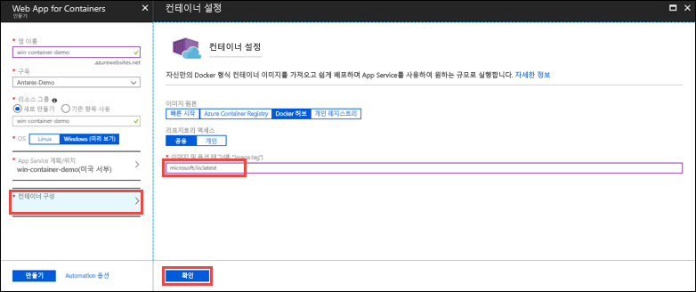

# <a name="run-a-custom-windows-container-in-azure-preview"></a>Azure에서 사용자 지정 Windows 컨테이너 실행(미리 보기)

[Azure App Service](app-service-web-overview.md)는 IIS에서 실행하는 ASP.NET 또는 Node.js와 같은 Windows에서 미리 정의된 응용 프로그램 스택을 제공합니다. 미리 구성된 Windows 환경은 관리자 액세스의 운영 체제, 소프트웨어 설치, 글로벌 어셈블리 캐시 변경 내용을 잠급니다([Azure App Service의 운영 체제 기능](web-sites-available-operating-system-functionality.md) 참조). 응용 프로그램에 미리 구성된 환경에서 허용하는 것보다 많은 액세스 권한이 필요한 경우 대신 사용자 지정 Windows 컨테이너를 배포할 수 있습니다. 이 빠른 시작에서는 [Docker 허브](https://hub.docker.com/)의 Azure App Service에 사용자 지정 IIS 이미지를 배포하는 방법을 보여줍니다.


## <a name="sign-in-to-azure"></a>Azure에 로그인

https://portal.azure.com에서 Azure Portal에 로그인합니다.

## <a name="create-a-windows-container-app"></a>Windows 컨테이너 앱 만들기

1. Azure Portal의 왼쪽 위 모서리에서 **리소스 만들기**를 선택합니다.

2. Azure Marketplace 리소스 목록 위에 있는 검색 상자에서 **Web App for Containers**를 검색하고 선택합니다.

3. *mywebapp*과 같은 앱 이름을 입력하고, 새 리소스 그룹을 만드는 기본값을 적용하고, **OS** 상자에서 **Windows(미리 보기)** 를 클릭합니다.

    

4. **App Service 계획/위치** > **새로 만들기**를 클릭하여 App Service 계획을 만듭니다. 새 계획에 이름을 지정하고, 기본값을 적용하고, **확인**을 클릭합니다.

    

5. **컨테이너 구성**을 클릭하고, **이미지 및 선택적 태그**에서 _microsoft/iis:latest_를 입력하고, **확인**을 클릭합니다.

    

    이 아티클에서는 공용 [microsoft/iis:latest](https://hub.docker.com/r/microsoft/iis/) Docker Hub 이미지를 사용합니다. 웹 응용 프로그램에 대한 사용자 지정 이미지가 [Azure Container Registry](/azure/container-registry/) 또는 다른 개인 리포지토리와 같이 다른 곳에 있는 경우 여기에서 구성할 수 있습니다.

6. **만들기**를 클릭하고, Azure를 수신 대기하여 필수 리소스를 만듭니다.

## <a name="browse-to-the-container-app"></a>컨테이너 앱으로 이동

Azure 작업이 완료되면 알림 상자가 표시됩니다.


1. **리소스로 이동**을 클릭합니다.

2. 앱 페이지에서 **URL** 아래에 있는 링크를 클릭합니다.

새 브라우저 페이지가 다음 페이지로 열립니다.


IIS 시작 페이지가 표시될 때까지 몇 분 정도 기다렸다가 다시 시도하세요.


**축하합니다.** Azure App Service에서 첫 번째 사용자 지정 Windows 컨테이너를 실행하고 있습니다.

## <a name="see-container-start-up-logs"></a>컨테이너 시작 로그를 참조하세요.

Windows 컨테이너를 로드하는 데 다소 시간이 걸릴 수 있습니다. 진행률을 보려면 *\<app_name >* 을 앱 이름으로 대체하여 다음 URL로 이동합니다.
```
https://<app_name>.scm.azurewebsites.net/api/logstream
```

스트리밍된 로그는 다음과 같이 표시됩니다.

```
2018-07-27T12:03:11  Welcome, you are now connected to log-streaming service.
27/07/2018 12:04:10.978 INFO - Site: win-container-demo - Start container succeeded. Container: facbf6cb214de86e58557a6d073396f640bbe2fdec88f8368695c8d1331fc94b
27/07/2018 12:04:16.767 INFO - Site: win-container-demo - Container start complete
27/07/2018 12:05:05.017 INFO - Site: win-container-demo - Container start complete
27/07/2018 12:05:05.020 INFO - Site: win-container-demo - Container started successfully
```

## <a name="use-a-different-docker-image"></a>다양한 Docker 이미지 사용

다른 사용자 지정 Docker 이미지를 사용하여 자유롭게 앱을 실행할 수 있습니다. 그러나 원하는 프레임워크에 대해 정확한 [부모 이미지](https://docs.docker.com/develop/develop-images/baseimages/)를 선택해야 합니다. 

- .NET Framework 앱을 배포하려면 Windows Server Core 2016 [LTSC(장기 서비스 채널)](https://docs.microsoft.com/windows-server/get-started/semi-annual-channel-overview#long-term-servicing-channel-ltsc) 릴리스에 따라 부모 이미지를 사용합니다. 
- .NET Core 앱을 배포하려면 Windows Server Nano 2016 [LTSC(장기 서비스 채널)](https://docs.microsoft.com/windows-server/get-started/semi-annual-channel-overview#long-term-servicing-channel-ltsc) 릴리스에 따라 부모 이미지를 사용합니다. 

앱을 시작하는 동안 부모 이미지를 다운로드하는 데 다소 시간이 걸립니다. 그러나 Azure App Service에서 이미 캐시된 다음 부모 이미지 중 하나를 사용하여 시작 시간을 줄일 수 있습니다.

- [microsoft/iis](https://hub.docker.com/r/microsoft/iis/):windowsservercore-ltsc2016, latest
- [microsoft/iis](https://hub.docker.com/r/microsoft/iis/):nanoserver-sac2016
- [microsoft/aspnet](https://hub.docker.com/r/microsoft/aspnet/):4.7.2-windowsservercore-ltsc2016, 4.7.2, latest
- [microsoft/dotnet](https://hub.docker.com/r/microsoft/dotnet/):2.1-aspnetcore-runtime
- [microsoft/dotnet](https://hub.docker.com/r/microsoft/dotnet/):2.1-sdk
