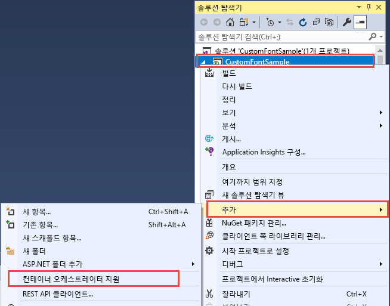
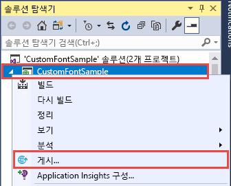
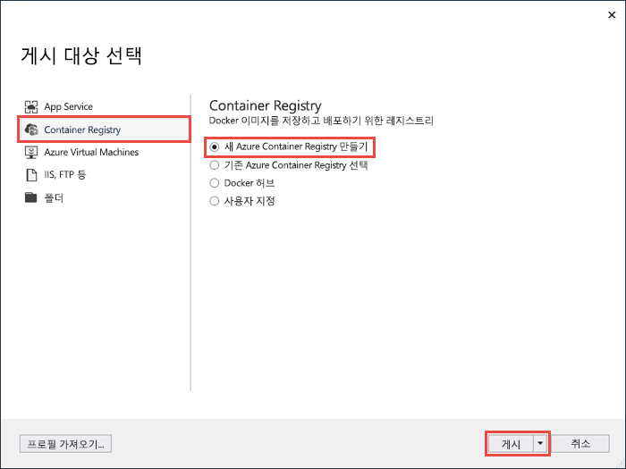
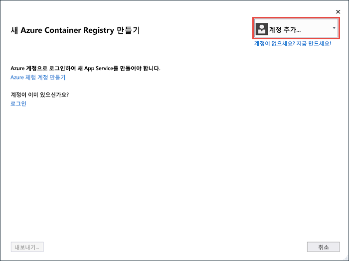
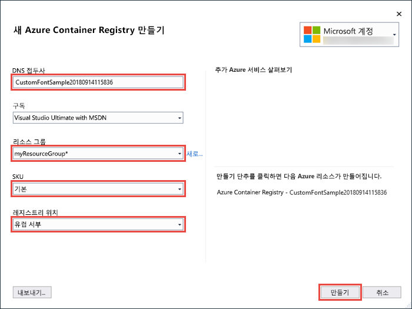
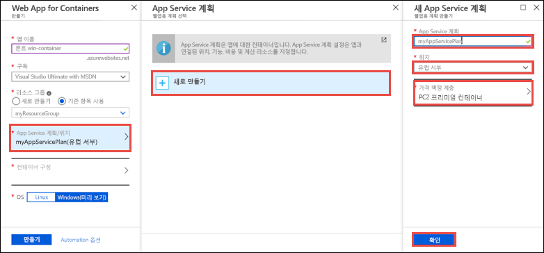
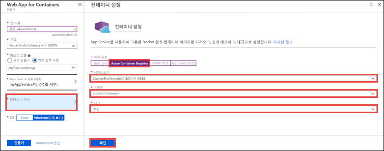

# <a name="migrate-an-aspnet-app-to-azure-app-service-using-a-windows-container-preview"></a>Windows 컨테이너를 사용하여 ASP.NET 앱을 Azure App Service로 마이그레이션(미리 보기)

[Azure App Service](app-service-web-overview.md)는 IIS에서 실행하는 ASP.NET 또는 Node.js와 같은 Windows에서 미리 정의된 응용 프로그램 스택을 제공합니다. 미리 구성된 Windows 환경은 관리자 액세스의 운영 체제, 소프트웨어 설치, 글로벌 어셈블리 캐시 변경 내용을 잠급니다([Azure App Service의 운영 체제 기능](web-sites-available-operating-system-functionality.md) 참조). 하지만 App Service에서 사용자 지정 Windows 컨테이너를 사용하면 앱에 필요한 OS 변경이 가능합니다. 따라서 사용자 지정 OS 및 소프트웨어 구성이 필요한 온-프레미스 앱을 쉽게 마이그레이션할 수 있습니다. 이 자습서에서는 Windows 글꼴 라이브러리에 설치된 사용자 지정 글꼴을 사용하는 ASP.NET 앱을 App Service로 마이그레이션하는 방법을 보여줍니다. 사용자 지정 구성된 Windows 이미지를 Visual Studio에서 [Azure Container Registry](https://docs.microsoft.com/azure/container-registry/)로 배포한 다음, App Service에서 실행합니다.


## <a name="prerequisites"></a>필수 조건

이 자습서를 완료하려면 다음이 필요합니다.

- <a href="https://hub.docker.com/" target="_blank">Docker 허브 계정 등록</a>
- <a href="https://docs.docker.com/docker-for-windows/install/" target="_blank">Windows용 Docker 설치</a>
- <a href="https://docs.microsoft.com/virtualization/windowscontainers/quick-start/quick-start-windows-10#2-switch-to-windows-containers" target="_blank">Windows 컨테이너를 실행하도록 Docker 전환</a>
- **ASP.NET과 웹 개발** 및 **Azure 개발** 워크로드와 함께 <a href="https://www.visualstudio.com/downloads/" target="_blank">Visual Studio 2017 설치</a> Visual Studio 2017이 설치되어 있는 경우:
    - **도움말** > **업데이트 확인**을 클릭하여 Visual Studio에 최신 업데이트를 설치합니다.
    - **도구** > **도구 및 기능 가져오기**를 클릭하여 Visual Studio에서 워크로드를 추가합니다.

## <a name="set-up-the-app-locally"></a>로컬에서 앱 설정

### <a name="download-the-sample"></a>샘플 다운로드

이 단계에서 로컬 .NET 프로젝트를 설정합니다.

- [샘플 프로젝트를 다운로드합니다](https://github.com/Azure-Samples/custom-font-win-container/archive/master.zip).
- *custom-font-win-container.zip* 파일을 추출(압축 해제)합니다.

샘플 프로젝트에는 Windows 글꼴 라이브러리에 설치된 사용자 지정 글꼴을 사용하는 간단한 ASP.NET 응용 프로그램이 포함되어 있습니다. 글꼴을 설치할 필요는 없지만 기본 OS와 통합된 앱의 예입니다. 이러한 앱을 App Service로 마이그레이션하려면 코드 아키텍처를 변경하여 통합을 제거하거나 사용자 지정 Windows 컨테이너에서 그대로 마이그레이션합니다.

### <a name="install-the-font"></a>글꼴 설치

Windows 탐색기에서 _custom-font-win-container-master/CustomFontSample_로 이동하여 _FrederickatheGreat-Regular.ttf_를 마우스 오른쪽 단추로 클릭하고 **설치**를 선택합니다.

이 글꼴은 [Google 글꼴](https://fonts.google.com/specimen/Fredericka+the+Great)을 통해 공개적으로 제공됩니다.

### <a name="run-the-app"></a>앱 실행

Visual Studio에서 *custom-font-win-container/CustomFontSample.sln* 파일을 엽니다. 

디버깅 없이 앱을 실행하려면 `Ctrl+F5`를 입력합니다. 앱이 기본 브라우저에 표시됩니다. 


설치된 글꼴이 사용되기 때문에 App Service 샌드박스에서 앱을 실행할 수 없습니다. 하지만 Windows 컨테이너에 글꼴을 설치할 수 있기 때문에 Windows 컨테이너를 대신 사용하여 앱을 배포할 수 있습니다.

### <a name="configure-windows-container"></a>Windows 컨테이너 구성

솔루션 탐색기에서 **CustomFontSample** 프로젝트를 마우스 오른쪽 단추로 클릭하고 **추가** > **Container Orchestration Support**(컨테이너 오케스트레이션 지원)를 선택합니다.



**Docker Compose** > **확인**을 선택합니다.

이제 프로젝트가 Windows 컨테이너에서 실행되도록 설정되었습니다. _Dockerfile_이 **CustomFontSample** 프로젝트에 추가되고 **docker-compose** 프로젝트가 솔루션에 추가됩니다. 

솔루션 탐색기에서 **Dockerfile**을 엽니다.

[지원되는 부모 이미지](app-service-web-get-started-windows-container.md#use-a-different-parent-image)를 사용해야 합니다. `FROM` 줄을 다음 코드로 바꿔서 부모 이미지를 변경합니다.

```Dockerfile
FROM microsoft/aspnet:4.7.1
```

파일 끝에 다음 줄을 추가하고 파일을 저장합니다.

```Dockerfile
RUN ${source:-obj/Docker/publish/InstallFont.ps1}
```

_InstallFont.ps1_은 **CustomFontSample** 프로젝트에서 찾을 수 있습니다. 글꼴을 설치하는 간단한 스크립트입니다. [스크립트 센터](https://gallery.technet.microsoft.com/scriptcenter/fb742f92-e594-4d0c-8b79-27564c575133)에서 더 복잡한 스크립트 버전을 찾을 수 있습니다.

## <a name="publish-to-azure-container-registry"></a>Azure Container Registry에 게시

[Azure Container Registry](https://docs.microsoft.com/azure/container-registry/)는 컨테이너 배포용 이미지를 저장할 수 있습니다. Azure Container Registry에서 호스트되는 이미지를 사용하도록 App Service를 구성할 수 있습니다.

### <a name="open-publish-wizard"></a>게시 마법사 열기

솔루션 탐색기에서 **CustomFontSample** 프로젝트를 마우스 오른쪽 단추로 클릭하고 **게시**를 선택합니다.



### <a name="create-registry-and-publish"></a>레지스트리 만들기 및 게시

게시 마법사에서 **Container Registry** > **새 Azure Container Registry 만들기** > **게시**를 선택합니다.



### <a name="sign-in-with-azure-account"></a>Azure 계정으로 로그인

**새 Azure Container Registry 만들기** 대화 상자에서 **계정 추가**를 선택하고 Azure 구독에 로그인합니다. 이미 로그인한 경우 드롭다운에서 원하는 구독이 포함된 계정을 선택합니다.



### <a name="configure-the-registry"></a>레지스트리 구성

다음 표의 제안 값을 기반으로 새 컨테이너 레지스트리를 구성합니다. 작업을 마쳤으면 **만들기**를 클릭합니다.

| 설정  | 제안 값 | Blob에 대한 자세한 내용은 |
| ----------------- | ------------ | ----|
|**DNS 접두사**| 생성된 레지스트리 이름을 유지하거나 다른 고유한 이름으로 변경합니다. |  |
|**리소스 그룹**| **새로 만들기**를 클릭하고 **myResourceGroup**을 입력하고 **확인**을 클릭합니다. |  |
|**SKU**| Basic | [가격 책정 계층](https://azure.microsoft.com/pricing/details/container-registry/)|
|**레지스트리 위치**| 서유럽 | |



터미널 창이 열리고 이미지 배포 진행률이 표시됩니다. 배포가 완료될 때가지 기다립니다.

## <a name="sign-in-to-azure"></a>Azure에 로그인

https://portal.azure.com에서 Azure Portal에 로그인합니다.

## <a name="create-a-web-app"></a>웹앱 만들기

왼쪽 메뉴에서 **리소스 만들기** > **웹** > **Web App for Containers**를 선택합니다.

### <a name="configure-the-new-web-app"></a>새 웹앱 구성

만들기 인터페이스에서 다음 표에 따라 설정을 구성합니다.

| 설정  | 제안 값 | Blob에 대한 자세한 내용은 |
| ----------------- | ------------ | ----|
|**앱 이름**| 고유한 이름을 입력합니다. | 웹앱의 URL은 `http://<app_name>.azurewebsites.net`이며, 여기서 `<app_name>`은 앱 이름입니다. |
|**리소스 그룹**| **기존 항목 사용**을 선택하고, **myResourceGroup**을 입력합니다. |  |
|**OS**| Windows(미리 보기) | |

### <a name="configure-app-service-plan"></a>App Service 계획 구성

**App Service 계획/위치** > **새로 만들기**를 클릭합니다. 새 계획 이름을 입력하고 **유럽 서부**를 위치로 선택하고 **확인**을 클릭합니다.



### <a name="configure-container"></a>컨테이너 구성

**컨테이너 구성** > **Azure Container Registry**를 클릭합니다. 앞서 [Azure Container Registry에 게시](#publish-to-azure-container-registry)에서 만든 레지스트리, 이미지 및 태그를 선택하고 **확인**을 클릭합니다.



### <a name="complete-app-creation"></a>앱 만들기 완료

**만들기**를 클릭하고, Azure를 수신 대기하여 필수 리소스를 만듭니다.

## <a name="browse-to-the-web-app"></a>웹앱으로 이동

Azure 작업이 완료되면 알림 상자가 표시됩니다.


1. **리소스로 이동**을 클릭합니다.

2. 앱 페이지에서 **URL** 아래에 있는 링크를 클릭합니다.

새 브라우저 페이지가 다음 페이지로 열립니다.


원하는 글꼴이 적용된 홈 페이지가 표시될 때까지 몇 분 정도 기다렸다가 다시 시도해보십시오.


**축하합니다.** ASP.NET 응용 프로그램이 Windows 컨테이너의 Azure App Service로 마이그레이션되었습니다.

## <a name="see-container-start-up-logs"></a>컨테이너 시작 로그를 참조하세요.

Windows 컨테이너를 로드하는 데 다소 시간이 걸릴 수 있습니다. 진행률을 보려면 *\<app_name >* 을 앱 이름으로 대체하여 다음 URL로 이동합니다.
```
https://<app_name>.scm.azurewebsites.net/api/logstream
```

스트리밍된 로그는 다음과 같이 표시됩니다.

```
14/09/2018 23:16:19.889 INFO - Site: fonts-win-container - Creating container for image: customfontsample20180914115836.azurecr.io/customfontsample:latest.
14/09/2018 23:16:19.928 INFO - Site: fonts-win-container - Create container for image: customfontsample20180914115836.azurecr.io/customfontsample:latest succeeded. Container Id 329ecfedbe370f1d99857da7352a7633366b878607994ff1334461e44e6f5418
14/09/2018 23:17:23.405 INFO - Site: fonts-win-container - Start container succeeded. Container: 329ecfedbe370f1d99857da7352a7633366b878607994ff1334461e44e6f5418
14/09/2018 23:17:28.637 INFO - Site: fonts-win-container - Container ready
14/09/2018 23:17:28.637 INFO - Site: fonts-win-container - Configuring container
14/09/2018 23:18:03.823 INFO - Site: fonts-win-container - Container ready
14/09/2018 23:18:03.823 INFO - Site: fonts-win-container - Container start-up and configuration completed successfully
```

