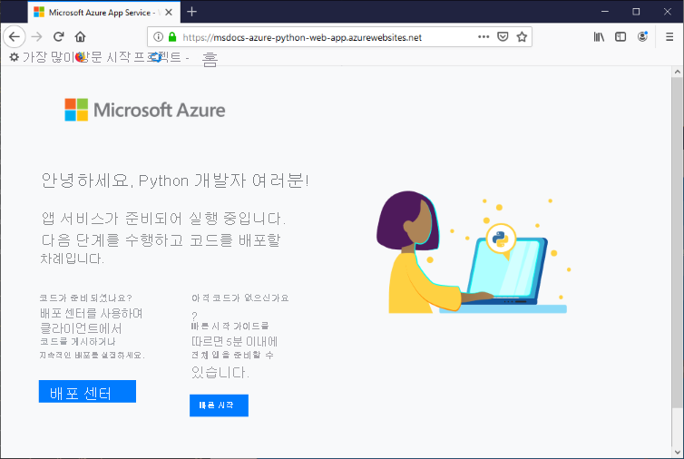

# <a name="configure-a-linux-python-app-for-azure-app-service"></a>Azure App Service용 Linux Python 앱 구성

이 문서에서는 [Azure App Service](overview.md)에서 Python 앱을 실행하는 방법 및 필요한 경우 App Service의 동작을 사용자 지정하는 방법에 대해 설명합니다. Python 앱을 배포할 때 모든 필수 [pip](https://pypi.org/project/pip/) 모듈을 함께 배포해야 합니다.

사용자가 [Git 리포지토리](deploy-local-git.md) 또는 [Zip 패키지](deploy-zip.md)를 배포하면 App Service 배포 엔진은 자동으로 가상 환경을 활성화하고 사용자 대신 `pip install -r requirements.txt`를 실행합니다.

이 가이드에서는 App Service의 기본 제공 Linux 컨테이너를 사용하는 Python 개발자를 위한 주요 개념과 지침을 제공합니다. Azure App Service를 사용한 경험이 없는 경우 먼저 [Python 빠른 시작](quickstart-python.md) 및 [PostgreSQL을 사용하는 Python 자습서](tutorial-python-postgresql-app.md)를 수행해야 합니다.

다음과 같이 [Azure Portal](https://portal.azure.com) 또는 Azure CLI를 사용하여 구성할 수 있습니다.

- **Azure Portal**: [Azure Portal에서 App Service 앱 구성](configure-common.md)의 설명에 따라 앱의 **설정** > **구성** 페이지를 사용합니다.

- **Azure CLI**: 다음과 같은 두 가지 옵션이 있습니다.

    - [Azure Cloud Shell](../cloud-shell/overview.md)에서 명령을 실행합니다.
    - 최신 버전의 [Azure CLI](/cli/azure/install-azure-cli)를 설치하여 명령을 로컬로 실행한 다음, [az login](/cli/azure/reference-index#az-login)을 사용하여 Azure에 로그인합니다.
    
> [!NOTE]
> 현재는 App Service에서 Python 앱을 실행할 때 Linux를 사용할 것을 권장합니다. Windows 옵션에 대한 자세한 내용은 [Windows 버전 App Service 기반의 Python](/visualstudio/python/managing-python-on-azure-app-service)을 참조하세요.

## <a name="configure-python-version"></a>Python 버전 구성

- **Azure Portal**: Linux 컨테이너의 [일반 설정 구성](configure-common.md#configure-general-settings)에 설명된 대로 **구성** 페이지의 **일반 설정** 탭을 사용합니다.

- **Azure CLI**:

    -  [az webapp config show](/cli/azure/webapp/config#az_webapp_config_show) 명령을 사용하여 현재 Python 버전을 표시합니다.
    
        ```azurecli
        az webapp config show --resource-group <resource-group-name> --name <app-name> --query linuxFxVersion
        ```
        
        `<resource-group-name>` 및 `<app-name>`을 웹앱에 적합한 이름으로 바꿉니다.
    
    - [az webapp config set](/cli/azure/webapp/config#az_webapp_config_set) 명령을 사용하여 Python 버전을 설정합니다.
        
        ```azurecli
        az webapp config set --resource-group <resource-group-name> --name <app-name> --linux-fx-version "PYTHON|3.7"
        ```
    
    - [az webapp list-runtimes](/cli/azure/webapp#az_webapp_list_runtimes) 명령을 사용하여 Azure App Service에서 지원되는 모든 Python 버전을 표시합니다.
    
        ```azurecli
        az webapp list-runtimes --linux | grep PYTHON
        ```
    
사용자 고유의 컨테이너 이미지를 빌드하여 지원되지 않는 Python 버전을 실행할 수도 있습니다. 자세한 내용은 [사용자 지정 Docker 이미지 사용](tutorial-custom-container.md?pivots=container-linux)을 참조하세요

<!-- <a> element here to preserve external links-->
<a name="access-environment-variables"></a>

## <a name="customize-build-automation"></a>빌드 자동화 사용자 지정

사용자가 Git 또는 Zip 패키지를 사용하여 앱을 배포할 때 Oryx라고 하는 App Service의 빌드 시스템은 다음 단계를 수행합니다.

1. `PRE_BUILD_COMMAND` 설정을 통해 지정한 경우 사용자 지정 빌드 전 스크립트를 실행합니다.
1. `pip install -r requirements.txt`을 실행합니다. *requirements.txt* 파일은 프로젝트의 루트 폴더에 있어야 합니다. 그렇지 않으면 빌드 프로세스에서 오류를 보고합니다. "setup.py 또는 requirements.txt 파일을 찾을 수 없습니다. pip 설치를 실행하고 있지 않습니다."
1. 리포지토리의 루트에 *manage.py* 가 있는 경우(Django 앱이라는 의미) *manage.py collectstatic* 을 실행합니다. 그러나 `DISABLE_COLLECTSTATIC` 설정이 `true`인 경우 이 단계를 건너뜁니다.
1. `POST_BUILD_COMMAND` 설정을 통해 지정한 경우 사용자 지정 빌드 후 스크립트를 실행합니다.

기본적으로 `PRE_BUILD_COMMAND`, `POST_BUILD_COMMAND` 및 `DISABLE_COLLECTSTATIC` 설정은 비어 있습니다. 

- Django 앱을 빌드할 때 collectstatic을 실행하지 않도록 설정하려면 `DISABLE_COLLECTSTATIC`을 true로 설정합니다.

- 빌드 전 명령을 실행하려면 명령을 포함하도록(예: `echo Pre-build command`) 또는 프로젝트 루트를 기준으로 하는 스크립트 파일 경로를 포함하도록(예: `scripts/prebuild.sh`) `PRE_BUILD_COMMAND`를 설정합니다. 모든 명령은 프로젝트 루트 폴더에 대한 상대 경로를 사용해야 합니다.

- 빌드 후 명령을 실행하려면 명령을 포함하도록(예: `echo Post-build command`) 또는 프로젝트 루트를 기준으로 하는 스크립트 파일 경로를 포함하도록(예: `scripts/postbuild.sh`) `POST_BUILD_COMMAND`를 설정합니다. 모든 명령은 프로젝트 루트 폴더에 대한 상대 경로를 사용해야 합니다.

빌드 자동화를 사용자 지정하는 추가 설정은 [Oryx 구성](https://github.com/microsoft/Oryx/blob/master/doc/configuration.md)을 참조하세요. 

빌드 및 배포 로그에 액세스하려면 [배포 로그 액세스](#access-deployment-logs)를 참조하세요.

Linux에서 App Service를 실행하고 Python 앱을 빌드하는 방법에 대한 자세한 내용은 [Oryx에서 Python 앱을 탐지하고 빌드하는 방법](https://github.com/microsoft/Oryx/blob/master/doc/runtimes/python.md)을 참조하세요.

> [!NOTE]
> `PRE_BUILD_SCRIPT_PATH` 및 `POST_BUILD_SCRIPT_PATH` 설정은 `PRE_BUILD_COMMAND` 및 `POST_BUILD_COMMAND`와 동일하며 레거시 용도로 지원됩니다.
> 
> `SCM_DO_BUILD_DURING_DEPLOYMENT` 설정은 `true` 또는 1을 포함하는 경우 배포 중에 Oryx 빌드를 트리거합니다. git, Azure CLI 명령 `az webapp up` 및 Visual Studio Code를 사용하여 배포하는 경우 이 설정은 true입니다.

> [!NOTE]
> Oryx가 실행되는 빌드 컨테이너는 앱이 실행되는 런타임 컨테이너와 다르므로 모든 빌드 전 및 빌드 후 스크립트에서 항상 상대 경로를 사용해야 합니다. 컨테이너 내에서 앱 프로젝트 폴더의 정확한 배치를 사용하지 마세요(예를 들어 *site/wwwroot* 에 배치됨).

## <a name="production-settings-for-django-apps"></a>Django 앱의 프로덕션 설정

Azure App Service와 같은 프로덕션 환경의 경우 Django 앱은 Django의 [배포 검사 목록](https://docs.djangoproject.com/en/3.1/howto/deployment/checklist/)(djangoproject.com)을 따라야 합니다.

다음 표에는 Azure와 관련된 프로덕션 설정이 설명되어 있습니다. 이러한 설정은 앱의 *setting.py* 파일에서 정의됩니다.

| Django 설정 | Azure에 대한 지침 |
| --- | --- |
| `SECRET_KEY` | [환경 변수로 앱 설정에 액세스](#access-app-settings-as-environment-variables)에 설명된 대로 App Service 설정에 값을 저장합니다. [값을 Azure Key Vault에 "비밀"로 저장](/azure/key-vault/secrets/quick-create-python)할 수도 있습니다. |
| `DEBUG` | App Service에서 값이 0(false)인 `DEBUG` 설정을 만든 다음, 해당 값을 환경 변수로 로드합니다. 개발 환경에서 값이 1(true)인 `DEBUG` 환경 변수를 만듭니다. |
| `ALLOWED_HOSTS` | Django 앱을 프로덕션 환경에서 사용하려면 *settings.py* 의 `ALLOWED_HOSTS` 배열에 앱 URL을 포함해야 합니다. 이 URL은 런타임에 `os.environ['WEBSITE_HOSTNAME']` 코드를 사용하여 검색할 수 있습니다. App Service는 자동으로 `WEBSITE_HOSTNAME` 환경 변수를 앱의 URL로 설정합니다. |
| `DATABASES` | App Service에서 데이터베이스 연결에 대한 설정을 정의한 다음, 해당 설정을 환경 변수로 로드하여 [`DATABASES`](https://docs.djangoproject.com/en/3.1/ref/settings/#std:setting-DATABASES) 사전을 채웁니다. 값(특히 사용자 이름 및 암호)을 [Azure Key Vault 비밀](/azure/key-vault/secrets/quick-create-python)로 저장할 수도 있습니다. |

## <a name="container-characteristics"></a>컨테이너 특성

App Service에 배포된 Python 앱은 [App Service Python GitHub 리포지토리](https://github.com/Azure-App-Service/python)에 정의된 Linux Docker 컨테이너 내에서 실행됩니다. 버전별 디렉터리 내에서 이미지 구성을 찾을 수 있습니다.

이 컨테이너에는 다음과 같은 특성이 있습니다.

- 앱은 `--bind=0.0.0.0 --timeout 600` 추가 인수를 통해 [Gunicorn WSGI HTTP 서버](https://gunicorn.org/)를 사용하여 실행됩니다.
    - [Gunicorn 구성 개요](https://docs.gunicorn.org/en/stable/configure.html#configuration-file)(docs.gunicorn.org)에 설명된 대로 프로젝트 루트의 *gunicorn.conf.py* 파일을 통해 Gunicorn의 구성 설정을 제공할 수 있습니다. [시작 명령을 사용자 지정](#customize-startup-command)할 수도 있습니다.

    - 우발적인 또는 고의적인 DDOS 공격으로부터 웹앱을 보호하기 위해 Gunicorn은 [Gunicorn 배포](https://docs.gunicorn.org/en/latest/deploy.html)(docs.gunicorn.org)에 설명된 대로 Nginx 역방향 프록시 뒤에서 실행됩니다.

- 기본적으로 기본 컨테이너 이미지에는 Flask 웹 프레임워크만 포함되지만, 컨테이너는 WSGI 및 Python 3.6 이상과 호환되는 다른 프레임워크(예: Django)를 지원합니다.

- Django와 같은 추가 패키지를 설치하려면 직접 종속성을 지정하는 프로젝트의 루트에 [*requirements.txt*](https://pip.pypa.io/en/stable/user_guide/#requirements-files) 파일을 만듭니다. 그러면 프로젝트를 배포할 때 App Service에서 이러한 종속성을 자동으로 설치합니다.

    종속성을 설치하려면 *requirements.txt* 파일이 *반드시* 프로젝트 루트에 있어야 합니다. 그렇지 않으면 빌드 프로세스에서 오류를 보고합니다. "setup.py 또는 requirements.txt 파일을 찾을 수 없습니다. pip 설치를 실행하고 있지 않습니다." 이 오류가 발생하는 경우 요구 사항 파일의 위치를 확인합니다.

- App Service는 웹앱의 URL을 사용하여 `WEBSITE_HOSTNAME`이라는 환경 변수를 자동으로 정의합니다(예: `msdocs-hello-world.azurewebsites.net`). 또한 앱 이름을 사용하여 `WEBSITE_SITE_NAME`을 정의합니다(예: `msdocs-hello-world`). 
   
## <a name="container-startup-process"></a>컨테이너 시작 프로세스

시작하는 동안 Linux의 App Service 컨테이너에서 실행하는 단계는 다음과 같습니다.

1. [사용자 지정 시작 명령](#customize-startup-command)을 사용합니다(제공된 경우).
2. [Django 앱](#django-app)이 있는지 확인하고, 이 앱에 대한 Gunicorn이 탐지되면 시작합니다.
3. [Flask 앱](#flask-app)이 있는지 확인하고, 이 앱에 대한 Gunicorn이 탐지되면 시작합니다.
4. 다른 앱이 없으면 컨테이너에 기본적으로 제공되는 기본 앱을 시작합니다.

다음 섹션에서는 각 옵션에 대한 추가 세부 정보를 제공합니다.

### <a name="django-app"></a>Django 앱

Django 앱의 경우 App Service는 앱 코드 내에서 `wsgi.py`라는 파일을 찾고, 다음 명령을 사용하여 Gunicorn을 실행합니다.

```bash
# <module> is the name of the folder that contains wsgi.py
gunicorn --bind=0.0.0.0 --timeout 600 <module>.wsgi
```

시작 명령을 보다 구체적으로 제어하려면 [사용자 지정 시작 명령](#customize-startup-command)을 사용하고, `<module>`을 *wsgi.py* 가 포함된 폴더 이름으로 바꾸고, 해당 모듈이 프로젝트 루트에 있지 않은 경우에는 `--chdir` 인수를 추가합니다. 예를 들어 *wsgi.py* 가 프로젝트 루트의 *knboard/backend/config* 에 있는 경우 `--chdir knboard/backend config.wsgi` 인수를 사용합니다.

프로덕션 로깅을 사용하려면 [사용자 지정 시작 명령](#customize-startup-command)에 대한 예제에 표시된 대로 `--access-logfile` 및 `--error-logfile` 매개 변수를 추가합니다.

### <a name="flask-app"></a>Flask 앱

Flask의 경우 App Service는 *application.py* 또는 *app.py* 파일을 찾고, 다음과 같이 Gunicorn을 시작합니다.

```bash
# If application.py
gunicorn --bind=0.0.0.0 --timeout 600 application:app

# If app.py
gunicorn --bind=0.0.0.0 --timeout 600 app:app
```

기본 앱 모듈이 다른 파일에 포함되어 있거나, 앱 개체에 대해 다른 이름을 사용하거나, Gunicorn에 인수를 추가로 제공하려면 [사용자 지정 시작 명령](#customize-startup-command)을 사용합니다.

### <a name="default-behavior"></a>기본 동작

App Service는 사용자 지정 명령, Django 앱 또는 Flask 앱을 찾지 못하면 다음 그림처럼 _opt/defaultsite_ 폴더에 있는 기본 읽기 전용 앱을 실행합니다.

코드를 배포했는데 여전히 기본 앱이 표시되는 경우 [문제 해결 - 앱이 표시되지 않음](#app-doesnt-appear)을 참조하세요.

[](#app-doesnt-appear)

마찬가지로 기본 앱 대신 배포한 앱이 표시되는 경우 [문제 해결 - 앱이 표시되지 않음](#app-doesnt-appear)을 참조하세요.

## <a name="customize-startup-command"></a>시작 명령 사용자 지정

이 문서의 앞부분에서 언급했듯이, [Gunicorn 구성 개요](https://docs.gunicorn.org/en/stable/configure.html#configuration-file)에 설명된 대로 프로젝트 루트의 *gunicorn.conf.py* 파일을 통해 Gunicorn의 구성 설정을 제공할 수 있습니다.

이러한 구성으로 충분하지 않은 경우 사용자 지정 시작 명령을 제공하거나 시작 명령 파일의 여러 명령을 제공하여 컨테이너의 시작 동작을 제어할 수 있습니다. 시작 명령 파일의 이름은 *startup.sh*, *startup.cmd*, *startup.txt* 등과 같이 원하는 대로 지정할 수 있습니다.

모든 명령은 프로젝트 루트 폴더에 대한 상대 경로를 사용해야 합니다.

시작 명령 또는 명령 파일을 지정하는 방법은 다음과 같습니다.

- **Azure Portal**: 앱의 **구성** 페이지를 선택한 다음, **일반 설정** 을 선택합니다. **시작 명령** 필드에서 시작 명령의 전체 텍스트 또는 시작 명령 파일의 이름을 입력합니다. 그런 다음, **저장** 을 선택하여 변경 내용을 적용합니다. Linux 컨테이너의 [ 일반 설정 구성](configure-common.md#configure-general-settings)을 참조하세요.

- **Azure CLI**: [az webapp config set](/cli/azure/webapp/config#az_webapp_config_set) 명령과 `--startup-file` 매개 변수를 사용하여 시작 명령 또는 파일을 설정합니다.

    ```azurecli
    az webapp config set --resource-group <resource-group-name> --name <app-name> --startup-file "<custom-command>"
    ```
        
    `<custom-command>`를 시작 명령의 전체 텍스트 또는 시작 명령 파일의 이름으로 바꿉니다.
        
App Service는 사용자 지정 시작 명령 또는 파일을 처리할 때 발생하는 모든 오류를 무시한 다음, Django 및 Flask 앱을 찾아 시작 프로세스를 계속 진행합니다. 예상하는 동작이 발생하지 않는 경우 시작 명령 또는 파일이 오류 없이 작동하고 시작 명령 파일이 앱 코드와 함께 App Service에 배포되었는지 확인합니다. [진단 로그](#access-diagnostic-logs)에서 추가 정보를 확인할 수도 있습니다. 또한 [Azure Portal](https://portal.azure.com)에서 앱의 **문제 진단 및 해결** 페이지를 확인합니다.

### <a name="example-startup-commands"></a>시작 명령 예제

- **추가된 Gunicorn 인수**: 다음 예제에서는 Django 앱을 시작하기 위해 Gunicorn 명령줄에 `--workers=4`를 추가합니다. 

    ```bash
    # <module-path> is the relative path to the folder that contains the module
    # that contains wsgi.py; <module> is the name of the folder containing wsgi.py.
    gunicorn --bind=0.0.0.0 --timeout 600 --workers=4 --chdir <module_path> <module>.wsgi
    ```    

    자세한 내용은 [Gunicorn 실행](https://docs.gunicorn.org/en/stable/run.html)(docs.gunicorn.org)을 참조하세요.

- **Django에 프로덕션 로깅을 사용하도록 설정**: 다음과 같이 `--access-logfile '-'` 및 `--error-logfile '-'` 인수를 명령줄에 추가합니다.

    ```bash    
    # '-' for the log files means stdout for --access-logfile and stderr for --error-logfile.
    gunicorn --bind=0.0.0.0 --timeout 600 --workers=4 --chdir <module_path> <module>.wsgi --access-logfile '-' --error-logfile '-'
    ```    

    이러한 로그는 [App Service 로그 스트림](#access-diagnostic-logs)에 표시됩니다.

    자세한 내용은 [Gunicorn 로깅](https://docs.gunicorn.org/en/stable/settings.html#logging)(docs.gunicorn.org)을 참조하세요.
    
- **사용자 지정 Flask 기본 모듈**: 기본적으로 App Service는 Flask 앱의 기본 모듈이 *application.py* 또는 *app.py* 라고 가정합니다. 기본 모듈이 다른 이름을 사용하는 경우 시작 명령을 사용자 지정해야 합니다. 예를 들어 기본 모듈이 *hello.py* 이고 해당 파일에서 Flask 앱 개체의 이름이 `myapp`인 Flask 앱이 있는 경우 명령은 다음과 같습니다.

    ```bash
    gunicorn --bind=0.0.0.0 --timeout 600 hello:myapp
    ```
    
    기본 모듈이 하위 폴더(예: `website`)인 경우 `--chdir` 인수로 이 폴더를 지정합니다.
    
    ```bash
    gunicorn --bind=0.0.0.0 --timeout 600 --chdir website hello:myapp
    ```
    
- **비-Gunicorn 서버 사용**: [aiohttp](https://aiohttp.readthedocs.io/en/stable/web_quickstart.html) 같은 다른 웹 서버를 사용하려면 다음과 같이 적절한 명령을 시작 명령으로 또는 시작 명령 파일에 사용합니다.

    ```bash
    python3.7 -m aiohttp.web -H localhost -P 8080 package.module:init_func
    ```

## <a name="access-app-settings-as-environment-variables"></a>앱 설정에 환경 변수로 액세스

앱 설정은 [앱 설정 구성](configure-common.md#configure-app-settings)에 설명된 대로 앱을 위한 클라우드에 저장된 값입니다. 이러한 설정은 앱 코드에 환경 변수로 사용할 수 있으며 표준 [os.environ](https://docs.python.org/3/library/os.html#os.environ) 패턴을 사용하여 액세스할 수 있습니다.

예를 들어 `DATABASE_SERVER`라는 앱 설정을 만든 경우 다음 코드는 해당 설정의 값을 검색합니다.

```python
db_server = os.environ['DATABASE_SERVER']
```
    
## <a name="detect-https-session"></a>HTTPS 세션 검색

App Service에서, [SSL 종료](https://wikipedia.org/wiki/TLS_termination_proxy)(wikipedia.org)는 네트워크 부하 분산 장치에서 발생하므로 모든 HTTPS 요청은 암호화되지 않은 HTTP 요청으로 앱에 도달합니다. 앱 논리에서 사용자 요청의 암호화 여부를 확인해야 하는 경우 `X-Forwarded-Proto` 헤더를 검사합니다.

```python
if 'X-Forwarded-Proto' in request.headers and request.headers['X-Forwarded-Proto'] == 'https':
# Do something when HTTPS is used
```

인기 있는 웹 프레임워크를 사용하여 표준 앱 패턴의 `X-Forwarded-*` 정보에 액세스할 수 있습니다. [CodeIgniter](https://codeigniter.com/)에서, [is_https()](https://github.com/bcit-ci/CodeIgniter/blob/master/system/core/Common.php#L338-L365)는 기본적으로 `X_FORWARDED_PROTO` 값을 확인합니다.

## <a name="access-diagnostic-logs"></a>진단 로그 액세스

[!INCLUDE [Access diagnostic logs](../../includes/app-service-web-logs-access-linux-no-h.md)]

Azure Portal을 통해 로그에 액세스하려면 앱의 왼쪽 메뉴에서 **모니터링** > **로그 스트림** 을 선택합니다.

## <a name="access-deployment-logs"></a>배포 로그 액세스

코드를 배포하면 App Service는 [빌드 자동화 사용자 지정](#customize-build-automation) 섹션에서 설명한 빌드 프로세스를 수행합니다. 빌드는 자체 컨테이너에서 실행되기 때문에 빌드 로그는 앱의 진단 로그와 별도로 저장됩니다.

다음 단계에 따라 배포 로그에 액세스합니다.

1. 해당 웹앱의 Azure Portal 왼쪽 메뉴에서 **배포** > **배포 센터(미리 보기)** 를 선택합니다.
1. **로그** 탭에서 가장 최근 커밋의 **커밋 ID** 를 선택합니다.
1. 나타나는 **로그 세부 정보** 페이지에서 "oryx 빌드 실행 중..." 옆에 표시되는 **로그 표시...** 링크를 선택합니다.

*requirements.txt* 의 잘못된 종속성과 같은 빌드 문제와 빌드 전 또는 빌드 후 스크립트의 오류가 이러한 로그에 표시됩니다. 요구 사항 파일의 이름이 정확하게 *requirements.txt* 로 지정되지 않았거나 프로젝트의 루트 폴더에 표시되지 않는 경우에도 오류가 발생합니다.

## <a name="open-ssh-session-in-browser"></a>브라우저에서 SSH 세션 열기

[!INCLUDE [Open SSH session in browser](../../includes/app-service-web-ssh-connect-builtin-no-h.md)]

SSH 세션에 성공적으로 연결되면 창 아래쪽에 "SSH 연결 설정됨"이라는 메시지가 표시됩니다. "SSH_CONNECTION_CLOSED" 같은 오류가 발생하거나 컨테이너를 다시 시작한다는 메시지가 표시되면 오류 때문에 앱 컨테이너가 시작되지 않을 수 있습니다. 가능한 문제를 조사하는 단계는 [문제 해결](#troubleshooting)을 참조하세요.

## <a name="troubleshooting"></a>문제 해결

일반적으로 문제 해결의 첫 번째 단계는 App Service 진단을 사용하는 것입니다.

1. 해당 웹앱의 Azure Portal 왼쪽 메뉴에서 **문제 진단 및 해결** 을 선택합니다.
1. **가용성 및 성능** 을 선택합니다.
1. **애플리케이션 로그**, **컨테이너 충돌** 및 **컨테이너 문제** 옵션의 정보를 검사합니다. 대부분의 일반적인 문제가 여기서 발생합니다.

다음으로 오류 메시지에 대한 [배포 로그](#access-deployment-logs) 및 [앱 로그](#access-diagnostic-logs)를 검사합니다. 이러한 로그를 검사하여 앱 배포 또는 앱 시작을 방해하는 특정 문제를 파악할 수 있는 경우가 자주 있습니다. 예를 들어 *requirements.txt* 파일의 이름이 올바르지 않거나 프로젝트 루트 폴더에 없는 경우 빌드가 실패할 수 있습니다.

다음 섹션에서는 특정 문제에 대한 추가 지침을 제공합니다.

- [앱이 표시되지 않음 - 기본 앱 표시](#app-doesnt-appear)
- [앱이 표시되지 않음 - "서비스를 사용할 수 없음" 메시지](#service-unavailable)
- [setup.py 또는 requirements.txt 파일을 찾을 수 없음](#could-not-find-setuppy-or-requirementstxt)
- [암호를 입력할 때 SSH 세션에 표시되지 않음](#other-issues)
- [SSH 세션의 명령이 잘려서 표시됨](#other-issues)
- [정적 자산이 Django 앱에 표시되지 않음](#other-issues)
- [SSL 연결이 필요함](#other-issues)

#### <a name="app-doesnt-appear"></a>앱이 표시되지 않음

- **사용자 고유의 앱 코드가 배포되면 기본 앱이 표시됩니다.** 앱 코드를 App Service에 배포하지 않았거나 App Service에서 앱 코드를 찾지 못하여 기본 앱을 대신 실행했기 때문에 [기본 앱](#default-behavior)이 표시됩니다.

    - App Service를 다시 시작하고, 15-20초 동안 기다린 다음, 앱을 다시 확인합니다.
    
    - Windows 기반 인스턴스보다는 Linux용 App Service를 사용해야 합니다. Azure CLI에서 명령 `az webapp show --resource-group <resource-group-name> --name <app-name> --query kind`을 실행하여 `<resource-group-name>` 및 `<app-name>`을 적절하게 대체합니다. `app,linux`가 출력으로 표시되어야 합니다. 그렇지 않으면 App Service를 다시 만들고 Linux를 선택합니다.
    
    - [SSH](#open-ssh-session-in-browser)를 사용하여 App Service에 직접 연결하고, 파일이 *site/wwwroot* 에 있는지 확인합니다. 파일이 없으면 다음 단계를 수행합니다.
      1. 값이 1인 `SCM_DO_BUILD_DURING_DEPLOYMENT`라는 앱 설정을 만들고, 코드를 다시 배포하고, 몇 분 정도 기다렸다가 앱에 다시 액세스를 시도합니다. 앱 설정을 만드는 방법에 대한 자세한 내용은 [Azure Portal에서 App Service 앱 구성](configure-common.md)을 참조하세요.
      1. 배포 프로세스를 검토하고, [배포 로그를 검사](#access-deployment-logs)하고, 오류를 수정하고, 앱을 다시 배포합니다.
    
    - 파일이 있으면 App Service에서 특정 시작 파일을 식별하지 못한 것입니다. 앱이 [Django](#django-app) 또는 [Flask](#flask-app)에 대해 예상되는 App Service로 구성되었는지 확인하거나 [사용자 지정 시작 명령](#customize-startup-command)을 사용합니다.

- <a name="service-unavailable"></a>**브라우저에 "서비스를 사용할 수 없음"이라는 메시지가 표시됩니다.** App Service에서 Gunicorn 서버를 시작했다는 내용의 App Service 응답을 기다리는 동안 브라우저에서 시간이 초과되었지만, 앱 자체는 시작되지 않았습니다. 이 상태는 Gunicorn 인수가 올바르지 않거나 앱 코드에 오류가 있다는 뜻일 수 있습니다.

    - 특히 App Service 계획에서 가장 낮은 가격 책정 계층을 사용하는 경우 브라우저를 새로 고칩니다. 예를 들어 체험 계층을 사용하는 경우 앱을 시작하는 데 시간이 더 오래 걸릴 수 있으며, 브라우저를 새로 고친 후에 응답하게 됩니다.

    - 앱이 [Django](#django-app) 또는 [Flask](#flask-app)에 대해 예상되는 App Service로 구성되었는지 확인하거나 [사용자 지정 시작 명령](#customize-startup-command)을 사용합니다.

    - 오류 메시지의 [앱 로그 스트림](#access-diagnostic-logs)을 검사합니다. 이 로그는 앱 코드의 오류를 보여줍니다.

#### <a name="could-not-find-setuppy-or-requirementstxt"></a>setup.py 또는 requirements.txt 파일을 찾을 수 없음

- **로그 스트림에 "setup.py 또는 requirements.txt 파일을 찾을 수 없습니다. pip 설치를 실행하고 있지 않습니다"라는 메시지가 표시되는 경우**: Oryx 빌드 프로세스에서 *requirements.txt* 파일을 찾지 못했습니다.

    - [SSH](#open-ssh-session-in-browser)를 통해 웹앱의 컨테이너에 연결하고 *requirements.txt* 파일의 이름이 올바르게 지정되었으며 *site/wwwroot* 에 있는지 확인합니다. 파일이 없으면 리포지토리에 파일을 만들고 배포에 포함시킵니다. 파일이 별도의 폴더에 있으면 루트로 이동합니다.

#### <a name="other-issues"></a>기타 문제

- **암호를 입력할 때 SSH 세션에 표시되지 않음**: 보안상의 이유로 SSH 세션은 사용자가 입력하는 암호를 숨깁니다. 하지만 문자는 기록되고 있으므로 평소처럼 암호를 입력하고, 입력을 마쳤으면 **Enter** 키를 누르세요.

- **SSH 세션의 명령이 잘려서 표시됨**: 편집기가 자동 줄 바꿈 명령이 아닐 수 있지만 여전히 올바르게 실행됩니다.

- **정적 자산이 Django 앱에 표시되지 않음**: [whitenoise 모듈](http://whitenoise.evans.io/en/stable/django.html)을 사용하도록 설정했는지 확인합니다.

- **"SSL 연결이 필요함" 메시지가 표시됨**: 앱 내에서 리소스(예: 데이터베이스)에 액세스하는 데 사용되는 사용자 이름 및 암호를 확인합니다.

## <a name="next-steps"></a>다음 단계

> [!div class="nextstepaction"]
> [자습서: PostgreSQL을 사용한 Python 앱](tutorial-python-postgresql-app.md)

> [!div class="nextstepaction"]
> [자습서: 프라이빗 컨테이너 리포지토리에서 배포](tutorial-custom-container.md?pivots=container-linux)

> [!div class="nextstepaction"]
> [App Service Linux FAQ](faq-app-service-linux.md)
