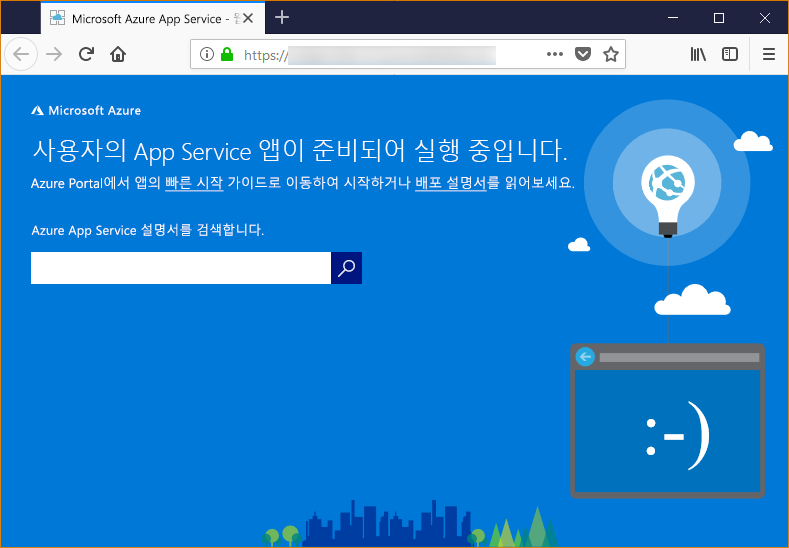

# <a name="configure-a-linux-python-app-for-azure-app-service"></a>Azure App Service용 Linux Python 앱 구성

이 문서에서는 [Azure App Service](app-service-linux-intro.md)에서 Python 앱을 실행하는 방법 및 필요한 경우 App Service의 동작을 사용자 지정하는 방법에 대해 설명합니다. Python 앱을 배포할 때 모든 필수 [pip](https://pypi.org/project/pip/) 모듈을 함께 배포해야 합니다.

사용자가 [Git 리포지토리](../deploy-local-git.md?toc=%2fazure%2fapp-service%2fcontainers%2ftoc.json) 또는 빌드 프로세스가 켜진 [Zip 패키지](../deploy-zip.md?toc=%2fazure%2fapp-service%2fcontainers%2ftoc.json)를 배포하면 App Service 배포 엔진은 자동으로 가상 환경을 활성화하고 사용자 대신 `pip install -r requirements.txt`를 실행합니다.

이 가이드에서는 App Service의 기본 제공 Linux 컨테이너를 사용하는 Python 개발자를 위한 주요 개념과 지침을 제공합니다. Azure App Service를 사용한 경험이 없는 경우 먼저 [Python 빠른 시작](quickstart-python.md) 및 [PostgreSQL을 사용하는 Python 자습서](tutorial-python-postgresql-app.md)를 수행해야 합니다.

> [!NOTE]
> 현재는 App Service에서 Python 앱을 실행할 때 Linux를 사용할 것을 권장합니다. Windows 옵션에 대한 자세한 내용은 [Windows 버전 App Service 기반의 Python](https://docs.microsoft.com/visualstudio/python/managing-python-on-azure-app-service)을 참조하세요.
>

## <a name="show-python-version"></a>Python 버전 표시

현재 Python 버전을 표시하려면 [Cloud Shell](https://shell.azure.com)에서 다음 명령을 실행합니다.

```azurecli-interactive
az webapp config show --resource-group <resource-group-name> --name <app-name> --query linuxFxVersion
```

지원되는 Python 버전을 모두 표시하려면 [Cloud Shell](https://shell.azure.com)에서 다음 명령을 실행합니다.

```azurecli-interactive
az webapp list-runtimes --linux | grep PYTHON
```

사용자 고유의 컨테이너 이미지를 빌드하여 지원되지 않는 Python 버전을 실행할 수도 있습니다. 자세한 내용은 [사용자 지정 Docker 이미지 사용](tutorial-custom-docker-image.md)을 참조하세요

## <a name="set-python-version"></a>Python 버전 설정

Python 버전을 3.7로 설정하려면 [Cloud Shell](https://shell.azure.com)에서 다음 명령을 실행합니다.

```azurecli-interactive
az webapp config set --resource-group <resource-group-name> --name <app-name> --linux-fx-version "PYTHON|3.7"
```

## <a name="container-characteristics"></a>컨테이너 특성

Linux 기반 App Service에 배포된 Python 앱은 GitHub 리포지토리에 정의된 Docker 컨테이너 [Python 3.6](https://github.com/Azure-App-Service/python/tree/master/3.6.6) 또는 [Python 3.7](https://github.com/Azure-App-Service/python/tree/master/3.7.0) 내에서 실행됩니다.

이 컨테이너에는 다음과 같은 특성이 있습니다.

- 앱은 `--bind=0.0.0.0 --timeout 600` 추가 인수를 통해 [Gunicorn WSGI HTTP 서버](https://gunicorn.org/)를 사용하여 실행됩니다.

- 기본적으로 기본 이미지에는 Flask 웹 프레임워크가 포함되어 있지만, 컨테이너는 WSGI 및 Python 3.7과 호환되는 다른 프레임워크(예: Django)를 지원합니다.

- Django와 같은 추가 패키지를 설치하려면 `pip freeze > requirements.txt`를 사용하여 프로젝트의 루트에 [*requirements.txt*](https://pip.pypa.io/en/stable/user_guide/#requirements-files) 파일을 만듭니다. 그런 다음, Git 배포를 사용하여 App Service에 앱을 게시합니다. Git 배포는 컨테이너에서 `pip install -r requirements.txt`를 자동으로 실행하여 앱의 종속성을 설치합니다.

## <a name="container-startup-process"></a>컨테이너 시작 프로세스

시작하는 동안 Linux의 App Service 컨테이너에서 실행하는 단계는 다음과 같습니다.

1. [사용자 지정 시작 명령](#customize-startup-command)을 사용합니다(제공된 경우).
2. [Django 앱](#django-app)이 있는지 확인하고, 이 앱에 대한 Gunicorn이 탐지되면 시작합니다.
3. [Flask 앱](#flask-app)이 있는지 확인하고, 이 앱에 대한 Gunicorn이 탐지되면 시작합니다.
4. 다른 앱이 없으면 컨테이너에 기본적으로 제공되는 기본 앱을 시작합니다.

다음 섹션에서는 각 옵션에 대한 추가 세부 정보를 제공합니다.

### <a name="django-app"></a>Django 앱

Django 앱의 경우 App Service는 앱 코드 내에서 `wsgi.py`라는 파일을 찾고, 다음 명령을 사용하여 Gunicorn을 실행합니다.

```bash
# <module> is the path to the folder that contains wsgi.py
gunicorn --bind=0.0.0.0 --timeout 600 <module>.wsgi
```

시작 명령에 대해 더 구체적으로 제어하려면 [사용자 지정 시작 명령](#customize-startup-command)을 사용하고, `<module>`을 *wsgi.py*가 포함된 모듈의 이름으로 바꿉니다.

### <a name="flask-app"></a>Flask 앱

Flask의 경우 App Service는 *application.py* 또는 *app.py* 파일을 찾고, 다음과 같이 Gunicorn을 시작합니다.

```bash
# If application.py
gunicorn --bind=0.0.0.0 --timeout 600 application:app
# If app.py
gunicorn --bind=0.0.0.0 --timeout 600 app:app
```

기본 앱 모듈이 다른 파일에 포함되어 있거나, 앱 개체에 대해 다른 이름을 사용하거나, Gunicorn에 인수를 추가로 제공하려면 [사용자 지정 시작 명령](#customize-startup-command)을 사용합니다.

### <a name="default-behavior"></a>기본 동작

App Service에서 사용자 지정 명령, Django 앱 또는 Flask 앱을 찾지 못하면 _opt/defaultsite_ 폴더에 있는 기본 읽기 전용 앱을 실행합니다. 기본 앱은 다음과 같이 표시됩니다.



## <a name="customize-startup-command"></a>시작 명령 사용자 지정

사용자 지정 Gunicorn 시작 명령을 제공하여 컨테이너의 시작 동작을 제어할 수 있습니다. 이렇게 하려면 [Cloud Shell](https://shell.azure.com)에서 다음 명령을 실행합니다.

```azurecli-interactive
az webapp config set --resource-group <resource-group-name> --name <app-name> --startup-file "<custom-command>"
```

예를 들어 기본 모듈이 *hello.py*이고 해당 파일의 Flask 앱 개체의 이름이 `myapp`인 Flask 앱이 있는 경우 *\<custom-command>* 는 다음과 같습니다.

```bash
gunicorn --bind=0.0.0.0 --timeout 600 hello:myapp
```

기본 모듈이 하위 폴더(예: `website`)인 경우 `--chdir` 인수로 이 폴더를 지정합니다.

```bash
gunicorn --bind=0.0.0.0 --timeout 600 --chdir website hello:myapp
```

또한 Gunicorn에 대한 추가 인수(예: `--workers=4`)를 *\<custom-command>* 에 추가할 수도 있습니다. 자세한 내용은 [Gunicorn 실행](https://docs.gunicorn.org/en/stable/run.html)(docs.gunicorn.org)을 참조하세요.

[aiohttp](https://aiohttp.readthedocs.io/en/stable/web_quickstart.html) 같은 비 Gunicorn 서버를 사용하려면 *\<custom-command>* 를 다음과 같은 항목으로 바꾸면 됩니다.

```bash
python3.7 -m aiohttp.web -H localhost -P 8080 package.module:init_func
```

> [!Note]
> App Service는 사용자 지정 명령 파일을 처리할 때 발생하는 모든 오류를 무시한 다음, Django 및 Flask 앱을 찾아 시작 프로세스를 계속 진행합니다. 예상한 동작이 표시되지 않으면 시작 파일이 App Service에 배포되고 오류가 없는지 확인합니다.

## <a name="access-environment-variables"></a>환경 변수 액세스

App Service에서, 앱 코드 외부에서 [앱 설정](../configure-common.md?toc=%2fazure%2fapp-service%2fcontainers%2ftoc.json#configure-app-settings)을 지정할 수 있습니다. 그런 다음, 표준 [os.environ](https://docs.python.org/3/library/os.html#os.environ) 패턴을 사용하여 액세스할 수 있습니다. 예를 들어 앱 설정 `WEBSITE_SITE_NAME`에 액세스하려면 다음 코드를 사용합니다.

```python
os.environ['WEBSITE_SITE_NAME']
```

## <a name="detect-https-session"></a>HTTPS 세션 검색

App Service에서, [SSL 종료](https://wikipedia.org/wiki/TLS_termination_proxy)는 네트워크 부하 분산 장치에서 발생하므로 모든 HTTPS 요청은 암호화되지 않은 HTTP 요청으로 앱에 도달합니다. 앱 논리에서 사용자 요청의 암호화 여부를 확인해야 하는 경우 `X-Forwarded-Proto` 헤더를 검사합니다.

```python
if 'X-Forwarded-Proto' in request.headers and request.headers['X-Forwarded-Proto'] == 'https':
# Do something when HTTPS is used
```

인기 있는 웹 프레임워크를 사용하여 표준 앱 패턴의 `X-Forwarded-*` 정보에 액세스할 수 있습니다. [CodeIgniter](https://codeigniter.com/)에서, [is_https()](https://github.com/bcit-ci/CodeIgniter/blob/master/system/core/Common.php#L338-L365)는 기본적으로 `X_FORWARDED_PROTO` 값을 확인합니다.

## <a name="access-diagnostic-logs"></a>진단 로그 액세스

[!INCLUDE [Access diagnostic logs](../../../includes/app-service-web-logs-access-no-h.md)]

## <a name="open-ssh-session-in-browser"></a>브라우저에서 SSH 세션 열기

[!INCLUDE [Open SSH session in browser](../../../includes/app-service-web-ssh-connect-builtin-no-h.md)]

## <a name="troubleshooting"></a>문제 해결

- **사용자 고유의 앱 코드가 배포되면 기본 앱이 표시됩니다.** 앱 코드를 App Service에 배포하지 않았거나 App Service에서 앱 코드를 찾지 못하여 기본 앱을 대신 실행했기 때문에 기본 앱이 표시됩니다.
- App Service를 다시 시작하고, 15-20초 동안 기다린 다음, 앱을 다시 확인합니다.
- Windows 기반 인스턴스보다는 Linux용 App Service를 사용해야 합니다. Azure CLI에서 명령 `az webapp show --resource-group <resource_group_name> --name <app_service_name> --query kind`을 실행하여 `<resource_group_name>` 및 `<app_service_name>`을 적절하게 대체합니다. `app,linux`가 출력으로 표시되어야 합니다. 그렇지 않으면 App Service를 다시 만들고 Linux를 선택합니다.
- SSH 또는 Kudu 콘솔을 사용하여 App Service에 직접 연결하고, 파일이 *site/wwwroot* 아래에 있는지 확인합니다. 파일이 없으면 배포 프로세스를 검토하고 앱을 다시 배포합니다.
- 파일이 있으면 App Service에서 특정 시작 파일을 식별하지 못한 것입니다. 앱이 [Django](#django-app) 또는 [Flask](#flask-app)에 대해 예상되는 App Service로 구성되었는지 확인하거나 [사용자 지정 시작 명령](#customize-startup-command)을 사용합니다.
- **브라우저에 "서비스를 사용할 수 없음"이라는 메시지가 표시됩니다.** App Service에서 Gunicorn 서버를 시작했음을 나타내는 App Service의 응답을 기다리는 동안 브라우저에서 시간이 초과되었지만 앱 코드를 지정하는 인수가 올바르지 않습니다.
- 특히 App Service 계획에서 가장 낮은 가격 책정 계층을 사용하는 경우 브라우저를 새로 고칩니다. 예를 들어 체험 계층을 사용하는 경우 앱을 시작하는 데 시간이 더 오래 걸릴 수 있으며, 브라우저를 새로 고친 후에 응답하게 됩니다.
- 앱이 [Django](#django-app) 또는 [Flask](#flask-app)에 대해 예상되는 App Service로 구성되었는지 확인하거나 [사용자 지정 시작 명령](#customize-startup-command)을 사용합니다.
- [로그 스트림에 액세스](#access-diagnostic-logs)합니다.

## <a name="next-steps"></a>다음 단계

> [!div class="nextstepaction"]
> [자습서: PostgreSQL을 사용한 Python 앱](tutorial-python-postgresql-app.md)

> [!div class="nextstepaction"]
> [자습서: 프라이빗 컨테이너 리포지토리에서 배포](tutorial-custom-docker-image.md)

> [!div class="nextstepaction"]
> [App Service Linux FAQ](app-service-linux-faq.md)