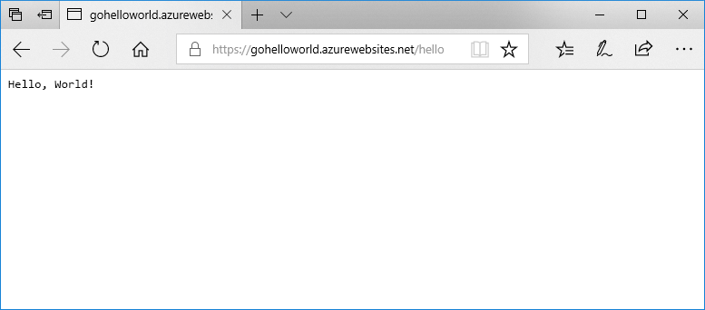

# <a name="run-a-custom-linux-container-in-azure-app-service"></a>Azure App Service에서 사용자 지정 Linux 컨테이너 실행

[App Service Linux](app-service-linux-intro.md)는 .NET, PHP, Node.js 등과 같은 언어에 대한 지원을 통해 Linux에 미리 정의된 애플리케이션 스택을 제공합니다. 또한 사용자 지정 Docker 이미지를 사용하여 Azure에 아직 정의되지 않은 애플리케이션 스택에 웹앱을 실행할 수도 있습니다. 이 빠른 시작에서는 웹앱을 만들고 Docker 허브에서 Go 이미지를 배포하는 방법을 설명합니다. [Azure CLI](https://docs.microsoft.com/cli/azure/get-started-with-azure-cli)를 사용하여 웹앱을 만듭니다.



[!INCLUDE [quickstarts-free-trial-note](../../../includes/quickstarts-free-trial-note.md)]

[!INCLUDE [cloud-shell-try-it.md](../../../includes/cloud-shell-try-it.md)]

[!INCLUDE [Create resource group](../../../includes/app-service-web-create-resource-group-linux.md)]

[!INCLUDE [Create app service plan](../../../includes/app-service-web-create-app-service-plan-linux.md)]

## <a name="create-a-web-app"></a>웹앱 만들기

[az webapp create](/cli/azure/webapp?view=azure-cli-latest#az-webapp-create) 명령을 사용하여 `myAppServicePlan` App Service 계획에 [웹앱](../overview.md)을 만듭니다. `<app name>`을 전역적으로 고유한 앱 이름으로 바꾸어야 합니다.

```azurecli-interactive
az webapp create --resource-group myResourceGroup --plan myAppServicePlan --name <app name> --deployment-container-image-name microsoft/azure-appservices-go-quickstart
```

앞의 명령에서 `--deployment-container-image-name`은 [microsoft/azure-appservices-go-quickstart](https://hub.docker.com/r/microsoft/azure-appservices-go-quickstart/) 공용 Docker 허브 이미지를 가리킵니다.

웹앱이 만들어지면 Azure CLI에서 다음 예제와 비슷한 출력을 표시합니다.

```json
{
  "availabilityState": "Normal",
  "clientAffinityEnabled": true,
  "clientCertEnabled": false,
  "cloningInfo": null,
  "containerSize": 0,
  "dailyMemoryTimeQuota": 0,
  "defaultHostName": "<app name>.azurewebsites.net",
  "deploymentLocalGitUrl": "https://<username>@<app name>.scm.azurewebsites.net/<app name>.git",
  "enabled": true,
  < JSON data removed for brevity. >
}
```

## <a name="browse-to-the-app"></a>앱으로 이동

```bash
http://<app_name>.azurewebsites.net/hello
```


**축하합니다.** Go 애플리케이션을 실행하는 사용자 지정 Docker 이미지가 Web Apps for Containers에 배포되었습니다.

[!INCLUDE [Clean-up section](../../../includes/cli-script-clean-up.md)]

## <a name="next-steps"></a>다음 단계

> [!div class="nextstepaction"]
> [자습서: 프라이빗 컨테이너 리포지토리에서 배포](tutorial-custom-docker-image.md)

> [!div class="nextstepaction"]
> [사용자 지정 컨테이너 구성](configure-custom-container.md)

> [!div class="nextstepaction"]
> [자습서: 다중 컨테이너 WordPress 앱](tutorial-multi-container-app.md)
