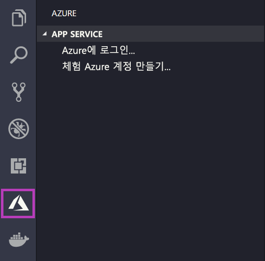

# <a name="deploy-a-custom-linux-container-to-azure-app-service"></a>Azure App Service에 사용자 지정 Linux 컨테이너 배포

App Service on Linux는 .NET, PHP, Node.js 등의 언어 지원을 통해 Linux에서 미리 정의된 애플리케이션 스택을 제공합니다. 또한 사용자 지정 Docker 이미지를 사용하여 Azure에 아직 정의되지 않은 애플리케이션 스택에 웹앱을 실행할 수도 있습니다. 이 빠른 시작에서는 ACR([Azure Container Registry](/azure/container-registry))에서 App Service로 이미지를 배포하는 방법을 보여 줍니다.

## <a name="prerequisites"></a>사전 요구 사항

* [Azure 계정](https://azure.microsoft.com/free/?utm_source=campaign&utm_campaign=vscode-tutorial-docker-extension&mktingSource=vscode-tutorial-docker-extension)
* [Docker](https://www.docker.com/community-edition)
* [Visual Studio Code](https://code.visualstudio.com/)
* [VS Code용 Azure App Service 확장](https://marketplace.visualstudio.com/items?itemName=ms-azuretools.vscode-azureappservice). 이 확장을 사용하여 Azure PaaS(Platform as a Service)에서 Linux Web Apps를 만들고, 관리하고, 배포할 수 있습니다.
* [VS Code용 Docker 확장](https://marketplace.visualstudio.com/items?itemName=ms-azuretools.vscode-docker). 이 확장을 사용하여 로컬 Docker 이미지 및 명령 관리를 간소화하고 빌드된 앱 이미지를 Azure에 배포할 수 있습니다.

## <a name="create-an-image"></a>이미지 만들기

이 빠른 시작을 완료하려면 적합한 웹앱 이미지가 [Azure Container Registry](/azure/container-registry)에 저장되어 있어야 합니다. [빠른 시작: Azure Portal을 사용하여 프라이빗 컨테이너 레지스트리 만들기](/azure/container-registry/container-registry-get-started-portal)의 명령을 따르되, `hello-world` 이미지 대신 `mcr.microsoft.com/azuredocs/go` 이미지를 사용합니다. 참고로 [샘플 Dockerfile은 Azure 샘플 리포지토리에 있습니다](https://github.com/Azure-Samples/go-docs-hello-world).

> [!IMPORTANT]
> 컨테이너 레지스트리를 만들 때 **관리 사용자** 옵션을 **사용**으로 설정해야 합니다. Azure Portal 레지스트리 페이지의 **액세스 키** 섹션에서 설정할 수도 있습니다. 이 설정은 App Service 액세스에 필요합니다.

## <a name="sign-in"></a>로그인

VS Code를 시작하고, App Service 확장을 사용하여 Azure 계정에 로그인합니다. 이렇게 하려면 작업 막대에서 Azure 로고를 선택하고 **APP SERVICE** 탐색기로 이동한 다음, **Azure에 로그인**을 선택하고 지침을 따릅니다.



## <a name="check-prerequisites"></a>필수 구성 요소 확인

이제 모든 필수 조건이 올바르게 설치 및 구성되었는지 확인할 수 있습니다.

VS Code에서 상태 표시줄에는 Azure 메일 주소가 표시되고, **APP SERVICE** 탐색기에는 구독이 표시되어야 합니다.

Docker가 설치되어 실행 중인지 확인합니다. 다음 명령은 실행 중인 경우 Docker 버전을 표시합니다.

```bash
docker --version
```

마지막으로, Azure Container Registry가 연결되어 있는지 확인합니다. 이렇게 하려면 작업 막대에서 Docker 로고를 선택하고 **레지스트리**로 이동합니다.


## <a name="deploy-the-image-to-azure-app-service"></a>Azure App Service에 이미지 배포

이제 모든 요소가 구성되었으므로, Docker 확장 탐색기에서 직접 [Azure App Service](https://azure.microsoft.com/services/app-service/)에 이미지를 배포할 수 있습니다.

**DOCKER** 탐색기의 **레지스트리** 노드 아래에서 이미지를 찾은 다음, 펼쳐서 해당 태그를 표시합니다. 태그를 마우스 오른쪽 단추로 클릭하고 **Azure App Service에 이미지 배포**를 선택합니다.

여기서 프롬프트에 따라 구독, 전역적으로 고유한 앱 이름, 리소스 그룹 및 App Service 계획을 선택합니다. 가격 책정 계층으로 **B1 기본**을 선택하고 지역을 선택합니다.

배포 후에는 `http://<app name>.azurewebsites.net`에서 앱을 사용할 수 있습니다.

**리소스 그룹**은 Azure에 있는 모든 애플리케이션 리소스의 명명된 컬렉션입니다. 예를 들어 리소스 그룹에는 웹 사이트, 데이터베이스 및 Azure 함수에 대한 참조가 포함될 수 있습니다.

**App Service 계획**은 웹 사이트를 호스트하는 데 사용되는 물리적 리소스를 정의합니다. 이 빠른 시작에서는 **Linux** 인프라의 **기본** 호스팅 계획을 사용하므로, 사이트가 다른 웹 사이트와 함께 Linux 머신에 호스트됩니다. **기본** 계획으로 시작하는 경우, Azure Portal을 사용하여 해당 웹 사이트만 머신에서만 실행되도록 강화할 수 있습니다.

## <a name="browse-the-website"></a>웹 사이트 찾아보기

배포 중에 **출력** 패널이 열려 작업 상태를 표시합니다. 작업이 완료되면, **APP SERVICE** 탐색기에서 만든 앱을 찾아 마우스 오른쪽 단추로 클릭한 다음, **웹 사이트**를 선택하여 브라우저에서 사이트를 엽니다.

> [!div class="nextstepaction"]
> [문제가 발생했습니다.](https://www.research.net/r/PWZWZ52?tutorial=quickstart-docker&step=deploy-app)

## <a name="next-steps"></a>다음 단계

축하합니다! 이 빠른 시작을 성공적으로 완료했습니다!

다음으로, 다른 Azure 확장을 확인합니다.

* [Cosmos DB](https://marketplace.visualstudio.com/items?itemName=ms-azuretools.vscode-cosmosdb)
* [Azure Functions](https://marketplace.visualstudio.com/items?itemName=ms-azuretools.vscode-azurefunctions)
* [Azure CLI 도구](https://marketplace.visualstudio.com/items?itemName=ms-vscode.azurecli)
* [Azure Resource Manager 도구](https://marketplace.visualstudio.com/items?itemName=msazurermtools.azurerm-vscode-tools)

또는 [Azure Tools](https://marketplace.visualstudio.com/items?itemName=ms-vscode.vscode-node-azure-pack) 확장 팩을 설치하여 모두 가져옵니다.
