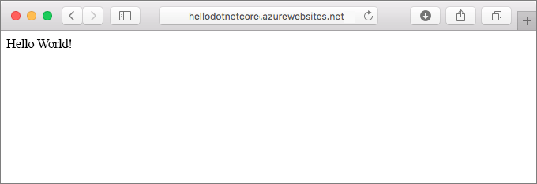
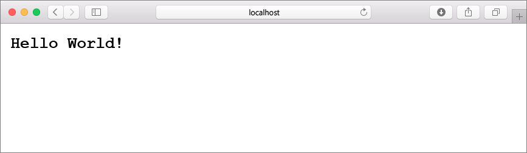
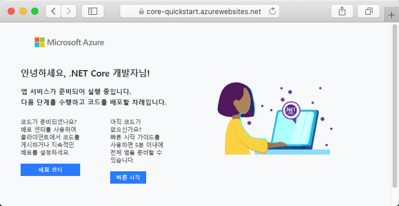
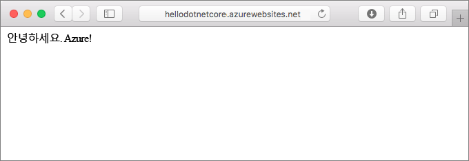
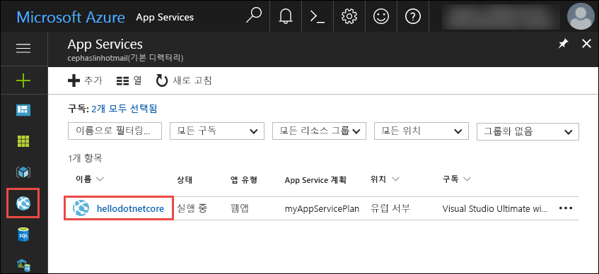
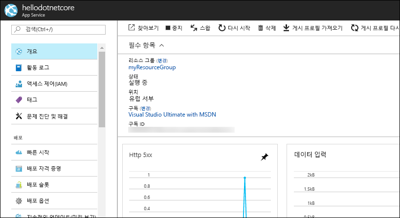

# <a name="create-a-net-core-web-app-in-app-service-on-linux"></a>Linux의 App Service에서 .NET Core 웹앱 만들기

> [!NOTE]
> 이 문서에서는 Linux의 App Service에 앱을 배포합니다. _Windows_의 App Service에 배포하려면 [Azure에서 ASP.NET Core 웹앱 만들기](../app-service-web-get-started-dotnet.md)를 참조하세요.
>

[Linux의 App Service](app-service-linux-intro.md)는 Linux 운영 체제를 사용하여 확장성이 높은 자체 패치 웹 호스팅 서비스를 제공합니다. 이 빠른 시작에서는 Linux의 App Service에서 [.NET Core](https://docs.microsoft.com/aspnet/core/) 앱을 만드는 방법을 보여줍니다. [Azure CLI](https://docs.microsoft.com/cli/azure/get-started-with-azure-cli)를 사용하여 웹앱을 만들고 Git를 사용하여 웹앱에 .NET Core 코드를 배포합니다.



Mac, Windows 또는 Linux 컴퓨터를 사용하여 이 문서의 단계를 수행하면 됩니다.

[!INCLUDE [quickstarts-free-trial-note](../../../includes/quickstarts-free-trial-note.md)]

## <a name="prerequisites"></a>필수 조건

이 빠른 시작을 완료하려면 다음이 필요합니다.

* <a href="https://git-scm.com/" target="_blank">Git 설치</a>
* <a href="https://www.microsoft.com/net/core/" target="_blank">.NET Core 설치</a>

## <a name="create-the-app-locally"></a>로컬로 앱 만들기

컴퓨터의 터미널 창에서 `hellodotnetcore`라는 디렉터리를 만들고 현재 디렉터리를 이 디렉터리로 변경합니다.

```bash
md hellodotnetcore
cd hellodotnetcore
```

새 .NET Core 웹앱을 만듭니다.

```bash
dotnet new web
```

## <a name="run-the-app-locally"></a>로컬에서 앱 실행

NuGet 패키지를 복원하고 앱을 실행합니다.

```bash
dotnet restore
dotnet run
```

웹 브라우저를 열고 `http://localhost:5000`의 앱으로 이동합니다.

이 페이지에 표시된 샘플 앱에서 **Hello World** 메시지가 표시됩니다.



터미널 창에서 **Ctrl+C**를 눌러 웹 서버를 종료합니다. .NET Core 프로젝트에 대해 Git 리포지토리를 초기화합니다.

```bash
git init
git add .
git commit -m "first commit"
```

[!INCLUDE [cloud-shell-try-it.md](../../../includes/cloud-shell-try-it.md)]

[!INCLUDE [Configure deployment user](../../../includes/configure-deployment-user.md)]

[!INCLUDE [Create resource group](../../../includes/app-service-web-create-resource-group-linux.md)]

[!INCLUDE [Create app service plan](../../../includes/app-service-web-create-app-service-plan-linux.md)]

## <a name="create-a-web-app"></a>웹앱 만들기

[!INCLUDE [Create web app](../../../includes/app-service-web-create-web-app-dotnetcore-linux-no-h.md)]

새로 만든 웹앱으로 이동합니다. _&lt;앱 이름>_ 을 해당하는 웹앱 이름으로 바꿉니다.

```bash
http://<app name>.azurewebsites.net
```

새로운 웹앱은 다음과 같아야 합니다.



[!INCLUDE [Push to Azure](../../../includes/app-service-web-git-push-to-azure.md)] 

```bash
Counting objects: 22, done.
Delta compression using up to 8 threads.
Compressing objects: 100% (18/18), done.
Writing objects: 100% (22/22), 51.21 KiB | 3.94 MiB/s, done.
Total 22 (delta 1), reused 0 (delta 0)
remote: Updating branch 'master'.
remote: Updating submodules.
remote: Preparing deployment for commit id '741f16d1db'.
remote: Generating deployment script.
remote: Project file path: ./hellodotnetcore.csproj
remote: Generated deployment script files
remote: Running deployment command...
remote: Handling ASP.NET Core Web Application deployment.
remote: ...............................................................................................
remote:   Restoring packages for /home/site/repository/hellodotnetcore.csproj...
remote: ....................................
remote:   Installing System.Xml.XPath 4.0.1.
remote:   Installing System.Diagnostics.Tracing 4.1.0.
remote:   Installing System.Threading.Tasks.Extensions 4.0.0.
remote:   Installing System.Reflection.Emit.ILGeneration 4.0.1.
remote:   ...
remote: Finished successfully.
remote: Running post deployment command(s)...
remote: Deployment successful.
To https://cephalin-dotnetcore.scm.azurewebsites.net/cephalin-dotnetcore.git
 * [new branch]      master -> master
```

## <a name="browse-to-the-app"></a>앱으로 이동

웹 브라우저를 사용하여 배포된 응용 프로그램으로 이동합니다.

```bash
http://<app_name>.azurewebsites.net
```

.NET Core 샘플 코드가 기본 제공 이미지가 있는 웹앱에서 실행됩니다.


**축하합니다.** Linux의 App Service에 첫 번째 .NET Core 앱을 배포했습니다.

## <a name="update-and-redeploy-the-code"></a>코드 업데이트 및 다시 배포

로컬 디렉터리에서 _Startup.cs_ 파일을 엽니다. 메서드 호출 `context.Response.WriteAsync`의 텍스트를 약간 변경합니다.

```csharp
await context.Response.WriteAsync("Hello Azure!");
```

Git에서 변경 내용을 커밋한 다음 Azure에 코드 변경 내용을 푸시합니다.

```bash
git commit -am "updated output"
git push azure master
```

배포가 완료되면 **앱으로 이동** 단계에서 열린 브라우저 창으로 다시 전환하고 새로 고침을 누릅니다.



## <a name="manage-your-new-azure-web-app"></a>새로운 Azure 웹앱 관리

만든 웹앱을 관리하려면 <a href="https://portal.azure.com" target="_blank">Azure Portal</a>로 이동합니다.

왼쪽 메뉴에서 **App Services**를 클릭한 다음 Azure 웹앱의 이름을 클릭합니다.



웹앱의 개요 페이지가 표시됩니다. 여기에서 찾아보기, 중지, 시작, 다시 시작, 삭제와 같은 기본 관리 작업을 수행할 수 있습니다. 



왼쪽 메뉴는 앱 구성을 위한 다양한 페이지를 제공합니다. 

[!INCLUDE [cli-samples-clean-up](../../../includes/cli-samples-clean-up.md)]

## <a name="next-steps"></a>다음 단계

> [!div class="nextstepaction"]
> [Linux의 Azure App Service에서 .NET Core 및 SQL Database 웹앱 빌드](tutorial-dotnetcore-sqldb-app.md)
