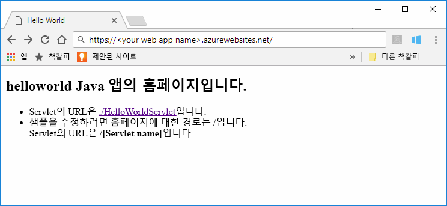
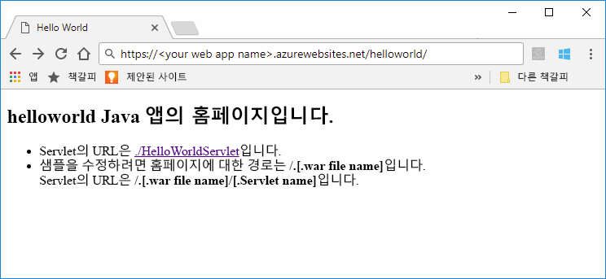

# <a name="quickstart-create-a-java-web-app-in-app-service-on-linux"></a>빠른 시작: Linux의 App Service에서 Java 웹앱 만들기

Linux의 App Service는 현재 Java 웹앱을 지원하기 위한 미리 보기 기능을 제공합니다. 미리 보기에 대한 자세한 내용은 [Microsoft Azure 미리 보기에 대한 추가 사용 약관](https://azure.microsoft.com/support/legal/preview-supplemental-terms/)을 참조하세요. 

[Linux의 App Service](app-service-linux-intro.md)는 Linux 운영 체제를 사용하여 확장성이 높은 자체 패치 웹 호스팅 서비스를 제공합니다. 이 빠른 시작에서는 [Azure Web Apps용 Maven 플러그인(미리 보기)](https://github.com/Microsoft/azure-maven-plugins/tree/develop/azure-webapp-maven-plugin)과 함께 [Azure CLI](https://docs.microsoft.com/cli/azure/get-started-with-azure-cli)를 사용하여 Linux 이미지가 내장된 Java 웹앱을 배포하는 방법을 보여 줍니다.



[IntelliJ용 Azure 도구 키트를 사용하여 클라우드에서 Linux 컨테이너에 Java 웹앱 배포](https://docs.microsoft.com/java/azure/intellij/azure-toolkit-for-intellij-hello-world-web-app-linux)는 고유한 컨테이너에 Java 앱을 배포하는 대체 방법입니다.

[!INCLUDE [quickstarts-free-trial-note](../../../includes/quickstarts-free-trial-note.md)]


## <a name="prerequisites"></a>필수 조건

이 빠른 시작을 완료하려면 다음이 필요합니다. 

* 로컬에 설치된 [Azure CLI 2.0 이상 버전](https://docs.microsoft.com/cli/azure/install-azure-cli?view=azure-cli-latest).
* [Apache Maven](http://maven.apache.org/).


## <a name="create-a-java-app"></a>Java 앱 만들기

Maven을 사용하여 다음 명령을 실행하여 새 *helloworld* 웹앱을 만듭니다.  

    mvn archetype:generate -DgroupId=example.demo -DartifactId=helloworld -DarchetypeArtifactId=maven-archetype-webapp

새 *helloworld* 프로젝트 디렉터리로 변경하고 다음 명령을 사용하여 모든 모듈을 빌드합니다.

    mvn verify

이 명령은 *helloworld/target* 하위 디렉터리의 *helloworld.war* 파일을 포함한 모든 모듈을 확인하고 생성합니다.


## <a name="deploying-the-java-app-to-app-service-on-linux"></a>Linux의 App Service에 Java 앱 배포

Linux에서 Java 웹앱을 App Service에 배포하기 위한 여러 가지 배포 옵션이 있습니다. 이러한 옵션에는 다음이 포함됩니다.

* [Azure Web Apps용 Maven 플러그인을 통한 배포](https://github.com/Microsoft/azure-maven-plugins/tree/develop/azure-webapp-maven-plugin)
* [ZIP 또는 WAR을 통한 배포](https://docs.microsoft.com/azure/app-service/app-service-deploy-zip)
* [FTP를 통한 배포](https://docs.microsoft.com/azure/app-service/app-service-deploy-ftp)

이 빠른 시작에서는 Azure 웹앱용 Maven 플러그인을 사용합니다. Maven에서 사용하기 쉽고, 필요한 Azure 리소스(리소스 그룹, 앱 서비스 계획 및 웹앱)가 자동으로 생성된다는 이점이 있습니다.

### <a name="deploy-with-maven"></a>Maven을 사용하여 배포

Maven에서 배포하려면 *pom.xml* 파일의 `<build>` 요소 내에 다음 플러그 인 정의를 추가합니다.

```xml
    <plugins>
      <plugin>
        <groupId>com.microsoft.azure</groupId> 
        <artifactId>azure-webapp-maven-plugin</artifactId> 
        <version>1.2.0</version>
        <configuration> 
          <resourceGroup>YOUR_RESOURCE_GROUP</resourceGroup> 
          <appName>YOUR_WEB_APP</appName> 
          <linuxRuntime>tomcat 9.0-jre8</linuxRuntime>
          <deploymentType>ftp</deploymentType> 
          <resources> 
              <resource> 
                  <directory>${project.basedir}/target</directory> 
                  <targetPath>webapps</targetPath> 
                  <includes> 
                      <include>*.war</include> 
                  </includes> 
                  <excludes> 
                      <exclude>*.xml</exclude> 
                  </excludes> 
              </resource> 
          </resources> 
        </configuration>
      </plugin>
    </plugins>
```    

플러그인 구성에서 다음 자리 표시자를 업데이트합니다.

| Placeholder | 설명 |
| ----------- | ----------- |
| `YOUR_RESOURCE_GROUP` | 웹앱을 만들 새 리소스 그룹의 이름입니다. 앱의 모든 리소스를 한 그룹에 배치하여 다 함께 관리할 수 있습니다. 예를 들어 리소스 그룹을 삭제하면 앱과 연결된 모든 리소스가 삭제됩니다. 이 값을 고유한 새 리소스 그룹(예: *TestResources*)으로 업데이트합니다. 이 리소스 그룹 이름을 사용하여 이후 섹션에서 모든 Azure 리소스를 정리합니다. |
| `YOUR_WEB_APP` | 앱 이름은 Azure(YOUR_WEB_APP.azurewebsites.net)에 배포할 때 웹앱의 호스트 이름의 일부가 됩니다. 이 값을 Java 앱을 호스팅할 새 Azure 웹앱의 고유 이름(예: *contoso*)으로 업데이트합니다. |

구성의 `linuxRuntime` 요소는 응용 프로그램과 함께 사용되는 기본 제공 Linux 이미지를 제어합니다. 지원되는 모든 런타임 스택은 [이 링크](https://github.com/Microsoft/azure-maven-plugins/tree/develop/azure-webapp-maven-plugin#runtime-stacks)에서 찾을 수 있습니다. 


> [!NOTE] 
> 이 문서에서는 WAR 파일로만 작업합니다. 하지만 플러그 인은 *pom.xml* 파일의 `<build>` 요소 내에 있는 다음 플러그 인 정의를 사용하여 JAR 웹 응용 프로그램을 지원합니다.
>
>```xml
>    <plugins>
>      <plugin>
>        <groupId>com.microsoft.azure</groupId> 
>        <artifactId>azure-webapp-maven-plugin</artifactId> 
>        <version>1.2.0</version>
>        <configuration> 
>          <resourceGroup>YOUR_RESOURCE_GROUP</resourceGroup> 
>          <appName>YOUR_WEB_APP</appName> 
>          <linuxRuntime>jre8</linuxRuntime>   
>          <!-- This is to make sure the jar file will not be occupied during the deployment -->
>          <stopAppDuringDeployment>true</stopAppDuringDeployment>
>          <deploymentType>ftp</deploymentType> 
>          <resources> 
>              <resource> 
>                  <directory>${project.basedir}/target</directory> 
>                  <targetPath>webapps</targetPath> 
>                  <includes> 
>                      <!-- Currently it is required to set as app.jar -->
>                      <include>app.jar</include> 
>                  </includes>  
>              </resource> 
>          </resources> 
>        </configuration>
>      </plugin>
>    </plugins>
>```    

다음 명령을 실행하고 모든 지시에 따라 Azure CLI로 인증합니다.

    az login

다음 명령을 사용하여 Java 앱을 웹앱에 배포합니다.

    mvn clean package azure-webapp:deploy


배포가 완료되면 웹 브라우저에서 다음 URL을 사용하여 배포된 응용 프로그램으로 이동합니다.

```bash
http://<app_name>.azurewebsites.net/helloworld
```

Java 샘플 코드가 기본 제공 이미지가 있는 웹앱에서 실행됩니다.



**축하합니다.** Linux의 App Service에 첫 번째 Java 앱을 배포했습니다.


[!INCLUDE [cli-samples-clean-up](../../../includes/cli-samples-clean-up.md)]


## <a name="next-steps"></a>다음 단계

이 빠른 시작에서는 Maven을 사용하여 Java 웹앱을 만든 다음, Linux의 App Service에 Java 웹앱을 배포했습니다. Azure와 함께 Java를 사용하는 방법에 대해 자세히 알아보려면 아래 링크로 이동하세요.

> [!div class="nextstepaction"]
> [Java 개발자용 Azure](https://docs.microsoft.com/java/azure/)

