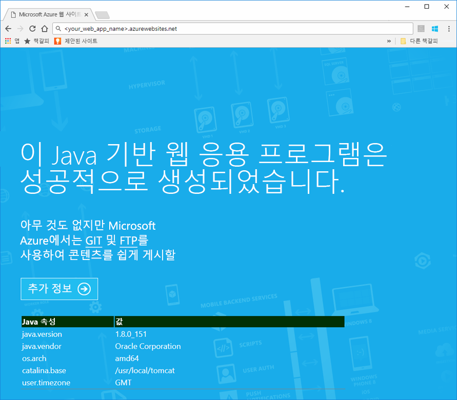
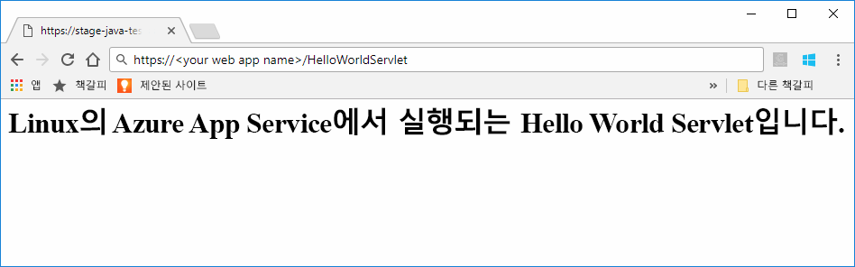
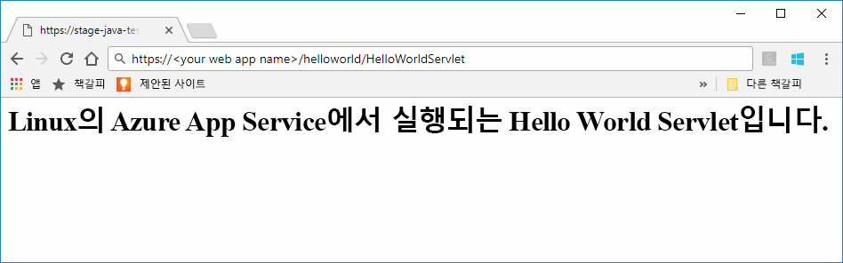

# <a name="preview-create-a-java-web-app-in-app-service-on-linux"></a>미리 보기: Linux의 App Service에서 Java 웹앱 만들기

Linux의 App Service는 현재 Java 웹앱을 지원하기 위한 미리 보기 기능을 제공합니다. 미리 보기에 대한 자세한 내용은 [Microsoft Azure 미리 보기에 대한 추가 사용 약관](https://azure.microsoft.com/support/legal/preview-supplemental-terms/)을 참조하세요. [IntelliJ용 Azure 도구 키트를 사용하여 클라우드에서 Linux 컨테이너에 Java 웹앱 배포](https://docs.microsoft.com/java/azure/intellij/azure-toolkit-for-intellij-hello-world-web-app-linux)는 고유한 컨테이너에 Java 앱을 배포하는 대체 방법입니다.

> [!NOTE]
> 이 문서에서는 Linux의 App Service에 Java 웹앱을 배포합니다.
>

[Linux의 App Service](app-service-linux-intro.md)는 Linux 운영 체제를 사용하여 확장성이 높은 자체 패치 웹 호스팅 서비스를 제공합니다. 이 빠른 시작은 기본 제공 이미지를 사용하여 Linux의 App Service에 Java 앱을 배포하는 방법을 보여 줍니다. [Azure CLI](https://docs.microsoft.com/cli/azure/get-started-with-azure-cli)를 사용하여 기본 제공 이미지로 웹앱을 만들고 웹앱에 Java 앱을 배포합니다.


[!INCLUDE [quickstarts-free-trial-note](../../../includes/quickstarts-free-trial-note.md)]


## <a name="prerequisites"></a>필수 조건

이 빠른 시작을 완료하려면 다음이 필요합니다. 

* Azure 구독이 있어야 합니다. Azure 구독이 아직 없는 경우 시작하기 전에 [무료 계정](https://azure.microsoft.com/free/?ref=microsoft.com&utm_source=microsoft.com&utm_medium=docs&utm_campaign=visualstudio)을 만듭니다.
* [Git를 설치](https://git-scm.com/)합니다.
* [Eclipse](https://www.eclipse.org/downloads/)를 설치합니다.


[!INCLUDE [cloud-shell-try-it.md](../../../includes/cloud-shell-try-it.md)]

[!INCLUDE [Configure deployment user](../../../includes/configure-deployment-user.md)]

[!INCLUDE [Create resource group](../../../includes/app-service-web-create-resource-group-linux.md)]

[!INCLUDE [Create app service plan](../../../includes/app-service-web-create-app-service-plan-linux.md)]


## <a name="create-a-web-app"></a>웹앱 만들기

Cloud Shell에서 `myAppServicePlan` App Service 계획에 [웹앱](../app-service-web-overview.md)을 만듭니다. 이 작업은 [`az webapp create`](/cli/azure/webapp?view=azure-cli-latest#az_webapp_create) 명령을 사용하여 수행할 수 있습니다. 다음 예제에서 *\<app_name>* 을 전역적으로 고유한 앱 이름으로 바꿉니다(유효한 문자는 `a-z`, `0-9` 및 `-`). 

```azurecli-interactive
# Bash
az webapp create --name <app_name> --resource-group myResourceGroup --plan myAppServicePlan --runtime "TOMCAT|8.5-jre8"
# PowerShell
az --% webapp create --name <app_name> --resource-group myResourceGroup --plan myAppServicePlan --runtime "TOMCAT|8.5-jre8"
```

**런타임** 매개 변수의 경우 다음 런타임 중 하나를 사용합니다.
 * TOMCAT|8.5-jre8
 * TOMCAT|9.0-jre8


웹앱을 만들었으면 Azure CLI는 다음 예와 비슷한 정보를 표시합니다.

```json
{
  "additionalProperties": {},
  "availabilityState": "Normal",
  "clientAffinityEnabled": true,
  "clientCertEnabled": false,
  "cloningInfo": null,
  "containerSize": 0,
  "dailyMemoryTimeQuota": 0,
  "defaultHostName": "<your web app name>.azurewebsites.net",
  "enabled": true,
  "enabledHostNames": [
    "<your web app name>.azurewebsites.net",
    "<your web app name>.scm.azurewebsites.net"
  ],
  "ftpPublishingUrl": "ftp://<your ftp URL>",  
  < JSON data removed for brevity. >
}
```

**ftpPublishingUrl**에 대한 값을 복사합니다. FTP 배포를 선택하는 경우 이를 나중에 사용합니다.

새로 만든 웹앱으로 이동합니다.

```
http://<app_name>.azurewebsites.net
```

웹앱이 시작 및 실행되는 경우 다음 이미지와 비슷한 기본 화면을 얻어야 합니다.




## <a name="download-the-sample-java-app"></a>샘플 Java 앱 다운로드

컴퓨터의 터미널 창에서 다음 명령을 실행하여 로컬 컴퓨터에 샘플 앱 리포지토리를 복제합니다. 이후 단계에서 이 샘플 앱을 배포합니다.

```bash
git clone https://github.com/Azure-Samples/java-docs-hello-world
```


## <a name="deploying-the-java-app-to-app-service-on-linux"></a>Linux의 App Service에 Java 앱 배포

[Eclipse](https://www.eclipse.org/downloads/)에서 샘플 프로젝트를 열고, `helloworld.war`라는 [WAR(Web Archive) 파일로 java 앱을 내보냅니다](http://help.eclipse.org/kepler/index.jsp?topic=%2Forg.eclipse.wst.webtools.doc.user%2Ftopics%2Ftwcrewar.html).

Java 앱 WAR 파일을 배포하려면 WarDeploy(현재 [미리 보기](https://azure.microsoft.com/support/legal/preview-supplemental-terms/) 상태) 또는 FTP를 사용할 수 있습니다.

사용하는 배포 방법에 따라 Java 웹앱으로 이동하는 상대 경로는 약간 달라집니다.

### <a name="deploy-with-wardeploy"></a>WarDeploy를 사용하여 배포 

WarDeploy로 WAR 파일을 배포하려면 다음 cURL 예제 명령줄을 사용하여 *https://<your app name>.scm.azurewebsites.net/api/wardeploy*에 POST 요청을 보냅니다. POST 요청은 메시지 본문에 .war 파일을 포함해야 합니다. 앱에 대한 배포 자격 증명은 HTTP 기본 인증을 사용하여 요청으로 제공됩니다. WarDeploy에 대한 자세한 내용은 [ZIP 또는 WAR 파일을 사용하여 Azure App Service에 앱 배포](../app-service-deploy-zip.md)를 참조하세요.

```bash
curl -X POST -u <username> --data-binary @"<war_file_path>" https://<app_name>.scm.azurewebsites.net/api/wardeploy
```

다음을 업데이트합니다.

* `username` - 이전에 만든 배포 자격 증명 사용자 이름을 사용합니다.
* `war_file_path` - 로컬 WAR 파일 경로를 사용합니다.
* `app_name` - 이전에 만든 앱 이름을 사용합니다.

명령을 실행합니다. cURL에서 메시지를 표시하는 경우 배포 자격 증명에 대한 암호를 입력합니다.

웹 브라우저에서 다음 URL을 사용하여 배포된 응용 프로그램으로 이동합니다.

```bash
http://<app_name>.azurewebsites.net
```

Java 샘플 코드가 기본 제공 이미지가 있는 웹앱에서 실행됩니다.


웹 브라우저를 사용하여 servlet로 이동합니다.

```bash
http://<app_name>.azurewebsites.net/HelloWorldServlet
```

servlet가 기본 제공 이미지가 있는 웹앱에서 실행됩니다.




**축하합니다.** Linux의 App Service에 첫 번째 Java 앱을 배포했습니다.


### <a name="ftp-deployment"></a>FTP 배포

또는 FTP를 사용하여 WAR 파일을 배포할 수도 있습니다. 

FTP는 웹앱의 */home/site/wwwroot/webapps* 디렉터리에 대한 파일입니다. 다음 예제 명령줄은 cURL을 사용합니다.

```bash
curl -T war_file_path -u "app_name\username" ftp://webappFTPURL/site/wwwroot/webapps/
```

다음을 업데이트합니다.

* `war_file_path` - 로컬 WAR 파일 경로를 사용합니다.
* `app_name` - 이전에 만든 앱 이름을 사용합니다.
* `username` - 이전에 만든 배포 자격 증명 사용자 이름을 사용합니다.
* `webappFTPURL` - 이전에 복사한 웹앱에 대한 **FTP 호스트 이름** 값을 사용합니다. FTP 호스트 이름은 [Azure Portal](https://portal.azure.com/)에서 웹앱에 대한 **개요** 블레이드에도 나열됩니다.

명령을 실행합니다. cURL에서 메시지를 표시하는 경우 배포 자격 증명에 대한 암호를 입력합니다.


웹 브라우저에서 다음 URL을 사용하여 배포된 응용 프로그램으로 이동합니다.

```bash
http://<app_name>.azurewebsites.net/helloworld
```

Java 샘플 코드가 기본 제공 이미지가 있는 웹앱에서 실행됩니다.


웹 브라우저를 사용하여 servlet로 이동합니다.

```bash
http://<app_name>.azurewebsites.net/helloworld/HelloWorldServlet
```

Java 샘플 코드가 기본 제공 이미지가 있는 웹앱에서 실행됩니다.




**축하합니다.** Linux의 App Service에 첫 번째 Java 앱을 배포했습니다.


[!INCLUDE [cli-samples-clean-up](../../../includes/cli-samples-clean-up.md)]


## <a name="next-steps"></a>다음 단계

Azure에서 Java 사용에 대한 자세한 내용은 다음 링크를 참조하세요.

* [Java 개발자용 Azure](https://docs.microsoft.com/java/azure/)
* [IntelliJ용 Azure 도구 키트를 사용하는 클라우드 내의 Linux 컨테이너에 Hello World 웹앱 배포](https://docs.microsoft.com/java/azure/intellij/azure-toolkit-for-intellij-hello-world-web-app-linux)
* [Visual Studio Team Services용 Java 도구](https://java.visualstudio.com/)
