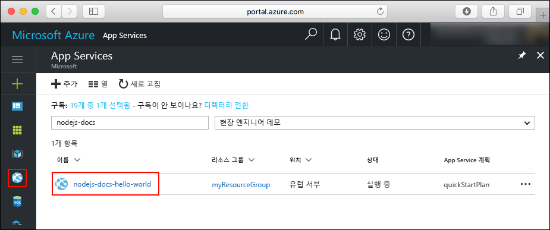
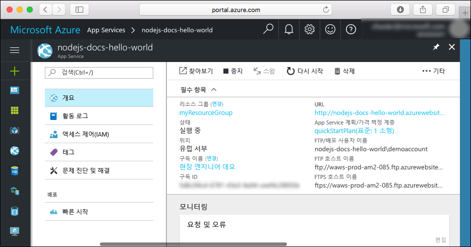

# <a name="create-a-nodejs-web-app-in-azure-app-service-on-linux"></a>Linux의 Azure App Service에서 Node.js 웹앱 만들기

> [!NOTE]
> 이 문서에서는 Linux의 App Service에 앱을 배포합니다. _Windows_의 App Service에 배포하려면 [Azure에서 Node.js 웹앱 만들기](../app-service-web-get-started-nodejs.md)를 참조하세요.
>

[Linux의 App Service](app-service-linux-intro.md)는 Linux 운영 체제를 사용하여 확장성이 높은 자체 패치 웹 호스팅 서비스를 제공합니다. 이 빠른 시작은 [Cloud Shell](https://docs.microsoft.com/azure/cloud-shell/overview)을 사용하여 Linux의 App Service에 Node.js 앱을 배포하는 방법을 보여줍니다.

Cloud Shell에서 이 빠른 시작을 완료하지만 [Azure CLI](/cli/azure/install-azure-cli)를 사용하여 이러한 명령을 로컬로 실행할 수도 있습니다.


[!INCLUDE [quickstarts-free-trial-note](../../../includes/quickstarts-free-trial-note.md)]

[!INCLUDE [cloud-shell-try-it.md](../../../includes/cloud-shell-try-it.md)]

## <a name="install-web-app-extension-for-cloud-shell"></a>Cloud Shell에 대한 웹앱 확장 설치

이 빠른 시작을 완료하려면 [az web app extension](https://docs.microsoft.com/cli/azure/extension?view=azure-cli-latest#az-extension-add)을 추가해야 합니다. 확장이 이미 설치되어 있는 경우 최신 버전으로 업데이트해야 합니다. 웹앱 확장을 업데이트하려면 `az extension update -n webapp`을 입력합니다.

웹앱 확장을 설치하려면 다음 명령을 실행합니다.

```bash
az extension add -n webapp
```

확장이 설치되면 Cloud Shell은 다음 예제에 대한 정보를 표시합니다.

```bash
The installed extension 'webapp' is in preview.
```

## <a name="download-the-sample"></a>샘플 다운로드

Cloud Shell에서 빠른 시작 디렉터리를 만든 다음, 변경합니다.

```bash
mkdir quickstart

cd quickstart
```

다음으로 다음 명령을 실행하여 빠른 시작 디렉터리에 샘플 앱 리포지토리를 복제합니다.

```bash
git clone https://github.com/Azure-Samples/nodejs-docs-hello-world
```

실행 시 다음 예와 유사한 정보를 출력합니다.

```bash
Cloning into 'nodejs-docs-hello-world'...
remote: Counting objects: 40, done.
remote: Total 40 (delta 0), reused 0 (delta 0), pack-reused 40
Unpacking objects: 100% (40/40), done.
Checking connectivity... done.
````

## <a name="create-a-web-app"></a>웹앱 만들기

샘플 코드를 포함하는 디렉터리로 변경하고 `az webapp up` 명령을 실행합니다.

다음 명령에서 <app_name>을 고유한 앱 이름으로 바꿉니다.

```bash
cd nodejs-docs-hello-world

az webapp up -n <app_name>
```

이 명령을 실행하는 데 몇 분 정도 걸릴 수 있습니다. 실행 시 다음 예와 유사한 정보를 출력합니다.

```json
Creating Resource group 'appsvc_rg_Linux_CentralUS' ...
Resource group creation complete
Creating App service plan 'appsvc_asp_Linux_CentralUS' ...
App service plan creation complete
Creating app '<app_name>' ....
Webapp creation complete
Updating app settings to enable build after deployment
Creating zip with contents of dir /home/username/quickstart/nodejs-docs-hello-world ...
Preparing to deploy and build contents to app.
Fetching changes.

Generating deployment script.
Generating deployment script.
Generating deployment script.
Running deployment command...
Running deployment command...
Running deployment command...
Deployment successful.
All done.
{
  "app_url": "https://<app_name>.azurewebsites.net",
  "location": "Central US",
  "name": "<app_name>",
  "os": "Linux",
  "resourcegroup": "appsvc_rg_Linux_CentralUS ",
  "serverfarm": "appsvc_asp_Linux_CentralUS",
  "sku": "STANDARD",
  "src_path": "/home/username/quickstart/nodejs-docs-hello-world ",
  "version_detected": "6.9",
  "version_to_create": "node|6.9"
}
```

`az webapp up` 명령에는 다음 작업이 포함됩니다.

- 기본 리소스 그룹 만들기

- 기본 앱 서비스 계획 만들기

- 지정된 이름의 앱 만들기

- 현재 작업 디렉터리에서 웹앱까지의 [Zip 배포](https://docs.microsoft.com/azure/app-service/app-service-deploy-zip) 파일

## <a name="browse-to-the-app"></a>앱으로 이동

웹 브라우저를 사용하여 배포된 응용 프로그램으로 이동합니다. <app_name>을 웹앱 이름으로 바꿉니다.

```bash
http://<app_name>.azurewebsites.net
```

Node.js 샘플 코드가 기본 제공 이미지가 있는 웹앱에서 실행됩니다.


**축하합니다.** Linux의 App Service에 첫 번째 Node.js 앱을 배포했습니다.

## <a name="update-and-redeploy-the-code"></a>코드 업데이트 및 다시 배포

Cloud Shell에서 `nano index.js`을 입력하여 Nano 텍스트 편집기를 엽니다.


 `response.end`에 대한 호출에서 텍스트를 약간 변경합니다.

```nodejs
response.end("Hello Azure!");
```

변경 내용을 저장하고 Nano를 종료합니다. `^O` 명령을 사용하여 저장하고 `^X` 명령을 사용하여 종료합니다.

이제 앱을 다시 배포합니다. `<app_name>`을 웹앱으로 대체합니다.

```bash
az webapp up -n <app_name>
```

배포가 완료되면 **앱으로 이동** 단계에서 열린 브라우저 창으로 다시 전환하고 페이지를 새로 고칩니다.


## <a name="manage-your-new-azure-web-app"></a>새로운 Azure 웹앱 관리

만든 웹앱을 관리하려면 <a href="https://portal.azure.com" target="_blank">Azure Portal</a>로 이동합니다.

왼쪽 메뉴에서 **App Services**를 클릭한 다음 Azure 웹앱의 이름을 클릭합니다.



웹앱의 개요 페이지가 표시됩니다. 여기에서 찾아보기, 중지, 시작, 다시 시작, 삭제와 같은 기본 관리 작업을 완료할 수 있습니다.



왼쪽 메뉴는 앱 구성을 위한 다양한 페이지를 제공합니다.

## <a name="clean-up-resources"></a>리소스 정리

이전 단계에서 Azure 리소스를 리소스 그룹에 만들었습니다. 이러한 리소스가 나중에 필요하지 않을 경우 Cloud Shell에서 리소스 그룹을 삭제합니다. 지역을 수정한 경우 리소스 그룹 이름 `appsvc_rg_Linux_CentralUS`를 응용 프로그램에 특정된 리소스 그룹으로 업데이트합니다.

```azurecli-interactive
az group delete --name appsvc_rg_Linux_CentralUS
```

이 명령을 실행하는 데 1분 정도 걸릴 수 있습니다.

## <a name="next-steps"></a>다음 단계

> [!div class="nextstepaction"]
> [MongoDB를 사용하는 Node.js](tutorial-nodejs-mongodb-app.md)
