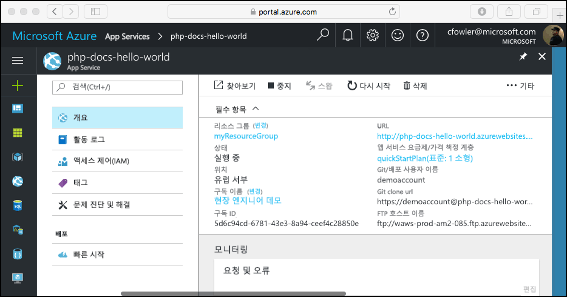

# <a name="create-a-php-app-in-app-service-on-linux"></a>Linux의 App Service에서 PHP 앱 만들기

> [!NOTE]
> 이 문서에서는 Linux의 App Service에 앱을 배포합니다. _Windows_의 App Service에 배포하려면 [Azure에서 PHP 앱 만들기](../app-service-web-get-started-php.md)를 참조하세요.
>

[Linux의 App Service](app-service-linux-intro.md)는 Linux 운영 체제를 기반으로 확장성이 높은 자체 패치 웹 호스팅 서비스를 제공합니다. 이 빠른 시작 자습서에서는 [Cloud Shell](https://docs.microsoft.com/azure/cloud-shell/overview)을 사용하여 Linux의 Azure App Service에 PHP 앱을 배포하는 방법을 보여줍니다.


Mac, Windows 또는 Linux 컴퓨터를 사용하여 이 문서의 단계를 수행하면 됩니다.

[!INCLUDE [quickstarts-free-trial-note](../../../includes/quickstarts-free-trial-note.md)]

## <a name="prerequisites"></a>사전 요구 사항

이 빠른 시작을 완료하려면 다음이 필요합니다.

* <a href="https://git-scm.com/" target="_blank">Git 설치</a>
* <a href="https://php.net" target="_blank">PHP 설치</a>

## <a name="download-the-sample"></a>샘플 다운로드

터미널 창에서 다음 명령을 실행하여, 샘플 애플리케이션을 로컬 컴퓨터에 복제하고 샘플 코드가 들어 있는 디렉터리로 이동합니다.

```bash
git clone https://github.com/Azure-Samples/php-docs-hello-world
cd php-docs-hello-world
```

## <a name="run-the-app-locally"></a>로컬에서 앱 실행하기

애플리케이션을 로컬로 실행하여 Azure에 애플리케이션을 배포할 때 표시되는 모양을 확인합니다. 터미널 창을 열고 `php` 명령을 사용하여 기본 제공 PHP 웹 서버를 시작합니다.

```bash
php -S localhost:8080
```

웹 브라우저를 열고 `http://localhost:8080`의 샘플 앱으로 이동합니다.

이 페이지에 표시된 샘플 앱의 **Hello World!** 메시지가 표시됩니다.


터미널 창에서 **Ctrl+C**를 눌러 웹 서버를 종료합니다.

[!INCLUDE [cloud-shell-try-it.md](../../../includes/cloud-shell-try-it.md)]

[!INCLUDE [Configure deployment user](../../../includes/configure-deployment-user.md)]

[!INCLUDE [Create resource group](../../../includes/app-service-web-create-resource-group-linux.md)]

[!INCLUDE [Create app service plan](../../../includes/app-service-web-create-app-service-plan-linux.md)]

## <a name="create-a-web-app"></a>웹앱 만들기

[!INCLUDE [Create web app](../../../includes/app-service-web-create-web-app-php-linux-no-h.md)] 

기본 제공 이미지를 사용하여 새로 만든 앱을 보려면 사이트로 이동합니다. _&lt;app name>_ 을 앱 이름으로 바꿉니다.

```bash
http://<app-name>.azurewebsites.net
```

새로운 앱은 다음과 같아야 합니다.


[!INCLUDE [Push to Azure](../../../includes/app-service-web-git-push-to-azure.md)] 

<pre>
Counting objects: 26, done.
Delta compression using up to 4 threads.
Compressing objects: 100% (23/23), done.
Writing objects: 100% (26/26), 4.95 KiB | 0 bytes/s, done.
Total 26 (delta 9), reused 0 (delta 0)
remote: Deploy Async
remote: Updating branch 'master'.
remote: Updating submodules.
remote: Preparing deployment for commit id 'df425ea6ef'.
remote: Repository path is /home/site/repository
remote: Running oryx build...
remote: Build orchestrated by Microsoft Oryx, https://github.com/Microsoft/Oryx
remote: You can report issues at https://github.com/Microsoft/Oryx/issues
remote: .
remote: .
remote: .
remote: Deployment successful.
remote: Deployment Logs : 'https://&lt;app-name&gt;.scm.azurewebsites.net/newui/jsonviewer?view_url=/api/deployments/.../log'
To https://&lt;app-name&gt;.scm.azurewebsites.net/&lt;app-name&gt;.git
 * [new branch]      master -> master
</pre>

## <a name="browse-to-the-app"></a>앱으로 이동

웹 브라우저를 사용하여 배포된 애플리케이션으로 이동합니다.

```bash
http://<app-name>.azurewebsites.net
```

PHP 샘플 코드가 기본 제공 이미지가 있는 Linux의 App Service에서 실행됩니다.


**축하합니다.** Linux의 App Service에 첫 번째 PHP 앱을 배포했습니다.

## <a name="update-locally-and-redeploy-the-code"></a>로컬로 코드 업데이트 및 다시 배포

로컬 디렉터리에서 PHP 앱 내 `index.php` 파일을 열고 `echo` 옆에 있는 문자열 내의 텍스트를 약간 변경합니다.

```php
echo "Hello Azure!";
```

Git에서 변경 내용을 커밋한 다음 Azure에 코드 변경 내용을 푸시합니다.

```bash
git commit -am "updated output"
git push azure master
```

배포가 완료되면 **앱으로 이동** 단계에서 열린 브라우저 창으로 다시 전환하고 페이지를 새로 고칩니다.


## <a name="manage-your-new-azure-app"></a>새 Azure 앱 관리

만든 앱을 관리하려면 <a href="https://portal.azure.com" target="_blank">Azure Portal</a>로 이동합니다.

왼쪽 메뉴에서 **App Services**를 클릭한 다음, Azure 앱의 이름을 클릭합니다.


앱의 [개요] 페이지가 표시됩니다. 여기에서 찾아보기, 중지, 시작, 다시 시작, 삭제와 같은 기본 관리 작업을 수행할 수 있습니다.



왼쪽 메뉴로 앱 구성을 위한 여러가지 페이지를 볼 수 있습니다. 

[!INCLUDE [cli-samples-clean-up](../../../includes/cli-samples-clean-up.md)]

## <a name="next-steps"></a>다음 단계

> [!div class="nextstepaction"]
> [자습서: MySQL을 사용하는 PHP 앱](tutorial-php-mysql-app.md)

> [!div class="nextstepaction"]
> [PHP 앱 구성](configure-language-php.md)
