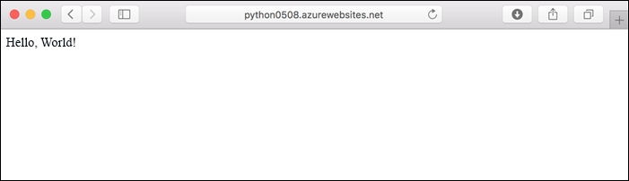
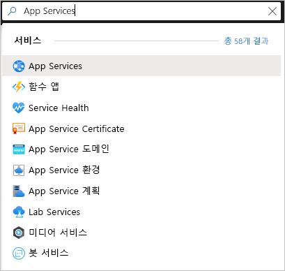
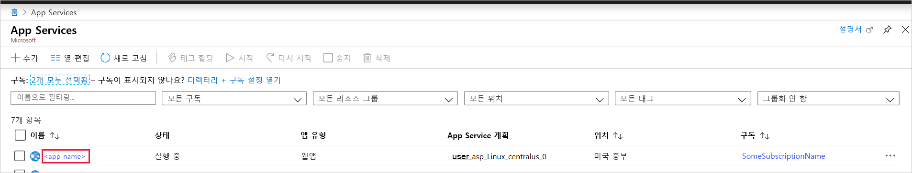
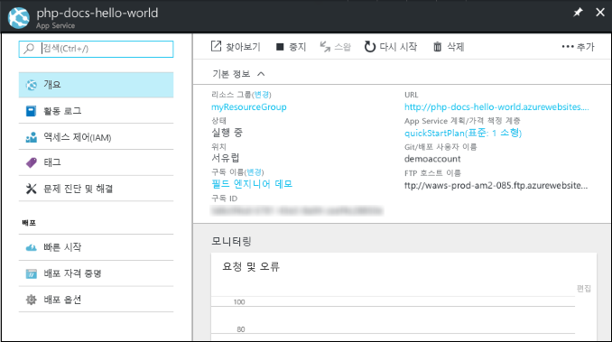

# <a name="quickstart-create-a-python-app-in-azure-app-service-on-linux"></a>빠른 시작: Azure App Service on Linux에서 Python 앱 만들기

이 빠른 시작에서는 확장성이 뛰어난 자체 패치 웹 호스팅 서비스인 [App Service on Linux](app-service-linux-intro.md)에 Python 앱을 배포합니다. Mac, Linux 또는 Windows 컴퓨터에서 로컬 [Azure CLI(명령줄 인터페이스)](/cli/azure/install-azure-cli)를 사용합니다. 구성하는 웹앱은 무료 App Service 계층을 사용하기 때문에 이 문서를 진행하는 동안 비용이 발생하지 않습니다.

IDE를 통한 앱 배포를 선호하는 경우에는 [Visual Studio Code에서 App Service에 Python 앱 배포](/azure/python/tutorial-deploy-app-service-on-linux-01)를 참조하세요.

## <a name="prerequisites"></a>사전 요구 사항

- Azure 구독 - [체험 구독 만들기](https://azure.microsoft.com/free/?ref=microsoft.com&utm_source=microsoft.com&utm_medium=docs&utm_campaign=visualstudio)
- <a href="https://www.python.org/downloads/" target="_blank">Python 3.7</a>(Python 3.6도 지원됨)
- <a href="https://git-scm.com/downloads" target="_blank">Git</a>
- <a href="https://docs.microsoft.com/cli/azure/install-azure-cli" target="_blank">Azure CLI</a>

## <a name="download-the-sample"></a>샘플 다운로드

터미널 창에서 다음 명령을 실행하여 로컬 컴퓨터에 샘플 애플리케이션을 복제합니다. 

```terminal
git clone https://github.com/Azure-Samples/python-docs-hello-world
```

그런 다음, 해당 폴더로 이동합니다.

```terminal
cd python-docs-hello-world
```

리포지토리는 코드에 Flask 앱이 포함되었음을 App Service에 알려주는 *application.py* 파일을 포함합니다. 자세한 내용은 [컨테이너 시작 프로세스 및 사용자 지정](how-to-configure-python.md)을 참조하세요.

## <a name="sign-in-to-azure"></a>Azure에 로그인

Azure CLI는 로컬 터미널에서 사용하여 명령줄에서 Azure 리소스를 프로비저닝하고 관리할 수 있는 여러 가지 편리한 명령을 제공합니다. 이러한 명령을 사용하여 브라우저에서 Azure Portal을 통해 수행하는 것과 동일한 작업을 완료할 수 있습니다. 스크립트에서 CLI 명령을 사용하여 관리 프로세스를 자동화할 수도 있습니다.

Azure CLI에서 Azure 명령을 실행하려면 먼저 `az login` 명령을 사용하여 로그인해야 합니다. 이 명령은 로그인 정보를 수집하는 브라우저를 엽니다.

```azurecli
az login
```

## <a name="deploy-the-sample"></a>샘플 배포

[`az webapp up`](/cli/azure/webapp#az-webapp-up) 명령은 App Service에서 웹앱을 만들고 코드를 배포합니다.

샘플 코드를 포함하는 *python-docs-hello-world* 폴더에서 다음 `az webapp up` 명령을 실행합니다. `<app-name>`을 전역적으로 고유한 앱 이름(*유효한 문자는 `a-z`, `0-9`, `-`임*)으로 바꿉니다. `<location-name>`도 Azure 지역(예: **centralus**, **eastasia**, **westeurope**, **koreasouth**, **brazilsouth**, **centralindia** 등)으로 바꿉니다. (Azure 계정에 허용되는 지역 목록은 [`az account locations-list`](/cli/azure/appservice?view=azure-cli-latest.md#az-appservice-list-locations) 명령을 실행하여 검색할 수 있습니다.)


```azurecli
az webapp up --sku F1 -n <app-name> -l <location-name>
```

이 명령은 실행하는 데 몇 분 정도 걸릴 수 있습니다. 실행 시 다음 예와 유사한 정보를 출력합니다.

```output
The behavior of this command has been altered by the following extension: webapp
Creating Resource group 'appsvc_rg_Linux_centralus' ...
Resource group creation complete
Creating App service plan 'appsvc_asp_Linux_centralus' ...
App service plan creation complete
Creating app '<app-name>' ....
Webapp creation complete
Creating zip with contents of dir /home/username/quickstart/python-docs-hello-world ...
Preparing to deploy contents to app.
All done.
{
  "app_url": "https:/<app-name>.azurewebsites.net",
  "location": "Central US",
  "name": "<app-name>",
  "os": "Linux",
  "resourcegroup": "appsvc_rg_Linux_centralus ",
  "serverfarm": "appsvc_asp_Linux_centralus",
  "sku": "BASIC",
  "src_path": "/home/username/quickstart/python-docs-hello-world ",
  "version_detected": "-",
  "version_to_create": "python|3.7"
}
```

[!INCLUDE [AZ Webapp Up Note](../../../includes/app-service-web-az-webapp-up-note.md)]

## <a name="browse-to-the-app"></a>앱으로 이동

웹 브라우저에서 배포된 애플리케이션(URL: `http://<app-name>.azurewebsites.net`)으로 이동합니다.

Python 샘플 코드가 기본 제공 이미지를 사용하여 App Service에서 Linux 컨테이너를 실행 중입니다.



**축하합니다.** App Service on Linux에 Python 앱이 배포되었습니다.

## <a name="run-the-sample-app-locally"></a>로컬로 샘플 앱 실행

터미널 창에서 아래 명령(운영 체제에 적합한 명령)을 사용하여 필요한 종속성을 설치하고 기본 제공 개발 서버를 시작합니다. 

# <a name="bash"></a>[Bash](#tab/bash)

```bash
python3 -m venv venv
source venv/bin/activate
pip install -r requirements.txt
FLASK_APP=application.py
flask run
```

# <a name="powershell"></a>[PowerShell](#tab/powershell)

```powershell
py -3 -m venv env
env\scripts\activate
pip install -r requirements.txt
Set-Item Env:FLASK_APP ".\application.py"
flask run
```

# <a name="cmd"></a>[Cmd](#tab/cmd)

```cmd
py -3 -m venv env
env\scripts\activate
pip install -r requirements.txt
SET FLASK_APP=application.py
flask run
```

---

웹 브라우저를 열고 `http://localhost:5000/`의 샘플 앱으로 이동합니다. 앱에 **Hello World!** 메시지가 표시됩니다.


터미널 창에서 **Ctrl**+**C**를 눌러서 웹 서버를 종료합니다.

## <a name="redeploy-updates"></a>업데이트 재배포

원하는 코드 편집기에서 *application.py*를 열고 마지막 줄의 `return` 문을 다음 코드와 일치하도록 변경합니다. `print` 문은 다음 섹션에서 작업하는 로깅 출력을 생성하기 위해 여기에 포함됩니다. 

```python
print("Handling request to home page.")
return "Hello Azure!"
```

변경 내용을 저장하고 편집기를 종료합니다. 

처음으로 앱을 배포할 때 사용한 것과 동일한 `az webapp up` 명령을 사용하되 `<app-name>`과 `<location-name>`을 이전에 사용한 것과 동일한 이름으로 바꿔서 앱을 재배포합니다. 

```azurecli
az webapp up --sku F1 -n <app-name> -l <location-name>
```

배포가 완료되면 브라우저 창으로 다시 전환하여 `http://<app-name>.azurewebsites.net`을 열고 페이지를 새로 고칩니다. 그러면 수정된 메시지가 표시됩니다.


> [!TIP]
> Visual Studio Code는 Python 웹앱을 App Service에 배포하는 프로세스를 간소화하는 Python 및 Azure App Service에 대한 강력한 확장 기능을 제공합니다. 자세한 내용은 [Visual Studio Code에서 Azure App Service에 Python 앱 배포](/azure/python/tutorial-deploy-app-service-on-linux-01)를 참조하세요.

## <a name="stream-logs"></a>로그 스트리밍

앱 내부에서 생성되는 콘솔 로그와 앱이 실행되는 컨테이너에 액세스할 수 있습니다. 로그에는 `print` 문을 사용하여 생성된 모든 출력이 포함됩니다.

먼저 터미널에서 다음 명령을 실행하여 컨테이너 로깅을 설정합니다. 이때 `<app-name>`은 앱 이름으로 바꾸고, `<resource-group-name>`은 사용한 `az webapp up` 명령의 출력에 표시된 리소스 그룹 이름(예: "appsvc_rg_Linux_centralus")으로 바꿉니다.

```azurecli
az webapp log config --name <app-name> --resource-group <resource-group-name> --docker-container-logging filesystem
```

컨테이너 로깅이 설정되면 다음 명령을 실행하여 로그 스트림을 표시합니다.

```azurecli
az webapp log tail --name <app-name> --resource-group <resource-group-name>
```

브라우저에서 앱을 새로 고쳐서 콘솔 로그를 생성합니다. 여기에는 다음 텍스트와 유사한 줄이 포함되어야 합니다. 출력이 즉시 표시되지 않으면 30초 후에 다시 시도합니다.

```output
2019-10-23T12:40:03.815574424Z Handling request to home page.
2019-10-23T12:40:03.815602424Z 172.16.0.1 - - [23/Oct/2019:12:40:03 +0000] "GET / HTTP/1.1" 200 12 "-" "Mozilla/5.0 (Windows NT 10.0; Win64; x64) AppleWebKit/537.36 (KHTML, like Gecko) Chrome/78.0.3904.63 Safari/537.36 Edg/78.0.276.19"
```

`https://<app-name>.scm.azurewebsites.net/api/logs/docker`의 브라우저에서 로그 파일을 검사할 수도 있습니다.

언제든지 로그 스트리밍을 중지하려면 `Ctrl`+`C`를 입력합니다.

## <a name="manage-the-azure-app"></a>Azure 앱 관리

만든 앱을 관리하려면 <a href="https://portal.azure.com" target="_blank">Azure Portal</a>로 이동합니다. **App Services**를 검색하여 선택합니다.



Azure 앱의 이름을 선택합니다.



앱의 [개요] 페이지가 표시됩니다. 여기에서 찾아보기, 중지, 시작, 다시 시작, 삭제와 같은 기본 관리 작업을 수행할 수 있습니다.



App Service 메뉴는 앱 구성을 위한 다양한 페이지를 제공합니다.

## <a name="clean-up-resources"></a>리소스 정리

이전 단계에서 Azure 리소스를 리소스 그룹에 만들었습니다. 리소스 그룹의 이름은 사용자의 위치에 따라 "appsvc_rg_Linux_CentralUS" 등입니다. 무료 F1 계층 이외의 App Service SKU를 사용하면 이러한 리소스에 지속적인 비용이 발생합니다.

이러한 리소스가 나중에 필요하지 않을 것으로 예상되면 다음 명령을 실행하여 리소스 그룹을 삭제합니다. 이때 `<resource-group-name>`은 `az webapp up` 명령의 출력에 표시된 리소스 그룹(예: "appsvc_rg_Linux_centralus")으로 바꿉니다. 이 명령을 완료하는 데 1분 정도 걸릴 수 있습니다.

```azurecli
az group delete -n <resource-group-name>
```

## <a name="next-steps"></a>다음 단계

> [!div class="nextstepaction"]
> [자습서: PostgreSQL을 사용하는 Python(Django) 웹앱](tutorial-python-postgresql-app.md)

> [!div class="nextstepaction"]
> [Python 앱 구성](how-to-configure-python.md)

> [!div class="nextstepaction"]
> [자습서: 사용자 지정 컨테이너에서 Python 앱 실행](tutorial-custom-docker-image.md)
