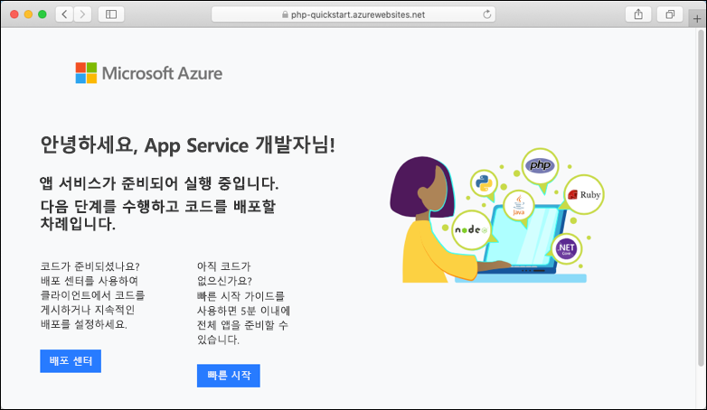

# <a name="create-a-python-web-app-in-azure-app-service-on-linux-preview"></a>Linux의 Azure App Service에서 Python 웹앱 만들기(미리 보기)

[Linux의 App Service](app-service-linux-intro.md)는 Linux 운영 체제를 기반으로 확장성이 높은 자체 패치 웹 호스팅 서비스를 제공합니다. 이 빠른 시작에서는 [Azure CLI](/cli/azure/install-azure-cli)를 사용하여 App Service에서 기본 Python 이미지(미리 보기) 위에 Python 앱을 배포하는 방법을 보여 줍니다.

Mac, Windows 또는 Linux 컴퓨터를 사용하여 이 문서의 단계를 수행하면 됩니다.


[!INCLUDE [quickstarts-free-trial-note](../../../includes/quickstarts-free-trial-note.md)]

## <a name="prerequisites"></a>필수 조건

이 빠른 시작을 완료하려면 다음이 필요합니다.

* <a href="https://www.python.org/downloads/" target="_blank">Python 3.7 설치</a>
* <a href="https://git-scm.com/" target="_blank">Git 설치</a>

## <a name="download-the-sample"></a>샘플 다운로드

터미널 창에서 다음 명령을 실행하여, 샘플 애플리케이션을 로컬 머신에 복제하고 샘플 코드가 들어 있는 디렉터리로 이동합니다.

```bash
git clone https://github.com/Azure-Samples/python-docs-hello-world
cd python-docs-hello-world
```

## <a name="run-the-app-locally"></a>로컬에서 앱 실행하기

애플리케이션을 로컬로 실행하여 Azure에 애플리케이션을 배포할 때 표시되는 모양을 확인합니다. 터미널 창을 열고 아래 명령을 사용하여 필요한 종속성을 설치하고 기본 제공 개발 서버를 시작합니다. 

```bash
# In Bash
python3 -m venv venv
source venv/bin/activate
pip install -r requirements.txt
FLASK_APP=application.py flask run

# In PowerShell
py -3 -m venv env
env\scripts\activate
pip install -r requirements.txt
Set-Item Env:FLASK_APP ".\application.py"
flask run
```

웹 브라우저를 열고 `http://localhost:5000/`의 샘플 앱으로 이동합니다.

이 페이지에 표시된 샘플 앱의 **Hello World!** 메시지가 표시됩니다.


터미널 창에서 **Ctrl+C**를 눌러 웹 서버를 종료합니다.

[!INCLUDE [cloud-shell-try-it.md](../../../includes/cloud-shell-try-it.md)]

[!INCLUDE [Configure deployment user](../../../includes/configure-deployment-user.md)]

[!INCLUDE [Create resource group](../../../includes/app-service-web-create-resource-group-linux.md)]

[!INCLUDE [Create app service plan](../../../includes/app-service-web-create-app-service-plan-linux.md)]

## <a name="create-a-web-app"></a>웹앱 만들기

[!INCLUDE [Create app service plan](../../../includes/app-service-web-create-web-app-python-linux-no-h.md)]

기본 제공 이미지를 사용하여 새로 만든 웹앱을 보려면 사이트로 이동합니다. _&lt;앱 이름>_ 을 해당하는 웹앱 이름으로 바꿉니다.

```bash
http://<app_name>.azurewebsites.net
```

새로운 웹앱은 다음과 같아야 합니다.



[!INCLUDE [Push to Azure](../../../includes/app-service-web-git-push-to-azure.md)] 

```bash
Counting objects: 42, done.
Delta compression using up to 8 threads.
Compressing objects: 100% (39/39), done.
Writing objects: 100% (42/42), 9.43 KiB | 0 bytes/s, done.
Total 42 (delta 15), reused 0 (delta 0)
remote: Updating branch 'master'.
remote: Updating submodules.
remote: Preparing deployment for commit id 'c40efbb40e'.
remote: Generating deployment script.
remote: Generating deployment script for python Web Site
.
.
.
remote: Finished successfully.
remote: Running post deployment command(s)...
remote: Deployment successful.
remote: App container will begin restart within 10 seconds.
To https://user2234@cephalin-python.scm.azurewebsites.net/cephalin-python.git
 * [new branch]      master -> master
 ```

## <a name="browse-to-the-app"></a>앱으로 이동

웹 브라우저를 사용하여 배포된 애플리케이션으로 이동합니다.

```bash
http://<app_name>.azurewebsites.net
```

Python 샘플 코드가 기본 제공 이미지가 있는 웹앱에서 실행됩니다.


**축하합니다.** Linux에서 App Service에 첫 번째 Python 앱을 배포했습니다.

## <a name="update-locally-and-redeploy-the-code"></a>로컬로 코드 업데이트 및 다시 배포

로컬 리포지토리에서 `application.py` 파일을 열고 마지막 줄의 텍스트를 다음과 같이 약간 변경합니다.

```python
return "Hello Azure!"
```

Git에서 변경 내용을 커밋한 다음 Azure에 코드 변경 내용을 푸시합니다.

```bash
git commit -am "updated output"
git push azure master
```

배포가 완료되면 **앱으로 이동** 단계에서 열린 브라우저 창으로 다시 전환하고 페이지를 새로 고칩니다.


## <a name="manage-your-new-azure-web-app"></a>새로운 Azure 웹앱 관리

만든 웹앱을 관리하려면 <a href="https://portal.azure.com" target="_blank">Azure Portal</a>로 이동합니다.

왼쪽 메뉴에서 **App Services**를 클릭한 다음 Azure 웹앱의 이름을 클릭합니다.


웹앱의 개요 페이지가 표시됩니다. 여기에서 찾아보기, 중지, 시작, 다시 시작, 삭제와 같은 기본 관리 작업을 수행할 수 있습니다.


왼쪽 메뉴는 앱 구성을 위한 다양한 페이지를 제공합니다. 

[!INCLUDE [cli-samples-clean-up](../../../includes/cli-samples-clean-up.md)]

## <a name="next-steps"></a>다음 단계

Linux의 App Service에 기본 제공되는 Python 이미지는 현재 미리 보기로 제공되며, 앱 시작에 사용되는 명령을 사용자 지정할 수 있습니다. 사용자 지정 컨테이너를 대신 사용하여 프로덕션 Python 앱을 만들 수도 있습니다.

> [!div class="nextstepaction"]
> [PostgreSQL을 사용하는 Python](tutorial-python-postgresql-app.md)

> [!div class="nextstepaction"]
> [사용자 지정 시작 명령 구성](how-to-configure-python.md#custom-startup-command)

> [!div class="nextstepaction"]
> [문제 해결](how-to-configure-python.md#troubleshooting)

> [!div class="nextstepaction"]
> [사용자 지정 이미지 사용](tutorial-custom-docker-image.md)
