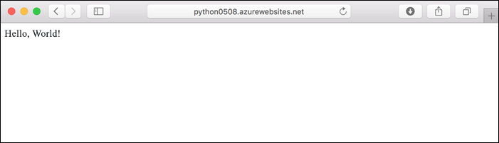
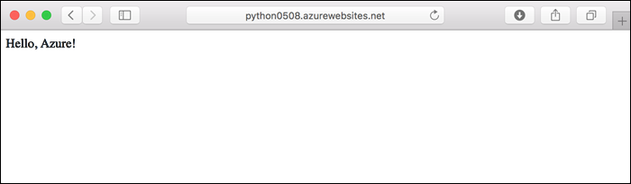
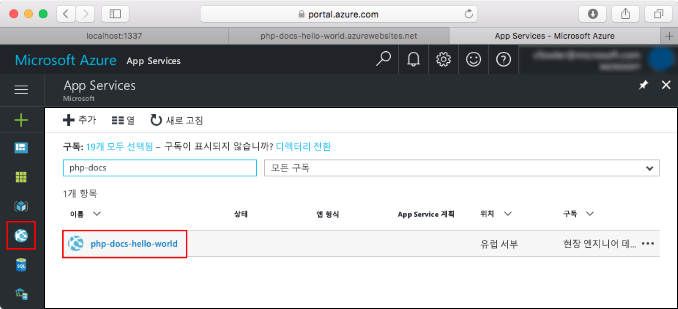

# <a name="create-a-python-app-in-azure-app-service-on-linux"></a>Azure App Service on Linux에서 Python 앱 만들기

이 빠른 시작에서는 간단한 Python 앱을 [Linux의 App Service](app-service-linux-intro.md)에 배포합니다. 이는 확장성이 높은 셀프 패치 웹 호스팅 서비스를 제공합니다. 대화형, 브라우저 기반 Azure Cloud Shell을 통해 Azure 명령줄 인터페이스([Azure CLI](/cli/azure/install-azure-cli))를 사용하므로 Mac, Linux 또는 Windows 컴퓨터를 사용하여 단계를 수행할 수 있습니다.



## <a name="prerequisites"></a>필수 조건

이 빠른 시작을 완료하려면 다음이 필요합니다.

* <a href="https://www.python.org/downloads/" target="_blank">Python 3.7 설치</a>
* <a href="https://git-scm.com/" target="_blank">Git 설치</a>
* Azure 구독. 구독이 없으면 시작하기 전에 [체험 계정](https://azure.microsoft.com/free/?ref=microsoft.com&utm_source=microsoft.com&utm_medium=docs&utm_campaign=visualstudio)을 만드세요.

## <a name="download-the-sample-locally"></a>로컬로 샘플 다운로드

터미널 창에서 다음 명령을 실행하여, 샘플 애플리케이션을 로컬 머신에 복제하고 샘플 코드가 들어 있는 디렉터리로 이동합니다.

```bash
git clone https://github.com/Azure-Samples/python-docs-hello-world
cd python-docs-hello-world
```

리포지토리는 리포지토리에 Flask 앱이 포함되었음을 App Service에 알려 주는 *application.py*를 포함합니다. 자세한 내용은 [컨테이너 시작 프로세스 및 사용자 지정](how-to-configure-python.md)을 참조하세요.

## <a name="run-the-app-locally"></a>로컬에서 앱 실행하기

애플리케이션을 로컬로 실행하여 Azure에 애플리케이션을 배포할 때 표시되는 모양을 확인합니다. 터미널 창을 열고 아래 명령을 사용하여 필요한 종속성을 설치하고 기본 제공 개발 서버를 시작합니다. 

```bash
# In Bash
python3 -m venv venv
source venv/bin/activate
pip install -r requirements.txt
FLASK_APP=application.py flask run

# In PowerShell
py -3 -m venv env
env\scripts\activate
pip install -r requirements.txt
Set-Item Env:FLASK_APP ".\application.py"
flask run
```

웹 브라우저를 열고 `http://localhost:5000/`의 샘플 앱으로 이동합니다.

이 페이지에 표시된 샘플 앱의 **Hello World!** 메시지가 표시됩니다.


터미널 창에서 **Ctrl+C**를 눌러 웹 서버를 종료합니다.

[!INCLUDE [cloud-shell-try-it.md](../../../includes/cloud-shell-try-it.md)]

## <a name="download-the-sample"></a>샘플 다운로드

Cloud Shell에서 quickstart 디렉터리를 만든 다음, 해당 디렉토리로 이동합니다.

```bash
mkdir quickstart

cd quickstart
```

이어서 다음 명령을 실행하여 quickstart 디렉터리에 샘플 앱 리포지토리를 복제합니다.

```bash
git clone https://github.com/Azure-Samples/python-docs-hello-world
```

실행 시 다음 예와 유사한 정보를 출력합니다.

```bash
Cloning into 'python-docs-hello-world'...
remote: Enumerating objects: 43, done.
remote: Total 43 (delta 0), reused 0 (delta 0), pack-reused 43
Unpacking objects: 100% (43/43), done.
Checking connectivity... done.
```

## <a name="create-a-web-app"></a>웹앱 만들기

샘플 코드가 들어있는 디렉토리로 이동한 후 `az webapp up` 명령을 실행합니다.

다음 예제에서 `<app-name>`을 고유한 앱 이름으로 바꿉니다.

```bash
cd python-docs-hello-world

az webapp up -n <app-name>
```

이 명령을 실행하는 데 몇 분 정도 걸릴 수 있습니다. 실행 시 다음 예와 유사한 정보를 출력합니다.

```json
The behavior of this command has been altered by the following extension: webapp
Creating Resource group 'appsvc_rg_Linux_CentralUS' ...
Resource group creation complete
Creating App service plan 'appsvc_asp_Linux_CentralUS' ...
App service plan creation complete
Creating app '<app-name>' ....
Webapp creation complete
Creating zip with contents of dir /home/username/quickstart/python-docs-hello-world ...
Preparing to deploy contents to app.
All done.
{
  "app_url": "https:/<app-name>.azurewebsites.net",
  "location": "Central US",
  "name": "<app-name>",
  "os": "Linux",
  "resourcegroup": "appsvc_rg_Linux_CentralUS ",
  "serverfarm": "appsvc_asp_Linux_CentralUS",
  "sku": "BASIC",
  "src_path": "/home/username/quickstart/python-docs-hello-world ",
  "version_detected": "-",
  "version_to_create": "python|3.7"
}
```

[!INCLUDE [AZ Webapp Up Note](../../../includes/app-service-web-az-webapp-up-note.md)]

## <a name="browse-to-the-app"></a>앱으로 이동

웹 브라우저를 사용하여 배포된 애플리케이션으로 이동합니다.

```bash
http://<app-name>.azurewebsites.net
```

Python 샘플 코드가 기본 제공 이미지가 있는 Linux의 App Service에서 실행됩니다.


**축하합니다.** Linux에서 App Service에 첫 번째 Python 앱을 배포했습니다.

## <a name="update-locally-and-redeploy-the-code"></a>로컬로 코드 업데이트 및 다시 배포

Cloud Shell에서 `code application.py`을 입력하여 Cloud Shell 편집기를 엽니다.


 `return`에 대한 호출에서 텍스트를 약간 변경합니다.

```python
return "Hello Azure!"
```

변경 내용을 저장하고 편집기를 종료합니다. `^S` 명령을 사용하여 저장하고 `^Q` 명령을 사용하여 종료합니다.

[`az webapp up`](/cli/azure/ext/webapp/webapp?view=azure-cli-latest.md#ext-webapp-az-webapp-up) 명령을 사용하여 앱을 다시 배포합니다. `<app-name>`을 앱의 이름으로 바꾸고 `<location-name>`에 대한 위치를 지정합니다([`az account list-locations`](/cli/azure/appservice?view=azure-cli-latest.md#az-appservice-list-locations) 명령에서 표시 된 값 중 하나를 사용).

```bash
az webapp up -n <app-name> -l <location-name>
```

배포가 완료되면 **앱으로 이동** 단계에서 열린 브라우저 창으로 다시 전환하고 페이지를 새로 고칩니다.



## <a name="manage-your-new-azure-app"></a>새 Azure 앱 관리

만든 앱을 관리하려면 <a href="https://portal.azure.com" target="_blank">Azure Portal</a>로 이동합니다.

왼쪽 메뉴에서 **App Services**를 클릭한 다음, Azure 앱의 이름을 클릭합니다.



앱의 개요 페이지가 표시됩니다. 여기에서 찾아보기, 중지, 시작, 다시 시작, 삭제와 같은 기본 관리 작업을 수행할 수 있습니다.


왼쪽 메뉴로 앱 구성을 위한 여러가지 페이지를 볼 수 있습니다. 

[!INCLUDE [cli-samples-clean-up](../../../includes/cli-samples-clean-up.md)]

## <a name="next-steps"></a>다음 단계

> [!div class="nextstepaction"]
> [자습서: PostgreSQL을 사용한 Python 앱](tutorial-python-postgresql-app.md)

> [!div class="nextstepaction"]
> [Python 앱 구성](how-to-configure-python.md)

> [!div class="nextstepaction"]
> [자습서: 사용자 지정 컨테이너에서 Python 앱 실행](tutorial-custom-docker-image.md)
