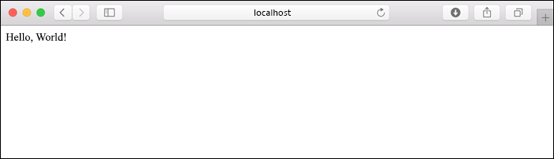

# <a name="quickstart-create-a-python-app-in-azure-app-service-on-linux"></a>빠른 시작: Azure App Service on Linux에서 Python 앱 만들기

이 빠른 시작에서는 확장성이 뛰어난 자체 패치 웹 호스팅 서비스인 [App Service on Linux](app-service-linux-intro.md)에 Python 앱을 배포합니다. Mac, Linux 또는 Windows 컴퓨터에서 로컬 [Azure CLI(명령줄 인터페이스)](/cli/azure/install-azure-cli)를 사용합니다. 구성하는 웹앱은 무료 App Service 계층을 사용하기 때문에 이 문서를 진행하는 동안 비용이 발생하지 않습니다.

IDE를 통한 앱 배포를 선호하는 경우에는 [Visual Studio Code에서 App Service에 Python 앱 배포](/azure/developer/python/tutorial-deploy-app-service-on-linux-01)를 참조하세요.

## <a name="set-up-your-initial-environment"></a>초기 환경 설정

시작하기 전에 다음이 있어야 합니다.

1. 활성 구독이 포함된 Azure 계정이 있어야 합니다. [체험 계정을 만듭니다](https://azure.microsoft.com/free/?ref=microsoft.com&utm_source=microsoft.com&utm_medium=docs&utm_campaign=visualstudio).
1. <a href="https://www.python.org/downloads/" target="_blank">Python 3.6 이상</a>을 설치합니다.
1. <a href="/cli/azure/install-azure-cli" target="_blank">Azure CLI</a> 2.0.80 이상을 설치합니다. 이를 통해 셸에서 명령을 실행하여 Azure 리소스를 프로비저닝하고 구성할 수 있습니다.

터미널 창을 열고 Python 버전이 3.6 이상인지 확인합니다.

# <a name="bash"></a>[Bash](#tab/bash)

```bash
python3 --version
```

# <a name="powershell"></a>[PowerShell](#tab/powershell)

```cmd
py -3 --version
```

# <a name="cmd"></a>[Cmd](#tab/cmd)

```cmd
py -3 --version
```

---

Azure CLI 버전이 2.0.80 이상인지 확인합니다.

```azurecli
az --version
```

그런 다음, CLI를 통해 Azure에 로그인합니다.

```azurecli
az login
```

이 명령은 로그인 정보를 수집하는 브라우저를 엽니다. 명령이 완료되면 구독에 대한 정보가 포함된 JSON 출력이 표시됩니다.

로그인하면 Azure CLI에서 Azure 명령을 실행하여 구독의 리소스를 사용할 수 있습니다.

## <a name="clone-the-sample"></a>샘플 복제

다음 명령을 사용하여 샘플 리포지토리를 복제합니다. (git를 아직 설치하지 않은 경우 [git를 설치](https://git-scm.com/downloads)합니다.)

```terminal
git clone https://github.com/Azure-Samples/python-docs-hello-world
```

그런 다음, 해당 폴더로 이동합니다.

```terminal
cd python-docs-hello-world
```

샘플 코드는 코드에 Flask 앱이 포함되었음을 App Service에 알려주는 *application.py* 파일을 포함합니다. 자세한 내용은 [컨테이너 시작 프로세스 및 사용자 지정](how-to-configure-python.md)을 참조하세요.

## <a name="run-the-sample"></a>샘플 실행

# <a name="bash"></a>[Bash](#tab/bash)

먼저 가상 환경을 만들고 종속성을 설치합니다.

```bash
python3 -m venv venv
source venv/bin/activate
pip install -r requirements.txt
```

그런 다음, `FLASK_APP` 환경 변수를 앱의 진입 모듈로 설정하고 Flask 개발 서버를 실행합니다.

```
export FLASK_APP=application.py
flask run
```

# <a name="powershell"></a>[PowerShell](#tab/powershell)

먼저 가상 환경을 만들고 종속성을 설치합니다.

```powershell
py -3 -m venv env
env\scripts\activate
pip install -r requirements.txt
```

그런 다음, `FLASK_APP` 환경 변수를 앱의 진입 모듈로 설정하고 Flask 개발 서버를 실행합니다.

```powershell
Set-Item Env:FLASK_APP ".\application.py"
flask run
```

# <a name="cmd"></a>[Cmd](#tab/cmd)

먼저 가상 환경을 만들고 종속성을 설치합니다.

```cmd
py -3 -m venv env
env\scripts\activate
pip install -r requirements.txt
```

그런 다음, `FLASK_APP` 환경 변수를 앱의 진입 모듈로 설정하고 Flask 개발 서버를 실행합니다.

```cmd
SET FLASK_APP=application.py
flask run
```

---

웹 브라우저를 열고 `http://localhost:5000/`의 샘플 앱으로 이동합니다. 앱에 **Hello World!** 메시지가 표시됩니다.



터미널 창에서 **Ctrl**+**C**를 눌러 Flask 개발 서버를 종료합니다.

## <a name="deploy-the-sample"></a>샘플 배포

`az webapp up` 명령을 사용하여 로컬 폴더(*python-docs-hello-world*)에 코드를 배포합니다.

```azurecli
az webapp up --sku F1 -n <app-name>
```

- `az` 명령을 인식할 수 없는 경우 [초기 환경 설정](#set-up-your-initial-environment)에 설명된 대로 Azure CLI가 설치되어 있어야 합니다.
- `<app_name>`을 모든 Azure에서 고유한 이름으로 바꿉니다(*유효한 문자는 `a-z`, `0-9` 및 `-`* ). 좋은 패턴은 회사 이름과 앱 식별자의 조합을 사용하는 것입니다.
- `--sku F1` 인수는 무료 가격 책정 계층에 웹앱을 만듭니다. 이 인수를 생략하여 더 빠른 프리미엄 계층을 사용합니다. 이 경우 시간당 비용이 발생합니다.
- `<location_name>`이 **centralus**, **eastasia**, **westeurope**, **koreasouth**, **brazilsouth**, **centralindia** 등과 같은 Azure 지역인 `-l <location-name>` 인수를 필요에 따라 포함할 수 있습니다. Azure 계정에 허용되는 지역 목록은 [`az account list-locations`](/cli/azure/appservice?view=azure-cli-latest.md#az-appservice-list-locations) 명령을 실행하여 검색할 수 있습니다.

이 명령을 완료하는 데 몇 분 정도 걸릴 수 있습니다. 실행되는 동안 리소스 그룹, App Service 계획 및 호스팅 앱을 만들고, 로깅을 구성한 다음, ZIP 배포 수행에 대한 메시지를 제공합니다. 그런 다음, "http://&lt;app-name&gt;.azurewebsites.net에서 앱을 시작할 수 있습니다."라는 메시지를 제공합니다. 이 메시지는 Azure에서 앱의 URL입니다.


[!INCLUDE [AZ Webapp Up Note](../../../includes/app-service-web-az-webapp-up-note.md)]

## <a name="browse-to-the-app"></a>앱으로 이동

웹 브라우저에서 배포된 애플리케이션(URL: `http://<app-name>.azurewebsites.net`)으로 이동합니다.

Python 샘플 코드가 기본 제공 이미지를 사용하여 App Service에서 Linux 컨테이너를 실행 중입니다.


**축하합니다.** App Service on Linux에 Python 앱이 배포되었습니다.

## <a name="redeploy-updates"></a>업데이트 재배포

즐겨 찾는 코드 편집기에서 *application.py*를 열고 `hello` 함수를 다음과 같이 업데이트합니다. 이 변경 사항은 다음 섹션에서 작업하는 로깅 출력을 생성하기 위해 `print` 문을 추가합니다. 

```python
def hello():
    print("Handling request to home page.")
    return "Hello Azure!"
```

변경 내용을 저장하고 편집기를 종료합니다. 

`az webapp up` 명령을 사용하여 앱을 다시 배포합니다.

```azurecli
az webapp up
```

이 명령은 앱 이름, 리소스 그룹 및 App Service 계획을 포함하여 *.azure/config* 파일에서 로컬로 캐시된 값을 사용합니다.

배포가 완료되면 `http://<app-name>.azurewebsites.net`으로 열린 브라우저 창으로 다시 전환합니다. 수정된 메시지를 표시하는 페이지를 새로 고칩니다.


> [!TIP]
> Visual Studio Code는 Python 웹앱을 App Service에 배포하는 프로세스를 간소화하는 Python 및 Azure App Service에 대한 강력한 확장 기능을 제공합니다. 자세한 내용은 [Visual Studio Code에서 Azure App Service에 Python 앱 배포](/azure/python/tutorial-deploy-app-service-on-linux-01)를 참조하세요.

## <a name="stream-logs"></a>로그 스트리밍

앱 내부에서 생성되는 콘솔 로그와 앱이 실행되는 컨테이너에 액세스할 수 있습니다. 로그에는 `print` 문을 사용하여 생성된 모든 출력이 포함됩니다.

로그를 스트리밍하려면 다음 명령을 실행합니다.

```azurecli
az webapp log tail
```

브라우저에서 앱을 새로 고쳐서 콘솔 로그를 생성합니다. 여기에는 앱에 대한 HTTP 요청을 설명하는 메시지를 포함합니다. 출력이 즉시 표시되지 않으면 30초 후에 다시 시도합니다.

`https://<app-name>.scm.azurewebsites.net/api/logs/docker`의 브라우저에서 로그 파일을 검사할 수도 있습니다.

언제든지 로그 스트리밍을 중지하려면 **Ctrl**+**C**를 입력합니다.

## <a name="manage-the-azure-app"></a>Azure 앱 관리

만든 앱을 관리하려면 <a href="https://portal.azure.com" target="_blank">Azure Portal</a>로 이동합니다. **App Services**를 검색하여 선택합니다.


Azure 앱의 이름을 선택합니다.


앱을 선택하면 해당 **개요** 페이지가 열리며 여기에서 찾아보기, 중지, 시작, 다시 시작, 삭제와 같은 기본 관리 작업을 수행할 수 있습니다.


App Service 메뉴는 앱 구성을 위한 다양한 페이지를 제공합니다.

## <a name="clean-up-resources"></a>리소스 정리

이전 단계에서 Azure 리소스를 리소스 그룹에 만들었습니다. 리소스 그룹의 이름은 사용자의 위치에 따라 "appsvc_rg_Linux_CentralUS" 등입니다. 무료 F1 계층 이외의 App Service SKU를 사용하면 이러한 리소스에 지속적인 비용이 발생합니다([App Service 가격 계층](https://azure.microsoft.com/pricing/details/app-service/linux/) 참조).

나중에 이러한 리소스가 필요하지 않으면 다음 명령을 실행하여 리소스 그룹을 삭제합니다.

```azurecli
az group delete
```

이 명령은 *.azure/config* 파일에 캐시된 리소스 그룹 이름을 사용합니다.

이 명령을 완료하는 데 1분 정도 걸릴 수 있습니다.

## <a name="next-steps"></a>다음 단계

> [!div class="nextstepaction"]
> [자습서: PostgreSQL을 사용하는 Python(Django) 웹앱](tutorial-python-postgresql-app.md)

> [!div class="nextstepaction"]
> [Python 웹앱에 사용자 로그인 추가](../../active-directory/develop/quickstart-v2-python-webapp.md)

> [!div class="nextstepaction"]
> [Python 앱 구성](how-to-configure-python.md)

> [!div class="nextstepaction"]
> [자습서: 사용자 지정 컨테이너에서 Python 앱 실행](tutorial-custom-docker-image.md)
