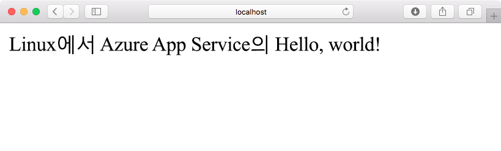
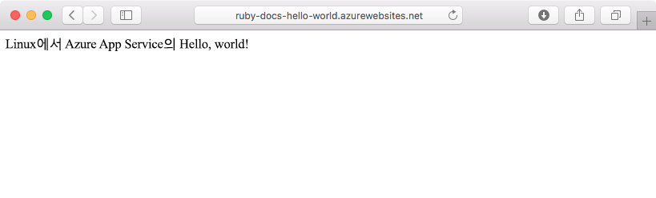
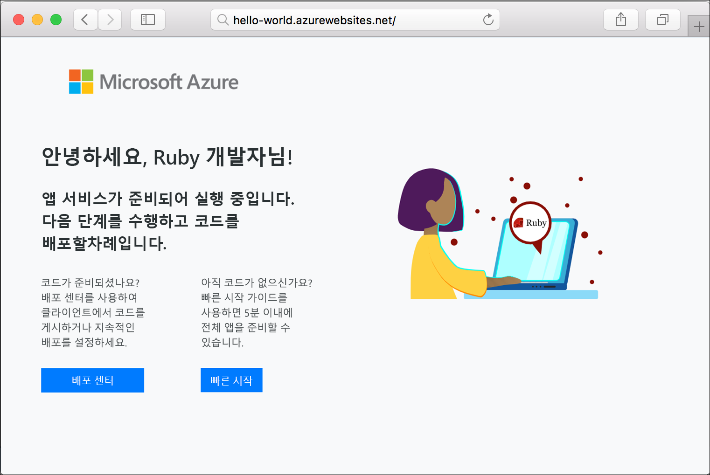

# <a name="create-a-ruby-on-rails-app-in-app-service-on-linux"></a>Linux의 App Service에서 Ruby on Rails 앱 만들기

[Linux의 Azure App Service](app-service-linux-intro.md)는 확장성 높은 자체 패치 웹 호스팅 서비스를 제공합니다. 이 빠른 시작에서는 기본 [Ruby on Rails](https://rubyonrails.org/) 애플리케이션을 만든 다음, Linux의 웹앱으로 Azure에 배포하는 방법을 보여 줍니다.

> [!NOTE]
> Ruby 개발 스택은 현재 Ruby on Rails만 지원합니다. Sinatra와 같은 다른 플랫폼을 사용하거나 [지원되지 않는 Ruby 버전](app-service-linux-intro.md)을 사용하려면 [사용자 지정 컨테이너에서 실행](quickstart-docker-go.md)을 참조하세요.



[!INCLUDE [quickstarts-free-trial-note](../../../includes/quickstarts-free-trial-note.md)]

## <a name="prerequisites"></a>필수 조건

* <a href="https://www.ruby-lang.org/en/documentation/installation/#rubyinstaller" target="_blank">Ruby 2.3 이상 설치</a>
* <a href="https://git-scm.com/" target="_blank">Git 설치</a>

## <a name="download-the-sample"></a>샘플 다운로드

터미널 창에서 다음 명령을 실행하여 로컬 컴퓨터에 샘플 앱 리포지토리를 복제합니다.

```bash
git clone https://github.com/Azure-Samples/ruby-docs-hello-world
```

## <a name="run-the-application-locally"></a>로컬에서 애플리케이션 실행

애플리케이션을 로컬로 실행하여 Azure에 애플리케이션을 배포할 때 표시되는 모양을 확인합니다. 터미널 창을 열고, `hello-world` 디렉터리로 변경하고, `rails server` 명령을 사용하여 서버를 시작합니다.

첫 번째 단계는 필요한 Gem을 설치하는 것입니다. 샘플에 `Gemfile`이 포함되어 있으므로 설치할 Gem을 지정하지 않아도 됩니다. 이를 위해 번들러를 사용합니다.

```bash
bundle install
```

Gem이 설치되면 번들러를 사용하여 앱을 시작합니다.

```bash
bundle exec rails server
```

웹 브라우저를 사용하여 `http://localhost:3000`으로 이동한 후 앱을 로컬로 테스트합니다.



[!INCLUDE [Try Cloud Shell](../../../includes/cloud-shell-try-it.md)]

[!INCLUDE [Configure deployment user](../../../includes/configure-deployment-user.md)]

[!INCLUDE [Create resource group](../../../includes/app-service-web-create-resource-group-linux.md)]

[!INCLUDE [Create app service plan](../../../includes/app-service-web-create-app-service-plan-linux.md)]

## <a name="create-a-web-app"></a>웹앱 만들기

[!INCLUDE [Create web app](../../../includes/app-service-web-create-web-app-ruby-linux-no-h.md)] 

기본 제공 이미지를 사용하여 새로 만든 웹앱을 보려면 사이트로 이동합니다. _&lt;앱 이름>_ 을 해당하는 웹앱 이름으로 바꿉니다.

```bash
http://<app_name>.azurewebsites.net
```

새로운 웹앱은 다음과 같아야 합니다.



## <a name="deploy-your-application"></a>애플리케이션 배포

다음 명령을 실행하여 Azure 웹 사이트에 로컬 애플리케이션을 배포합니다.

```bash
git remote add azure <Git deployment URL from above>
git add -A
git commit -m "Initial deployment commit"
git push azure master
```

원격 배포 작업이 성공을 보고하는지 확인합니다. 이 명령은 다음 텍스트와 유사한 출력을 생성합니다.

```bash
remote: Using sass-rails 5.0.6
remote: Updating files in vendor/cache
remote: Bundle gems are installed into ./vendor/bundle
remote: Updating files in vendor/cache
remote: ~site/repository
remote: Finished successfully.
remote: Running post deployment command(s)...
remote: Deployment successful.
To https://<your web app name>.scm.azurewebsites.net/<your web app name>.git
  579ccb....2ca5f31  master -> master
myuser@ubuntu1234:~workspace/<app name>$
```

배포가 완료되면 여기에 표시된 것처럼 [`az webapp restart`](/cli/azure/webapp?view=azure-cli-latest#az-webapp-restart) 명령을 사용하여 배포를 적용하도록 웹앱을 다시 시작합니다.

```azurecli-interactive
az webapp restart --name <app name> --resource-group myResourceGroup
```

사이트로 이동하고 결과를 확인합니다.

```bash
http://<app name>.azurewebsites.net
```


> [!NOTE]
> 앱이 다시 시작되는 동안 사이트로 이동하려고 하면 HTTP 상태 코드 `Error 503 Server unavailable`이 표시됩니다. 완전하게 다시 시작하는 데 몇 분 정도 걸릴 수 있습니다.
>

[!INCLUDE [Clean-up section](../../../includes/cli-script-clean-up.md)]

## <a name="next-steps"></a>다음 단계

> [!div class="nextstepaction"]
> [자습서: Postgres과 Ruby on Rails](tutorial-ruby-postgres-app.md)

> [!div class="nextstepaction"]
> [Ruby 앱 구성](configure-language-ruby.md)
