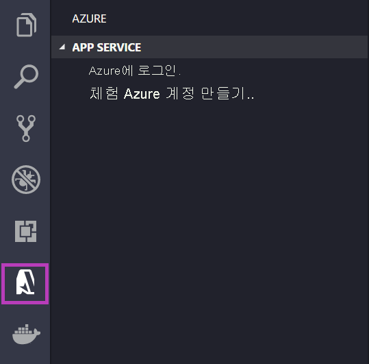
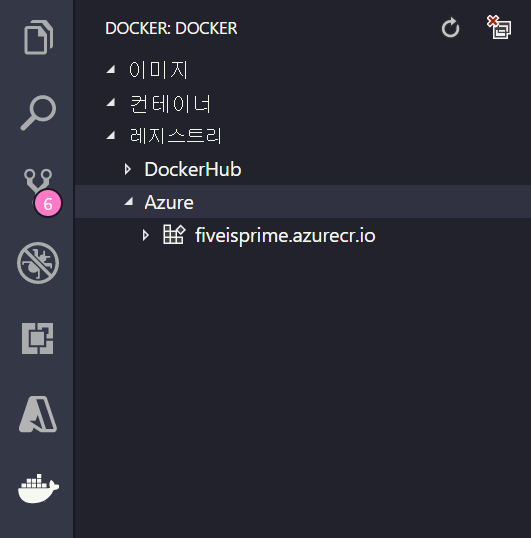

# <a name="run-a-custom-container-in-azure"></a>Azure에서 사용자 지정 컨테이너 실행

::: zone pivot="container-windows"
[Azure App Service](overview.md)는 IIS에서 실행하는 ASP.NET 또는 Node.js와 같은 Windows에서 미리 정의된 애플리케이션 스택을 제공합니다. 미리 구성된 Windows 컨테이너(미리 보기) 환경에서는 관리 액세스, 소프트웨어 설치, 글로벌 어셈블리 캐시 변경 등으로부터 운영 체제를 잠급니다. 자세한 내용은 [Azure App Service의 운영 체제 기능](operating-system-functionality.md)을 참조하세요. 애플리케이션에 미리 구성된 환경에서 허용하는 것보다 많은 액세스 권한이 필요한 경우 대신 사용자 지정 Windows 컨테이너를 배포할 수 있습니다.

이 빠른 시작에서는 Windows 이미지의 ASP.NET 앱을 Visual Studio의 [Docker Hub](https://hub.docker.com/)에 배포합니다. Azure App Service의 사용자 지정 컨테이너에서 앱을 실행합니다.

> [!NOTE]
> Windows 컨테이너의 App Service는 미리 보기로 제공됩니다.
>

## <a name="prerequisites"></a>필수 구성 요소

이 자습서를 완료하려면 다음이 필요합니다.

- <a href="https://hub.docker.com/" target="_blank">Docker 허브 계정 등록</a>
- <a href="https://docs.docker.com/docker-for-windows/install/" target="_blank">Windows용 Docker 설치</a>
- <a href="/virtualization/windowscontainers/quick-start/quick-start-windows-10" target="_blank">Windows 컨테이너를 실행하도록 Docker 전환</a>
- **ASP.NET과 웹 개발** 및 **Azure 개발** 워크로드와 함께 <a href="https://www.visualstudio.com/downloads/" target="_blank">Visual Studio 2019 설치</a> Visual Studio 2019를 이미 설치한 경우:

    - **도움말** > **업데이트 확인**을 차례로 선택하여 Visual Studio에서 최신 업데이트를 설치합니다.
    - **도구** > **도구 및 기능 가져오기**를 차례로 선택하여 Visual Studio에서 워크로드를 추가합니다.

## <a name="create-an-aspnet-web-app"></a>ASP.NET 웹앱 만들기

다음 단계에 따라 ASP.NET 웹앱을 만듭니다.

1. Visual Studio를 연 다음, **새 프로젝트 만들기**를 선택합니다.

1. **새 프로젝트 만들기**에서 C#용 **ASP.NET 웹 애플리케이션(.NET Framework)** 을 찾아서 선택하고, **다음**을 선택합니다.

1. **새 프로젝트 구성**에서 애플리케이션 이름을 _myfirstazurewebapp_으로 지정한 다음, **만들기**를 선택합니다.

   

1. 모든 종류의 ASP.NET 웹앱을 Azure에 배포할 수 있습니다. 이 빠른 시작에서는 **MVC** 템플릿을 선택합니다.

1. **Docker 지원**을 선택하고 인증이 **인증 없음**으로 설정되어 있는지 확인합니다. **만들기**를 선택합니다.

   

1. _Dockerfile_ 파일이 자동으로 열리지 않으면 **솔루션 탐색기**에서 엽니다.

1. [지원되는 부모 이미지](configure-custom-container.md#supported-parent-images)가 필요합니다. `FROM` 줄을 다음 코드로 바꾸고 파일을 저장하여 부모 이미지를 변경합니다.

   ```dockerfile
   FROM mcr.microsoft.com/dotnet/framework/aspnet:4.7.2-windowsservercore-ltsc2019
   ```

1. Visual Studio 메뉴에서 **디버그** > **디버깅하지 않고 시작**을 차례로 선택하여 웹앱을 로컬로 실행합니다.

   

## <a name="publish-to-docker-hub"></a>Docker 허브에 게시

1. **솔루션 탐색기**에서 마우스 오른쪽 단추로 **myfirstazurewebapp** 프로젝트를 클릭하고 **게시**를 선택합니다.

1. **App Service**를 선택한 다음, **게시**를 선택합니다.

1. **게시 대상 선택**에서 **Container Registry** 및 **Docker Hub**를 선택한 다음, **게시**를 클릭합니다.

   

1. Docker Hub 계정 자격 증명을 제공하고 **저장**을 선택합니다.

   배포가 완료될 때가지 기다립니다. 이제 **게시** 페이지에서 나중에 사용할 리포지토리 이름이 표시됩니다.

   

1. 나중에 사용할 수 있도록 이 리포지토리 이름을 복사해 둡니다.

## <a name="create-a-windows-container-app"></a>Windows 컨테이너 앱 만들기

1. [Azure Portal]( https://portal.azure.com)에 로그인합니다.

1. Azure Portal의 왼쪽 위 모서리에서 **리소스 만들기**를 선택합니다.

1. Azure Marketplace 리소스의 목록 위에 있는 검색 상자에서 **Web App for Containers**를 검색하고, **만들기**를 선택합니다.

1. **웹앱 만들기**에서 구독 및 **리소스 그룹**을 선택합니다. 필요한 경우 새 리소스 그룹을 만들 수 있습니다.

1. *win-container-demo*와 같은 앱 이름을 제공하고, **운영 체제**에 대해 **Windows**를 선택합니다. 완료되면 **다음: Docker**를 선택하여 계속합니다.

   

1. **이미지 원본**에 대해 **Docker Hub**를 선택하고, **이미지 및 태그**에 대해 [Docker Hub에 게시](#publish-to-docker-hub)에서 복사한 리포지토리 이름을 입력합니다.

   

    웹 애플리케이션에 대한 사용자 지정 이미지가 [Azure Container Registry](../container-registry/index.yml) 또는 다른 프라이빗 리포지토리와 같이 다른 곳에 있는 경우 여기에서 구성할 수 있습니다.

1. **검토 및 만들기**를 선택한 다음, **만들기**를 선택하여 Azure에서 필요한 리소스를 만들 때까지 기다립니다.

## <a name="browse-to-the-container-app"></a>컨테이너 앱으로 이동

Azure 작업이 완료되면 알림 상자가 표시됩니다.


1. **리소스로 이동**을 클릭합니다.

1. 이 리소스의 개요에서 **URL** 옆에 있는 링크를 따릅니다.

다음 페이지의 새 브라우저 페이지가 열립니다.


기본 ASP.NET 홈 페이지가 표시될 때까지 몇 분 정도 기다렸다가 다시 시도하세요.


**축하합니다.** Azure App Service에서 첫 번째 사용자 지정 Windows 컨테이너를 실행하고 있습니다.

## <a name="see-container-start-up-logs"></a>컨테이너 시작 로그를 참조하세요.

Windows 컨테이너를 로드하는 데 다소 시간이 걸릴 수 있습니다. 진행률을 보려면 *\<app_name>* 을 앱 이름으로 대체하여 다음 URL로 이동합니다.
```
https://<app_name>.scm.azurewebsites.net/api/logstream
```

스트리밍된 로그는 다음과 같이 표시됩니다.

```
2018-07-27T12:03:11  Welcome, you are now connected to log-streaming service.
27/07/2018 12:04:10.978 INFO - Site: win-container-demo - Start container succeeded. Container: facbf6cb214de86e58557a6d073396f640bbe2fdec88f8368695c8d1331fc94b
27/07/2018 12:04:16.767 INFO - Site: win-container-demo - Container start complete
27/07/2018 12:05:05.017 INFO - Site: win-container-demo - Container start complete
27/07/2018 12:05:05.020 INFO - Site: win-container-demo - Container started successfully
```

## <a name="update-locally-and-redeploy"></a>로컬로 업데이트 및 다시 배포

1. Visual Studio의 **솔루션 탐색기**에서 **보기** > **홈** > **Index.cshtml**을 차례로 엽니다.

1. 위쪽 가까이에 `<div class="jumbotron">` HTML 태그를 찾아서 전체 요소를 다음 코드로 바꿉니다.

   ```html
   <div class="jumbotron">
       <h1>ASP.NET in Azure!</h1>
       <p class="lead">This is a simple app that we've built that demonstrates how to deploy a .NET app to Azure App Service.</p>
   </div>
   ```

1. Azure에 다시 배포하려면 **솔루션 탐색기**에서 마우스 오른쪽 단추로 **myfirstazurewebapp** 프로젝트를 클릭하고 **게시**를 선택합니다.

1. 게시 페이지에서 **게시**를 선택하고 게시가 완료될 때까지 기다립니다.

1. App Service가 Docker 허브에서 새 이미지를 끌어오도록 하려면, 앱을 다시 시작합니다. 포털의 앱 페이지로 돌아가서 **다시 시작** > **예**를 클릭합니다.

   

[컨테이너 앱으로 다시 이동](#browse-to-the-container-app)합니다. 웹 페이지를 새로 고치면 처음에는 앱이 '시작' 페이지로 돌아간 다음 몇 분 후에 업데이트된 웹 페이지가 표시됩니다.


## <a name="next-steps"></a>다음 단계

> [!div class="nextstepaction"]
> [Azure에서 Windows 컨테이너로 마이그레이션](tutorial-custom-container.md)

또는 다른 리소스를 확인합니다.

> [!div class="nextstepaction"]
> [사용자 지정 컨테이너 구성](configure-custom-container.md)

::: zone-end  

::: zone pivot="container-linux"
App Service on Linux는 .NET, PHP, Node.js 등의 언어 지원을 통해 Linux에서 미리 정의된 애플리케이션 스택을 제공합니다. 또한 사용자 지정 Docker 이미지를 사용하여 Azure에 아직 정의되지 않은 애플리케이션 스택에 웹앱을 실행할 수도 있습니다. 이 빠른 시작에서는 ACR([Azure Container Registry](../container-registry/index.yml))에서 App Service로 이미지를 배포하는 방법을 보여 줍니다.

## <a name="prerequisites"></a>필수 구성 요소

* [Azure 계정](https://azure.microsoft.com/free/?utm_source=campaign&utm_campaign=vscode-tutorial-docker-extension&mktingSource=vscode-tutorial-docker-extension)
* [Docker](https://www.docker.com/community-edition)
* [Visual Studio Code](https://code.visualstudio.com/)
* [VS Code용 Azure App Service 확장](https://marketplace.visualstudio.com/items?itemName=ms-azuretools.vscode-azureappservice). 이 확장을 사용하여 Azure PaaS(Platform as a Service)에서 Linux Web Apps를 만들고, 관리하고, 배포할 수 있습니다.
* [VS Code용 Docker 확장](https://marketplace.visualstudio.com/items?itemName=ms-azuretools.vscode-docker). 이 확장을 사용하여 로컬 Docker 이미지 및 명령 관리를 간소화하고 빌드된 앱 이미지를 Azure에 배포할 수 있습니다.

## <a name="create-an-image"></a>이미지 만들기

이 빠른 시작을 완료하려면 적합한 웹앱 이미지가 [Azure Container Registry](../container-registry/index.yml)에 저장되어 있어야 합니다. [빠른 시작: Azure Portal을 사용하여 프라이빗 컨테이너 레지스트리 만들기](../container-registry/container-registry-get-started-portal.md)의 명령을 따르되, `hello-world` 이미지 대신 `mcr.microsoft.com/azuredocs/go` 이미지를 사용합니다. 참고로 [샘플 Dockerfile은 Azure 샘플 리포지토리에 있습니다](https://github.com/Azure-Samples/go-docs-hello-world).

> [!IMPORTANT]
> 컨테이너 레지스트리를 만들 때 **관리 사용자** 옵션을 **사용**으로 설정해야 합니다. Azure Portal 레지스트리 페이지의 **액세스 키** 섹션에서 설정할 수도 있습니다. 이 설정은 App Service 액세스에 필요합니다.

## <a name="sign-in"></a>로그인

VS Code를 시작하고, App Service 확장을 사용하여 Azure 계정에 로그인합니다. 이렇게 하려면 작업 막대에서 Azure 로고를 선택하고 **APP SERVICE** 탐색기로 이동한 다음, **Azure에 로그인**을 선택하고 지침을 따릅니다.



## <a name="check-prerequisites"></a>필수 구성 요소 확인

이제 모든 필수 조건이 올바르게 설치 및 구성되었는지 확인할 수 있습니다.

VS Code에서 상태 표시줄에는 Azure 메일 주소가 표시되고, **APP SERVICE** 탐색기에는 구독이 표시되어야 합니다.

Docker가 설치되어 실행 중인지 확인합니다. 다음 명령은 실행 중인 경우 Docker 버전을 표시합니다.

```bash
docker --version
```

마지막으로, Azure Container Registry가 연결되어 있는지 확인합니다. 이렇게 하려면 작업 막대에서 Docker 로고를 선택하고 **레지스트리**로 이동합니다.



## <a name="deploy-the-image-to-azure-app-service"></a>Azure App Service에 이미지 배포

이제 모든 요소가 구성되었으므로, Docker 확장 탐색기에서 직접 [Azure App Service](https://azure.microsoft.com/services/app-service/)에 이미지를 배포할 수 있습니다.

**DOCKER** 탐색기의 **레지스트리** 노드 아래에서 이미지를 찾은 다음, 펼쳐서 해당 태그를 표시합니다. 태그를 마우스 오른쪽 단추로 클릭하고 **Azure App Service에 이미지 배포**를 선택합니다.

여기서 프롬프트에 따라 구독, 전역적으로 고유한 앱 이름, 리소스 그룹 및 App Service 계획을 선택합니다. 가격 책정 계층으로 **B1 기본**을 선택하고 지역을 선택합니다.

배포 후에는 `http://<app name>.azurewebsites.net`에서 앱을 사용할 수 있습니다.

**리소스 그룹**은 Azure에 있는 모든 애플리케이션 리소스의 명명된 컬렉션입니다. 예를 들어 리소스 그룹에는 웹 사이트, 데이터베이스 및 Azure 함수에 대한 참조가 포함될 수 있습니다.

**App Service 계획**은 웹 사이트를 호스트하는 데 사용되는 물리적 리소스를 정의합니다. 이 빠른 시작에서는 **Linux** 인프라의 **기본** 호스팅 계획을 사용하므로, 사이트가 다른 웹 사이트와 함께 Linux 머신에 호스트됩니다. **기본** 계획으로 시작하는 경우, Azure Portal을 사용하여 해당 웹 사이트만 머신에서만 실행되도록 강화할 수 있습니다.

## <a name="browse-the-website"></a>웹 사이트 찾아보기

배포 중에 **출력** 패널이 열려 작업 상태를 표시합니다. 작업이 완료되면, **APP SERVICE** 탐색기에서 만든 앱을 찾아 마우스 오른쪽 단추로 클릭한 다음, **웹 사이트**를 선택하여 브라우저에서 사이트를 엽니다.

> [!div class="nextstepaction"]
> [문제가 발생했습니다.](https://www.research.net/r/PWZWZ52?tutorial=quickstart-docker&step=deploy-app)

## <a name="next-steps"></a>다음 단계

축하합니다! 이 빠른 시작을 성공적으로 완료했습니다!

다음으로, 다른 Azure 확장을 확인합니다.

* [Cosmos DB](https://marketplace.visualstudio.com/items?itemName=ms-azuretools.vscode-cosmosdb)
* [Azure Functions](https://marketplace.visualstudio.com/items?itemName=ms-azuretools.vscode-azurefunctions)
* [Azure CLI 도구](https://marketplace.visualstudio.com/items?itemName=ms-vscode.azurecli)
* [Azure Resource Manager 도구](https://marketplace.visualstudio.com/items?itemName=msazurermtools.azurerm-vscode-tools)

또는 [Azure Tools](https://marketplace.visualstudio.com/items?itemName=ms-vscode.vscode-node-azure-pack) 확장 팩을 설치하여 모두 가져옵니다.

다른 리소스를 확인합니다.

> [!div class="nextstepaction"]
> [사용자 지정 컨테이너 구성](configure-custom-container.md)

::: zone-end