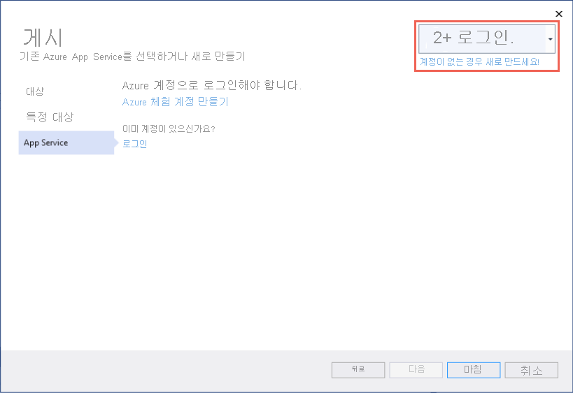
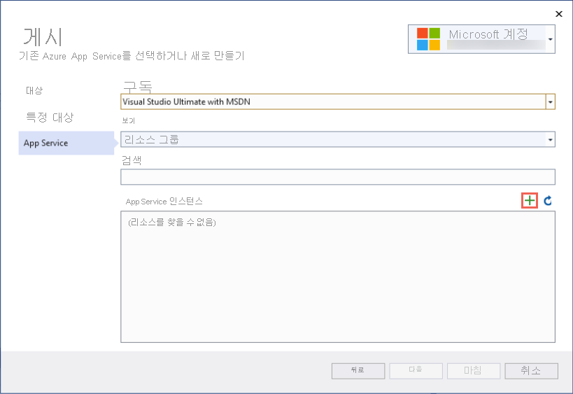
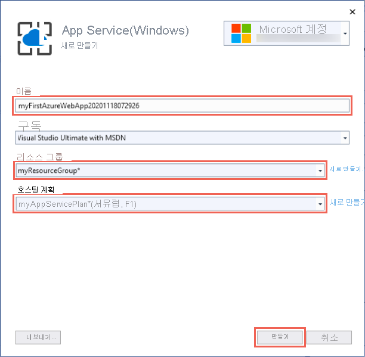
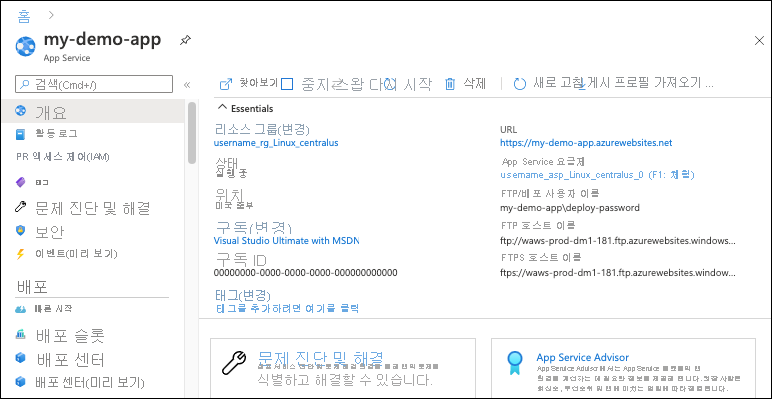

# <a name="quickstart-create-an-aspnet-core-web-app-in-azure"></a>빠른 시작: Azure에서 ASP.NET Core 웹앱 만들기

::: zone pivot="platform-windows"  

이 빠른 시작에서는 첫 번째 ASP.NET Core 웹앱을 [Azure App Service](overview.md)에 배포하는 방법을 배웁니다. App Service는 .NET 5.0 앱을 지원합니다.

이 빠른 시작을 마치고 나면 App Service 호스팅 계획 및 웹 애플리케이션이 배포된 App Service로 구성된 리소스 그룹이 하나 생깁니다.

## <a name="prerequisites"></a>사전 요구 사항

- 활성 구독이 있는 Azure 계정. [체험 계정을 만듭니다](https://azure.microsoft.com/free/dotnet/).
- **ASP.NET 및 웹 개발** 워크로드가 있는 <a href="https://www.visualstudio.com/downloads/" target="_blank">Visual Studio 2019</a>를 설치합니다.

  Visual Studio 2019를 이미 설치한 경우:

  - **도움말** > **업데이트 확인** 을 차례로 선택하여 Visual Studio에서 최신 업데이트를 설치합니다. 최신 업데이트에는 .NET 5.0 SDK가 포함되어 있습니다.
  - **도구** > **도구 및 기능 가져오기** 를 차례로 선택하여 워크로드를 추가합니다.


## <a name="create-an-aspnet-core-web-app"></a>ASP.NET Core 웹앱 만들기

다음 단계에 따라 Visual Studio에서 ASP.NET Core 웹앱을 만듭니다.

# <a name="net-core-31"></a>[.NET Core 3.1](#tab/netcore31)

1. Visual Studio를 열고 **새 프로젝트 만들기** 를 선택합니다.

1. **새 프로젝트 만들기** 에서 **ASP.NET Core 웹 애플리케이션** 을 선택하고, 선택한 항목의 언어에 **C#** 이 나열되는지 확인하고, **다음** 을 선택합니다.

1. **새 프로젝트 구성** 에서 웹 애플리케이션 이름을 *myFirstAzureWebApp* 으로 지정한 다음, **만들기** 를 선택합니다.

   

1. 모든 유형의 ASP.NET Core 웹앱을 Azure에 배포할 수 있지만, 이 빠른 시작에서는 **웹 애플리케이션** 템플릿을 선택합니다. **인증** 을 **인증 없음** 으로 설정하고, 그 외의 옵션은 선택하지 않습니다. 그런 다음 **만들기** 를 선택합니다.

    
   
1. Visual Studio 메뉴에서 **디버그** > **디버깅하지 않고 시작** 을 차례로 선택하여 웹앱을 로컬로 실행합니다.

   

# <a name="net-50"></a>[.NET 5.0](#tab/net50)

1. Visual Studio를 열고 **새 프로젝트 만들기** 를 선택합니다.

1. **새 프로젝트 만들기** 에서 **ASP.NET Core 웹 애플리케이션** 을 선택하고, 선택한 항목의 언어에 **C#** 이 나열되는지 확인하고, **다음** 을 선택합니다.

1. **새 프로젝트 구성** 에서 웹 애플리케이션 이름을 *myFirstAzureWebApp* 으로 지정한 다음, **만들기** 를 선택합니다.

   

1. .NET 5.0 앱의 경우 드롭다운에서 **ASP.NET Core 5.0** 을 선택합니다.

1. 모든 유형의 ASP.NET Core 웹앱을 Azure에 배포할 수 있지만, 이 빠른 시작에서는 **ASP.NET Core 웹앱** 템플릿을 선택합니다. **인증** 을 **인증 없음** 으로 설정하고, 그 외의 옵션은 선택하지 않습니다. 그런 다음 **만들기** 를 선택합니다.

    
   
1. Visual Studio 메뉴에서 **디버그** > **디버깅하지 않고 시작** 을 차례로 선택하여 웹앱을 로컬로 실행합니다.

   

---

## <a name="publish-your-web-app"></a>웹앱 게시

웹앱을 게시하려면 먼저 앱을 게시할 수 있는 새 App Service를 만들고 구성해야 합니다. 

App Service를 설정하는 과정에서 다음 항목을 만듭니다.

- 서비스에 필요한 모든 Azure 리소스를 포함할 새 [리소스 그룹](../azure-resource-manager/management/overview.md#terminology)
- 앱을 호스팅하는 웹 서버 팜의 위치, 크기 및 기능을 지정하는 새 [호스팅 계획](./overview-hosting-plans.md)

다음 단계에 따라 App Service를 만들고 웹앱을 게시합니다.

1. **솔루션 탐색기** 에서 마우스 오른쪽 단추로 **myFirstAzureWebApp** 프로젝트를 클릭하고, **게시** 를 선택합니다. 

1. **게시** 에서 **Azure** 를 선택하고 **다음** 을 클릭합니다.

1. 옵션은 Azure에 이미 로그인했는지 여부와 Azure 계정에 연결된 Visual Studio 계정이 있는지 여부에 따라 달라집니다. **계정 추가** 또는 **로그인** 중 하나를 선택하여 Azure 구독에 로그인합니다. 이미 로그인한 경우 원하는 계정을 선택합니다.

   

1. **App Service 인스턴스** 오른쪽에서 **+** 를 클릭합니다.

   

1. **구독** 의 경우 나열된 구독을 수락하거나 드롭다운 목록에서 새 구독을 선택합니다.

1. **리소스 그룹** 에 대해 **새로 만들기** 를 선택합니다. **새 리소스 그룹 이름** 에서 *myResourceGroup* 을 입력하고, **확인** 을 선택합니다. 

1. **호스팅 계획** 에서 **새로 만들기** 를 선택합니다. 

1. **호스팅 계획: 새로 만들기** 대화 상자에서 다음 표에 지정된 값을 입력합니다.

   | 설정  | 제안 값 | Description |
   | -------- | --------------- | ----------- |
   | **호스팅 계획**  | *myFirstAzureWebAppPlan* | App Service 플랜의 이름입니다. |
   | **위치**      | *서유럽* | 웹앱이 호스팅된 데이터 센터입니다. |
   | **크기**          | *Free* | [가격 책정 계층](https://azure.microsoft.com/pricing/details/app-service/?ref=microsoft.com&utm_source=microsoft.com&utm_medium=docs&utm_campaign=visualstudio)은 호스팅 기능을 결정합니다. |
   
   

1. **이름** 에서 유효한 문자(`a-z`, `A-Z`, `0-9` 및 `-`)만 포함된 고유한 앱 이름을 입력합니다. 자동으로 생성된 고유한 이름을 적용할 수 있습니다. 웹앱의 URL은 `http://<app-name>.azurewebsites.net`이며, 여기서 `<app-name>`은 앱 이름입니다.

2. **만들기** 를 선택하여 Azure 리소스를 만듭니다.

   

   마법사가 완료되면 Azure 리소스가 생성되고 게시할 준비가 완료됩니다.

3. **마침** 을 선택하여 마법사를 닫습니다.

1. **게시** 페이지에서 **게시** 를 클릭합니다. Visual Studio는 앱을 Azure에 빌드, 패키지 및 게시한 다음, 기본 브라우저에서 앱을 시작합니다.

   

**축하합니다.** 이제 ASP.NET Core 웹앱이 Azure App Service에서 실시간으로 실행됩니다.

## <a name="update-the-app-and-redeploy"></a>앱 업데이트 및 재배포

웹앱을 업데이트하고 다시 배포하려면 다음 단계를 수행합니다.

1. **솔루션 탐색기** 의 프로젝트 아래에서 **페이지** > **Index.cshtml** 을 차례로 엽니다.

1. 전체 `<div>` 태그를 다음 코드로 바꿉니다.

   ```html
   <div class="jumbotron">
       <h1>ASP.NET in Azure!</h1>
       <p class="lead">This is a simple app that we've built that demonstrates how to deploy a .NET app to Azure App Service.</p>
   </div>
   ```

1. Azure에 다시 배포하려면 **솔루션 탐색기** 에서 **myFirstAzureWebApp** 프로젝트를 마우스 오른쪽 버튼으로 클릭하고 **게시** 를 선택합니다.

1. **게시** 요약 페이지에서 **게시** 를 선택합니다.

   <!--  -->

    게시가 완료되면 Visual Studio가 웹앱의 URL로 브라우저를 시작합니다.

    

## <a name="manage-the-azure-app"></a>Azure 앱 관리

웹앱을 관리하려면 [Azure Portal](https://portal.azure.com)로 이동하고, **App Services** 를 검색하여 선택합니다.


**App Service** 페이지에서 웹앱의 이름을 선택합니다.

:::image type="content" source="./media/quickstart-dotnetcore/select-app-service.png" alt-text="예제 웹앱이 선택된 App Services 페이지의 스크린샷.":::

웹앱의 **개요** 페이지에는 찾아보기, 중지, 시작, 다시 시작, 삭제와 같은 기본 관리 옵션이 포함되어 있습니다. 왼쪽 메뉴는 앱을 구성하기 위한 추가 페이지를 제공합니다.


[!INCLUDE [Clean-up section](../../includes/clean-up-section-portal.md)]

## <a name="next-steps"></a>다음 단계

이 빠른 시작에서는 Visual Studio를 사용하여 ASP.NET Core 웹앱을 만들고 Azure App Service에 배포했습니다.

다음 문서로 넘어가서 .NET Core 앱을 만들고 SQL Database에 연결하는 방법을 알아보세요.

> [!div class="nextstepaction"]
> [SQL Database를 사용한 ASP.NET Core](tutorial-dotnetcore-sqldb-app.md)

> [!div class="nextstepaction"]
> [ASP.NET Core 앱 구성](configure-language-dotnetcore.md)

::: zone-end  

::: zone pivot="platform-linux"
[Linux의 App Service](overview.md#app-service-on-linux)는 Linux 운영 체제를 기반으로 확장성이 높은 자체 패치 웹 호스팅 서비스를 제공합니다. 이 빠른 시작에서는 [Azure CLI](/cli/azure/get-started-with-azure-cli)를 사용하여 [.NET Core](/aspnet/core/) 앱을 만들고 Linux 호스트 App Service에 배포하는 방법을 보여 줍니다.


Mac, Windows 또는 Linux 컴퓨터를 사용하여 이 문서의 단계를 수행하면 됩니다.

[!INCLUDE [quickstarts-free-trial-note](../../includes/quickstarts-free-trial-note.md)]

## <a name="set-up-your-initial-environment"></a>초기 환경 설정

# <a name="net-core-31"></a>[.NET Core 3.1](#tab/netcore31)

이 빠른 시작을 완료하려면 다음이 필요합니다.

* <a href="https://dotnet.microsoft.com/download/dotnet-core/3.1" target="_blank">최신 .NET Core 3.1 SDK를 설치</a>하니다.
* <a href="/cli/azure/install-azure-cli" target="_blank">최신 Azure CLI를 설치</a>합니다.

# <a name="net-50"></a>[.NET 5.0](#tab/net50)

이 빠른 시작을 완료하려면 다음이 필요합니다.

* <a href="https://dotnet.microsoft.com/download/dotnet/5.0" target="_blank">최신 .NET 5.0 SDK를 설치</a>합니다.
* <a href="/cli/azure/install-azure-cli" target="_blank">최신 Azure CLI를 설치</a>합니다.

---

[문제가 있나요? 알려주세요.](https://aka.ms/DotNetAppServiceLinuxQuickStart)

## <a name="create-the-app-locally"></a>로컬로 앱 만들기

컴퓨터의 터미널 창에서 `hellodotnetcore`라는 디렉터리를 만들고 현재 디렉터리를 이 디렉터리로 변경합니다.

```bash
mkdir hellodotnetcore
cd hellodotnetcore
```

.NET Core 앱을 만듭니다.

```bash
dotnet new web
```

## <a name="run-the-app-locally"></a>로컬에서 앱 실행하기

애플리케이션을 로컬로 실행하여 Azure에 애플리케이션을 배포할 때 표시되는 모양을 확인합니다. 

```bash
dotnet run
```

웹 브라우저를 열고 `http://localhost:5000`의 앱으로 이동합니다.

이 페이지에 표시된 샘플 앱에서 **Hello World** 메시지가 표시됩니다.


[문제가 있나요? 알려주세요.](https://aka.ms/DotNetAppServiceLinuxQuickStart)

## <a name="sign-into-azure"></a>Azure에 로그인
터미널 창에서 다음 명령을 사용하여 Azure에 로그인합니다.

```azurecli
az login
```

## <a name="deploy-the-app"></a>앱 배포

`az webapp up` 명령을 사용하여 로컬 폴더(*hellodotnetcore*)에 코드를 배포합니다.

```azurecli
az webapp up --sku F1 --name <app-name>
```

- `az` 명령이 인식되지 않는 경우 [초기 환경 설정](#set-up-your-initial-environment)에서 설명한 대로 Azure CLI가 설치되어 있는지 확인합니다.
- `<app-name>`을 모든 Azure에서 고유한 이름으로 바꿉니다(*유효한 문자는 `a-z`, `0-9` 및 `-`* ). 좋은 패턴은 회사 이름과 앱 식별자의 조합을 사용하는 것입니다.
- `--sku F1` 인수는 무료 가격 책정 계층에 웹앱을 만듭니다. 이 인수를 생략하여 더 빠른 프리미엄 계층을 사용합니다. 이 경우 시간당 비용이 발생합니다.
- 선택적으로 인수 `--location <location-name>`을 포함할 수 있습니다. 여기서 `<location-name>`은 사용 가능한 Azure 지역입니다. Azure 계정에 허용되는 지역 목록은 [`az account list-locations`](/cli/azure/appservice#az-appservice-list-locations) 명령을 실행하여 검색할 수 있습니다.

이 명령을 완료하는 데 몇 분 정도 걸릴 수 있습니다. 실행되는 동안 리소스 그룹, App Service 계획 및 호스팅 앱을 만들고, 로깅을 구성한 다음, ZIP 배포 수행에 대한 메시지를 제공합니다. 그런 다음, "http://&lt;app-name&gt;.azurewebsites.net에서 앱을 시작할 수 있습니다."라는 메시지를 제공합니다. 이 메시지는 Azure에서 앱의 URL입니다.

# <a name="net-core-31"></a>[.NET Core 3.1](#tab/netcore31)


# <a name="net-50"></a>[.NET 5.0](#tab/net50)

<!-- Deploy the code in your local folder (*hellodotnetcore*) using the `az webapp up` command:

```azurecli
az webapp up --sku B1 --name <app-name> --os-type linux
```

- If the `az` command isn't recognized, be sure you have the Azure CLI installed as described in [Set up your initial environment](#set-up-your-initial-environment).
- Replace `<app-name>` with a name that's unique across all of Azure (*valid characters are `a-z`, `0-9`, and `-`*). A good pattern is to use a combination of your company name and an app identifier.
- The `--sku B1` argument creates the web app in the Basic pricing tier, which incurs an hourly cost. Omit this argument to use a faster premium tier, which costs more.
- You can optionally include the argument `--location <location-name>` where `<location-name>` is an available Azure region. You can retrieve a list of allowable regions for your Azure account by running the [`az account list-locations`](/cli/azure/appservice#az-appservice-list-locations) command.

The command may take a few minutes to complete. While running, it provides messages about creating the resource group, the App Service plan and hosting app, configuring logging, then performing ZIP deployment. It then gives the message, "You can launch the app at http://&lt;app-name&gt;.azurewebsites.net", which is the app's URL on Azure. -->


---

[문제가 있나요? 알려주세요.](https://aka.ms/DotNetAppServiceLinuxQuickStart)

[!include [az webapp up command note](../../includes/app-service-web-az-webapp-up-note.md)]

## <a name="browse-to-the-app"></a>앱으로 이동

웹 브라우저를 사용하여 배포된 애플리케이션으로 이동합니다.

```bash
http://<app_name>.azurewebsites.net
```

.NET Core 샘플 코드가 기본 제공 이미지가 있는 Linux의 App Service에서 실행됩니다.


**축하합니다.** Linux의 App Service에 첫 번째 .NET Core 앱을 배포했습니다.

[문제가 있나요? 알려주세요.](https://aka.ms/DotNetAppServiceLinuxQuickStart)

## <a name="update-and-redeploy-the-code"></a>코드 업데이트 및 다시 배포

로컬 디렉터리에서 _Startup.cs_ 파일을 엽니다. 메서드 호출 `context.Response.WriteAsync`의 텍스트를 약간 변경합니다.

```csharp
await context.Response.WriteAsync("Hello Azure!");
```

변경 내용을 저장한 다음, `az webapp up` 명령을 사용하여 앱을 다시 배포합니다.

```azurecli
az webapp up --os-type linux
```

이 명령은 앱 이름, 리소스 그룹 및 App Service 계획을 포함하여 *.azure/config* 파일에서 로컬로 캐시된 값을 사용합니다.

배포가 완료되면 **앱으로 이동** 단계에서 열린 브라우저 창으로 다시 전환하고 새로 고침을 누릅니다.


[문제가 있나요? 알려주세요.](https://aka.ms/DotNetAppServiceLinuxQuickStart)

## <a name="manage-your-new-azure-app"></a>새 Azure 앱 관리

만든 앱을 관리하려면 <a href="https://portal.azure.com" target="_blank">Azure Portal</a>로 이동합니다.

왼쪽 메뉴에서 **App Services** 를 클릭한 다음, Azure 앱의 이름을 클릭합니다.

:::image type="content" source="./media/quickstart-dotnetcore/portal-app-service-list-up.png" alt-text="선택한 예제 Azure 앱 예제를 보여주는 App Services 페이지의 스크린샷.":::

앱의 [개요] 페이지가 표시됩니다. 여기에서 찾아보기, 중지, 시작, 다시 시작, 삭제와 같은 기본 관리 작업을 수행할 수 있습니다. 



왼쪽 메뉴에는 앱을 구성할 수 있는 여러 페이지가 표시됩니다. 

[!INCLUDE [cli-samples-clean-up](../../includes/cli-samples-clean-up.md)]

[문제가 있나요? 알려주세요.](https://aka.ms/DotNetAppServiceLinuxQuickStart)

## <a name="next-steps"></a>다음 단계

> [!div class="nextstepaction"]
> [자습서: SQL Database를 사용하는 ASP.NET Core 앱](tutorial-dotnetcore-sqldb-app.md)

> [!div class="nextstepaction"]
> [ASP.NET Core 앱 구성](configure-language-dotnetcore.md)

::: zone-end
