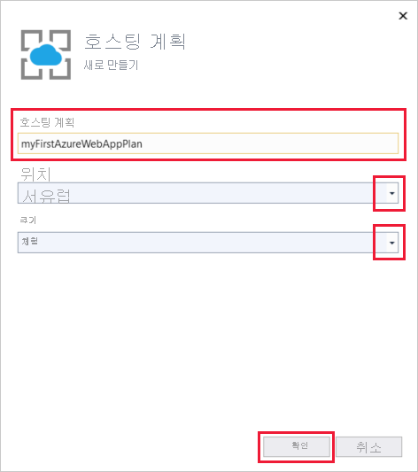
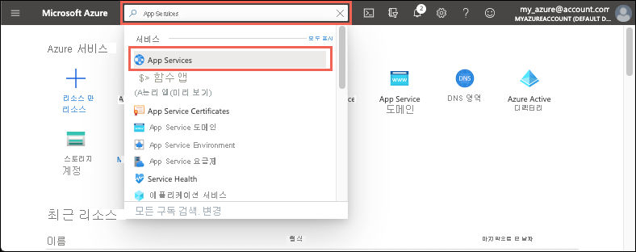
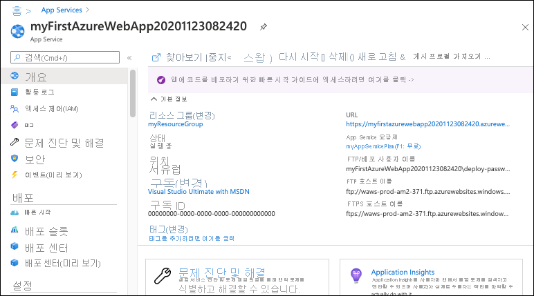

# <a name="quickstart-create-an-aspnet-core-web-app-in-azure"></a>빠른 시작: Azure에서 ASP.NET Core 웹앱 만들기

::: zone pivot="platform-windows"  

이 빠른 시작에서는 첫 번째 ASP.NET Core 웹앱을 [Azure App Service](overview.md)에 배포하는 방법을 배웁니다. 

이 빠른 시작을 마치고 나면 App Service 호스팅 계획 및 웹 애플리케이션이 배포된 App Service로 구성된 리소스 그룹이 하나 생깁니다.

## <a name="prerequisites"></a>사전 요구 사항

- 활성 구독이 있는 Azure 계정. [체험 계정을 만듭니다](https://azure.microsoft.com/free/dotnet/).
- 이 빠른 시작에서는 Windows의 App Service에 앱을 배포합니다. _Linux_의 App Service에 배포하려면 [App Service에서 .NET Core 웹앱 만들기](./quickstart-dotnetcore.md)를 참조하세요.
- **ASP.NET 및 웹 개발** 워크로드가 있는 <a href="https://www.visualstudio.com/downloads/" target="_blank">Visual Studio 2019</a>를 설치합니다.

  Visual Studio 2019를 이미 설치한 경우:

  - **도움말** > **업데이트 확인**을 차례로 선택하여 Visual Studio에서 최신 업데이트를 설치합니다.
  - **도구** > **도구 및 기능 가져오기**를 차례로 선택하여 워크로드를 추가합니다.


## <a name="create-an-aspnet-core-web-app"></a>ASP.NET Core 웹앱 만들기

다음 단계에 따라 Visual Studio에서 ASP.NET Core 웹앱을 만듭니다.

1. Visual Studio를 열고 **새 프로젝트 만들기**를 선택합니다.

1. **새 프로젝트 만들기**에서 **ASP.NET Core 웹 애플리케이션**을 선택하고, 선택한 항목의 언어에 **C#** 이 나열되는지 확인하고, **다음**을 선택합니다.

1. **새 프로젝트 구성**에서 웹 애플리케이션 이름을 *myFirstAzureWebApp*으로 지정한 다음, **만들기**를 선택합니다.

   

1. 모든 유형의 ASP.NET Core 웹앱을 Azure에 배포할 수 있지만, 이 빠른 시작에서는 **웹 애플리케이션** 템플릿을 선택합니다. **인증**을 **인증 없음**으로 설정하고, 그 외의 옵션은 선택하지 않습니다. 그런 다음 **만들기**를 선택합니다.

    
   
1. Visual Studio 메뉴에서 **디버그** > **디버깅하지 않고 시작**을 차례로 선택하여 웹앱을 로컬로 실행합니다.

   

## <a name="publish-your-web-app"></a>웹앱 게시

웹앱을 게시하려면 먼저 앱을 게시할 수 있는 새 App Service를 만들고 구성해야 합니다. 

App Service를 설정하는 과정에서 다음 항목을 만듭니다.

- 서비스에 필요한 모든 Azure 리소스를 포함할 새 [리소스 그룹](../azure-resource-manager/management/overview.md#terminology)
- 앱을 호스팅하는 웹 서버 팜의 위치, 크기 및 기능을 지정하는 새 [호스팅 계획](./overview-hosting-plans.md)

다음 단계에 따라 App Service를 만들고 웹앱을 게시합니다.

1. **솔루션 탐색기**에서 마우스 오른쪽 단추로 **myFirstAzureWebApp** 프로젝트를 클릭하고, **게시**를 선택합니다. 아직 Visual Studio에서 Azure 계정에 로그인하지 않은 경우 **계정 추가** 또는 **로그인**을 선택합니다. Azure 체험 계정을 만들 수도 있습니다.

1. **게시 대상 선택** 대화 상자에서 **App Service**, **새로 만들기**, **프로필 만들기**를 차례로 선택합니다.

   

1. **App Service: 새로 만들기** 대화 상자에서 기본 이름을 적용하거나 새 이름을 입력하여 앱의 전역적으로 고유한 **이름**을 입력합니다. 유효한 문자는 `a-z`, `A-Z`, `0-9` 및 `-`입니다. 이 **이름**은 `http://<app_name>.azurewebsites.net` 형식으로 웹앱의 URL 접두사로 사용됩니다.

1. **구독**의 경우 나열된 구독을 수락하거나 드롭다운 목록에서 새 구독을 선택합니다.

1. **리소스 그룹**에서 **새로 만들기**를 선택합니다. **새 리소스 그룹 이름**에서 *myResourceGroup*을 입력하고, **확인**을 선택합니다. 

1. **호스팅 계획**에서 **새로 만들기**를 선택합니다. 

1. **호스팅 계획: 새로 만들기** 대화 상자에서 다음 표에 지정된 값을 입력합니다.

   | 설정  | 제안 값 | Description |
   | -------- | --------------- | ----------- |
   | **호스팅 계획**  | *myFirstAzureWebAppPlan* | App Service 플랜의 이름입니다. |
   | **위치**      | *서유럽* | 웹앱이 호스팅된 데이터 센터입니다. |
   | **크기**          | *Free* | [가격 책정 계층](https://azure.microsoft.com/pricing/details/app-service/?ref=microsoft.com&utm_source=microsoft.com&utm_medium=docs&utm_campaign=visualstudio)은 호스팅 기능을 결정합니다. |
   
   

1. **Application Insights**를 *없음*으로 둡니다.

1. **App Service: 새로 만들기** 대화 상자에서 **만들기**를 선택하여 Azure 리소스 만들기를 시작합니다.

   

1. 마법사가 완료되면 **게시**를 선택합니다.

   

   Visual Studio는 ASP.NET Core 웹앱을 Azure에 게시하고, 기본 브라우저에서 앱을 시작합니다. 

   

**축하합니다.** 이제 ASP.NET Core 웹앱이 Azure App Service에서 실시간으로 실행됩니다.

## <a name="update-the-app-and-redeploy"></a>앱 업데이트 및 재배포

웹앱을 업데이트하고 다시 배포하려면 다음 단계를 수행합니다.

1. **솔루션 탐색기**의 프로젝트 아래에서 **페이지** > **Index.cshtml**을 차례로 엽니다.

1. 전체 `<div>` 태그를 다음 코드로 바꿉니다.

   ```html
   <div class="jumbotron">
       <h1>ASP.NET in Azure!</h1>
       <p class="lead">This is a simple app that we've built that demonstrates how to deploy a .NET app to Azure App Service.</p>
   </div>
   ```

1. Azure에 다시 배포하려면 **솔루션 탐색기**에서 **myFirstAzureWebApp** 프로젝트를 마우스 오른쪽 버튼으로 클릭하고 **게시**를 선택합니다.

1. **게시** 요약 페이지에서 **게시**를 선택합니다.

   

게시가 완료되면 Visual Studio가 웹앱의 URL로 브라우저를 시작합니다.


## <a name="manage-the-azure-app"></a>Azure 앱 관리

웹앱을 관리하려면 [Azure Portal](https://portal.azure.com)로 이동하고, **App Services**를 검색하여 선택합니다.



**App Service** 페이지에서 웹앱의 이름을 선택합니다.

:::image type="content" source="./media/quickstart-dotnetcore/select-app-service.png" alt-text="예제 웹앱이 선택된 App Services 페이지의 스크린샷.":::

웹앱의 **개요** 페이지에는 찾아보기, 중지, 시작, 다시 시작, 삭제와 같은 기본 관리 옵션이 포함되어 있습니다. 왼쪽 메뉴는 앱을 구성하기 위한 추가 페이지를 제공합니다.



[!INCLUDE [Clean-up section](../../includes/clean-up-section-portal.md)]

## <a name="next-steps"></a>다음 단계

이 빠른 시작에서는 Visual Studio를 사용하여 ASP.NET Core 웹앱을 만들고 Azure App Service에 배포했습니다.

다음 문서로 넘어가서 .NET Core 앱을 만들고 SQL Database에 연결하는 방법을 알아보세요.

> [!div class="nextstepaction"]
> [SQL Database를 사용한 ASP.NET Core](tutorial-dotnetcore-sqldb-app.md)

> [!div class="nextstepaction"]
> [ASP.NET Core 앱 구성](configure-language-dotnetcore.md)

::: zone-end  

::: zone pivot="platform-linux"
[Linux의 App Service](overview.md#app-service-on-linux)는 Linux 운영 체제를 기반으로 확장성이 높은 자체 패치 웹 호스팅 서비스를 제공합니다. 이 빠른 시작에서는 Linux의 App Service에서 [.NET Core](/aspnet/core/) 앱을 만드는 방법을 보여줍니다. [Azure CLI](/cli/azure/get-started-with-azure-cli)를 사용하여 앱을 만들고 Git을 사용하여 앱에 .NET Core 코드를 배포합니다.


Mac, Windows 또는 Linux 컴퓨터를 사용하여 이 문서의 단계를 수행하면 됩니다.

[!INCLUDE [quickstarts-free-trial-note](../../includes/quickstarts-free-trial-note.md)]

## <a name="prerequisites"></a>필수 구성 요소

이 빠른 시작을 완료하려면 다음이 필요합니다.

* <a href="https://git-scm.com/" target="_blank">Git 설치</a>
* <a href="https://dotnet.microsoft.com/download/dotnet-core/3.1" target="_blank">최신 .NET Core 3.1 SDK 설치</a>

[문제가 있나요? 알려주세요.](https://aka.ms/DotNetAppServiceLinuxQuickStart)

## <a name="create-the-app-locally"></a>로컬로 앱 만들기

컴퓨터의 터미널 창에서 `hellodotnetcore`라는 디렉터리를 만들고 현재 디렉터리를 이 디렉터리로 변경합니다.

```bash
mkdir hellodotnetcore
cd hellodotnetcore
```

.NET Core 앱을 만듭니다.

```bash
dotnet new web
```

## <a name="run-the-app-locally"></a>로컬에서 앱 실행하기

애플리케이션을 로컬로 실행하여 Azure에 애플리케이션을 배포할 때 표시되는 모양을 확인합니다. 

NuGet 패키지를 복원하고 앱을 실행합니다.

```bash
dotnet run
```

웹 브라우저를 열고 `http://localhost:5000`의 앱으로 이동합니다.

이 페이지에 표시된 샘플 앱에서 **Hello World** 메시지가 표시됩니다.


터미널 창에서 **Ctrl+C**를 눌러 웹 서버를 종료합니다. .NET Core 프로젝트에 대해 Git 리포지토리를 초기화합니다.

```bash
git init
git add .
git commit -m "first commit"
```

[문제가 있나요? 알려주세요.](https://aka.ms/DotNetAppServiceLinuxQuickStart)

[!INCLUDE [cloud-shell-try-it.md](../../includes/cloud-shell-try-it.md)]

[문제가 있나요? 알려주세요.](https://aka.ms/DotNetAppServiceLinuxQuickStart)

[!INCLUDE [Configure deployment user](../../includes/configure-deployment-user.md)]

[문제가 있나요? 알려주세요.](https://aka.ms/DotNetAppServiceLinuxQuickStart)

[!INCLUDE [Create resource group](../../includes/app-service-web-create-resource-group-linux.md)]

[문제가 있나요? 알려주세요.](https://aka.ms/DotNetAppServiceLinuxQuickStart)

[!INCLUDE [Create app service plan](../../includes/app-service-web-create-app-service-plan-linux.md)]

[문제가 있나요? 알려주세요.](https://aka.ms/DotNetAppServiceLinuxQuickStart)

## <a name="create-a-web-app"></a>웹앱 만들기

[!INCLUDE [Create web app](../../includes/app-service-web-create-web-app-dotnetcore-linux-no-h.md)]

새로 만든 앱으로 이동합니다. _&lt;app-name>_ 을 앱 이름으로 바꿉니다.

```bash
https://<app-name>.azurewebsites.net
```

새로운 앱은 다음과 같아야 합니다.


[!INCLUDE [Push to Azure](../../includes/app-service-web-git-push-to-azure.md)] 

<pre>
Enumerating objects: 5, done.
Counting objects: 100% (5/5), done.
Compressing objects: 100% (3/3), done.
Writing objects: 100% (3/3), 285 bytes | 95.00 KiB/s, done.
Total 3 (delta 2), reused 0 (delta 0), pack-reused 0
remote: Deploy Async
remote: Updating branch 'master'.
remote: Updating submodules.
remote: Preparing deployment for commit id 'd6b54472f7'.
remote: Repository path is /home/site/repository
remote: Running oryx build...
remote: Build orchestrated by Microsoft Oryx, https://github.com/Microsoft/Oryx
remote: You can report issues at https://github.com/Microsoft/Oryx/issues
remote:
remote: Oryx Version      : 0.2.20200114.13, Commit: 204922f30f8e8d41f5241b8c218425ef89106d1d, ReleaseTagName: 20200114.13
remote: Build Operation ID: |imoMY2y77/s=.40ca2a87_
remote: Repository Commit : d6b54472f7e8e9fd885ffafaa64522e74cf370e1
.
.
.
remote: Deployment successful.
remote: Deployment Logs : 'https://&lt;app-name&gt;.scm.azurewebsites.net/newui/jsonviewer?view_url=/api/deployments/d6b54472f7e8e9fd885ffafaa64522e74cf370e1/log'
To https://&lt;app-name&gt;.scm.azurewebsites.net:443/&lt;app-name&gt;.git
   d87e6ca..d6b5447  master -> master
</pre>

[문제가 있나요? 알려주세요.](https://aka.ms/DotNetAppServiceLinuxQuickStart)

## <a name="browse-to-the-app"></a>앱으로 이동

웹 브라우저를 사용하여 배포된 애플리케이션으로 이동합니다.

```bash
http://<app_name>.azurewebsites.net
```

.NET Core 샘플 코드가 기본 제공 이미지가 있는 Linux의 App Service에서 실행됩니다.


**축하합니다.** Linux의 App Service에 첫 번째 .NET Core 앱을 배포했습니다.

[문제가 있나요? 알려주세요.](https://aka.ms/DotNetAppServiceLinuxQuickStart)

## <a name="update-and-redeploy-the-code"></a>코드 업데이트 및 다시 배포

로컬 디렉터리에서 _Startup.cs_ 파일을 엽니다. 메서드 호출 `context.Response.WriteAsync`의 텍스트를 약간 변경합니다.

```csharp
await context.Response.WriteAsync("Hello Azure!");
```

Git에서 변경 내용을 커밋한 다음 Azure에 코드 변경 내용을 푸시합니다.

```bash
git commit -am "updated output"
git push azure master
```

배포가 완료되면 **앱으로 이동** 단계에서 열린 브라우저 창으로 다시 전환하고 새로 고침을 누릅니다.


[문제가 있나요? 알려주세요.](https://aka.ms/DotNetAppServiceLinuxQuickStart)

## <a name="manage-your-new-azure-app"></a>새 Azure 앱 관리

만든 앱을 관리하려면 <a href="https://portal.azure.com" target="_blank">Azure Portal</a>로 이동합니다.

왼쪽 메뉴에서 **App Services**를 클릭한 다음, Azure 앱의 이름을 클릭합니다.

:::image type="content" source="./media/quickstart-dotnetcore/portal-app-service-list.png" alt-text="예제 웹앱이 선택된 App Services 페이지의 스크린샷.":::

앱의 [개요] 페이지가 표시됩니다. 여기에서 찾아보기, 중지, 시작, 다시 시작, 삭제와 같은 기본 관리 작업을 수행할 수 있습니다. 


왼쪽 메뉴에는 앱을 구성할 수 있는 여러 페이지가 표시됩니다. 

[!INCLUDE [cli-samples-clean-up](../../includes/cli-samples-clean-up.md)]

[문제가 있나요? 알려주세요.](https://aka.ms/DotNetAppServiceLinuxQuickStart)

## <a name="next-steps"></a>다음 단계

> [!div class="nextstepaction"]
> [자습서: SQL Database를 사용하는 ASP.NET Core 앱](tutorial-dotnetcore-sqldb-app.md)

> [!div class="nextstepaction"]
> [ASP.NET Core 앱 구성](configure-language-dotnetcore.md)

::: zone-end