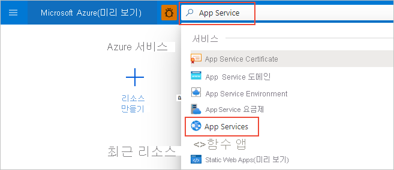
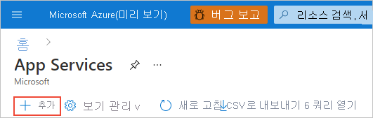
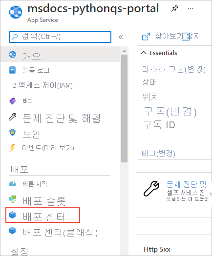
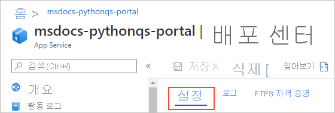
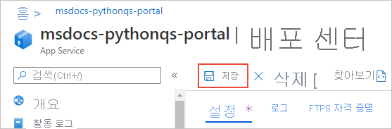
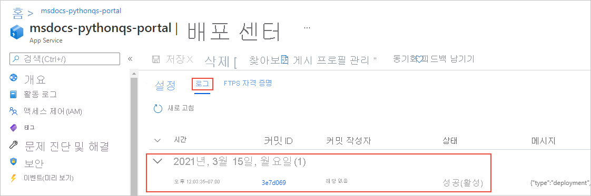
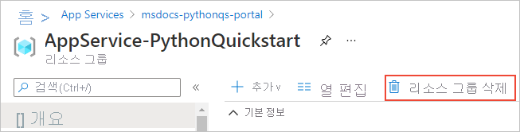

# 빠른 시작: Azure App Service on Linux를 사용하여 Python 앱 만들기(Azure Portal)

이 빠른 시작에서는 확장성이 뛰어난 자체 패치 웹 호스팅 서비스인 [App Service on Linux](overview.md#app-service-on-linux)에 Python 앱을 배포합니다. Azure Portal에서 Flask 또는 Django 프레임워크 중 하나를 사용하여 샘플을 배포할 수 있습니다. 구성하는 웹앱은 Azure 구독에서 약간의 비용이 발생하는 기본 App Service 계층을 사용합니다.

## 계정 구성

- 활성 구독이 있는 Azure 계정이 아직 없는 경우 [체험 계정을 만듭니다](https://azure.microsoft.com/free/?ref=microsoft.com&utm_source=microsoft.com&utm_medium=docs&utm_campaign=visualstudio).

- GitHub 계정이 없는 경우 [github.com](https://github.com)을 방문하여 하나를 만듭니다. 

## 샘플 GitHub 리포지토리 포크

1. [github.com](https://github.com)을 열고 로그인합니다.

1. 다음 샘플 리포지토리 중 하나로 이동합니다.
    - [Flask Hello World](https://github.com/Azure-Samples/python-docs-hello-world)
    - [Django Hello World](https://github.com/Azure-Samples/python-docs-hello-django)

1. GitHub 페이지의 오른쪽 위에서 **Fork** 를 선택하여 리포지토리의 복사본을 사용자 고유의 GitHub 계정에 만듭니다.

    

    Azure를 사용하려면 리포지토리가 포함된 GitHub 조직에 액세스할 수 있어야 합니다. 샘플을 사용자 고유의 GitHub 계정에 포크하면 필요한 액세스 권한이 자동으로 제공되고 코드를 변경할 수도 있습니다.

## App Service 웹앱 프로비저닝

App Service 웹앱은 코드를 배포하는 웹 서버입니다.

1. [https://portal.azure.com](https://portal.azure.com)에서 Azure Portal을 열고, 필요한 경우 로그인합니다.

1. Azure Portal 위쪽의 검색 창에서 "App Service"를 입력한 다음, **App Services** 를 선택합니다.

    

1. **App Services** 페이지에서 **+ 추가** 를 선택합니다.

    

1. **웹앱 만들기** 페이지에서 다음 작업을 수행합니다.
    
    | 필드 | 작업 |
    | --- | --- |
    | Subscription | 사용할 Azure 구독을 선택합니다. |
    | 리소스 그룹 | 드롭다운 아래에서 **새로 만들기** 를 선택합니다. 팝업에서 "AppService-PythonQuickstart"를 입력하고, **확인** 을 선택합니다. |
    | Name | 일반적으로 *contoso-testapp-123* 과 같은 개인 또는 회사 이름의 조합을 사용하여 모든 Azure에서 고유한 이름을 입력합니다. |
    | 게시 | **코드** 를 선택합니다. |
    | 런타임 스택 | **Python 3.8** 을 선택합니다. |
    | 운영 체제 | **Linux** 를 선택합니다(Python은 Linux에서만 지원됨). |
    | 지역 | 근처에 있는 지역을 선택합니다. |
    | Linux 플랜 | 기존 App Service 플랜을 선택하거나 **새로 만들기** 를 사용하여 새 플랜을 만듭니다. **기본 B1** 플랜을 사용하는 것이 좋습니다. |

    

1. 페이지 아래쪽에서 **검토 + 만들기** 를 선택하고, 세부 정보를 검토한 다음, **만들기** 를 선택합니다.

1. 프로비저닝이 완료되면 **리소스로 이동** 을 선택하여 새 App Service 페이지로 이동합니다. 이 시점에서 웹앱에는 기본 페이지만 포함되어 있으므로 다음 단계에서는 샘플 코드를 배포합니다.

문제가 있나요? [알려주세요](https://aka.ms/FlaskPortalQuickstartHelp).

## 샘플 코드 배포

1. Azure Portal의 웹앱 페이지에서 **배포 센터** 를 선택합니다.
    
    

1. **배포 센터** 페이지에서 아직 열려 있지 않은 경우 **설정** 탭을 선택합니다.

    

1. **원본** 아래에서 **GitHub** 를 선택한 다음, 표시되는 **GitHub** 양식에서 다음 작업을 수행합니다.

    | 필드 | 작업 |
    | --- | --- |
    | (으)로 로그인함 | GitHub에 아직 로그인하지 않은 경우 지금 로그인하거나 필요한 경우 **계정 변경* 을 선택합니다. |
    | 조직 | 필요한 경우 GitHub 조직을 선택합니다. |
    | 리포지토리 | 이전에 포크한 샘플 리포지토리의 이름을 **python-docs-hello-world**(Flask) 또는 **python-docs-hello-django**(Django) 중에서 선택합니다. |
    | Branch | **기본** 을 선택합니다. |

    

1. 페이지 위쪽에서 **저장** 을 선택하여 설정을 적용합니다.

    

1. **로그** 탭을 선택하여 배포 상태를 확인합니다. 샘플을 빌드하고 배포하는 데 몇 분 정도 걸리고, 프로세스 중에 추가 로그가 표시됩니다. 완료되면 로그에 **성공(활성)** 상태가 반영됩니다.

    

문제가 있나요? [알려주세요](https://aka.ms/FlaskPortalQuickstartHelp).

## 앱으로 이동

1. 배포가 완료되면 왼쪽 메뉴에서 **개요** 를 선택하여 웹앱에 대한 기본 페이지로 돌아갑니다.

1. 웹앱 주소가 포함된 **URL** 을 선택합니다.

    

1. 앱의 출력이 "Hello, World!"인지 확인합니다.

    

문제가 있나요? 먼저 [문제 해결 가이드](configure-language-python.md#troubleshooting)를 참조하세요. 그렇지 않으면 [알려주세요](https://aka.ms/FlaskPortalQuickstartHelp).

## 변경 및 다시 배포

App Service를 리포지토리에 연결했으므로 원본 리포지토리에 커밋한 변경 내용이 웹앱에 자동으로 배포됩니다.

1. GitHub에서 포크한 리포지토리에서 직접 변경할 수 있거나, 리포지토리를 로컬로 복제하고, 변경 내용을 적용하여 커밋한 다음, 이러한 변경 내용을 GitHub로 푸시할 수 있습니다. 두 방법 중 하나를 사용하면 App Service에 연결된 리포지토리가 변경됩니다.

1. **포크한 리포지토리** 에서 앱의 메시지를 "Hello, World!"에서 "Hello, Azure!"로 변경합니다. 선택해야 합니다.
    - Flask(python-docs-hello-world 샘플): *application.py* 파일의 6번 줄에서 텍스트 문자열을 변경합니다.
    - Django(python-docs-hello-django 샘플): *hello* 폴더에 있는 *views.py* 파일의 5번 줄에서 텍스트 문자열을 변경합니다.

1. 변경 내용을 리포지토리에 커밋합니다.

    로컬 복제를 사용하는 경우 해당 변경 내용도 GitHub로 푸시합니다.

1. 웹앱에 대한 Azure Portal에서 **배포 센터** 로 돌아가서 **로그** 탭을 선택하고, 진행해야 하는 새 배포 작업을 확인합니다.

1. 배포가 완료되면 웹앱의 **개요** 페이지로 돌아가서 웹앱의 URL을 다시 열고, 앱의 변경 내용을 관찰합니다.

    

문제가 있나요? 먼저 [문제 해결 가이드](configure-language-python.md#troubleshooting)를 참조하세요. 그렇지 않으면 [알려주세요](https://aka.ms/FlaskCLIQuickstartHelp).

## 리소스 정리

이전 단계에서는 Azure 리소스를 웹앱의 *개요** 페이지에 표시되는 "AppService-PythonQuickstart"라는 리소스 그룹에 만들었습니다. 웹앱을 계속 실행하는 경우 몇 가지 지속적인 비용이 발생합니다([App Service 가격 책정](https://azure.microsoft.com/pricing/details/app-service/linux/) 참조).

나중에 이러한 리소스가 필요하지 않을 경우 웹앱 **개요** 페이지에서 리소스 그룹 이름을 선택하여 리소스 그룹 개요로 이동합니다. **리소스 그룹 삭제** 를 선택하고, 프롬프트를 따릅니다.

문제가 있나요? [알려주세요](https://aka.ms/FlaskCLIQuickstartHelp).

## 다음 단계

> [!div class="nextstepaction"]
> [자습서: PostgreSQL을 사용하는 Python(Django) 웹앱](/azure/developer/python/tutorial-python-postgresql-app-portal)

> [!div class="nextstepaction"]
> [Python 앱 구성](configure-language-python.md)

> [!div class="nextstepaction"]
> [Python 웹앱에 사용자 로그인 추가](../active-directory/develop/quickstart-v2-python-webapp.md)

> [!div class="nextstepaction"]
> [자습서: 사용자 지정 컨테이너에서 Python 앱 실행](tutorial-custom-container.md)
