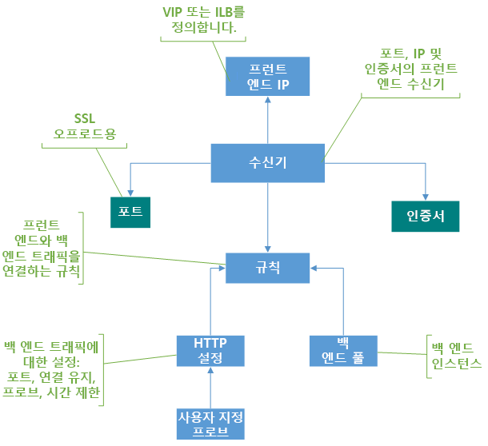

# 응용 프로그램 게이트웨이 구성 요소

 Application gateway는 단일 클라이언트에 대 한 연결 지점으로 사용 됩니다. Azure Vm, 가상 머신 확장 집합, Azure App Service 및 온-프레미스/외부 서버를 포함 하는 여러 백 엔드 풀에 걸쳐 트래픽을 응용 프로그램을 배포 합니다. 응용 프로그램 게이트웨이 트래픽,이 문서에서 설명 하는 여러 구성 요소를 사용 합니다.

## 프런트 엔드 IP 주소

프런트 엔드 IP 주소에는 응용 프로그램 게이트웨이 사용 하 여 연결 된 IP 주소가입니다. 공용 IP 주소, IP 주소를 개인 또는 둘 다 응용 프로그램 게이트웨이 구성할 수 있습니다. Application gateway는 공용 또는 개인 IP 주소 하나를 지원합니다. 가상 네트워크 및 공용 IP 주소는 application gateway와 동일한 위치에 있어야 합니다. 를 만든 후 프런트 엔드 IP 주소를 수신기와 관련이 있습니다.

### 정적 및 동적 공용 IP 주소

Azure Application Gateway v2 SKU는 v1 SKU는 정적 내부 IP 주소만 지원 하지만 두 정적 내부 및 정적 공용 IP 주소를 지원 합니다. 응용 프로그램 게이트웨이 중지 및 시작 된 가상 IP (VIP) 주소를 변경할 수 있습니다.

Application gateway와 연결 된 DNS 이름을 gateway의 수명 주기 동안 변경 되지 않습니다. 결과적으로, CNAME 별칭을 사용 하 고 응용 프로그램 게이트웨이의 DNS 주소를 가리키도록 해야 합니다.

## 수신기

수신기는 들어오는 연결 요청을 확인 하는 논리 엔터티입니다. 수신기는 프로토콜, 포트, 호스트 및 IP 주소를 요청과 연결 된 수신기 구성과 사용 하 여 연결 된 동일한 요소와 일치 하는 경우 요청을 수락 합니다.

응용 프로그램 게이트웨이 사용 하기 전에 하나 이상의 수신기를 추가 해야 합니다. application gateway에 연결 된 리스너가 여러 개 있을 수 있으며 동일한 프로토콜에 사용할 수 있습니다.

클라이언트에서 들어오는 요청을 감지 하는 수신기 후 application gateway 백 엔드 풀에서 멤버에 이러한 요청을 라우팅합니다. Application gateway는 들어오는 요청을 수신 하는 수신기에 대해 정의 된 요청 라우팅 규칙을 사용 합니다.

수신기는 다음 포트와 프로토콜을 지원합니다.

### 포트

포트는 클라이언트 요청에 대 한 수신기를 수신 하는 위치입니다. 1 사이에 속하는 65502 v1 SKU 및 1을 65199 v2 SKU에 대 한 포트를 구성할 수 있습니다.

### 프로토콜

Application Gateway에는 네 가지 프로토콜을 지원합니다. HTTP, HTTPS, http/2 및 WebSocket:

- 수신기 구성에서 프로토콜은 HTTP 및 HTTPS 간의 지정 합니다.
- 에 대 한 지원 [http/2 및 Websocket 프로토콜](https://docs.microsoft.com/azure/application-gateway/overview#websocket-and-http2-traffic) , 기본적으로 제공 됩니다 하 고 [WebSocket 지원](https://docs.microsoft.com/azure/application-gateway/application-gateway-websocket) 기본적으로 사용 됩니다. WebSocket 지원을 선택적으로 사용하거나 사용하지 않도록 설정하는 사용자 구성 가능 설정은 없습니다. HTTP 및 HTTPS 수신기를 사용 하 여 Websocket을 사용 합니다.
- Application Gateway 수신기에 연결하는 클라이언트의 경우에만 HTTP/2 프로토콜이 지원됩니다. 백 엔드 서버 풀에 대한 통신은 HTTP/1.1을 통해 이루어집니다. 기본적으로 HTTP/2 지원은 사용할 수 없습니다. 사용 하도록 선택할 수 있습니다.

SSL 종료를 위한 HTTPS 수신기를 사용 합니다. HTTPS 수신기를 웹 서버에서 오버 헤드가 부담이 되지 않습니다 있도록 응용 프로그램 게이트웨이에, 암호화 및 암호 해독 작업을 오프 로드 합니다. 응용 프로그램 비즈니스 논리에 집중 하 게 됩니다.

### 사용자 지정 오류 페이지

Application Gateway를 사용 하면 기본 오류 페이지를 표시 하는 대신 사용자 지정 오류 페이지를 만들 수 있습니다. 사용자 지정 오류 페이지를 사용하여 자체 브랜딩과 레이아웃을 사용할 수 있습니다. Application Gateway 요청을 백 엔드에 연결할 수 없는 경우 사용자 지정 오류 페이지를 표시 합니다.

자세한 내용은 [application gateway에 대 한 사용자 지정 오류 페이지](https://docs.microsoft.com/azure/application-gateway/custom-error)합니다.

### 수신기의 형식

수신기는 다음과 같은 두 종류가 있습니다.

- **Basic**. Application gateway의 IP 주소에 대 한 단일 DNS 매핑을 권한이 있는 단일 도메인 사이트에이 유형의 수신기 수신 대기 합니다. 이 수신기 구성은 응용 프로그램 게이트웨이 뒤에 단일 사이트를 호스트 하는 경우에 필요 합니다.

- **다중 사이트**합니다. 이 수신기 구성은 동일한 응용 프로그램 게이트웨이 인스턴스에서 둘 이상의 웹 응용 프로그램을 구성한 경우에 필요 합니다. 응용 프로그램 게이트웨이를 최대 100 개의 웹 사이트를 추가 하 여 배포에 대 한 보다 효율적인 토폴로지를 구성 할 수 있습니다. 각 웹 사이트는 고유한 백 엔드 풀로 이동할 수 있습니다. 예를 들어, 세 하위 도메인, abc.contoso.com, xyz.contoso.com, 및 pqr.contoso.com, application gateway의 IP 주소를 가리킵니다. 세 가지 다중 사이트 수신기 만들고 해당 포트 및 프로토콜 설정에 대 한 각 수신기를 구성 합니다.

    자세한 내용은 [다중 사이트 호스팅](https://docs.microsoft.com/azure/application-gateway/application-gateway-web-app-overview)합니다.

수신기를 만든 후 요청 라우팅 규칙을 사용 하 여 연결 합니다. 이 규칙은 백 엔드 수신기에서 수신한 요청 라우팅해야 하는 방법을 결정 합니다.

Application Gateway 수신기 순서 대로 처리 합니다. 기본 수신기 들어오는 요청과 일치 하는 경우 먼저 처리 됩니다. 트래픽이 올바른 백 엔드에 라우트하도록 기본 수신기 보다 먼저 다중 사이트 수신기를 구성 합니다.

## 라우팅 규칙 요청

요청 라우팅 규칙을 application gateway의 핵심 구성 요소 이므로 수신기에서 트래픽을 라우팅하는 방법을 결정 합니다. 규칙은 수신기, 백 엔드 서버 풀 및 백 엔드 HTTP 설정에 바인딩합니다.

수신기에서 요청을 승인 요청 라우팅 규칙 백 엔드에 요청을 전달 하거나 다른 위치에 리디렉션합니다. 백 엔드에 요청 전달 될 경우 요청 라우팅 규칙에 전달 하는 백 엔드 서버 풀을 정의 합니다. 또한 요청 라우팅 규칙 요청 헤더를 다시 작성 하려는 경우 또한 결정 합니다. 수신기를 하나 이상의 규칙에 연결할 수 있습니다.

요청 라우팅 규칙에는 다음과 같은 두 종류가 있습니다.

- **Basic**. 연결 된 수신기 (예를 들어 blog.contoso.com/*)에서 모든 요청은 관련된 HTTP 설정을 사용 하 여 연결 된 백 엔드 풀에 전달 됩니다.

- **경로 기반**입니다. 이 라우팅 규칙 요청에 URL을 기준으로 특정 백 엔드 풀에 연결 된 수신기에서 요청을 라우팅할 수 있습니다. 요청에서 URL의 경로 경로 기반 규칙에 경로 패턴과 일치 하는 경우 규칙이 해당 요청을 라우팅합니다. 해당 쿼리 매개 변수가 아니라 URL 경로만 경로 패턴도 적용합니다. 수신기 요청 URL 경로 경로 기반 규칙 일치 하지 않으면, 기본 백 엔드 풀 및 HTTP 설정을 요청을 라우팅합니다.

자세한 내용은 [URL 기반 라우팅](https://docs.microsoft.com/azure/application-gateway/url-route-overview)합니다.

### 리디렉션 지원

또한 요청 라우팅 규칙을 사용 하면 응용 프로그램 게이트웨이에서 트래픽을 리디렉션할 수 있습니다. 리디렉션할 수 있습니다 하 고 규칙을 사용 하 여 정의한 모든 포트에서를 일반적인 리디렉션 메커니즘입니다.

리디렉션 대상 (도움이 되는 자동 HTTP-HTTPS 리디렉션 사용 하도록 설정) 다른 수신기 또는 외부 사이트를 선택할 수 있습니다. 임시 또는 영구 리디렉션 할 또는 리디렉션된 URL에 URI 경로 및 쿼리 문자열을 추가할 수도 있습니다.

자세한 내용은 [응용 프로그램 게이트웨이에서 트래픽을 리디렉션할](https://docs.microsoft.com/azure/application-gateway/redirect-overview)합니다.

### HTTP 헤더 다시 쓰기

요청 라우팅 규칙을 사용 하 여 추가, 제거 또는 HTTP (S) 요청을 업데이트 및 응용 프로그램 게이트웨이 통해 풀 클라이언트와 백 엔드 간에 이동 요청 및 응답 패킷에 대 한 응답 헤더입니다.

정적 값 또는 다른 헤더 및 서버 변수 헤더를 설정할 수 있습니다. 이렇게 하면 중요 한를 사용 하 여 추가 보안을 강화 하려면 백 엔드에 대 한 중요 한 정보를 제거, 클라이언트 IP 주소를 추출 하는 등의 경우 사용 합니다.

자세한 내용은 [application gateway에서 다시 작성 하는 HTTP 헤더](https://docs.microsoft.com/azure/application-gateway/rewrite-http-headers)합니다.

## HTTP 설정

응용 프로그램 게이트웨이 포트 번호, 프로토콜 및이 구성 요소에 자세히 설명 하는 다른 설정을 사용 하 여 (HTTP 설정을 포함 하는 요청 라우팅 규칙에 지정 됨) 백 엔드 서버에 트래픽을 라우팅합니다.

포트 및 프로토콜 HTTP 설정에 사용 되는 암호화 되지 않은 또는 (종단 간 SSL을 제공 합니다.) 응용 프로그램 게이트웨이와 백 엔드 서버 간의 트래픽을 암호화 되는지 여부를 확인 합니다.

이 구성 요소에도 사용 됩니다.

- 사용자 세션을 사용 하 여 동일한 서버에 유지할지 여부를 확인 합니다 [쿠키 기반 세션 선호도](https://docs.microsoft.com/azure/application-gateway/overview#session-affinity)합니다.

- 정상적으로 사용 하 여 백 엔드 풀 멤버를 제거할 [연결 드레이닝](https://docs.microsoft.com/azure/application-gateway/overview#connection-draining)합니다.

- 백 엔드 상태를 모니터링, 요청 시간 제한 간격을 설정, 호스트 이름 및 요청에 대 한 경로 재정의 및 App Service 백 엔드에 대 한 설정을 지정 하려면 한 번의 클릭 용이성을 제공 하기 위한 사용자 지정 프로브를 연결 합니다.

## 백 엔드 풀

백 엔드 풀 요청을 처리 하는 백 엔드 서버로 요청을 라우팅합니다. 백 엔드 풀에 포함할 수 있습니다.

- NIC
- 가상 머신 크기 집합
- 공용 IP 주소
- 내부 IP 주소
- FQDN
- 다중 테 넌 트 백 엔드 (예: App Service)

응용 프로그램 게이트웨이 백 엔드 풀 멤버는 가용성 집합에 연결 되지 않습니다. Application gateway에 가상 네트워크 외부 인스턴스와 통신할 수 있습니다. 결과적으로, 백 엔드 풀의 멤버 수 클러스터 간에 데이터 센터 또는 Azure 외부에서 IP 연결이으로 합니다.

백 엔드 풀 멤버로 내부 Ip를 사용 하는 경우 사용 해야 합니다 [가상 네트워크 피어 링](https://docs.microsoft.com/azure/virtual-network/virtual-network-peering-overview) 또는 [VPN gateway](https://docs.microsoft.com/azure/vpn-gateway/vpn-gateway-about-vpngateways)합니다. 지원 되는 및에 대 한 유용한 트래픽의 부하를 분산 다른 가상 네트워크에는 가상 네트워크 피어 링입니다.

Application gateway 통신할 수도 온-프레미스 서버에 트래픽을 허용 하는 경우 Azure ExpressRoute 또는 VPN 터널과 연결 상태입니다.

다양 한 유형의 요청에 대 한 다른 백 엔드 풀을 만들 수 있습니다. 예를 들어 일반 요청에 대 한 하나의 백 엔드 풀 및 응용 프로그램에 대 한 마이크로 서비스에 대 한 요청에 대 한 다른 백 엔드 풀을 만듭니다.

## 상태 프로브

기본적으로 application gateway는 백 엔드 풀의 모든 리소스의 상태를 모니터링 하 고 자동으로 비정상 항목을 제거 합니다. 그런 다음 비정상 인스턴스를 모니터링 하 고 사용할 수 있게 하 고 상태 프로브에 응답할 때 정상 백 엔드 풀에 다시 추가 합니다.

기본 상태 프로브 모니터링 사용 외에도 애플리케이션 프로그의 요구 사항에 맞게 상태 프로브를 사용자 지정할 수도 있습니다. 사용자 지정 프로브는 상태 모니터링을 보다 세부적으로 제어할을 수 있습니다. 사용자 지정 프로브를 사용 하는 경우 프로브 간격, URL 경로 테스트 하려면 및 백 엔드 풀 인스턴스를 비정상으로 표시 되기 전까지 허용할 실패 응답 횟수를 구성할 수 있습니다. 각 백 엔드 풀의 상태를 모니터링 하는 사용자 지정 프로브를 구성 하는 것이 좋습니다.

자세한 내용은 [application gateway의 상태를 모니터링](https://docs.microsoft.com/azure/application-gateway/application-gateway-probe-overview)합니다.

## 다음 단계

애플리케이션 게이트웨이를 만듭니다.

* [Azure Portal에서](quick-create-portal.md)
* [Azure PowerShell을 사용 하 여](quick-create-powershell.md)
* [Azure CLI를 사용 하 여](quick-create-cli.md)
