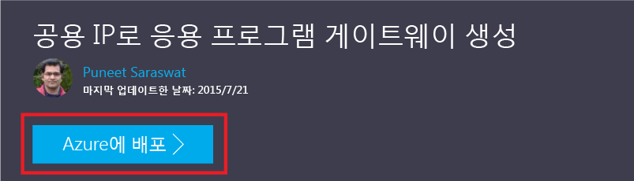
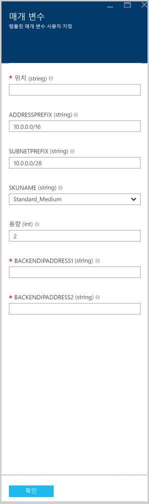

# <a name="create-an-application-gateway-by-using-the-azure-resource-manager-template"></a>Azure Resource Manager 템플릿을 사용하여 애플리케이션 게이트웨이 만들기

Azure Application Gateway는 계층 7 부하 분산 장치입니다. 클라우드 또는 온-프레미스에 상관없이 서로 다른 서버 간에 장애 조치(failover) 및 성능 라우팅 HTTP 요청을 제공합니다. Application Gateway는 HTTP 부하 분산, 쿠키 기반 세션 선호도, SSL(Secure Sockets Layer) 오프로드, 사용자 지정 상태 프로브, 다중 사이트 지원 및 기타 여러 기능을 포함하여 다양한 ADC(Application Delivery Controller)를 제공합니다. 지원되는 기능의 전체 목록을 찾으려면 [Application Gateway 개요](application-gateway-introduction.md)를 참조하세요.

이 문서에서는 GitHub에서 기존 [Azure Resource Manager 템플릿](../azure-resource-manager/resource-group-authoring-templates.md)을 다운로드 및 수정하고 GitHub, PowerShell 및 Azure CLI에서 템플릿을 배포하는 과정을 안내합니다.

변경하지 않고 GitHub에서 직접 템플릿을 배포하는 경우 GitHub에서 템플릿 배포로 건너뜁니다.

## <a name="scenario"></a>시나리오

이 시나리오에서는

* 웹 애플리케이션 방화벽을 사용하여 Application Gateway를 만드는 방법
* 예약된 CIDR 블록이 10.0.0.0/16이고 이름이 VirtualNetwork1인 가상 네트워크를 만듭니다.
* CIDR 블록으로 10.0.0.0/28을 사용하는 Appgatewaysubnet이라고 하는 서브넷을 만듭니다.
* 트래픽을 부하 분산하려는 웹 서버에 대해 이전에 구성된 백 엔드 IP 2개를 설정합니다. 이 템플릿 예제에서 백 엔드 IP는 10.0.1.10 및 10.0.1.11이 됩니다.

> [!NOTE]
> 이러한 설정은 이 템플릿에 대한 매개 변수입니다. 템플릿을 사용자 지정하려면 규칙, 수신기, SSL 및 azuredeploy.json 파일의 기타 옵션을 변경할 수 있습니다.


## <a name="download-and-understand-the-azure-resource-manager-template"></a>Azure 리소스 관리자 템플릿 다운로드 및 이해

GitHub에서 가상 네트워크 및 두 개의 서브넷을 만들기 위한 기존 Azure 리소스 관리자 템플릿을 다운로드하고 원하는 대로 변경한 후 다시 사용할 수 있습니다. 이렇게 하려면 다음 단계를 수행합니다.

1. [웹 애플리케이션 방화벽이 설정된 Application Gateway 만들기](https://github.com/Azure/azure-quickstart-templates/tree/master/101-application-gateway-waf)로 이동합니다.
1. **azuredeploy.json**을 클릭하고 **RAW**를 클릭합니다.
1. 파일을 컴퓨터의 로컬 폴더에 저장합니다.
1. Azure 리소스 관리자 템플릿에 익숙한 경우 7단계로 건너뜁니다.
1. 저장한 파일을 열고 줄에서 **parameters** 아래의 내용을 확인합니다.
1. Azure 리소스 관리자 템플릿 매개 변수는 배포하는 동안 채울 수 있는 값에 대한 자리 표시자를 제공합니다.

   | 매개 변수 | 설명 |
   | --- | --- |
   | **subnetPrefix** |애플리케이션 게이트웨이 서브넷에 대한 CIDR 블록 |
   | **applicationGatewaySize** | Application Gateway의 크기.  WAF는 중형 및 대형만 허용합니다. |
   | **backendIpaddress1** |첫 번째 웹 서버의 IP 주소 |
   | **backendIpaddress2** |두 번째 웹 서버의 IP 주소 |
   | **wafEnabled** | WAF가 사용되도록 설정되어 있는지를 결정하는 설정|
   | **wafMode** | 웹 애플리케이션 방화벽의 모드  사용 가능한 옵션은 **방지** 또는 **검색**입니다.|
   | **wafRuleSetType** | WAF에 대한 규칙 집합 유형.  현재 OWASP만 지원되는 옵션입니다. |
   | **wafRuleSetVersion** |규칙 집합 버전. OWASP CRS 2.2.9 및 3.0이 현재 지원되는 옵션입니다. |

1. **resources** 아래의 내용을 확인하고 다음 속성을 검토합니다.

   * **type**. 템플릿에 의해 생성되는 리소스의 유형입니다. 이 경우 형식은 애플리케이션 게이트웨이를 나타내는 `Microsoft.Network/applicationGateways`입니다.
   * **이름**: 리소스의 이름입니다. `[parameters('applicationGatewayName')]`이 사용됩니다. 이것은 해당 이름이 배포 중에 사용자 또는 매개 변수 파일에 의한 입력으로 제공됨을 의미합니다.
   * **properties**. 리소스의 속성 목록입니다. 이 템플릿은 애플리케이션 게이트웨이를 만드는 동안 가상 네트워크 및 공용 IP 주소를 사용합니다.

1. [https://github.com/Azure/azure-quickstart-templates/blob/master/101-application-gateway-waf/](https://github.com/Azure/azure-quickstart-templates/blob/master/101-application-gateway-waf)로 돌아갑니다.
1. **azuredeploy-parameters.json**을 클릭하고 **RAW**를 클릭합니다.
1. 파일을 컴퓨터의 로컬 폴더에 저장합니다.
1. 저장한 파일을 열고 매개 변수 값을 편집합니다. 다음 값을 사용하여 이 시나리오에 설명된 애플리케이션 게이트웨이를 배포합니다.

     ```json
     {
         "$schema": "https://schema.management.azure.com/schemas/2015-01-01/deploymentParameters.json#",
         "contentVersion": "1.0.0.0",
         "parameters": {
             "addressPrefix": {
             "value": "10.0.0.0/16"
             },
             "subnetPrefix": {
             "value": "10.0.0.0/28"
             },
             "applicationGatewaySize": {
             "value": "WAF_Medium"
             },
             "capacity": {
             "value": 2
             },
             "backendIpAddress1": {
             "value": "10.0.1.10"
             },
             "backendIpAddress2": {
             "value": "10.0.1.11"
             },
             "wafEnabled": {
             "value": true
             },
             "wafMode": {
             "value": "Detection"
             },
             "wafRuleSetType": {
             "value": "OWASP"
             },
             "wafRuleSetVersion": {
             "value": "3.0"
             }
         }
     }
     ```

1. 파일을 저장합니다. [JSlint.com](https://www.jslint.com/)같은 JSON 유효성 검사 도구를 사용하여 JSON 템플릿과 매개 변수 템플릿을 테스트할 수 있습니다.

## <a name="deploy-the-azure-resource-manager-template-by-using-powershell"></a>PowerShell을 사용하여 Azure 리소스 관리자 템플릿 배포

[!INCLUDE [updated-for-az](../../includes/updated-for-az.md)]

Azure PowerShell을 처음 사용하는 경우 [Azure PowerShell을 설치 및 구성하는 방법](/powershell/azure/overview)을 참조하고 지침에 따라 Azure에 로그인하고 구독을 선택합니다.

1. PowerShell에 로그인

    ```powershell
    Connect-AzAccount
    ```

1. 계정에 대한 구독을 확인합니다.

    ```powershell
    Get-AzSubscription
    ```

    자격 증명을 사용하여 인증하라는 메시지가 표시됩니다.

1. 사용할 Azure 구독을 선택합니다.

    ```powershell
    Select-AzSubscription -Subscriptionid "GUID of subscription"
    ```

1. 필요한 경우 **New-AzureResourceGroup** cmdlet을 사용하여 리소스 그룹을 만듭니다. 다음 예제에서는 미국 동부 위치에 AppgatewayRG라고 하는 리소스 그룹을 만듭니다.

    ```powershell
    New-AzResourceGroup -Name AppgatewayRG -Location "West US"
    ```

1. 실행 된 **새로 만들기-AzResourceGroupDeployment** 다운로드 한 후 수정한 이전의 템플릿 및 매개 변수를 사용 하 여 새 가상 네트워크를 배포 하는 cmdlet 파일.
    
    ```powershell
    New-AzResourceGroupDeployment -Name TestAppgatewayDeployment -ResourceGroupName AppgatewayRG `
    -TemplateFile C:\ARM\azuredeploy.json -TemplateParameterFile C:\ARM\azuredeploy-parameters.json
    ```

## <a name="deploy-the-azure-resource-manager-template-by-using-the-azure-cli"></a>Azure CLI를 사용하여 Azure 리소스 관리자 템플릿 배포

Azure CLI를 사용하여 다운로드한 Azure Resource Manager 템플릿을 배포하려면 다음 단계를 수행합니다.

1. Azure CLI를 처음 사용하는 경우 [Azure CLI 설치 및 구성](/cli/azure/install-azure-cli)을 참조하고 Azure 계정 및 구독을 선택하는 부분까지 관련 지침을 따릅니다.

1. 필요한 경우 다음 코드 조각과 같이 `az group create` 명령을 실행하여 리소스 그룹을 만듭니다. 명령의 출력을 확인합니다. 출력 다음에 표시되는 목록은 사용되는 매개 변수를 설명합니다. 리소스 그룹에 대한 자세한 내용은 [Azure Resource Manager 개요](../azure-resource-manager/resource-group-overview.md)를 참조하세요.

    ```azurecli
    az group create --location westus --name appgatewayRG
    ```
    
    **-n (or --name)** . 새 리소스 그룹의 이름입니다. 이 시나리오에서는 *appgatewayRG*입니다.
    
    **-l(또는 --location)** . 새 리소스 그룹이 생성되는 Azure 지역입니다. 이 시나리오에서는 *westus*입니다.

1. `az group deployment create` cmdlet을 실행하고 이전 단계에서 다운로드한 후 수정한 템플릿 및 매개 변수를 사용하여 새 가상 네트워크를 배포합니다. 출력 다음에 표시되는 목록은 사용되는 매개 변수를 설명합니다.

    ```azurecli
    az group deployment create --resource-group appgatewayRG --name TestAppgatewayDeployment --template-file azuredeploy.json --parameters @azuredeploy-parameters.json
    ```

## <a name="deploy-the-azure-resource-manager-template-by-using-click-to-deploy"></a>클릭하여 배포를 사용하여 Azure 리소스 관리자 템플릿 배포

클릭하여 배포는 Azure 리소스 관리자 템플릿을 사용하는 다른 방법입니다. Azure 포털에서 템플릿을 사용하는 쉬운 방법입니다.

1. [웹 애플리케이션 방화벽을 사용하여 애플리케이션 게이트웨이를 만드는 방법](https://azure.microsoft.com/documentation/templates/101-application-gateway-waf/)으로 이동합니다.

1. **Deploy to Azure**를 클릭합니다.

    
    
1. 포털에서 배포 템플릿에 대한 매개 변수를 채우고 **확인**을 클릭합니다.

    
    
1. **위에 명시된 사용 약관에 동의함**을 선택한 다음 **구매**를 클릭합니다.

1. 사용자 지정 배포 블레이드에서 **만들기**를 클릭합니다.

## <a name="providing-certificate-data-to-resource-manager-templates"></a>Resource Manager 템플릿에 인증서 데이터 제공

템플릿과 함께 SSL을 사용하는 경우 인증서를 업로드하는 대신 base64 문자열에 제공해야 합니다. .pfx 또는 .cer을 base64 문자열로 변환하려면 다음 명령 중 하나를 사용합니다. 다음 명령은 인증서를 base64 문자열로 변환하며, 그러면 인증서를 템플릿에 제공할 수 있습니다. 예상 출력은 변수에 저장되고 템플릿에 붙여넣을 수 있는 문자열입니다.

### <a name="macos"></a>macOS
```bash
cert=$( base64 <certificate path and name>.pfx )
echo $cert
```

### <a name="windows"></a>Windows
```powershell
[System.Convert]::ToBase64String([System.IO.File]::ReadAllBytes("<certificate path and name>.pfx"))
```

## <a name="delete-all-resources"></a>모든 리소스 삭제

이 문서에서 만든 모든 리소스를 삭제하려면 다음 단계 중 하나를 완료합니다.

### <a name="powershell"></a>PowerShell

```powershell
Remove-AzResourceGroup -Name appgatewayRG
```

### <a name="azure-cli"></a>Azure CLI

```azurecli
az group delete --name appgatewayRG
```

## <a name="next-steps"></a>다음 단계

SSL 오프로드를 구성하려는 경우 [SSL 오프로드에 대한 애플리케이션 게이트웨이 구성](application-gateway-ssl.md)을 방문해보세요.

내부 부하 분산 장치에 사용되도록 애플리케이션 게이트웨이를 구성하려면 [ILB(내부 부하 분산 장치)를 사용하여 애플리케이션 게이트웨이 만들기](application-gateway-ilb.md)를 참조하세요.

부하 분산 옵션에 대한 자세한 정보는 다음을 방문하세요.

* [Azure 부하 분산 장치](https://azure.microsoft.com/documentation/services/load-balancer/)
* [Azure Traffic Manager](https://azure.microsoft.com/documentation/services/traffic-manager/)