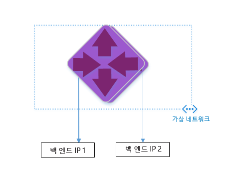

<properties 
   pageTitle="Azure 리소스 관리자 템플릿을 사용하여 응용 프로그램 게이트웨이 만들기 | Microsoft Azure"
   description="이 페이지에서는 Azure 리소스 관리자 템플릿을 사용하여 Azure 응용 프로그램 게이트웨이를 만드는 지침을 제공합니다."
   documentationCenter="na"
   services="application-gateway"
   authors="joaoma"
   manager="jdial"
   editor="tysonn"/>
<tags 
   ms.service="application-gateway"
   ms.devlang="na"
   ms.topic="hero-article" 
   ms.tgt_pltfrm="na"
   ms.workload="infrastructure-services" 
   ms.date="09/21/2015"
   ms.author="joaoma"/>

# ARM 템플릿을 사용하여 응용 프로그램 게이트웨이 구성

응용 프로그램 게이트웨이는 부하 분산 장치 계층 7입니다. 클라우드 또는 온-프레미스이든 상관없이 서로 다른 서버 간에 장애 조치(Failover), 성능 라우팅 HTTP 요청을 제공합니다. 응용 프로그램 게이트웨이의 응용 프로그램 전달 기능에는 HTTP 부하 분산, 쿠키 기반 세션 선호도, SSL 오프로드 등이 있습니다.

> [AZURE.SELECTOR]
- [Azure Classic Powershell steps](application-gateway-create-gateway.md)
- [Azure Resource Manager Powershell steps](application-gateway-create-gateway-arm.md)
- [Azure Resource Manager template steps](application-gateway-create-gateway-arm-template.md)

 

GitHub에서 기존 ARM 템플릿을 다운로드한 후 수정하고 GitHub, PowerShell 및 Azure CLI에서 템플릿을 배포하는 방법에 알아봅니다.

변경하지 않고 GitHub에서 직접 ARM 템플릿을 배포하는 경우 github에서 템플릿 배포로 건너뜁니다.

>[AZURE.IMPORTANT]Azure 리소스로 작업하기 전에 Azure에는 현재 리소스 관리자와 클래식 모드의 두 가지 배포 모델이 있다는 것을 이해해야 합니다. Azure 리소스로 작업하기 전에 [배포 모델 및 도구](azure-classic-rm.md)를 이해해야 합니다. 이 문서의 윗부분에 있는 탭을 클릭하여 다양한 도구에 대한 설명서를 볼 수 있습니다. 이 문서에서는 Azure 리소스 관리자를 사용하여 응용 프로그램 게이트웨이를 만드는 방법을 설명합니다. 클래식 버전을 사용하려면 [PowerShell을 사용하여 응용 프로그램 게이트웨이 클래식 배포 만들기](application-gateway-create-gateway.md)로 이동합니다.

## 시나리오

이 시나리오에서 생성하는 항목:

- 응용 프로그램 게이트웨이 2 인스턴스;
- 예약된 CIDR 블록이 10.0.0.0/16이고 이름이 VirtualNetwork1인 Vnet;
- CIDR 블록으로 10.0.0.0/28을 사용하는 Appgatewaysubnet이라고 하는 서브넷;
- 트래픽을 부하 분산하려는 웹 서버에 대해 이전에 구성된 백 엔드 IP 2개 설정. 이 템플릿 예제에 사용되는 백 엔드 IP는 10.0.1.10 및 10.0.1.11입니다.

>[AZURE.NOTE]이 템플릿에 대한 매개 변수입니다. azuredeploy.json을 열어서 규칙, 수신기 및 SSL을 변경하여 템플릿을 사용자 지정할 수 있습니다.

## ARM 템플릿 다운로드 및 이해

github에서 VNet 및 두 개의 서브넷을 만들기 위한 기존 ARM 템플릿을 다운로드하고 원하는 대로 변경한 후 다시 사용할 수 있습니다. 이 작업을 수행하려면 다음 단계를 따르세요.

1. https://github.com/Azure/azure-quickstart-templates/blob/master/101-create-applicationgateway-publicip로 이동합니다.
2. **azuredeploy.json**을 클릭하고 **RAW**를 클릭합니다.
3. 파일을 컴퓨터의 로컬 폴더에 저장합니다.
4. ARM 템플릿에 익숙한 경우 7단계로 건너뜁니다.
5. 방금 저장한 파일을 열고 줄 5에 있는 **parameters** 아래의 내용을 확인합니다. ARM 템플릿 매개 변수는 배포하는 동안 채울 수 있는 값에 대한 자리 표시자를 제공합니다.

	| 매개 변수 | 설명 |
	|---|---|
	| **위치** | 응용 프로그램 게이트웨이를 만들 Azure 지역입니다. |
	| **VirtualNetwork1** | 새 VNet의 이름 |
	| **addressPrefix** | CIDR 형식의 VNet에 대한 주소 공간 |
	| **ApplicationGatewaysubnet** | 응용 프로그램 게이트웨이 서브넷의 이름 |
	| **subnetPrefix** | 응용 프로그램 게이트웨이 서브넷에 대한 CIDR 블록 |
	| **skuname** | sku 인스턴스 크기 |
	| **용량** | 인스턴스 수 |
	| **backendaddress1** | 첫 번째 웹 서버의 IP 주소 |
	| **backendaddress2** | 두 번째 웹 서버의 IP 주소|

>[AZURE.IMPORTANT]Github에서 유지 관리되는 ARM 템플릿은 시간이 지나면서 달라질 수 있습니다. 템플릿을 사용하기 전에 확인합니다.
	
6. **resources** 아래의 내용을 확인하고 다음을 검토합니다.

	- **type**. 템플릿에 의해 생성되는 리소스의 유형입니다. 이 경우, 응용 프로그램 게이트웨이를 나타내는 **Microsoft.Network/applicationGateways**입니다.
	- **name**. 리소스의 이름입니다. **[parameters('applicationGatewayName')]**이 사용됩니다. 이것은 해당 이름이 배포 중에 사용자 또는 매개 변수 파일에 의한 입력으로 제공됨을 의미합니다.
	- **properties**. 리소스의 속성 목록입니다. 이 템플릿은 응용 프로그램 게이트웨이를 만드는 동안 가상 네트워크 및 공용 IP 주소를 사용합니다.

7. https://github.com/Azure/azure-quickstart-templates/blob/master/101-create-applicationgateway-publicip로 돌아갑니다.
8. **azuredeploy-paremeters.json**을 클릭하고 **RAW**를 클릭합니다.
9. 파일을 컴퓨터의 로컬 폴더에 저장합니다.
10. 방금 저장한 파일을 열고 매개 변수 값을 편집합니다. 아래의 값을 사용하여 이 시나리오에 설명된 응용 프로그램 게이트웨이를 배포합니다.

		{
		   "$schema": "http://schema.management.azure.com/schemas/2015-01-01/deploymentParameters.json#",
		   "contentVersion": "1.0.0.0",
		   "parameters": {
		     "location": {
		       "value": "East US"
		     },
		     "addressPrefix": {
		      "value": "10.0.0.0/16"
    		 },
		     "subnetPrefix": {
		      "value": "10.0.0.0/24"
		     },
		     "skuName": {
		       "value": "Standard_Small"
		     },
		     "capacity": {
		       "value": 2
		    },
		    "backendIpAddress1": {
		      "value": "10.0.1.10"
		    },
		     "backendIpAddress2": {
		       "value": "10.0.1.11"
		     }
		  }
		}

11. 파일을 저장합니다. [JSlint.com](http://www.jslint.com/) 같은 json 유효성 검사 도구를 사용하여 Json 템플릿과 매개 변수 템플릿을 테스트할 수 있습니다.
 
## PowerShell을 사용하여 ARM 템플릿 배포

1. Azure PowerShell을 처음 사용하는 경우 [Azure PowerShell을 설치 및 구성하는 방법](powershell-install-configure.md)을 참조하고 지침을 끝까지 따르면서 Azure에 로그인하고 구독을 선택합니다.
2. Azure PowerShell 프롬프트에서 다음과 같이 **Switch-AzureMode** cmdlet을 실행하여 리소스 관리자 모드로 전환합니다.

		Switch-AzureMode AzureResourceManager
	
예상 출력:

		WARNING: The Switch-AzureMode cmdlet is deprecated and will be removed in a future release.

>[AZURE.WARNING]Switch-AzureMode cmdlet은 곧 더 이상 사용되지 않습니다. 이 경우 모든 리소스 관리자 cmdlet의 이름이 바뀝니다.
	
3. 필요한 경우 `New-AzureResourceGroup` cmdlet을 사용하여 새 리소스 그룹을 만듭니다. 아래 예제에서 미국 동부 위치에 AppgatewayRG라고 하는 새 리소스 그룹을 만듭니다.

		PS C:\> New-AzureResourceGroup -Name AppgatewayRG -Location "East US"
		VERBOSE: 5:38:49 PM - Created resource group 'AppgatewayRG' in location 'eastus'

		ResourceGroupName : AppgatewayRG
		Location          : eastus
		ProvisioningState : Succeeded
		Tags              :
		Permissions       :
	                 Actions  NotActions
	                 =======  ==========
	                  *

		ResourceId        : /subscriptions/################################/resourceGroups/AppgatewayRG

4. AzureResourceGroupDeployment cmdlet을 실행하고 위에서 다운로드한 후 수정한 템플릿 및 매개 변수를 사용하여 새 VNet을 배포합니다.

		New-AzureResourceGroupDeployment -Name TestAppgatewayDeployment -ResourceGroupName AppgatewayRG `
 		   -TemplateFile C:\ARM\azuredeploy.json -TemplateParameterFile C:\ARM\azuredeploy-parameters.json

명령줄에 의해 생성된 출력은 다음과 같습니다.

		DeploymentName    : testappgatewaydeployment
		ResourceGroupName : appgatewayRG
		ProvisioningState : Succeeded
		Timestamp         : 9/19/2015 1:49:41 AM
		Mode              : Incremental
		TemplateLink      :
		Parameters        :
                   Name             Type                       Value
                   ===============  =========================  ==========
                   location         String                     East US
                   addressPrefix    String                     10.0.0.0/16
                   subnetPrefix     String                     10.0.0.0/24
                   skuName          String                     Standard_Small
                   capacity         Int                        2
                   backendIpAddress1  String                     10.0.1.10
                   backendIpAddress2  String                     10.0.1.11

		Outputs           :

## Azure CLI를 사용하여 ARM 템플릿 배포

Azure CLI를 사용하여 다운로드한 ARM 템플릿을 배포하려면 다음 단계를 수행합니다.

1. Azure CLI를 처음 사용하는 경우 [Azure CLI 설치 및 구성](xplat-cli-install.md)을 참조하고 Azure 계정 및 구독을 선택하는 부분까지 관련 지침을 따릅니다.
2. 아래와 같이 **azure config mode** 명령을 실행하여 리소스 관리자 모드로 전환합니다.

		azure config mode arm

다음은 위의 명령에 대해 예상된 출력입니다.

		info:	New mode is arm

3. 필요한 경우 아래와 같이 **azure group create**를 실행하여 새 리소스 그룹을 만듭니다. 명령의 출력을 확인합니다. 출력 다음에 표시되는 목록은 사용되는 매개 변수를 설명합니다. 리소스 그룹에 대한 자세한 내용은 [Azure 리소스 관리자 개요](resource-group-overview.md)를 참조하세요.

		azure group create -n appgatewayRG -l eastus

**-n (or --name)**. 새 리소스 그룹의 이름입니다. 이 시나리오에서는 *appgatewayRG*입니다.

**-l (or --location)**. 새 리소스 그룹이 생성되는 Azure 지역입니다. 이 시나리오에서는 *Eastus*입니다.

4. **azure group deployment create** cmdlet을 실행하고 위에서 다운로드한 후 수정한 템플릿 및 매개 변수를 사용하여 새 VNet을 배포합니다. 출력 다음에 표시되는 목록은 사용되는 매개 변수를 설명합니다.

		azure group deployment create -g appgatewayRG -n TestAppgatewayDeployment -f C:\ARM\azuredeploy.json -e C:\ARM\azuredeploy-parameters.json

다음은 위의 명령에 대해 예상된 출력입니다.

		azure group deployment create -g appgatewayRG -n TestAppgatewayDeployment -f C:\ARM\azuredeploy.json -e C:\ARM\azuredeploy-parameters.json
		info:    Executing command group deployment create
		+ Initializing template configurations and parameters
		+ Creating a deployment
		info:    Created template deployment "TestAppgatewayDeployment"
		+ Waiting for deployment to complete
		data:    DeploymentName     : TestAppgatewayDeployment
		data:    ResourceGroupName  : appgatewayRG
		data:    ProvisioningState  : Succeeded
		data:    Timestamp          : 2015-09-21T20:50:27.5129912Z
		data:    Mode               : Incremental
		data:    Name               Type    Value
		data:    -----------------  ------  --------------
		data:    location           String  East US
		data:    addressPrefix      String  10.0.0.0/16
		data:    subnetPrefix       String  10.0.0.0/24	
		data:    skuName            String  Standard_Small
		data:    capacity           Int     2
		data:    backendIpAddress1  String  10.0.1.10
		data:    backendIpAddress2  String  10.0.1.11
		info:    group deployment create command OK

**-g (or --resource-group)**. 새 VNet이 만들어지는 리소스 그룹의 이름입니다.

**-f (or --template-file)**. ARM 템플릿 파일에 대한 경로입니다.

**-e (or --parameters-file)**. ARM 매개 변수 파일에 대한 경로입니다.

## 클릭하여 배포를 사용하여 ARM 템플릿 배포

클릭하여 배포는 ARM 템플릿을 사용하는 다른 방법입니다. Azure 포털에서 템플릿을 사용하는 쉬운 방법입니다.

### 1단계 
[Click to deploy Application Gateway](http://azure.microsoft.com/documentation/templates/101-create-applicationgateway-publicip/)(응용 프로그램 게이트웨이 클릭하여 배포) 링크를 사용하면 응용 프로그램 게이트웨이에 대한 포털 템플릿 페이지로 리디렉션됩니다.

### 2단계 

"Azure에 배포"를 클릭합니다.

### 3단계

포털에서 배포 템플릿에 대한 매개 변수를 채우고 확인을 클릭합니다.

### 4단계

"약관"을 선택하고 "구입"을 클릭합니다.

### 5단계

"사용자 지정 배포" 블레이드에서 "만들기"를 클릭합니다.

 
## 다음 단계

SSL 오프로드를 구성하려는 경우 [SSL 오프로드에 대해 응용 프로그램 게이트웨이 구성](application-gateway-ssl.md)을 참조하세요.

ILB에서 사용되도록 응용 프로그램 게이트웨이를 구성하려면 [ILB(내부 부하 분산 장치)를 사용하여 응용 프로그램 게이트웨이 만들기](application-gateway-ilb.md)를 참조하세요.

보다 자세한 내용을 원한다면 일반적 부하 분산 옵션을 참조:

- [Azure 부하 분산 장치](https://azure.microsoft.com/documentation/services/load-balancer/)
- [Azure 트래픽 관리자](https://azure.microsoft.com/documentation/services/traffic-manager/)

<!---HONumber=Oct15_HO1-->