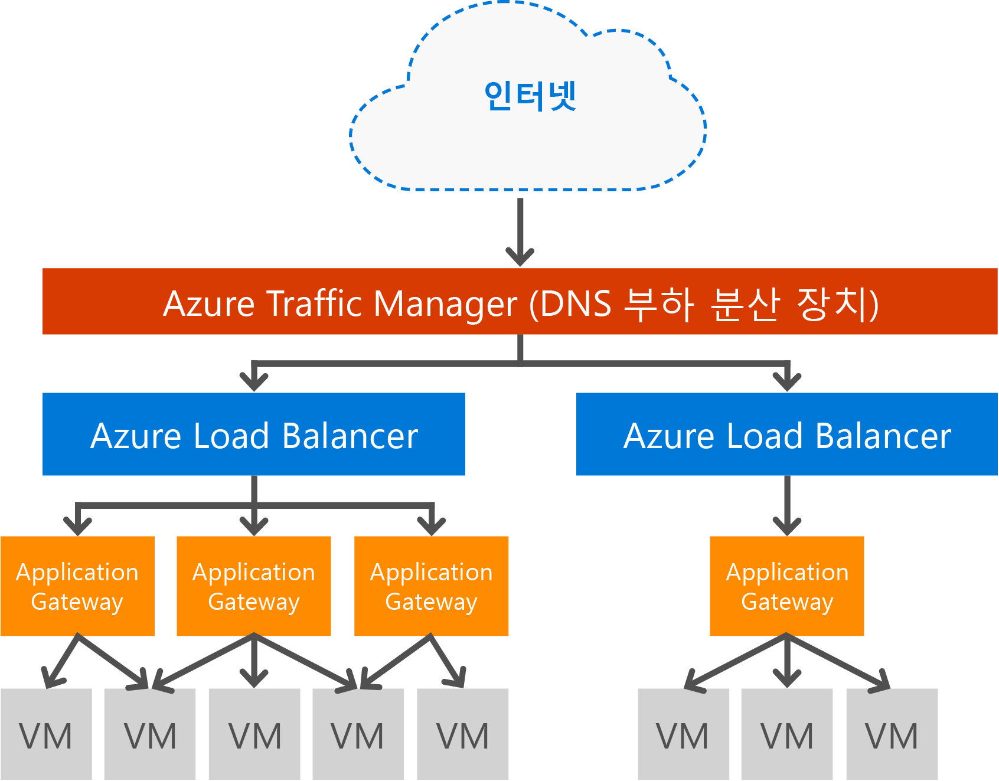

# 응용 프로그램 게이트웨이 개요

## Application Gateway란?

Microsoft Azure Application Gateway는 응용 프로그램 배달 컨트롤러(ADC)를 서비스로 제공하여 다양한 계층 7 부하 분산 기능을 제공합니다. 따라서 고객은 Application Gateway에 CPU 집약적인 SSL 종료를 오프로드하여 웹 팜 생산성을 최적화할 수 있습니다. 또한 들어오는 트래픽의 라운드 로빈 배포, 쿠키 기반 세션 선호도, URL 경로 기반 라우팅 및 단일 Application Gateway 뒤에 여러 웹 사이트를 호스트할 수 있는 능력 등을 포함하는 다른 계층 7 라우팅 기능이 제공됩니다. Application Gateway에는 대부분의 OWASP top 10 일반적인 웹 취약성에 대해 응용 프로그램을 보호하는 웹 응용 프로그램 방화벽(WAF)이 있습니다. Application Gateway는 인터넷 연결 게이트웨이, 내부 전용 게이트웨이 또는 둘의 조합으로 구성할 수 있습니다. Application Gateway는 전적으로 Azure에 의해 관리되고, 확장성 및 고가용성을 제공합니다. 향상된 관리 효율성을 위한 풍부한 진단 및 로깅 기능을 제공합니다. 응용 프로그램 게이트웨이는 가상 컴퓨터, 클라우드 서비스 및 내부 또는 외부 연결 웹 응용 프로그램에서 작동합니다.

Application Gateway는 응용 프로그램에 대한 전용 가상 어플라이언스이며 확장성 및 고가용성을 제공하는 여러 개의 작업자 인스턴스로 구성됩니다. 응용 프로그램 게이트웨이를 만들 때 끝점(공용 VIP 또는 내부 ILB IP)이 연결되어 수신 네트워크 트래픽에 사용됩니다. VIP 또는 ILB IP는 전송 수준(TCP/UDP)에서 작동하며 응용 프로그램 게이트웨이 서비스로 모든 수신 네트워크 트래픽이 부하 분산되는 Azure 부하 분산 장치를 통해 제공됩니다. 그런 다음 Application Gateway는 가상 컴퓨터, 클라우드 서비스, 내부 또는 외부 IP 주소인지 확인하여 해당 구성에 따라 HTTP 트래픽을 라우팅합니다. SLA 및 가격 책정은 [SLA](https://azure.microsoft.com/support/legal/sla/) 및 [가격 책정](https://azure.microsoft.com/pricing/details/application-gateway/) 페이지를 참조하세요.

## 기능

현재 Application Gateway는 다음 기능을 사용하여 계층 7 응용 프로그램 배달을 지원합니다.

* **[웹 응용 프로그램 방화벽(미리 보기)](application-gateway-webapplicationfirewall-overview.md)** - Azure Application Gateway의 WAF(웹 응용 프로그램 방화벽)은 SQL 삽입, 사이트 간 스크립팅 공격, 세션 하이재킹 등의 일반적인 웹 기반 공격으로부터 웹 응용 프로그램을 보호합니다.
* **HTTP 부하 분산** - Application Gateway는 라운드 로빈 부하 분산을 제공합니다. 부하 분산은 계층 7에서 수행되고 HTTP(S) 트래픽에 대해서만 사용됩니다.
* **쿠키 기반 세션 선호도** - 이 기능은 동일한 백 엔드에서 사용자 세션을 유지하려는 경우에 유용합니다. Application Gateway는 게이트웨이 관리형 쿠키를 사용하여 사용자 세션에서 동일한 백 엔드에 후속 트래픽을 처리하도록 지시할 수 있습니다. 이 기능은 세션 상태가 사용자 세션의 백 엔드 서버에 로컬로 저장된 경우에 특히 중요합니다.
* **[SSL(Secure Sockets Layer) 오프로드](application-gateway-ssl-arm.md)** - 이 기능은 웹 서버에서 HTTPS 트래픽을 해독하는 것과 같은 비용이 많이 드는 태스크를 담당합니다. 웹 서버는 Application Gateway에서 SSL 연결을 종료하고 암호화되지 않은 서버에 대한 요청을 전달하여 암호 해독에서 벗어납니다.  Application Gateway는 응답을 다시 암호화한 후 클라이언트에 다시 보냅니다. 이 기능은 백 엔드가 Azure에서 Application Gateway와 동일한 보안 가상 네트워크에 있는 경우에 유용합니다.
* **[종단 간 SSL](application-gateway-backend-ssl.md)** - Application Gateway는 트래픽의 종단 간 암호화를 지원합니다. Application Gateway는 이를 위해 응용 프로그램 게이트웨이에서 SSL 연결을 종료합니다. 그러면 게이트웨이에서 트래픽에 라우팅 규칙을 적용하고, 패킷을 다시 암호화하고, 정의된 라우팅 규칙에 따라 적절한 백 엔드에 패킷을 전달합니다. 웹 서버의 모든 응답은 동일한 프로세스를 거쳐 최종 사용자에게 돌아갑니다.
* **[URL 기반 콘텐츠 라우팅](application-gateway-url-route-overview.md)** - 이 기능은 다른 트래픽에 다른 백 엔드 서버를 사용하는 기능을 제공합니다. 웹 서버 또는 CDN에 있는 폴더에 대한 트래픽은 다른 백 엔드로 라우팅될 수 있으며 특정 콘텐츠를 제공하지 않는 백 엔드에 대한 불필요한 로드를 감소시킵니다.
* **[다중 사이트 라우팅](application-gateway-multi-site-overview.md)** - Application Gateway를 사용하면 단일 Application Gateway에서 최대 20개의 웹 사이트를 통합할 수 있습니다.
* **[Websocket 지원](application-gateway-websocket.md)** - Application Gateway의 또 다른 장점은 Websocket에 대한 네이티브 지원이라는 점입니다.
* **[상태 모니터링](application-gateway-probe-overview.md)** - Application Gateway는 기본적인 백 엔드 리소스 상태 모니터링 및 보다 구체적인 시나리오를 모니터링하기 위한 사용자 지정 프로브를 제공합니다.
* **[고급 진단](application-gateway-diagnostics.md)** - Application Gateway는 전체 진단 및 액세스 로그를 제공합니다. 방화벽 로그는 WAF를 사용할 수 있는 Application Gateway 리소스에 사용할 수 있습니다.

## 이점

Application Gateway는 다음과 같은 경우에 유용합니다.

* 동일한 사용자/클라이언트 세션의 요청이 동일한 백 엔드 가상 컴퓨터에 도달해야 하는 응용 프로그램. 이러한 응용 프로그램의 예로는 쇼핑 카트 앱 및 웹 메일 서버가 있습니다.
* 응용 프로그램은 SSL 종료 오버헤드에서 웹 서버 팜을 무료로 원합니다. 
* 콘텐츠 배달 네트워크와 같은 응용 프로그램은 다른 서버로 라우팅 또는 부하 분산을 위해 여러 HTTP 요청을 동일한 장기 실행 TCP 연결에서 요구합니다.
* websocket 트래픽을 지원하는 응용 프로그램
* SQL 삽입, 사이트 간 스크립팅 공격, 세션 하이재킹과 같은 일반적인 웹 기반 공격으로부터 웹 응용 프로그램을 보호합니다.

Azure 관리 서비스와 비슷한 부하 분산 응용 프로그램 게이트웨이는 Azure 소프트웨어 부하 분산 뒤에서 계층 7 부하 분산 장치를 프로비전하는 것을 허용합니다. Traffic Manager는 다음 이미지와 같이 시나리오를 완료하는 데 사용될 수 있습니다. 여기서 Traffic Manager는 다른 지역에 있는 여러 응용 프로그램 게이트웨이 리소스에 트래픽의 리디렉션 및 가용성을 제공하는 반면 응용 프로그램 게이트웨이는 지역 간 계층 7 부하 분산을 제공합니다. 이 시나리오의 예제는 [Azure 클라우드에서 부하 분산 서비스 사용](../traffic-manager/traffic-manager-load-balancing-azure.md)에서 확인할 수 있습니다.

[!INCLUDE [load-balancer-compare-tm-ag-lb-include.md](../../includes/load-balancer-compare-tm-ag-lb-include.md)]

## 게이트웨이 크기 및 인스턴스

Application Gateway는 현재 **소형**, **중형** 및 **대형**의&3;가지 크기를 제공합니다. 소규모 인스턴스 크기는 개발 및 테스트 시나리오를 위해 사용 됩니다.

현재 Application Gateway에는 **WAF** 및 **표준**이라는 두 SKU가 있습니다.

구독당 최대 50개의 응용 프로그램 게이트웨이를 만들 수 있으며 각 응용 프로그램 게이트웨이에는 최대 10개의 인스턴스가 있을 수 있습니다. 각 Application Gateway는 http 수신기 20개로 구성할 수 있습니다. Application Gateway의 전체 목록은 [Application Gateway 서비스 제한](../azure-subscription-service-limits.md?toc=%2fazure%2fapplication-gateway%2ftoc.json#application-gateway-limits)을 참조하세요.

다음 표에서는 각 응용 프로그램 게이트웨이 인스턴스의 평균 성능 처리량을 보여 줍니다.

| 백 엔드 페이지 응답 | 작음 | 중간 | 큼 |
| --- | --- | --- | --- |
| 6K |7.5Mbps |13Mbps |50Mbps |
| 100K |35Mbps |100Mbps |200Mbps |

> [!NOTE]
> 이러한 값은 응용 프로그램 게이트웨이 처리량에 대한 대략적인 값입니다. 실제 처리량은 평균 페이지 크기, 백 엔드 인스턴스의 위치 및 페이지 처리 시간 등 다양한 환경 세부 사항에 따라 달라집니다. 정확한 성능 수치를 얻으려면 자체 테스트를 실행해야 합니다. 이러한 값은 용량 계획 지침에 대해서만 제공됩니다.

## 상태 모니터링

Azure Application Gateway는 기본 및 사용자 지정 상태 프로브를 통해 백 엔드 인스턴스의 상태를 자동으로 모니터링합니다. 상태 프로브를 사용하여 정상적인 호스트가 트래픽에 응답하지 확인합니다. 자세한 내용은 [응용 프로그램 게이트웨이 상태 모니터링 개요](application-gateway-probe-overview.md)를 참조하세요.

## 구성 및 관리

Azure Application Gateway는 구성된 경우 끝점으로 공용 IP, 개인 IP 또는 둘 다를 가질 수 있습니다. Application Gateway는 고유한 서브넷의 가상 네트워크 내에서 구성됩니다. Application Gateway에 대해 만들거나 사용된 서브넷은 다른 유형의 리소스를 포함할 수 없습니다. 그리고 서브넷에 허용되는 유일한 리소스는 다른 Application Gateway입니다. 백 엔드 리소스를 보호하려면 응용 프로그램 게이트웨이와 같은 가상 네트워크의 다른 서브넷에 백 엔드 서버를 포함하면 됩니다. Application Gateway가 ip 주소에 연결할 수 있고 백 엔드 서버에 ADC 기능을 제공할 수 있는 한, 이 추가 서브넷은 백 엔드 응용 프로그램에 필요하지 않습니다.

REST API, PowerShell cmdlets, Azure CLI 또는 [Azure Portal](https://portal.azure.com/)을 사용하여 Application Gateway를 만들고 관리할 수 있습니다.

## 다음 단계

Application Gateway에 대해 학습한 후에 [응용 프로그램 게이트웨이를 만들](application-gateway-create-gateway-portal.md)거나 [응용 프로그램 게이트웨이 SSL 오프로드를 만들](application-gateway-ssl-arm.md)어서 HTTPS 연결의 부하를 분산할 수 있습니다.

URL 기반 콘텐츠 라우팅을 사용하여 응용 프로그램 게이트웨이를 만드는 방법에 대한 자세한 내용은 [URL 기반 라우팅을 사용하여 응용 프로그램 게이트웨이 만들기](application-gateway-create-url-route-arm-ps.md) 를 참조하세요.

<!--HONumber=Jan17_HO3-->

