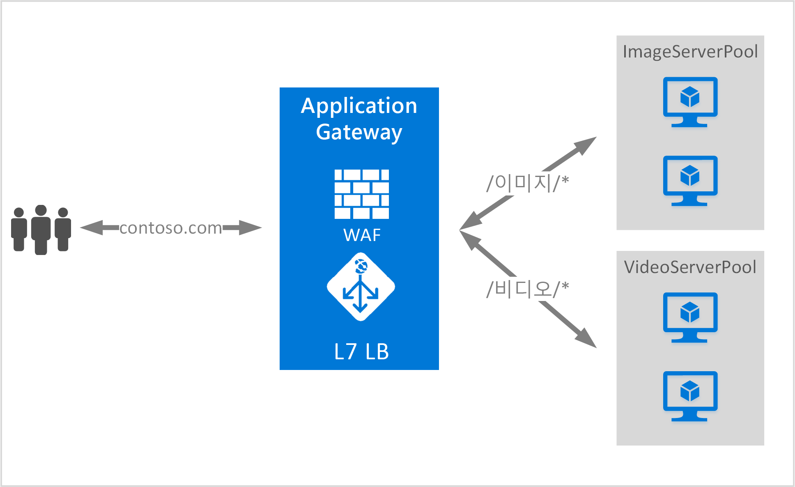

# <a name="url-path-based-routing-overview"></a>URL 경로 기반 라우팅 개요

URL 경로 기반 라우팅을 사용하여 요청의 URL 경로에 따라 트래픽을 백 엔드 서버 풀로 라우팅할 수 있습니다. 

시나리오 중 하나는 여러 콘텐츠 형식에 대한 요청을 서로 다른 백 엔드 서버 풀로 라우팅하는 것입니다.

다음 예제에서는 Application Gateway가 세 개의 백 엔드 서버 풀(예: VideoServerPool, ImageServerPool 및 DefaultServerPool)에서 contoso.com에 대한 트래픽을 제공합니다.



http\://contoso.com/video/*에 대한 요청은 VideoServerPool로 라우팅되고 http\://contoso.com/images/*에 대한 요청은 ImageServerPool로 라우팅됩니다. 경로 패턴과 일치하는 항목이 없는 경우 DefaultServerPool이 선택됩니다.

> [!IMPORTANT]
> 규칙은 포털에 나열된 순서대로 처리됩니다. 기본 수신기를 구성하기 전에 먼저 다중 사이트 수신기를 구성하는 것이 좋습니다.  그러면 트래픽이 올바른 백 엔드로 라우팅됩니다. 기본 수신기가 먼저 나열되고 들어오는 요청과 일치하면 해당 수신기에서 처리합니다.

## <a name="urlpathmap-configuration-element"></a>UrlPathMap 구성 요소

urlPathMap 요소는 백 엔드 서버 풀 매핑에 대한 경로 패턴을 지정하는 데 사용됩니다. 다음 코드 예제는 템플릿 파일의 urlPathMap 요소 조각입니다.

```json
"urlPathMaps": [{
    "name": "{urlpathMapName}",
    "id": "/subscriptions/{subscriptionId}/../microsoft.network/applicationGateways/{gatewayName}/urlPathMaps/{urlpathMapName}",
    "properties": {
        "defaultBackendAddressPool": {
            "id": "/subscriptions/    {subscriptionId}/../microsoft.network/applicationGateways/{gatewayName}/backendAddressPools/{poolName1}"
        },
        "defaultBackendHttpSettings": {
            "id": "/subscriptions/{subscriptionId}/../microsoft.network/applicationGateways/{gatewayName}/backendHttpSettingsList/{settingname1}"
        },
        "pathRules": [{
            "name": "{pathRuleName}",
            "properties": {
                "paths": [
                    "{pathPattern}"
                ],
                "backendAddressPool": {
                    "id": "/subscriptions/{subscriptionId}/../microsoft.network/applicationGateways/{gatewayName}/backendAddressPools/{poolName2}"
                },
                "backendHttpsettings": {
                    "id": "/subscriptions/{subscriptionId}/../microsoft.network/applicationGateways/{gatewayName}/backendHttpsettingsList/{settingName2}"
                }
            }
        }]
    }
}]
```

### <a name="pathpattern"></a>PathPattern

PathPattern은 일치시킬 경로 패턴의 목록입니다. 각각은 /로 시작해야 하고 "*"는 "/" 다음의 끝에 올 수 있습니다. 경로 검사기에 제공되는 문자열에는 첫 번째 ? 또는 # 뒤에 어떤 텍스트도 포함되지 않으며, 여기에서는 해당 문자를 사용할 수 없습니다. 그렇지 않은 경우 URL에 허용되는 모든 문자는 PathPattern에서 사용됩니다.

지원되는 패턴은 Application Gateway v1을 배포할지 또는 v2를 배포할지에 따라 다릅니다.

#### <a name="v1"></a>v1

경로 규칙은 대/소문자를 구분하지 않습니다.

|v1 경로 패턴  |지원 여부  |
|---------|---------|
|`/images/*`     |예|
|`/images*`     |no|
|`/images/*.jpg`     |아니요|
|`/*.jpg`     |아니요|
|`/Repos/*/Comments/*`     |아니요|
|`/CurrentUser/Comments/*`     |예|

#### <a name="v2"></a>v2

경로 규칙은 대/소문자를 구분합니다.

|v2 경로 패턴  |지원 여부  |
|---------|---------|
|`/images/*`     |예|
|`/images*`     |예|
|`/images/*.jpg`     |no|
|`/*.jpg`     |아니요|
|`/Repos/*/Comments/*`     |아니요|
|`/CurrentUser/Comments/*`     |예|

자세한 내용은 [URL 기반 라우팅을 사용하는 Resource Manager 템플릿](https://azure.microsoft.com/documentation/templates/201-application-gateway-url-path-based-routing)을 참조하세요.

## <a name="pathbasedrouting-rule"></a>PathBasedRouting 규칙

PathBasedRouting 형식의 RequestRoutingRule은 수신기를 urlPathMap에 바인딩하는 데 사용됩니다. 이 수신기에 대해 수신되는 모든 요청은 urlPathMap에 지정된 정책에 따라 라우팅됩니다.
PathBasedRouting 규칙 조각:

```json
"requestRoutingRules": [
    {

"name": "{ruleName}",
"id": "/subscriptions/{subscriptionId}/../microsoft.network/applicationGateways/{gatewayName}/requestRoutingRules/{ruleName}",
"properties": {
    "ruleType": "PathBasedRouting",
    "httpListener": {
        "id": "/subscriptions/{subscriptionId}/../microsoft.network/applicationGateways/{gatewayName}/httpListeners/<listenerName>"
    },
    "urlPathMap": {
        "id": "/subscriptions/{subscriptionId}/../microsoft.network/applicationGateways/{gatewayName}/ urlPathMaps/{urlpathMapName}"
    },

}
    }
]
```

## <a name="next-steps"></a>다음 단계

URL 기반 콘텐츠 라우팅을 알아본 후에는 [URL 기반 라우팅을 사용하여 애플리케이션 게이트웨이 만들기](application-gateway-create-url-route-portal.md)로 이동하여 URL 라우팅 규칙을 사용하여 애플리케이션 게이트웨이를 만듭니다.
