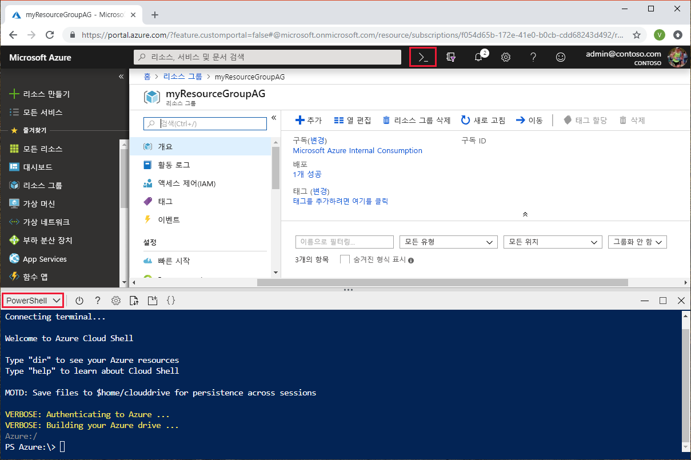
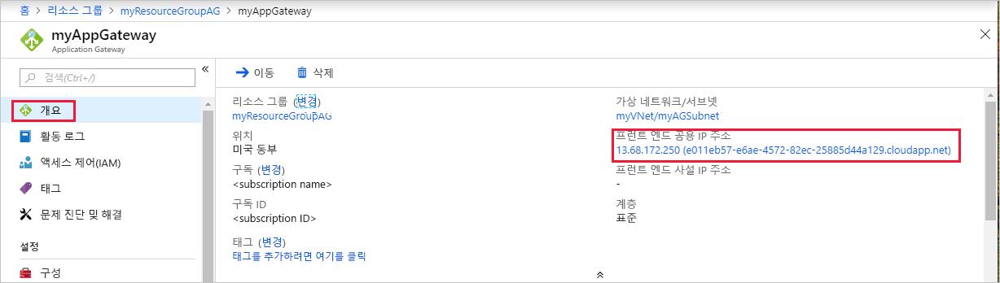

# <a name="tutorial-create-an-application-gateway-with-a-web-application-firewall-using-the-azure-portal"></a>자습서: Azure Portal을 사용하여 웹 애플리케이션 방화벽이 있는 애플리케이션 게이트웨이를 만듭니다.

이 자습서에서는 Azure Portal을 사용하여 WAF([웹 애플리케이션 방화벽](application-gateway-web-application-firewall-overview.md))이 있는 [애플리케이션 게이트웨이](application-gateway-introduction.md)를 만드는 방법을 보여줍니다. WAF는 [OWASP](https://www.owasp.org/index.php/Category:OWASP_ModSecurity_Core_Rule_Set_Project) 규칙을 사용하여 애플리케이션을 보호합니다. 이러한 규칙에는 SQL 삽입, 사이트 간 스크립팅 공격 및 세션 하이재킹과 같은 공격으로부터의 보호가 포함됩니다. Application Gateway를 만든 후 올바르게 작동하는지 테스트합니다. Azure Application Gateway를 통해 수신기를 포트에 할당하고, 규칙을 만들고, 백 엔드 풀에 리소스를 추가하여 애플리케이션 웹 트래픽을 특정 리소스로 보냅니다. 간단한 설명을 위해 이 자습서에서는 공용 프런트 엔드 IP 하나, 이 애플리케이션 게이트웨이에 단일 사이트를 호스트하는 기본 수신기 하나, 백 엔드 풀에 사용되는 가상 머신 두 개, 기본 요청 회람 규칙 하나를 이용하는 간단한 설정을 사용합니다.

이 자습서에서는 다음 방법에 대해 알아봅니다.

> [!div class="checklist"]
> * WAF를 사용하는 애플리케이션 게이트웨이 만들기
> * 백 엔드 서버로 사용되는 가상 머신 만들기
> * 저장소 계정 만들기 및 진단 구성
> * 애플리케이션 게이트웨이 테스트


[!INCLUDE [updated-for-az](../../includes/updated-for-az.md)]

원하는 경우 [Azure PowerShell](tutorial-restrict-web-traffic-powershell.md) 또는 [Azure CLI](tutorial-restrict-web-traffic-cli.md)를 사용하여 이 자습서를 완료해도 됩니다.

Azure 구독이 아직 없는 경우 시작하기 전에 [체험 계정](https://azure.microsoft.com/free/?WT.mc_id=A261C142F)을 만듭니다.

## <a name="sign-in-to-azure"></a>Azure에 로그인

[https://portal.azure.com](https://portal.azure.com) 에서 Azure Portal에 로그인합니다.

## <a name="create-an-application-gateway"></a>애플리케이션 게이트웨이 만들기

Azure가 리소스 간에 통신하려면 가상 네트워크가 필요합니다. 새 가상 네트워크를 만들거나 기존 가상 네트워크를 선택할 수 있습니다. 이 예제에서는 새 가상 네트워크를 만듭니다. 애플리케이션 게이트웨이를 만드는 동시에 가상 네트워크를 만들 수 있습니다. 별도의 서브넷으로 Application Gateway 인스턴스가 만들어집니다. 이 예제에서는 두 개의 서브넷을 만듭니다. 하나는 애플리케이션 게이트웨이용이고, 다른 하나는 백 엔드 서버용입니다.

Azure Portal의 왼쪽 메뉴에서 **리소스 만들기**를 선택합니다. **새로 만들기** 창이 나타납니다.

**네트워킹**을 선택한 다음, **추천** 목록에서 **Application Gateway**를 선택합니다.

### <a name="basics-page"></a>기본 페이지

1. **기본 사항** 페이지에서 다음 애플리케이션 게이트웨이 설정에 대한 값을 입력합니다.
   - **이름**: 애플리케이션 게이트웨이의 이름으로 *myAppGateway*를 입력합니다.
   - **리소스 그룹**: 리소스 그룹으로 **myResourceGroupAG**를 선택합니다. 이 리소스 그룹이 없으면 **새로 만들기**를 선택하여 새로 만듭니다.
   - 애플리케이션 게이트웨이 계층으로 *WAF*를 선택합니다.

다른 설정에 대한 기본값을 적용한 다음, **확인**을 클릭합니다.

### <a name="settings-page"></a>설정 페이지

1. **설정** 페이지의 **서브넷 구성**에서 **가상 네트워크 선택**을 선택합니다. <br>
2. **가상 네트워크 선택** 페이지에서 **새로 만들기**를 선택하고, 다음 가상 네트워크 설정의 값을 입력합니다.
   - **이름**: 가상 네트워크의 이름으로 *myVNet*을 입력합니다.
   - **주소 공간**: 가상 네트워크 주소 공간으로 *10.0.0.0/16*을 입력합니다.
   - **서브넷 이름**: 서브넷 이름으로 *myAGSubnet*을 입력합니다.<br>애플리케이션 게이트웨이 서브넷은 애플리케이션 게이트웨이만 포함할 수 있습니다. 다른 리소스는 허용되지 않습니다.
   - **서브넷 주소 범위**: 서브넷 주소 범위로 *10.0.0.0/24*를 입력합니다.
3. **확인**을 클릭하여 가상 네트워크 및 서브넷을 만듭니다.
4. **프런트 엔드 IP 구성**을 선택합니다. **프런트 엔드 IP 구성** 아래에서 **IP 주소 유형**이 **공용**으로 설정되었는지 확인합니다. **공용 IP 주소** 아래에서 **새로 만들기**가 선택되었는지 확인합니다. <br>사용 사례에 따라 프런트 엔드 IP를 공용 또는 프라이빗 IP로 구성할 수 있습니다. 여기서 공용 프런트 엔드 IP를 선택합니다.
5. 공용 IP 주소 이름으로 *myAGPublicIPAddress*를 입력합니다.
6. 다른 설정은 기본값을 적용하고 **확인**을 선택합니다.<br>이 문서에서는 간단한 설명을 위해 기본값을 선택하지만, 사용 사례에 따라 다른 설정에 대한 사용자 지정 값을 구성할 수도 있습니다.

### <a name="summary-page"></a>요약 페이지

**요약** 페이지에서 설정을 검토한 다음, **확인**을 선택하여 가상 네트워크, 공용 IP 주소 및 애플리케이션 게이트웨이를 만듭니다. Azure가 애플리케이션 게이트웨이를 만들 때까지 몇 분 정도 걸릴 수 있습니다. 배포가 성공적으로 완료될 때까지 기다렸다가 다음 섹션으로 이동합니다.

## <a name="add-backend-pool"></a>백 엔드 풀 추가

백 엔드 풀은 요청에 대응하는 백 엔드 서버로 요청을 라우팅하는 데 사용됩니다. 백 엔드 풀은 NIC, 가상 머신 확장 집합, 공용 IP, 내부 IP, FQDN(정규화된 도메인 이름) 및 다중 테넌트 백 엔드(예: Azure App Service)로 구성할 수 있습니다. 백 엔드 풀에 백 엔드 대상을 추가하세요.

이 예제에서는 가상 머신을 대상 백 엔드로 사용합니다. 기존 가상 머신을 사용해도 되고 새로 만들어도 됩니다. 여기서는 Azure에서 애플리케이션 게이트웨이의 백 엔드 서버로 사용할 두 개의 가상 머신을 만듭니다. 이렇게 하려면 다음을 수행합니다.

1. 새 VM이 만들어질 새 서브넷 *myBackendSubnet*을 만듭니다. 
2. 백 엔드 서버로 사용할 두 개의 새 VMS *myVM* 및 *myVM2*를 만듭니다.
3. 애플리케이션 게이트웨이가 성공적으로 만들어졌는지 확인하기 위해 가상 머신에 IIS를 설치합니다.
4. 백 엔드 서버를 백 엔드 풀에 추가합니다.

### <a name="add-a-subnet"></a>서브넷 추가

다음 단계를 수행하여 앞에서 만든 가상 네트워크에 서브넷을 추가합니다.

1. Azure Portal의 왼쪽 메뉴에서 **모든 리소스**를 선택하고, 검색 상자에 *myVNet*을 입력한 다음, 검색 결과에서 **myVNet**을 선택합니다.

2. 왼쪽 메뉴에서 **서브넷**을 선택하고 **+ 서브넷**을 선택합니다. 

   

3. **서브넷 추가** 페이지에서 서브넷 **이름**으로 *myBackendSubnet*을 입력한 다음, **확인**을 선택합니다.

### <a name="create-a-virtual-machine"></a>가상 머신 만들기

1. Azure Portal에서 **리소스 만들기**를 선택합니다. **새로 만들기** 창이 나타납니다.
2. **컴퓨팅**을 선택한 다음, **추천** 목록에서 **Windows Server 2016 Datacenter**를 선택합니다. **가상 머신 만들기** 페이지가 표시됩니다.<br>Application Gateway는 백 엔드 풀에서 사용한 가상 머신 유형에 관계없이 트래픽을 라우팅할 수 있습니다. 이 예제에서는 Windows Server 2016 Datacenter를 사용합니다.
3. **기본 사항** 탭에서 다음 가상 머신 설정의 값을 입력합니다.
   - **리소스 그룹**: 리소스 그룹 이름으로 **myResourceGroupAG**를 선택합니다.
   - **가상 머신 이름**: 가상 머신의 이름으로 *myVM*을 입력합니다.
   - **사용자 이름**: 관리자 사용자 이름으로 *azureuser*를 입력합니다.
   - **암호**: 관리자 암호로 *Azure123456!* 를 입력합니다.
4. 나머지는 기본값으로 두고 **다음: 디스크**를 선택합니다.  
5. **디스크** 탭을 기본값으로 두고 **다음: 네트워킹**을 선택합니다.
6. **네트워킹** 탭에서 **가상 네트워크**로 **myVNet**이 선택되었고 **서브넷**이 **myBackendSubnet**으로 설정되었는지 확인합니다. 나머지는 기본값으로 두고 **다음: 관리**를 선택합니다.<br>Application Gateway는 가상 네트워크 외부의 인스턴스와 통신할 수 있지만, IP가 연결되어야 합니다.
7. **관리** 탭에서 **부트 진단**을 **해제**합니다. 나머지는 기본값으로 두고 **검토 + 만들기**를 선택합니다.
8. **검토 + 만들기** 탭에서 설정을 검토하고, 유효성 검사 오류를 수정하고, **만들기**를 선택합니다.
9. 가상 머신 만들기가 완료되기를 기다렸다가 계속합니다.

### <a name="install-iis-for-testing"></a>테스트를 위해 IIS 설치

이 예제에서는 오직 Azure가 애플리케이션 게이트웨이를 성공적으로 만들었는지 확인할 목적으로 가상 머신에 IIS를 설치합니다. 

1. [Azure PowerShell](https://docs.microsoft.com/azure/cloud-shell/quickstart-powershell)을 엽니다. 이렇게 하려면 Azure Portal의 위쪽 탐색 모음에서 **Cloud Shell**을 선택한 다음, 드롭다운 목록에서 **PowerShell**을 선택합니다. 

   

2. 다음 명령을 실행하여 가상 머신에 IIS를 설치합니다. 

   ```azurepowershell-interactive
   Set-AzVMExtension `
     -ResourceGroupName myResourceGroupAG `
     -ExtensionName IIS `
     -VMName myVM `
     -Publisher Microsoft.Compute `
     -ExtensionType CustomScriptExtension `
     -TypeHandlerVersion 1.4 `
     -SettingString '{"commandToExecute":"powershell Add-WindowsFeature Web-Server; powershell Add-Content -Path \"C:\\inetpub\\wwwroot\\Default.htm\" -Value $($env:computername)"}' `
     -Location EastUS
   ```

3. 앞에서 완료한 단계를 사용하여 두 번째 가상 머신을 만들고 IIS를 설치합니다. 가상 머신 이름에 *myVM2*를 사용하고, **VMName** 설정에 **Set-AzVMExtension** cmdlet을 사용합니다.

### <a name="add-backend-servers-to-backend-pool"></a>백 엔드 풀에 백 엔드 서버 추가

1. **모든 리소스**를 선택한 다음, **myAppGateway**를 선택합니다.

2. 왼쪽 메뉴에서 **백 엔드 풀**을 선택합니다. 앞에서 애플리케이션 게이트웨이를 만들 때 Azure가 자동으로 기본 풀 **appGatewayBackendPool**을 만들었습니다. 

3. **appGatewayBackendPool**을 선택합니다.

4. **대상** 아래의 드롭다운 메뉴에서 **가상 머신**을 선택합니다.

5. **가상 머신** 및 **네트워크 인터페이스** 아래의 드롭다운 목록에서 가상 머신 **myVM** 및 **myVM2**, 그리고 가상 머신과 연결된 네트워크 인터페이스를 선택합니다.

   

6. **저장**을 선택합니다.

## <a name="create-a-storage-account-and-configure-diagnostics"></a>저장소 계정 만들기 및 진단 구성

### <a name="create-a-storage-account"></a>저장소 계정 만들기

이 자습서에서 애플리케이션 게이트웨이는 저장소 계정을 사용하여 검색 및 방지 목적으로 데이터를 저장합니다. Azure Monitor 로그 또는 Event Hub를 사용하여 데이터를 기록할 수도 있습니다.

1. Azure Portal의 왼쪽 위에서 **새로 만들기**를 클릭합니다.
2. **저장소**를 선택한 다음, **저장소 계정 - Blob, 파일, 테이블, 큐**를 선택합니다.
3. 저장소 계정의 이름을 입력하고 리소스 그룹에 **기존 그룹 사용**을 선택한 다음, **myResourceGroupAG**를 선택합니다. 이 예제에서 저장소 계정 이름은 *myagstore1*입니다. 다른 설정에 대한 기본값을 적용한 다음, **만들기**를 클릭합니다.

### <a name="configure-diagnostics"></a>진단 구성

ApplicationGatewayAccessLog, ApplicationGatewayPerformanceLog 및 ApplicationGatewayFirewallLog 로그에 데이터를 기록하도록 진단을 구성합니다.

1. 왼쪽 메뉴에서 **모든 리소스**를 클릭한 다음, *myAppGateway*를 선택합니다.
2. 모니터링에서 **진단 로그**를 클릭합니다.
3. **진단 설정 추가**를 클릭합니다.
4. 진단 설정의 이름으로 *myDiagnosticsSettings*를 입력합니다.
5. **저장소 계정에 보관**을 선택한 다음, **구성**을 클릭하여 이전에 만든 *myagstore1* 저장소 계정을 선택합니다.
6. 수집하고 유지할 애플리케이션 게이트웨이 로그를 선택합니다.
7. **저장**을 클릭합니다.

    

## <a name="test-the-application-gateway"></a>애플리케이션 게이트웨이 테스트

애플리케이션 게이트웨이를 만들려면 반드시 IIS가 필요한 것은 아니지만, 이 빠른 시작에서는 Azure가 애플리케이션 게이트웨이를 성공적으로 만들었는지 확인하기 위해 설치했습니다. IIS를 사용하여 애플리케이션 게이트웨이 테스트:

1. **개요** 페이지에서 애플리케이션 게이트웨이에 대한 공용 IP 주소를 찾습니다.또는, **모든 리소스**를 선택하고 검색 상자에 *myAGPublicIPAddress*를 입력한 후 검색 결과에서 선택합니다. Azure는 공용 IP 주소를 **개요** 페이지에 표시합니다.
2. 공용 IP 주소를 복사하여 브라우저의 주소 표시줄에 붙여넣습니다.
3. 응답을 확인합니다. 응답이 유효하면 애플리케이션 게이트웨이가 성공적으로 만들어졌으며 백 엔드에 성공적으로 연결할 수 있다는 의미입니다.

## <a name="clean-up-resources"></a>리소스 정리

애플리케이션 게이트웨이로 만든 리소스가 더 이상 필요 없으면 리소스 그룹을 제거합니다. 리소스 그룹을 제거하면 애플리케이션 게이트웨이 및 모든 관련 리소스도 함께 제거됩니다. 

리소스 그룹을 제거하려면:

1. Azure Portal의 왼쪽 메뉴에서 **리소스 그룹**을 선택합니다.
2. **리소스 그룹** 페이지의 목록에서 **myResourceGroupAG**를 검색하여 선택합니다.
3. **리소스 그룹** 페이지에서 **리소스 그룹 삭제**를 선택합니다.
4. **리소스 그룹 이름 입력**에 *myResourceGroupAG*를 입력하고 **삭제**를 선택합니다.

## <a name="next-steps"></a>다음 단계

> [!div class="nextstepaction"]
> [Azure Application Gateway를 통해 수행할 수 있는 작업에 대한 자세한 정보](application-gateway-introduction.md)
