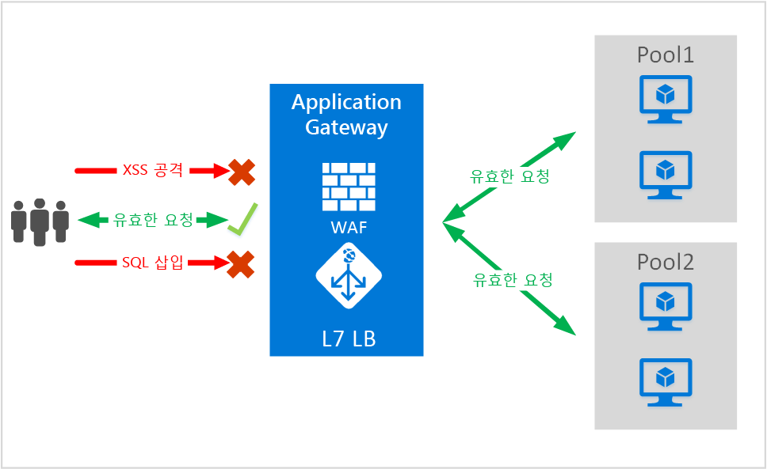
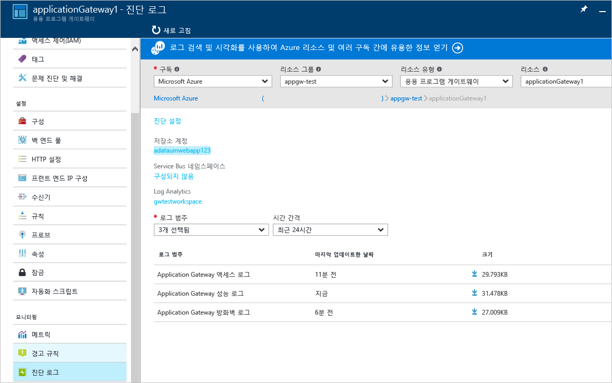

<properties
   pageTitle="Application Gateway 웹 응용 프로그램 방화벽| Microsoft Azure"
   description="이 페이지에서는 Application Gateway 웹 응용 프로그램 방화벽 기능에 대한 개요를 제공합니다."
   documentationCenter="na"
   services="application-gateway"
   authors="amsriva"
   manager="rossort"
   editor="amsriva"/>
<tags
   ms.service="application-gateway"
   ms.devlang="na"
   ms.topic="article"
   ms.tgt_pltfrm="na"
   ms.workload="infrastructure-services"
   ms.date="09/26/2016"
   ms.author="amsriva"/>

# Application Gateway 웹 응용 프로그램 방화벽(미리 보기)

웹 응용 프로그램의 널리 알려진 취약점을 악용하는 악의적인 공격이 점점 많아지고 있습니다. 이러한 공격으로는 SQL 삽입 공격, 사이트 간 스크립팅 공격 등이 있습니다. 응용 프로그램 코드로 이러한 공격을 방어하기란 매우 어려울 수 있으며 응용 프로그램 토폴로지의 여러 계층에서 엄격한 유지 관리, 패치 적용 및 모니터링이 필요할 수 있습니다. 중앙 집중식 웹 공격 보호는 훨씬 간단하며 침입 위협으로부터 응용 프로그램을 훨씬 효과적으로 보호합니다. 또한 WAF 솔루션은 각각의 웹 응용 프로그램을 보호하는 대신 중앙의 위치에서 알려진 취약점에 패치를 적용하여 보다 신속하게 보안 위협에 대응할 수 있습니다.

Application Gateway는 응용 프로그램 배달 컨트롤러로 작동하여 SSL 종료, 쿠키 기반 세션 선호도, 라운드 로빈 부하 분산, 콘텐츠 기반 라우팅, 다중 웹 사이트 호스트 및 향상된 보안 기능을 제공합니다. Application Gateway가 제공하는 향상된 보안 기능으로는 SSL 정책 관리, 종단 간 SSL 지원이 포함됩니다. 현재 ADC와 직접 통합되는 WAF(웹 응용 프로그램 방화벽)를 도입하여 서비스의 응용 프로그램 보안 기능을 강화하고 있습니다. 그 중 하나로 웹 응용 프로그램을 관리하고 일반적인 웹 취약점 공격으로부터 보호할 수 있는 구성이 용이한 중앙 위치를 제공합니다.

Application Gateway에서 WAF를 구성하면 다음과 같은 이점이 있습니다.

- 백 엔드 코드를 수정하지 않고 웹 취약점 공격으로부터 웹 응용 프로그램을 보호합니다.
- 동시에 여러 웹 응용 프로그램을 Application Gateway 뒤에 두고 보호합니다. Application Gateway는 게이트웨이 하나 뒤에 최대 20개의 웹 사이트를 호스트하여 웹 공격으로부터 보호할 수 있습니다.
- Application Gateway WAF 로그에서 생성하는 실시간 보고서를 사용하여 공격을 받는 웹 응용 프로그램을 모니터링할 수 있습니다.
- 특정 규정 준수 컨트롤은 모든 인터넷 연결 끝점을 WAF 솔루션으로 보호해야 합니다. WAF가 활성화된 Application Gateway를 사용하면 이러한 규정 준수 요구 사항을 충족할 수 있습니다.

## 개요

Application Gateway WAF는 새 SKU(WAF SKU)에 제공되며 가장 많이 발생하는 OWASP 일반 웹 취약점 공격 10가지를 기본적으로 방어하도록 ModSecurity 및 OWASP 코어 규칙 집합을 통해 사전 구성됩니다.

- SQL 삽입 공격 보호
- 교차 사이트 스크립팅 공격 보호
- 명령 삽입, HTTP 요청 밀반입, HTTP 응답 분할, 원격 파일 포함 공격 등의 일반 웹 공격 보호
- HTTP 프로토콜 위반 보호
- 누락된 호스트 사용자-에이전트 및 수락 헤더 같은 HTTP 프로토콜 이상 보호
- HTTP 초과 및 느린 HTTP DoS 방지를 포함하여 HTTP DoS 보호
- 보트, 크롤러 및 스캐너 방지
- 일반적인 응용 프로그램 구성 오류(예: Apache, IIS 등) 검색

## WAF 모드

Application Gateway WAF는 다음 두 가지 모드에서 실행되도록 구성할 수 있습니다.

- **검색 모드** – 검색 모드에서 실행되도록 구성할 경우 Application Gateway WAF는 모든 위협 경고를 로그 파일을 모니터링하고 로그 파일에 기록합니다. 진단 섹션을 사용하여 Application Gateway에 대한 진단 로깅을 켜야 합니다. 또한 WAF 로그를 선택하고 켜야 합니다.
- **방지 모드** – 방지 모드에서 실행되도록 구성할 경우 Application Gateway는 규칙에 의해 감지된 침입 및 공격을 능동적으로 차단합니다. 공격자는 403 무단 액세스 예외를 수신하고 연결이 종료됩니다. 방지 모드는 이러한 공격을 WAF 로그에 계속 기록합니다.

## Application Gateway WAF 보고서

Application Gateway WAF는 감지된 각 위협에 대한 상세 보고를 제공합니다. 로깅은 Azure 진단 로그에 통합되고 경고는 json 형식으로 기록됩니다.

    {
        "resourceId": "/SUBSCRIPTIONS/<subscriptionId>/RESOURCEGROUPS/<resourceGroupName>/PROVIDERS/MICROSOFT.NETWORK/APPLICATIONGATEWAYS/<applicationGatewayName>",
        "operationName": "ApplicationGatewayFirewall",
        "time": "2016-09-20T00:40:04.9138513Z",
        "category": "ApplicationGatewayFirewallLog",
        "properties":     {
            "instanceId":"ApplicationGatewayRole_IN_0",
            "clientIp":"108.41.16.164",
            "clientPort":1815,
            "requestUri":"/wavsep/active/RXSS-Detection-Evaluation-POST/",
            "ruleId":"OWASP_973336",
            "message":"XSS Filter - Category 1: Script Tag Vector",
            "action":"Logged",
            "site":"Global",
            "message":"XSS Filter - Category 1: Script Tag Vector",
            "details":{"message":" Warning. Pattern match "(?i)(<script","file":"/owasp_crs/base_rules/modsecurity_crs_41_xss_attacks.conf","line":"14"}}
    }

## Application Gateway WAF SKU 가격 책정

미리 보기 기간에는 Application Gateway WAF 사용에 대한 추가 비용이 없습니다. 기존의 기본 SKU 요금은 계속 청구됩니다. GA 시 WAF SKU 요금이 청구될 것입니다. WAF SKU에 Application Gateway를 배포하기로 선택한 고객은 GA 발표 이후부터 WAF SKU 요금이 누적되기 시작합니다.

## 다음 단계

WAF의 기능을 살펴본 후에는 [Application Gateway에서 웹 응용 프로그램 방화벽을 구성 하는 방법](application-gateway-web-application-firewall-portal.md)을 살펴보세요.

<!---HONumber=AcomDC_0928_2016-->