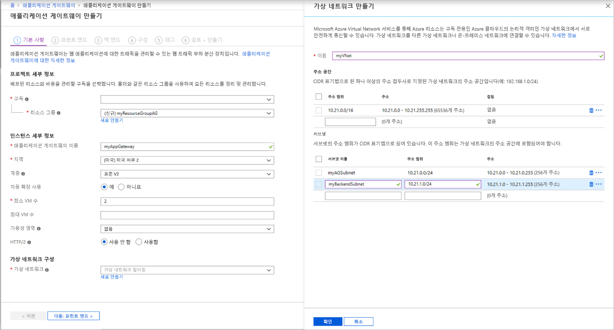
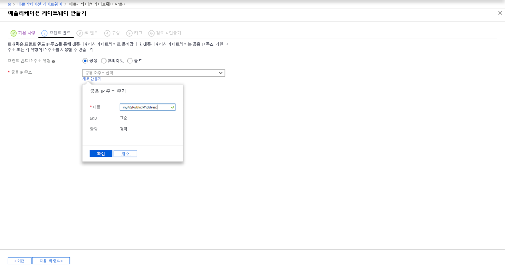
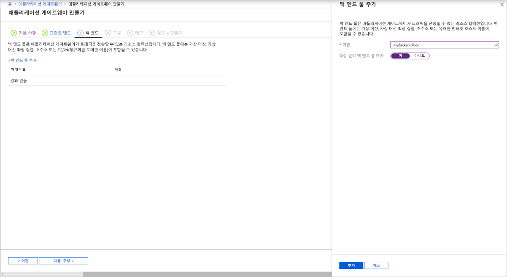
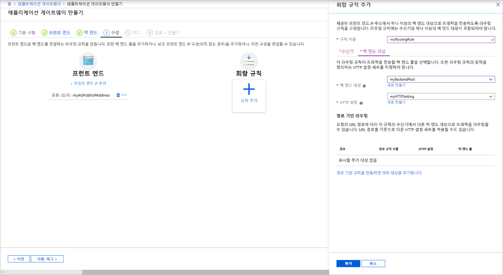

# <a name="tutorial-configure-an-application-gateway-with-ssl-termination-using-the-azure-portal"></a>자습서: Azure Portal을 사용하여 SSL 종료로 애플리케이션 게이트웨이 구성

Azure Portal을 사용하여 백 엔드 서버에 가상 머신을 사용하는 SSL 종료용 인증서가 있는 [애플리케이션 게이트웨이](overview.md)를 구성할 수 있습니다.

이 자습서에서는 다음 방법에 대해 알아봅니다.

> [!div class="checklist"]
> * 자체 서명된 인증서 만들기
> * 인증서가 있는 애플리케이션 게이트웨이 만들기
> * 백 엔드 서버로 사용되는 가상 머신 만들기
> * 애플리케이션 게이트웨이 테스트

Azure 구독이 아직 없는 경우 시작하기 전에 [체험 계정](https://azure.microsoft.com/free/?WT.mc_id=A261C142F)을 만듭니다.

[!INCLUDE [updated-for-az](../../includes/updated-for-az.md)]

## <a name="sign-in-to-azure"></a>Azure에 로그인

[https://portal.azure.com](https://portal.azure.com) 에서 Azure Portal에 로그인합니다.

## <a name="create-a-self-signed-certificate"></a>자체 서명된 인증서 만들기

이 섹션에서는 [New-SelfSignedCertificate](https://docs.microsoft.com/powershell/module/pkiclient/new-selfsignedcertificate)를 사용하여 자체 서명된 인증서를 만듭니다. 애플리케이션 게이트웨이의 수신기를 만들 때 이 인증서를 Azure Portal에 업로드합니다.

로컬 컴퓨터에서 Windows PowerShell 창을 관리자로 엽니다. 다음 명령을 실행하여 인증서를 만듭니다.

```powershell
New-SelfSignedCertificate `
  -certstorelocation cert:\localmachine\my `
  -dnsname www.contoso.com
```

다음과 같은 응답이 표시됩니다.

```
PSParentPath: Microsoft.PowerShell.Security\Certificate::LocalMachine\my

Thumbprint                                Subject
----------                                -------
E1E81C23B3AD33F9B4D1717B20AB65DBB91AC630  CN=www.contoso.com
```

[Export-PfxCertificate](https://docs.microsoft.com/powershell/module/pkiclient/export-pfxcertificate)을 인증서에서 pfx 파일을 내보내도록 반환된 지문과 함께 사용합니다.

> [!NOTE]
> .pfx 파일 암호에 특수 문자를 사용하지 마세요. 영숫자 문자만 지원됩니다.

```powershell
$pwd = ConvertTo-SecureString -String "Azure123456!" -Force -AsPlainText
Export-PfxCertificate `
  -cert cert:\localMachine\my\E1E81C23B3AD33F9B4D1717B20AB65DBB91AC630 `
  -FilePath c:\appgwcert.pfx `
  -Password $pwd
```

## <a name="create-an-application-gateway"></a>애플리케이션 게이트웨이 만들기

1. Azure Portal의 왼쪽 메뉴에서 **리소스 만들기**를 선택합니다. **새로 만들기** 창이 나타납니다.

2. **네트워킹**을 선택한 다음, **추천** 목록에서 **Application Gateway**를 선택합니다.

### <a name="basics-tab"></a>기본 사항 탭

1. **기본 사항** 탭에서 다음 애플리케이션 게이트웨이 설정에 대한 값을 입력합니다.

   - **리소스 그룹**: 리소스 그룹으로 **myResourceGroupAG**를 선택합니다. 이 리소스 그룹이 없으면 **새로 만들기**를 선택하여 새로 만듭니다.
   - **애플리케이션 게이트웨이 이름**: 애플리케이션 게이트웨이의 이름으로 *myAppGateway*를 입력합니다.

        

2.  Azure가 사용자가 만든 리소스 간에 통신하려면 가상 네트워크가 필요합니다. 새 가상 네트워크를 만들거나 기존 가상 네트워크를 선택할 수 있습니다. 이 예제에서는 애플리케이션 게이트웨이를 만들면서 새 가상 네트워크를 만듭니다. 별도의 서브넷으로 Application Gateway 인스턴스가 만들어집니다. 이 예제에서는 두 개의 서브넷을 만듭니다. 하나는 애플리케이션 게이트웨이용이고, 다른 하나는 백 엔드 서버용입니다.

    **가상 네트워크 구성**에서 **새로 만들기**를 선택하여 새 가상 네트워크를 만듭니다. **가상 네트워크 만들기** 창이 열리면 다음 값을 입력하여 가상 네트워크 및 두 개의 서브넷을 만듭니다.

    - **이름**: 가상 네트워크의 이름으로 *myVNet*을 입력합니다.

    - **서브넷 이름**(Application Gateway 서브넷): **서브넷** 표에 *Default*라는 서브넷이 표시됩니다. 이 서브넷의 이름을 *myAGSubnet*으로 변경합니다.<br>애플리케이션 게이트웨이 서브넷은 애플리케이션 게이트웨이만 포함할 수 있습니다. 다른 리소스는 허용되지 않습니다.

    - **서브넷 이름**(백 엔드 서버 서브넷): **서브넷** 표의 두 번째 행에 있는 **서브넷 이름** 열에 *myBackendSubnet*을 입력합니다.

    - **주소 범위**(백 엔드 서버 서브넷): **서브넷** 표의 두 번째 행에 *myAGSubnet*의 주소 범위와 겹치지 않는 주소 범위를 입력합니다. 예를 들어 *myAGSubnet*의 주소 범위가 10.0.0.0/24인 경우 *myBackendSubnet*의 주소 범위로 *10.0.1.0/24*를 입력합니다.

    **확인**을 선택하여 **가상 네트워크 만들기** 창을 닫고 가상 네트워크 설정을 저장합니다.

    
    
3. **기본 사항** 탭에서 다른 설정에 대한 기본값을 적용한 다음, **다음: 프런트 엔드**를 선택합니다.

### <a name="frontends-tab"></a>프런트 엔드 탭

1. **프런트 엔드** 탭에서 **프런트 엔드 IP 주소 형식**이 **퍼블릭**으로 설정되어 있는지 확인합니다. <br>사용 사례에 따라 프런트 엔드 IP를 공용 또는 프라이빗 IP로 구성할 수 있습니다. 이 예제에서는 공용 프런트 엔드 IP를 선택합니다.
   > [!NOTE]
   > Application Gateway v2 SKU의 경우 **공용** 프런트 엔드 IP 구성만 선택할 수 있습니다. 프라이빗 프런트 엔드 IP 구성은 현재 v2 SKU에서 사용할 수 없습니다.

2. **퍼블릭 IP 주소**에 대해 **새로 만들기**를 선택하고 퍼블릭 IP 주소 이름으로 *myAGPublicIPAddress*를 입력한 후 **확인**을 선택합니다. 

   

3. 완료되면 **다음: 백 엔드**를 선택합니다.

### <a name="backends-tab"></a>백 엔드 탭

백 엔드 풀은 요청을 처리하는 백 엔드 서버로 요청을 라우팅하는 데 사용됩니다. 백 엔드 풀은 NIC, 가상 머신 확장 집합, 공용 IP, 내부 IP, FQDN(정규화된 도메인 이름) 및 다중 테넌트 백 엔드(예: Azure App Service)로 구성될 수 있습니다. 이 예제에서는 애플리케이션 게이트웨이가 있는 빈 백 엔드 풀을 만든 다음, 백 엔드 대상을 백 엔드 풀에 추가합니다.

1. **백 엔드** 탭에서 **+백 엔드 풀 추가**를 선택합니다.

2. 열리는 **백 엔드 풀 추가** 창에서 다음 값을 입력하여 빈 백 엔드 풀을 만듭니다.

    - **이름**: 백 엔드 풀의 이름으로 *myBackendPool*을 입력합니다.
    - **대상 없이 백 엔드 풀 추가**: 대상이 없는 백 엔드 풀을 만들려면 **예**를 선택합니다. 애플리케이션 게이트웨이를 만든 후에 백 엔드 대상을 추가합니다.

3. **백 엔드 풀 추가** 창에서 **추가**를 선택하여 백 엔드 풀 구성을 저장하고 **백 엔드** 탭으로 돌아갑니다.

   

4. **백 엔드** 탭에서 **다음: 구성**을 선택합니다.

### <a name="configuration-tab"></a>구성 탭

**구성** 탭에서 라우팅 규칙을 사용하여 만든 프런트 엔드 및 백 엔드 풀을 연결합니다.

1. **라우팅 규칙** 열에서 **규칙 추가**를 선택합니다.

2. 열리는 **라우팅 규칙 추가** 창에서 **규칙 이름**으로 *myRoutingRule*을 입력합니다.

3. 라우팅 규칙에는 수신기가 필요합니다. **라우팅 규칙 추가** 창 내의 **수신기** 탭에서 수신기에 대해 다음 값을 입력합니다.

    - **수신기 이름**: 수신기 이름으로 *myListener*를 입력합니다.
    - **프런트 엔드 IP**: **퍼블릭**을 선택하여 프런트 엔드에 대해 만든 퍼블릭 IP를 선택합니다.
    - **프로토콜**: **HTTPS**를 선택합니다.
    - **포트**: 포트에 443을 입력합니다.

   **HTTPS 인증서**에서 다음을 수행합니다.

   - **PFX 인증서 파일** - 앞에서 만든 c:\appgwcert.pfx 파일을 찾아 선택합니다.
   - **인증서 이름** - 인증서 이름으로 *mycert1*을 입력합니다.
   - **암호** - *Azure123456!* 를 입력합니다. 암호
  
        **수신기** 탭에서 다른 설정에 대해 기본값을 그대로 적용한 다음, **백 엔드 대상** 탭을 선택하여 나머지 라우팅 규칙을 구성합니다.

   

4. **백 엔드 대상** 탭에서 **백 엔드 대상**으로 **myBackendPool**을 선택합니다.

5. **Http 설정**에서 **새로 만들기**를 선택하여 새 HTTP 설정을 만듭니다. HTTP 설정에 따라 라우팅 규칙의 동작이 결정됩니다. 열리는 **HTTP 설정 추가** 창에서 **HTTP 설정 이름**으로 *myHTTPSetting*을 입력합니다. **HTTP 설정 추가** 창에서 다른 설정에 대해 기본값을 그대로 적용한 다음, **추가**를 선택하여 **라우팅 규칙 추가** 창으로 돌아옵니다. 

   

6. **라우팅 규칙 추가** 창에서 **추가**를 선택하여 라우팅 규칙을 저장하고 **구성** 탭으로 돌아옵니다.

   

7. 완료되면 **다음: 태그**를 선택하고 **다음: 리뷰 + 만들기**를 클릭합니다.

### <a name="review--create-tab"></a>리뷰 + 만들기 탭

**리뷰 + 만들기** 탭에서 설정을 검토한 다음, **만들기**를 선택하여 가상 네트워크, 공용 IP 주소 및 애플리케이션 게이트웨이를 만듭니다. Azure가 애플리케이션 게이트웨이를 만들 때까지 몇 분 정도 걸릴 수 있습니다. 배포가 성공적으로 완료될 때까지 기다렸다가 다음 섹션으로 이동합니다.

## <a name="add-backend-targets"></a>백 엔드 대상 추가

이 예제에서는 가상 머신을 대상 백 엔드로 사용합니다. 기존 가상 머신을 사용해도 되고 새로 만들어도 됩니다. Azure에서 애플리케이션 게이트웨이의 백 엔드 서버로 사용할 두 개의 가상 머신을 만듭니다.

이 작업을 수행하려면 다음이 필요합니다.

1. 백 엔드 서버로 사용할 VM 2개, *myVM* 및 *myVM2*를 만듭니다.
2. 애플리케이션 게이트웨이가 성공적으로 만들어졌는지 확인하기 위해 가상 머신에 IIS를 설치합니다.
3. 백 엔드 서버를 백 엔드 풀에 추가합니다.

### <a name="create-a-virtual-machine"></a>가상 머신 만들기

1. Azure Portal에서 **리소스 만들기**를 선택합니다. **새로 만들기** 창이 나타납니다.
2. **인기** 목록에서 **Windows Server 2016 Datacenter**를 선택합니다. **가상 머신 만들기** 페이지가 표시됩니다.

   Application Gateway는 백 엔드 풀에서 사용한 가상 머신 유형에 관계없이 트래픽을 라우팅할 수 있습니다. 이 예제에서는 Windows Server 2016 Datacenter를 사용합니다.

1. **기본 사항** 탭에서 다음 가상 머신 설정의 값을 입력합니다.

    - **리소스 그룹**: 리소스 그룹 이름으로 **myResourceGroupAG**를 선택합니다.
    - **가상 머신 이름**: 가상 머신의 이름으로 *myVM*을 입력합니다.
    - **사용자 이름**: 관리자 사용자 이름으로 *azureuser*를 입력합니다.
    - **암호**: 관리자 암호로 *Azure123456!* 를 입력합니다.
4. 나머지는 기본값으로 두고 **다음: 디스크**를 선택합니다.  
5. **디스크** 탭을 기본값으로 두고 **다음: 네트워킹**을 선택합니다.
6. **네트워킹** 탭에서 **가상 네트워크**로 **myVNet**이 선택되었고 **서브넷**이 **myBackendSubnet**으로 설정되었는지 확인합니다. 나머지는 기본값으로 두고 **다음: 관리**를 선택합니다.

   Application Gateway는 가상 네트워크 외부의 인스턴스와 통신할 수 있지만, IP가 연결되어야 합니다.
1. **관리** 탭에서 **부트 진단**을 **해제**합니다. 나머지는 기본값으로 두고 **검토 + 만들기**를 선택합니다.
2. **검토 + 만들기** 탭에서 설정을 검토하고, 유효성 검사 오류를 수정하고, **만들기**를 선택합니다.
3. 배포가 완료될 때까지 기다렸다가 계속 진행합니다.

### <a name="install-iis-for-testing"></a>테스트를 위해 IIS 설치

이 예제에서는 Azure가 애플리케이션 게이트웨이를 성공적으로 만들었는지만 확인할 목적으로 가상 머신에 IIS를 설치합니다.

1. [Azure PowerShell](https://docs.microsoft.com/azure/cloud-shell/quickstart-powershell)을 엽니다. 이렇게 하려면 Azure Portal의 위쪽 탐색 모음에서 **Cloud Shell**을 선택한 다음, 드롭다운 목록에서 **PowerShell**을 선택합니다. 

    

2. 다음 명령을 실행하여 가상 머신에 IIS를 설치합니다. 

   ```azurepowershell-interactive
          Set-AzVMExtension `
            -ResourceGroupName myResourceGroupAG `
            -ExtensionName IIS `
            -VMName myVM `
            -Publisher Microsoft.Compute `
            -ExtensionType CustomScriptExtension `
            -TypeHandlerVersion 1.4 `
            -SettingString '{"commandToExecute":"powershell Add-WindowsFeature Web-Server; powershell Add-Content -Path \"C:\\inetpub\\wwwroot\\Default.htm\" -Value $($env:computername)"}' `
            -Location EastUS
   ```

3. 앞에서 완료한 단계를 사용하여 두 번째 가상 머신을 만들고 IIS를 설치합니다. 가상 머신 이름에 *myVM2*를 사용하고, **VMName** 설정에 **Set-AzVMExtension** cmdlet을 사용합니다.

### <a name="add-backend-servers-to-backend-pool"></a>백 엔드 풀에 백 엔드 서버 추가

1. **모든 리소스**를 선택한 다음, **myAppGateway**를 선택합니다.

2. 왼쪽 메뉴에서 **백 엔드 풀**을 선택합니다.

3. **myBackendPool**을 선택합니다.

4. **대상** 아래의 드롭다운 메뉴에서 **가상 머신**을 선택합니다.

5. **가상 머신** 및 **네트워크 인터페이스** 아래의 드롭다운 목록에서 가상 머신 **myVM** 및 **myVM2**, 그리고 가상 머신과 연결된 네트워크 인터페이스를 선택합니다.

    

6. **저장**을 선택합니다.

7. 배포가 완료될 때까지 기다렸다가 다음 단계로 진행합니다.

## <a name="test-the-application-gateway"></a>애플리케이션 게이트웨이 테스트

1. **모든 리소스**를 선택한 다음, **myAGPublicIPAddress**를 선택합니다.

    

2. 브라우저의 주소 표시줄에 *https://\<애플리케이션 게이트웨이 ip 주소\>* 를 입력 합니다.

   자체 서명된 인증서를 사용하는 경우 보안 경고를 수락하려면 **세부 정보**(또는 Chrome의 **Advanced**)를 선택하고, 다음 웹 페이지로 이동합니다.

    

    그러면 보안 IIS 웹 사이트가 다음 예제와 같이 표시됩니다.

    

## <a name="next-steps"></a>다음 단계

> [!div class="nextstepaction"]
> [Application Gateway SSL 지원에 대한 자세한 정보](ssl-overview.md)
