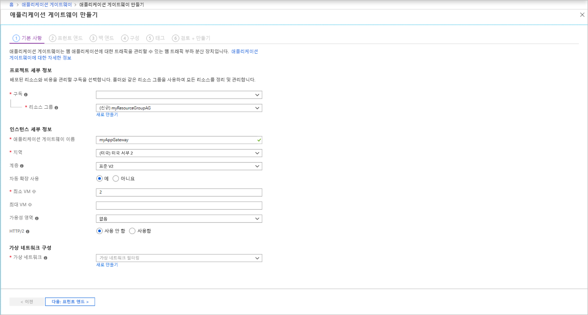

# <a name="tutorial-create-an-application-gateway-with-path-based-routing-rules-using-the-azure-portal"></a>자습서: Azure Portal을 사용하여 경로 기반 회람 규칙을 사용하여 애플리케이션 게이트웨이 만들기

Azure Portal을 사용하여 [애플리케이션 게이트웨이](application-gateway-introduction.md)를 만들 때 [URL 경로 기반 회람 규칙](application-gateway-url-route-overview.md)을 구성할 수 있습니다. 이 자습서에서는 가상 머신을 사용하여 백 엔드 풀을 만듭니다. 그런 다음, 웹 트래픽이 풀의 적절한 서버에 도착하도록 하는 라우팅 규칙을 만듭니다.

이 문서에서는 다음 방법을 설명합니다.

> [!div class="checklist"]
> * 애플리케이션 게이트웨이 만들기
> * 백 엔드 서버용 가상 머신 만들기
> * 백 엔드 서버로 백 엔드 풀 만들기
> * 백 엔드 수신기 만들기
> * 경로 기반 라우팅 규칙 만들기


Azure 구독이 아직 없는 경우 시작하기 전에 [체험 계정](https://azure.microsoft.com/free/?WT.mc_id=A261C142F)을 만듭니다.

[!INCLUDE [updated-for-az](../../includes/updated-for-az.md)]

## <a name="sign-in-to-azure"></a>Azure에 로그인

[https://portal.azure.com](https://portal.azure.com) 에서 Azure Portal에 로그인합니다.

## <a name="create-virtual-machines"></a>가상 머신 만들기

이 예제에서는 애플리케이션 게이트웨이의 백 엔드 서버로 사용될 세 개의 가상 머신을 만듭니다. 또한 가상 머신에 IIS를 설치하여 애플리케이션 게이트웨이가 예상대로 작동하는지 확인합니다.

1. Azure Portal에서 **리소스 만들기**를 선택합니다.
2. 인기 목록에서 **Windows Server 2016 Datacenter**를 선택합니다.
3. 가상 머신에 대해 다음 값을 입력합니다.

    - **리소스 그룹**, **새로 만들기**를 선택한 다음, *myResourceGroupAG*를 입력합니다.
    - **가상 머신 이름**: *myVM1*
    - **지역**: *(미국) 미국 동부*
    - **사용자 이름**: *azureuser*
    - **암호**: *Azure123456!* -


4. **다음: 디스크**를 선택합니다.
5. **다음: 네트워킹**을 선택합니다.
6. **가상 네트워크**의 경우 **새로 만들기**를 선택한 다음, 가상 네트워크의 다음 값을 입력합니다.

   - *myVNet* - 가상 네트워크 이름
   - *10.0.0.0/16* - 가상 네트워크 주소 공간
   - *myBackendSubnet* - 첫 번째 서브넷 이름
   - *10.0.1.0/24* - 서브넷 주소 공간
   - *myAGSubnet* - 두 번째 서브넷 이름
   - *10.0.0.0/24* - 서브넷 주소 공간
7. **확인**을 선택합니다.

8. **네트워크 인터페이스** 아래에서 서브넷에 대해 **myBackendSubnet**이 선택되었는지 확인한 다음, **다음: 관리**를 선택합니다.
9. **끄기**를 선택하여 부팅 진단을 사용하지 않도록 설정합니다.
10. **검토 + 만들기**를 클릭하고, 요약 페이지에서 설정을 검토한 다음, **만들기**를 선택합니다.
11. *myVM2* 및 *myVM3*의 가상 머신을 두 개 더 만들고 *MyVNet* 가상 네트워크 및 *myBackendSubnet* 서브넷에 배치합니다.

### <a name="install-iis"></a>IIS 설치

1. 대화형 셸을 열고 **PowerShell**로 설정되어 있는지 확인합니다.

    

2. 다음 명령을 실행하여 가상 머신에 IIS를 설치합니다. 

    ```azurepowershell
         $publicSettings = @{ "fileUris" = (,"https://raw.githubusercontent.com/Azure/azure-docs-powershell-samples/master/application-gateway/iis/appgatewayurl.ps1");  "commandToExecute" = "powershell -ExecutionPolicy Unrestricted -File appgatewayurl.ps1" }

        Set-AzVMExtension `
         -ResourceGroupName myResourceGroupAG `
         -Location eastus `
         -ExtensionName IIS `
         -VMName myVM1 `
         -Publisher Microsoft.Compute `
         -ExtensionType CustomScriptExtension `
         -TypeHandlerVersion 1.4 `
         -Settings $publicSettings
    ```

3. 가상 머신을 두 개 더 만들고 방금 완료한 단계를 사용하여 IIS를 설치합니다. Set-AzVMExtension에서 VMName의 이름과 값으로 *myVM2* 및 *myVM3*를 입력합니다.

## <a name="create-an-application-gateway"></a>애플리케이션 게이트웨이 만들기

1. Azure Portal의 왼쪽 메뉴에서 **리소스 만들기**를 선택합니다. **새로 만들기** 창이 나타납니다.

2. **네트워킹**을 선택한 다음, **추천** 목록에서 **Application Gateway**를 선택합니다.

### <a name="basics-tab"></a>기본 사항 탭

1. **기본 사항** 탭에서 다음 애플리케이션 게이트웨이 설정에 대한 값을 입력합니다.

   - **리소스 그룹**: 리소스 그룹으로 **myResourceGroupAG**를 선택합니다.
   - **애플리케이션 게이트웨이 이름**: 애플리케이션 게이트웨이의 이름으로 *myAppGateway*를 입력합니다.
   - **지역** - **(미국) 미국 동부**를 선택합니다.

        

2.  **가상 네트워크 구성**에서 가상 네트워크 이름으로 **myVNet**을 선택합니다.
3. 서브넷에 대해 **myAGSubnet**을 선택합니다.
3. 다른 설정은 기본값을 적용한 다음, **다음: 프런트 엔드**를 선택합니다.

### <a name="frontends-tab"></a>프런트 엔드 탭

1. **프런트 엔드** 탭에서 **프런트 엔드 IP 주소 형식**이 **퍼블릭**으로 설정되어 있는지 확인합니다.

   > [!NOTE]
   > Application Gateway v2 SKU의 경우 **공용** 프런트 엔드 IP 구성만 선택할 수 있습니다. 프라이빗 프런트 엔드 IP 구성은 현재 v2 SKU에서 사용할 수 없습니다.

2. **퍼블릭 IP 주소**에 대해 **새로 만들기**를 선택하고 퍼블릭 IP 주소 이름으로 *myAGPublicIPAddress*를 입력한 후 **확인**을 선택합니다. 
3. 완료되면 **다음: 백 엔드**를 선택합니다.

### <a name="backends-tab"></a>백 엔드 탭

백 엔드 풀은 요청을 처리하는 백 엔드 서버로 요청을 라우팅하는 데 사용됩니다. 백 엔드 풀은 NIC, 가상 머신 확장 집합, 공용 IP, 내부 IP, FQDN(정규화된 도메인 이름) 및 다중 테넌트 백 엔드(예: Azure App Service)로 구성될 수 있습니다.

1. **백 엔드** 탭에서 **+백 엔드 풀 추가**를 선택합니다.

2. 열리는 **백 엔드 풀 추가** 창에서 다음 값을 입력하여 빈 백 엔드 풀을 만듭니다.

    - **Name**: 백 엔드 풀의 이름으로 *myBackendPool*을 입력합니다.
3. **백 엔드 대상**, **대상 유형** 아래의 드롭다운 목록에서 **가상 머신**을 선택합니다.

5. **대상**에서 **myVM1**에 대한 네트워크 인터페이스를 선택합니다.
6. **추가**를 선택합니다.
7. 대상으로 *myVM2*를 사용하여 *이미지* 백 엔드 풀을 추가하고, 대상으로 *myVM3*을 사용하여 *비디오* 백 엔드 풀을 추가하도록 반복합니다.
8. **추가**를 선택하여 백 엔드 풀 구성을 저장하고 **백 엔드** 탭으로 돌아갑니다.

4. **백 엔드** 탭에서 **다음: 구성**을 선택합니다.

### <a name="configuration-tab"></a>구성 탭

**구성** 탭에서 라우팅 규칙을 사용하여 만든 프런트 엔드 및 백 엔드 풀을 연결합니다.

1. **라우팅 규칙** 열에서 **규칙 추가**를 선택합니다.

2. 열리는 **라우팅 규칙 추가** 창에서 **규칙 이름**으로 *myRoutingRule*을 입력합니다.

3. 라우팅 규칙에는 수신기가 필요합니다. **라우팅 규칙 추가** 창 내의 **수신기** 탭에서 수신기에 대해 다음 값을 입력합니다.

    - **수신기 이름**: 수신기 이름으로 *myListener*를 입력합니다.
    - **프런트 엔드 IP**: **퍼블릭**을 선택하여 프런트 엔드에 대해 만든 퍼블릭 IP를 선택합니다.
    - **포트**: 유형 *8080*
  
        **수신기** 탭에서 다른 설정에 대해 기본값을 그대로 적용한 다음, **백 엔드 대상** 탭을 선택하여 나머지 라우팅 규칙을 구성합니다.

4. **백 엔드 대상** 탭에서 **백 엔드 대상**으로 **myBackendPool**을 선택합니다.

5. **Http 설정**에서 **새로 만들기**를 선택하여 새 HTTP 설정을 만듭니다. HTTP 설정에 따라 라우팅 규칙의 동작이 결정됩니다. 

6. 열리는 **HTTP 설정 추가** 창에서 **HTTP 설정 이름**으로 *myHTTPSetting*을 입력합니다. **HTTP 설정 추가** 창에서 다른 설정에 대해 기본값을 그대로 적용한 다음, **추가**를 선택하여 **라우팅 규칙 추가** 창으로 돌아옵니다.
7. **경로 기반 라우팅**에서 **경로 기반 규칙을 만들려면 여러 대상을 추가합니다**를 선택합니다.
8. **경로**에 */images/* \*를 입력합니다.
9. **경로 규칙 이름**에 *이미지*를 입력합니다.
10. **HTTP 설정**에 대해 **myHTTPSetting**을 선택합니다.
11. **백 엔드 대상**에 대해 **이미지**를 선택합니다.
12. **추가**를 선택하여 경로 규칙을 저장하고 **라우팅 규칙 추가** 탭으로 돌아갑니다.
13. 비디오에 대한 다른 규칙을 추가하도록 반복합니다.
14. **추가**를 선택하여 라우팅 규칙을 추가하고 **구성** 탭으로 돌아갑니다.
15. 완료되면 **다음: 태그**를 선택하고 **다음: 리뷰 + 만들기**를 클릭합니다.

> [!NOTE]
> 기본 사례를 처리하기 위해 사용자 지정 */* * 경로 규칙을 추가할 필요는 없습니다. 이는 기본 백 엔드 풀에 의해 자동으로 처리됩니다.

### <a name="review--create-tab"></a>리뷰 + 만들기 탭

**리뷰 + 만들기** 탭에서 설정을 검토한 다음, **만들기**를 선택하여 가상 네트워크, 공용 IP 주소 및 애플리케이션 게이트웨이를 만듭니다. Azure가 애플리케이션 게이트웨이를 만들 때까지 몇 분 정도 걸릴 수 있습니다. 배포가 성공적으로 완료될 때까지 기다렸다가 다음 섹션으로 이동합니다.


## <a name="test-the-application-gateway"></a>애플리케이션 게이트웨이 테스트

1. **모든 리소스**를 선택한 다음, **myAppGateway**를 선택합니다.

    

2. 공용 IP 주소를 복사하여 브라우저의 주소 표시줄에 붙여넣습니다. 예: http:\//52.188.72.175:8080

    

   포트 8080의 수신기는 이 요청을 기본 백 엔드 풀로 라우팅합니다.

3. URL을 *http://&lt;ip-address&gt;:8080/images/test.htm*으로 변경하고 &lt;ip-address&gt;를 해당 IP 주소로 바꾸면 다음 예제와 비슷한 내용이 표시됩니다.

    

   포트 8080의 수신기는 이 요청을 *이미지* 백 엔드 풀로 라우팅합니다.

4. URL을 *http://&lt;ip-address&gt;:8080/video/test.htm*으로 변경하고 &lt;ip-address&gt;를 해당 IP 주소로 바꾸면 다음 예제와 비슷한 내용이 표시됩니다.

    

   포트 8080의 수신기는 이 요청을 *비디오* 백 엔드 풀로 라우팅합니다.


## <a name="next-steps"></a>다음 단계

- [Azure Application Gateway에서 엔드투엔드 TLS 사용](application-gateway-backend-ssl.md)
