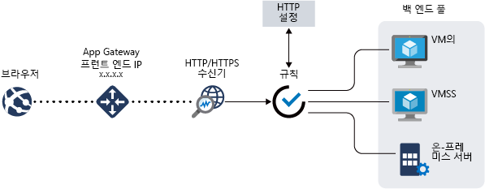

# Azure 애플리케이션 게이트웨이 기능

[Azure Application Gateway](overview.md)는 웹 애플리케이션에 대한 트래픽을 관리할 수 있도록 하는 웹 트래픽 부하 분산 장치입니다.

Application Gateway에는 다음과 같은 기능이 포함 되어 있습니다.

- [SSL(Secure Sockets Layer) (SSL/TLS) 종료](#secure-sockets-layer-ssltls-termination)
- [배율이](#autoscaling)
- [영역 중복성](#zone-redundancy)
- [정적 VIP](#static-vip)
- [웹 애플리케이션 방화벽](#web-application-firewall)
- [AKS에 대 한 수신 컨트롤러](#ingress-controller-for-aks)
- [URL 기반 라우팅](#url-based-routing)
- [다중 사이트 호스팅](#multiple-site-hosting)
- [리디렉션](#redirection)
- [세션 선호도](#session-affinity)
- [Websocket 및 HTTP/2 트래픽](#websocket-and-http2-traffic)
- [연결 드레이닝](#connection-draining)
- [사용자 지정 오류 페이지](#custom-error-pages)
- [HTTP 헤더 다시 작성](#rewrite-http-headers)
- [크기 조정](#sizing)

## SSL(Secure Sockets Layer)/TLS 종료

Application Gateway는 게이트웨이에서 SSL/TLS 종료를 지원합니다. 그 후의 트래픽은 일반적으로 암호화되지 않은 상태로 백 엔드 서버로 흐릅니다. 이 기능을 사용하면 비용이 많이 드는 암호화 및 암호 해독 오버헤드로부터 웹 서버의 부담을 줄일 수 있습니다. 그러나 서버에 대 한 암호화 되지 않은 통신은 적합 한 옵션이 아닙니다. 이는 보안 요구 사항, 규정 준수 요구 사항 또는 애플리케이션에서 보안 연결만 수락할 수 있기 때문일 수 있습니다. 이러한 애플리케이션의 경우 Application Gateway에서 엔드투엔드 SSL/TLS 암호화를 지원합니다.

자세한 내용은 [Application Gateway를 사용 하 여 ssl 종료 및 종단 간 Ssl 개요](ssl-overview.md) 를 참조 하세요.

## 자동 확장

Application Gateway Standard_v2는 자동 크기 조정을 지원 하며 트래픽 부하 패턴을 변경 하는 방식으로 확장 하거나 축소할 수 있습니다. 또한 자동 크기 조정을 사용하면 프로비전 시 배포 크기 또는 인스턴스 수를 선택할 필요가 없습니다. 

Application Gateway Standard_v2 기능에 대 한 자세한 내용은 [V2 SKU](application-gateway-autoscaling-zone-redundant.md)자동 크기 조정을 참조 하세요.

## 영역 중복

Standard_v2 Application Gateway 여러 가용성 영역 확장할 수 있으며, 더 나은 오류 복원 력을 제공 하 고 각 영역에 별도의 응용 프로그램 게이트웨이를 프로 비전 할 필요가 없습니다.

## 정적 VIP

Application gateway Standard_v2 SKU는 정적 VIP 유형만 지원 합니다. 이를 통해 Application Gateway와 연결된 VIP가 애플리케이션 게이트웨이의 수명 동안 변경되지 않도록 보장합니다.

## 웹 애플리케이션 방화벽

WAF (웹 응용 프로그램 방화벽)는 일반적인 악용 및 취약성 으로부터 웹 응용 프로그램에 대 한 중앙 집중식 보호를 제공 하는 서비스입니다. WAF는 [OWASP(Open Web Application Security Project) 핵심 규칙 집합](https://www.owasp.org/index.php/Category:OWASP_ModSecurity_Core_Rule_Set_Project) 3.1(WAF_v2만 해당), 3.0 또는 2.2.9의 규칙에 기반합니다. 

웹 애플리케이션의 널리 알려진 취약점을 악용하는 악의적인 공격이 점점 많아지고 있습니다. 이러한 공격으로는 SQL 삽입 공격, 사이트 간 스크립팅 공격 등이 있습니다. 애플리케이션 코드로 이러한 공격을 방어하기란 매우 어려울 수 있으며 애플리케이션 토폴로지의 다양한 계층에서 엄격한 유지 관리, 패치 적용 및 모니터링이 필요할 수 있습니다. 중앙 집중식 웹 애플리케이션 방화벽을 통해 보안 관리가 훨씬 간단해지고 애플리케이션 관리자에게 위협 또는 침입으로부터 효과적인 보호를 제공합니다. 또한 WAF 솔루션은 각각의 웹 애플리케이션을 보호하는 대신 중앙의 위치에서 알려진 취약점에 패치를 적용하여 보다 신속하게 보안 위협에 대응할 수 있습니다. 기존 응용 프로그램 게이트웨이를 웹 응용 프로그램 방화벽을 사용 하는 application gateway로 쉽게 변환할 수 있습니다.

자세한 내용은 [Azure Web Application Firewall이란?](../web-application-firewall/overview.md)를 참조하세요.

## AKS용 Ingress Controller
AGIC(Application Gateway Ingress Controller)에서는 Application Gateway를 [AKS(Azure Kubernetes Service)](https://azure.microsoft.com/services/kubernetes-service/) 클러스터용 Ingress Controller로 사용할 수 있습니다. 

수신 컨트롤러는 AKS 클러스터 내에서 pod로 실행 되며 [Kubernetes 수신 리소스](https://kubernetes.io/docs/concepts/services-networking/ingress/) 를 사용 하 여 게이트웨이를 Kubernetes pod에 대 한 트래픽 부하를 분산할 수 있도록 하는 Application Gateway 구성으로 변환 합니다. 수신 컨트롤러는 Application Gateway Standard_v2 및 WAF_v2 SKU만 지원합니다. 

자세한 내용은 [AGIC(Application Gateway Ingress Controller)](ingress-controller-overview.md)를 참조하세요.

## URL 기반 라우팅

URL 경로 기반 라우팅을 사용하여 요청의 URL 경로에 따라 트래픽을 백 엔드 서버 풀로 라우팅할 수 있습니다. 시나리오 중 하나는 여러 콘텐츠 형식에 대한 요청을 서로 다른 풀로 라우팅하는 것입니다.

예를 들어 `http://contoso.com/video/*`에 대한 요청은 VideoServerPool로 라우팅되고, `http://contoso.com/images/*`에 대한 요청은 ImageServerPool로 라우팅됩니다. 경로 패턴과 일치하는 항목이 없는 경우 DefaultServerPool이 선택됩니다.

자세한 내용은 [URL 경로 기반 라우팅 개요](url-route-overview.md)를 참조 하세요.

## 다중 사이트 호스팅

다중 사이트 호스팅을 통해 동일한 애플리케이션 게이트웨이 인스턴스에서 둘 이상의 웹 사이트를 구성할 수 있습니다. 이 기능을 사용 하면 최대 100 대의 웹 사이트를 하나의 Application Gateway (최적의 성능)에 추가 하 여 배포에 대 한 보다 효율적인 토폴로지를 구성할 수 있습니다. 각 웹 사이트는 고유한 풀로 이동할 수 있습니다. 예를 들어 애플리케이션 게이트웨이는 ContosoServerPool 및 FabrikamServerPool이라는 두 개의 서버 풀에서 `contoso.com` 및 `fabrikam.com`에 대한 트래픽을 사용할 수 있습니다.

`http://contoso.com`에 대한 요청은 ContosoServerPool로 라우팅되고, `http://fabrikam.com`에 대한 요청은 FabrikamServerPool로 라우팅됩니다.

마찬가지로 같은 부모 도메인의 하위 도메인 두 개를 동일한 애플리케이션 게이트웨이 배포에서 호스트할 수 있습니다. 하위 도메인을 사용하는 예제에는 단일 Application Gateway 배포에 호스팅되는 `http://blog.contoso.com` 및 `http://app.contoso.com`이 포함됩니다.

자세한 내용은 [여러 사이트 호스팅 Application Gateway](multiple-site-overview.md)를 참조 하세요.

## 리디렉션

일반적으로 여러 웹 애플리케이션에서 자동 HTTP - HTTPS 리디렉션을 지원하여 애플리케이션 및 해당 사용자 간 모든 통신이 암호화된 경로를 통해 이루어지도록 합니다.

이전에는 HTTP에서 수신하는 요청을 HTTPS로 리디렉션하는 것이 유일한 목적인 전용 풀 만들기와 같은 기술을 사용했습니다. Application Gateway에서 Application Gateway의 트래픽을 리디렉션하는 기능을 지원합니다. 이를 통해 애플리케이션 구성이 간소화되고, 리소스 사용이 최적화되고, 전역 및 경로 기반 리디렉션을 비롯한 새로운 리디렉션 시나리오가 지원됩니다. Application Gateway 리디렉션 지원은 HTTP - HTTPS 리디렉션으로만 제한되지 않습니다. 이는 일반 리디렉션 메커니즘이므로 규칙을 사용하여 정의하는 모든 포트 간에서 리디렉션할 수 있습니다. 외부 사이트로의 리디렉션도 지원합니다.

Application Gateway 리디렉션 지원에서는 다음과 같은 기능을 제공합니다.

- Gateway의 한 포트에서 다른 포트로의 전역 리디렉션. 한 사이트에서 HTTP - HTTPS 리디렉션이 가능합니다.
- 경로 기반 리디렉션. 이러한 종류의 리디렉션에서는 `/cart/*`로 표시되는 쇼핑 카트 영역과 같이 특정 사이트 영역에서만 HTTP - HTTPS 리디렉션이 가능합니다.
- 외부 사이트로 리디렉션.

자세한 내용은 [Application Gateway 리디렉션 개요](redirect-overview.md)를 참조 하세요.

## 세션 선호도

쿠키 기반 세션 선호도 기능은 동일한 서버에서 사용자 세션을 유지하려는 경우에 유용합니다. Application Gateway는 게이트웨이 관리형 쿠키를 사용하여 사용자 세션에서 동일한 서버에 후속 트래픽을 처리하도록 지시할 수 있습니다. 이는 세션 상태가 사용자 세션의 서버에 로컬로 저장된 경우에 특히 중요합니다.

자세한 내용은 [응용 프로그램 게이트웨이의 작동](how-application-gateway-works.md#modifications-to-the-request)원리를 참조 하세요.

## Websocket 및 HTTP/2 트래픽

Application Gateway는 WebSocket 및 HTTP/2 프로토콜에 대한 네이티브 지원을 제공합니다. WebSocket 지원을 선택적으로 사용하거나 사용하지 않도록 설정하는 사용자 구성 가능 설정은 없습니다.

WebSocket 및 HTTP/2 프로토콜을 사용하면 장기 실행 TCP 연결을 통해 서버와 클라이언트 간의 전이중 통신을 수행할 수 있습니다. 이를 사용하면 웹 서버와 클라이언트 간의 대화형 통신이 가능하며, HTTP 기반 구현에서 필요에 따라 폴링하지 않고도 양방향 통신을 수행할 수 있습니다. 이러한 프로토콜은 HTTP와 달리 오버 헤드가 낮고 여러 요청/응답에 동일한 TCP 연결을 다시 사용 하 여 리소스를 보다 효율적으로 활용할 수 있습니다. 이러한 프로토콜은 기존의 HTTP 포트 80 및 443을 통해 작동하도록 디자인되었습니다.

자세한 내용은 [WebSocket 지원](application-gateway-websocket.md) 및 [HTTP/2 지원](configuration-overview.md#http2-support)을 참조하세요.

## 연결 드레이닝

연결 드레이닝은 예정된 서비스 업데이트 중에 백 엔드 풀 멤버를 정상적으로 제거하는 데 도움이 됩니다. 이 설정은 백 엔드 http 설정을 통해 사용이 가능하며 규칙을 만드는 동안 백 엔드 풀의 모든 멤버에 적용할 수 있습니다. 사용 하도록 설정 하면 기존 요청이 구성 된 시간 제한 내에 완료 되도록 허용 하는 동안 백 엔드 풀의 모든 있음이 인스턴스가 새 요청 Application Gateway을 수신 하지 않도록 합니다. 이는 사용자 구성 변경에 의해 백엔드 풀에서 명시적으로 제거된 백 엔드 인스턴스와 상태 프로브에 의해 확인된 대로 비정상 상태로 보고된 백엔드 인스턴스에 모두 적용됩니다. 이에 대 한 유일한 예외는 있음이 인스턴스에 대해 바인딩되는 요청이 며,이는 게이트웨이 관리 세션 선호도로 인해 명시적으로 등록 취소 되 고 있음이 인스턴스로 계속 프록시 되기 때문입니다.

자세한 내용은 [Application Gateway 구성 개요](configuration-overview.md#connection-draining)를 참조 하세요.

## 사용자 지정 오류 페이지

Application Gateway를 사용하면 기본 오류 페이지를 표시하는 대신 사용자 지정 오류 페이지를 만들 수 있습니다. 사용자 지정 오류 페이지를 사용하여 자체 브랜딩과 레이아웃을 사용할 수 있습니다.

자세한 내용은 [사용자 지정 오류](custom-error.md)를 참조하세요.

## HTTP 헤더 다시 쓰기

HTTP 헤더를 통해 클라이언트와 서버는 요청 또는 응답을 사용하여 추가 정보를 전달할 수 있습니다. 이러한 HTTP 헤더 다시 쓰기는 다음과 같은 몇 가지 중요한 시나리오를 수행하는 데 유용합니다.

- HSTS/X-XSS-Protection과 같은 보안 관련 헤더 필드를 추가합니다.
- 중요한 정보를 표시할 수 있는 응답 헤더 필드를 제거합니다.
- X-Forwarded-For 헤더에서 포트 정보를 제거합니다.

Application Gateway는 요청 및 응답 패킷이 클라이언트와 백 엔드 풀 사이를 이동하는 동안 HTTP 요청 및 응답 헤더를 추가, 제거 또는 업데이트하는 기능을 지원합니다. 또한 특정 조건이 충족될 경우에만 지정된 헤더를 다시 쓸 수 있도록 조건을 추가하는 기능을 제공합니다.

자세한 내용은 [HTTP 헤더 다시 쓰기](rewrite-http-headers.md)를 참조하세요.

## 크기 조정

자동 크기 조정 또는 고정 크기 배포를 위해 Application Gateway Standard_v2를 구성할 수 있습니다. 이 SKU는 다른 인스턴스 크기를 제공 하지 않습니다. v2 성능 및 가격 책정에 대한 자세한 내용은 [v2 SKU 자동 크기 조정](application-gateway-autoscaling-zone-redundant.md#pricing)을 참조하세요.

Application Gateway 표준은 **Small**, **Medium**, **Large**의 세 가지 크기로 제공 됩니다. 소규모 인스턴스 크기는 개발 및 테스트 시나리오를 위해 사용 됩니다.

Application Gateway의 전체 목록은 [Application Gateway 서비스 제한](../azure-resource-manager/management/azure-subscription-service-limits.md?toc=%2fazure%2fapplication-gateway%2ftoc.json#application-gateway-limits)을 참조하세요.

다음 표에서는 활성화된 SSL 오프로드로 각 애플리케이션 게이트웨이 v1 인스턴스의 평균 성능 처리량을 보여줍니다.

| 평균 백 엔드 페이지 응답 크기 | 작음 | 중간 | 큰 |
| --- | --- | --- | --- |
| 6KB |7.5Mbps |13Mbps |50Mbps |
| 100KB |35Mbps |100Mbps |200Mbps |

> [!NOTE]
> 이러한 값은 애플리케이션 게이트웨이 처리량에 대한 대략적인 값입니다. 실제 처리량은 평균 페이지 크기, 백 엔드 인스턴스의 위치 및 페이지 처리 시간 등 다양한 환경 세부 사항에 따라 달라집니다. 정확한 성능 수치를 얻으려면 자체 테스트를 실행해야 합니다. 이러한 값은 용량 계획 지침에 대해서만 제공됩니다.

## 다음 단계

- Application Gateway 작동 방법 알아보기- [응용 프로그램 게이트웨이의 작동](how-application-gateway-works.md) 원리