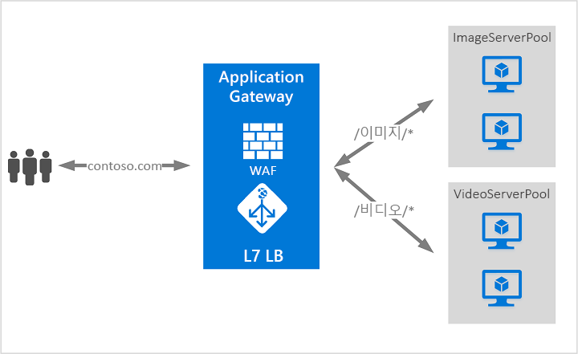

# Azure Application Gateway란?

Azure Application Gateway는 웹 응용 프로그램에 대한 트래픽을 관리할 수 있도록 하는 웹 트래픽 부하 분산 장치입니다. 

기존 부하 분산 장치는 전송 계층(OSI 계층 4 - TCP 및 UDP)에서 작동하고 원본 IP 주소와 포트를 기반으로 대상 IP 주소와 포트에 트래픽을 라우팅합니다. 하지만 Application Gateway를 사용하면 훨씬 더 달라질 수 있습니다. 예를 들어 들어오는 URL을 기반으로 하는 트래픽을 라우팅할 수 있습니다. 따라서 `/images`가 들어오는 URL에 있는 경우 이미지에 대해 구성된 서버(풀 라고도 함)의 특정 집합에 트래픽을 라우팅할 수 있습니다. `/video`가 URL에 있는 경우 해당 트래픽은 비디오에 대해 최적화된 다른 풀로 라우팅됩니다.

이 유형의 라우팅은 응용 프로그램 계층(OSI 계층 7) 부하 분산이라고 합니다. Azure Application Gateway는 URL 기반 라우팅 및 기타 작업을 수행할 수 있습니다. 

다음 기능이 Azure Application Gateway에 포함되어 있습니다. 

## SSL(Secure Sockets Layer) 종료

Application Gateway는 게이트웨이에서 SSL 종료를 지원합니다. 그 후의 트래픽은 일반적으로 암호화되지 않은 상태로 백 엔드 서버로 흐릅니다. 이 기능을 사용하면 비용이 많이 드는 암호화 및 암호 해독 오버헤드로부터 웹 서버의 부담을 줄일 수 있습니다. 그러나 서버에 암호화되지 않은 통신을 허용할 수 없는 경우도 있습니다. 이는 보안 요구 사항, 규정 준수 요구 사항 때문이거나 응용 프로그램이 보안 연결만 수락하는 것이기 때문일 수 있습니다. 이러한 응용 프로그램을 위해 Application Gateway에서 종단 간 SSL 암호화를 지원합니다.

## 웹 응용 프로그램 방화벽

WAF(웹 응용 프로그램 방화벽)는 일반적인 악용 및 취약점으로부터 웹 응용 프로그램에 대해 중앙 집중화된 보호를 제공하는 Application Gateway의 기능입니다. WAF는 [OWASP(Open Web Application Security Project) 핵심 규칙 집합](https://www.owasp.org/index.php/Category:OWASP_ModSecurity_Core_Rule_Set_Project) 3.0 또는 2.2.9의 규칙에 기반합니다. 

웹 응용 프로그램의 널리 알려진 취약점을 악용하는 악의적인 공격이 점점 많아지고 있습니다. 이러한 공격으로는 SQL 삽입 공격, 사이트 간 스크립팅 공격 등이 있습니다. 응용 프로그램 코드로 이러한 공격을 방어하기란 매우 어려울 수 있으며 응용 프로그램 토폴로지의 다양한 계층에서 엄격한 유지 관리, 패치 적용 및 모니터링이 필요할 수 있습니다. 중앙 집중식 웹 응용 프로그램 방화벽을 통해 보안 관리가 훨씬 간단해지고 응용 프로그램 관리자에게 위협 또는 침입으로부터 효과적인 보호를 제공합니다. 또한 WAF 솔루션은 각각의 웹 응용 프로그램을 보호하는 대신 중앙의 위치에서 알려진 취약점에 패치를 적용하여 보다 신속하게 보안 위협에 대응할 수 있습니다. 기존 Application Gateway는 웹 응용 프로그램 방화벽을 사용한 Application Gateway로 쉽게 변환될 수 있습니다.

## URL 기반 라우팅

URL 경로 기반 라우팅을 사용하여 요청의 URL 경로에 따라 트래픽을 백 엔드 서버 풀로 라우팅할 수 있습니다. 시나리오 중 하나는 여러 콘텐츠 형식에 대한 요청을 서로 다른 풀로 라우팅하는 것입니다.

예를 들어 `http://contoso.com/video/*`에 대한 요청은 VideoServerPool로 라우팅되고, `http://contoso.com/images/*`에 대한 요청은 ImageServerPool로 라우팅됩니다. 경로 패턴과 일치하는 항목이 없는 경우 DefaultServerPool이 선택됩니다.

## 다중 사이트 호스팅

다중 사이트 호스팅을 통해 동일한 응용 프로그램 게이트웨이 인스턴스에서 둘 이상의 웹 사이트를 구성할 수 있습니다. 이 기능을 사용하면 최대 20개의 웹 사이트를 하나의 Application Gateway로 추가하여 배포에 보다 효율적인 토폴로지를 구성할 수 있습니다. 각 웹 사이트는 고유한 풀로 이동할 수 있습니다. 예를 들어 응용 프로그램 게이트웨이는 ContosoServerPool 및 FabrikamServerPool이라는 두 개의 서버 풀에서 `contoso.com` 및 `fabrikam.com`에 대한 트래픽을 사용할 수 있습니다.

`http://contoso.com`에 대한 요청은 ContosoServerPool로 라우팅되고, `http://fabrikam.com`에 대한 요청은 FabrikamServerPool로 라우팅됩니다.

마찬가지로 같은 부모 도메인의 하위 도메인 두 개를 동일한 응용 프로그램 게이트웨이 배포에서 호스트할 수 있습니다. 하위 도메인을 사용하는 예제에는 단일 Application Gateway 배포에 호스팅되는 `http://blog.contoso.com` 및 `http://app.contoso.com`이 포함됩니다.

## 리디렉션

일반적으로 여러 웹 응용 프로그램에서 자동 HTTP - HTTPS 리디렉션을 지원하여 응용 프로그램 및 해당 사용자 간 모든 통신이 암호화된 경로를 통해 이루어지도록 합니다. 

이전에는 HTTP에서 수신하는 요청을 HTTPS로 리디렉션하는 것이 유일한 목적인 전용 풀 만들기와 같은 기술을 사용했습니다. Application Gateway에서 Application Gateway의 트래픽을 리디렉션하는 기능을 지원합니다. 이를 통해 응용 프로그램 구성이 간소화되고, 리소스 사용이 최적화되고, 전역 및 경로 기반 리디렉션을 비롯한 새로운 리디렉션 시나리오가 지원됩니다. Application Gateway 리디렉션 지원은 HTTP - HTTPS 리디렉션으로만 제한되지 않습니다. 이는 일반 리디렉션 메커니즘이므로 규칙을 사용하여 정의하는 모든 포트 간에서 리디렉션할 수 있습니다. 외부 사이트로의 리디렉션도 지원합니다.

Application Gateway 리디렉션 지원에서는 다음과 같은 기능을 제공합니다.

- Gateway의 한 포트에서 다른 포트로의 전역 리디렉션. 한 사이트에서 HTTP - HTTPS 리디렉션이 가능합니다.
- 경로 기반 리디렉션. 이러한 종류의 리디렉션에서는 `/cart/*`로 표시되는 쇼핑 카트 영역과 같이 특정 사이트 영역에서만 HTTP - HTTPS 리디렉션이 가능합니다.
- 외부 사이트로 리디렉션.

## 세션 선호도

쿠키 기반 세션 선호도 기능은 동일한 서버에서 사용자 세션을 유지하려는 경우에 유용합니다. Application Gateway는 게이트웨이 관리형 쿠키를 사용하여 사용자 세션에서 동일한 서버에 후속 트래픽을 처리하도록 지시할 수 있습니다. 이는 세션 상태가 사용자 세션의 서버에 로컬로 저장된 경우에 특히 중요합니다.

## Websocket 및 HTTP/2 트래픽

Application Gateway는 WebSocket 및 HTTP/2 프로토콜에 대한 네이티브 지원을 제공합니다. WebSocket 지원을 선택적으로 사용하거나 사용하지 않도록 설정하는 사용자 구성 가능 설정은 없습니다. HTTP/2 지원은 Azure PowerShell을 사용하여 활성화할 수 있습니다.
 
WebSocket 및 HTTP/2 프로토콜을 사용하면 장기 실행 TCP 연결을 통해 서버와 클라이언트 간의 전이중 통신을 수행할 수 있습니다. 이를 사용하면 웹 서버와 클라이언트 간의 대화형 통신이 가능하며, HTTP 기반 구현에서 필요에 따라 폴링하지 않고도 양방향 통신을 수행할 수 있습니다. 프로토콜은 HTTP와 달리 오버헤드가 낮고 여러 요청/응답에 동일한 TCP 연결을 다시 사용하므로 리소스를 보다 효율적으로 사용할 수 있습니다. 이러한 프로토콜은 기존의 HTTP 포트 80 및 443을 통해 작동하도록 디자인되었습니다.

## 다음 단계

요구 사항 및 환경에 따라 Azure Portal, Azure PowerShell 또는 Azure CLI 중 하나를 사용하여 테스트 Application Gateway를 만들 수 있습니다.

- [빠른 시작: Azure Application Gateway를 통해 웹 트래픽 보내기 - Azure Portal](quick-create-portal.md)
- [빠른 시작: Azure Application Gateway를 통해 웹 트래픽 보내기 - Azure PowerShell](quick-create-powershell.md)
- [빠른 시작: Azure Application Gateway를 통해 웹 트래픽 보내기 - Azure CLI](quick-create-cli.md)
