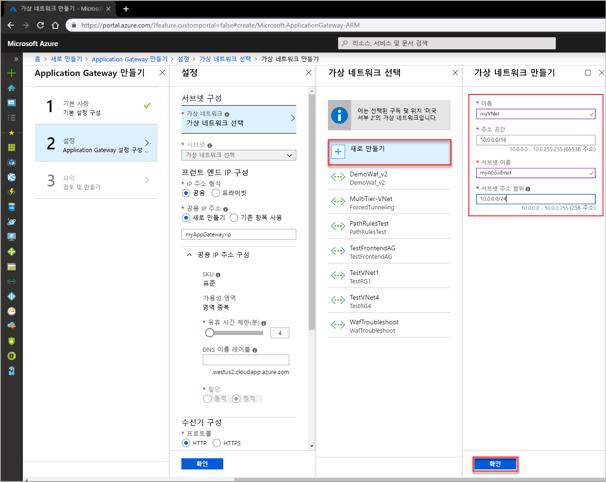

# <a name="quickstart-direct-web-traffic-with-azure-application-gateway---azure-portal"></a>빠른 시작: Azure Application Gateway를 통해 웹 트래픽 보내기 - Azure Portal

이 빠른 시작에서는 Azure Portal을 사용하여 백 엔드 풀에 가상 머신 두 개가 있는 애플리케이션 게이트웨이를 신속하게 만드는 방법을 보여줍니다. 그런 다음, 올바르게 작동하는지 테스트합니다. Azure Application Gateway를 통해 수신기를 포트에 할당하고, 규칙을 만들고, 백 엔드 풀에 리소스를 추가하여 애플리케이션 웹 트래픽을 특정 리소스로 보냅니다.

Azure 구독이 아직 없는 경우 시작하기 전에 [체험 계정](https://azure.microsoft.com/free/?WT.mc_id=A261C142F)을 만듭니다.

## <a name="sign-in-to-azure"></a>Azure에 로그인

Azure 계정을 사용하여 [Azure Portal](https://portal.azure.com) 에 로그인합니다.

## <a name="create-an-application-gateway"></a>애플리케이션 게이트웨이 만들기

Azure가 사용자가 만든 리소스 간에 통신하려면 가상 네트워크가 필요합니다. 이 예제에서는 두 개의 서브넷을 만듭니다. 하나는 애플리케이션 게이트웨이용이고, 다른 하나는 백 엔드 서버용입니다. 애플리케이션 게이트웨이를 만드는 동시에 가상 네트워크를 만들 수 있습니다.

1. Azure Portal의 왼쪽 메뉴에서 **리소스 만들기**를 선택합니다. **새로 만들기** 창이 나타납니다.

2. **네트워킹**을 선택한 다음, **추천** 목록에서 **Application Gateway**를 선택합니다.

### <a name="basics-page"></a>기본 페이지

1. **기본 사항** 페이지에서 다음 애플리케이션 게이트웨이 설정에 대한 값을 입력합니다.

    - **이름**: 애플리케이션 게이트웨이의 이름으로 *myAppGateway*를 입력합니다.
    - **리소스 그룹**: 리소스 그룹으로 **myResourceGroupAG**를 선택합니다. 이 리소스 그룹이 없으면 **새로 만들기**를 선택하여 새로 만듭니다.

    

2. 다른 설정은 기본값을 적용하고 **확인**을 선택합니다.

### <a name="settings-page"></a>설정 페이지

1. **설정** 페이지의 **서브넷 구성**에서 **가상 네트워크 선택**을 선택합니다.

2. **가상 네트워크 선택** 페이지에서 **새로 만들기**를 선택하고, 다음 가상 네트워크 설정의 값을 입력합니다.

    - **이름**: 가상 네트워크의 이름으로 *myVNet*을 입력합니다.

    - **주소 공간**: 가상 네트워크 주소 공간으로 *10.0.0.0/16*을 입력합니다.

    - **서브넷 이름**: 서브넷 이름으로 *myAGSubnet*을 입력합니다.<br>애플리케이션 게이트웨이 서브넷은 애플리케이션 게이트웨이만 포함할 수 있습니다. 다른 리소스는 허용되지 않습니다.

    - **서브넷 주소 범위**: 서브넷 주소 범위로 *10.0.0.0/24*를 입력합니다.

    

3. **확인**을 선택하여 **설정** 페이지로 돌아갑니다.

4. **프런트 엔드 IP 구성** 아래에서 **IP 주소 유형**이 **공용**으로 설정되었는지 확인합니다. **공용 IP 주소** 아래에서 **새로 만들기**가 선택되었는지 확인합니다. 

5. 공용 IP 주소 이름으로 *myAGPublicIPAddress*를 입력합니다. 

6. 다른 설정은 기본값을 적용하고 **확인**을 선택합니다.

### <a name="summary-page"></a>요약 페이지

**요약** 페이지에서 설정을 검토한 다음, **확인**을 선택하여 가상 네트워크, 공용 IP 주소 및 애플리케이션 게이트웨이를 만듭니다. Azure가 애플리케이션 게이트웨이를 만들 때까지 몇 분 정도 걸릴 수 있습니다. 배포가 성공적으로 완료될 때까지 기다렸다가 다음 섹션으로 이동합니다.

## <a name="add-a-subnet"></a>서브넷 추가

다음 단계를 수행하여 앞에서 만든 가상 네트워크에 서브넷을 추가합니다.

1. Azure Portal의 왼쪽 메뉴에서 **모든 리소스**를 선택하고, 검색 상자에 *myVNet*을 입력한 다음, 검색 결과에서 **myVNet**을 선택합니다.

2. 왼쪽 메뉴에서 **서브넷**을 선택하고 **+ 서브넷**을 선택합니다. 

    

3. **서브넷 추가** 페이지에서 서브넷 **이름**으로 *myBackendSubnet*을 입력한 다음, **확인**을 선택합니다.

## <a name="create-backend-servers"></a>백 엔드 서버 만들기

이 예제에서는 Azure에서 애플리케이션 게이트웨이의 백 엔드 서버로 사용할 두 개의 가상 머신을 만듭니다. 또한 Azure가 성공적으로 애플리케이션 게이트웨이를 만들었는지 확인할 수 있도록 가상 머신에 IIS를 설치합니다.

### <a name="create-a-virtual-machine"></a>가상 머신 만들기

1. Azure Portal에서 **리소스 만들기**를 선택합니다. **새로 만들기** 창이 나타납니다.

2. **컴퓨팅**을 선택한 다음, **추천** 목록에서 **Windows Server 2016 Datacenter**를 선택합니다. **가상 머신 만들기** 페이지가 표시됩니다.

3. **기본 사항** 탭에서 다음 가상 머신 설정의 값을 입력합니다.

    - **리소스 그룹**: 리소스 그룹 이름으로 **myResourceGroupAG**를 선택합니다.
    - **가상 머신 이름**: 가상 머신의 이름으로 *myVM*을 입력합니다.
    - **사용자 이름**: 관리자 사용자 이름으로 *azureuser*를 입력합니다.
    - **암호**: 관리자 암호로 *Azure123456!* 를 입력합니다.

4. 나머지는 기본값으로 두고 **다음: 디스크**를 선택합니다.  

5. **디스크** 탭을 기본값으로 두고 **다음: 네트워킹**을 선택합니다.

6. **네트워킹** 탭에서 **가상 네트워크**로 **myVNet**이 선택되었고 **서브넷**이 **myBackendSubnet**으로 설정되었는지 확인합니다. 나머지는 기본값으로 두고 **다음: 관리**를 선택합니다.

8. **관리** 탭에서 **부트 진단**을 **해제**합니다. 나머지는 기본값으로 두고 **검토 + 만들기**를 선택합니다.

9. **검토 + 만들기** 탭에서 설정을 검토하고, 유효성 검사 오류를 수정하고, **만들기**를 선택합니다.

10. 가상 머신 만들기가 완료되기를 기다렸다가 계속합니다.

### <a name="install-iis"></a>IIS 설치

1. [Azure PowerShell](https://docs.microsoft.com/azure/cloud-shell/quickstart-powershell)을 엽니다. 이렇게 하려면 Azure Portal의 위쪽 탐색 모음에서 **Cloud Shell**을 선택한 다음, 드롭다운 목록에서 **PowerShell**을 선택합니다. 

    

2. 다음 명령을 실행하여 가상 머신에 IIS를 설치합니다. 

    ```azurepowershell-interactive
    Set-AzureRmVMExtension `
      -ResourceGroupName myResourceGroupAG `
      -ExtensionName IIS `
      -VMName myVM `
      -Publisher Microsoft.Compute `
      -ExtensionType CustomScriptExtension `
      -TypeHandlerVersion 1.4 `
      -SettingString '{"commandToExecute":"powershell Add-WindowsFeature Web-Server; powershell Add-Content -Path \"C:\\inetpub\\wwwroot\\Default.htm\" -Value $($env:computername)"}' `
      -Location EastUS
    ```

3. 앞에서 완료한 단계를 사용하여 두 번째 가상 머신을 만들고 IIS를 설치합니다. 가상 머신 이름으로 *myVM2*를 사용하고, **VMName** 설정으로 **Set-AzureRmVMExtension** cmdlet을 사용합니다.

### <a name="add-backend-servers"></a>백 엔드 서버 추가

1. **모든 리소스**를 선택한 다음, **myAppGateway**를 선택합니다.

2. 왼쪽 메뉴에서 **백 엔드 풀**을 선택합니다. 앞에서 애플리케이션 게이트웨이를 만들 때 Azure가 자동으로 기본 풀 **appGatewayBackendPool**을 만들었습니다. 

3. **appGatewayBackendPool**을 선택합니다.

4. **대상** 아래의 드롭다운 메뉴에서 **가상 머신**을 선택합니다.

5. **가상 머신** 및 **네트워크 인터페이스** 아래의 드롭다운 목록에서 가상 머신 **myVM** 및 **myVM2**, 그리고 가상 머신과 연결된 네트워크 인터페이스를 선택합니다.

    

6. **저장**을 선택합니다.

## <a name="test-the-application-gateway"></a>애플리케이션 게이트웨이 테스트

1. **개요** 페이지에서 애플리케이션 게이트웨이에 대한 공용 IP 주소를 찾습니다.

    

    또는 **모든 리소스**를 선택하고, 검색 상자에 *myAGPublicIPAddress*를 입력한 다음, 검색 결과에서 선택할 수도 있습니다. Azure는 공용 IP 주소를 **개요** 페이지에 표시합니다.

2. 공용 IP 주소를 복사하여 브라우저의 주소 표시줄에 붙여넣습니다.

    

## <a name="clean-up-resources"></a>리소스 정리

애플리케이션 게이트웨이로 만든 리소스가 더 이상 필요 없으면 리소스 그룹을 제거합니다. 리소스 그룹을 제거하면 애플리케이션 게이트웨이 및 모든 관련 리소스도 함께 제거됩니다. 

리소스 그룹을 제거하려면:
1. Azure Portal의 왼쪽 메뉴에서 **리소스 그룹**을 선택합니다.
2. **리소스 그룹** 페이지의 목록에서 **myResourceGroupAG**를 검색하여 선택합니다.
3. **리소스 그룹** 페이지에서 **리소스 그룹 삭제**를 선택합니다.
4. **리소스 그룹 이름 입력**에 *myResourceGroupAG*를 입력하고 **삭제**를 선택합니다.

## <a name="next-steps"></a>다음 단계

> [!div class="nextstepaction"]
> [Azure CLI를 사용하여 애플리케이션 게이트웨이로 웹 트래픽 관리](./tutorial-manage-web-traffic-cli.md)
