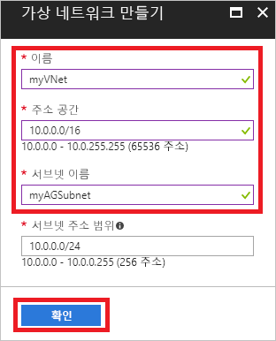
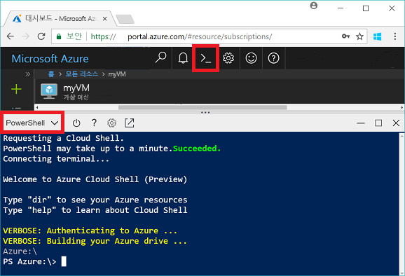
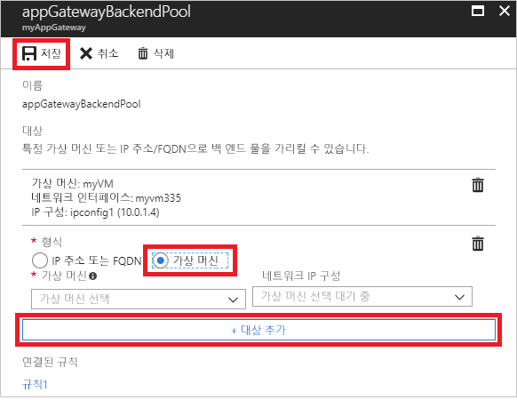
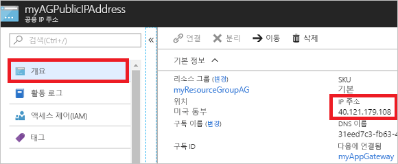

# <a name="quickstart-direct-web-traffic-with-azure-application-gateway---azure-portal"></a>빠른 시작: Azure Application Gateway를 통해 웹 트래픽 보내기 - Azure Portal

Azure Application Gateway를 통해 수신기를 포트에 할당하고, 규칙을 만들고, 백 엔드 풀에 리소스를 추가하여 응용 프로그램 웹 트래픽을 특정 리소스로 보낼 수 있습니다.

이 빠른 시작에서는 Azure Portal을 사용하여 백 엔드 풀에 가상 머신 두 개가 있는 응용 프로그램 게이트웨이를 신속하게 만드는 방법을 보여줍니다. 그런 다음, 올바르게 작동하는지 테스트합니다.

Azure 구독이 아직 없는 경우 시작하기 전에 [체험 계정](https://azure.microsoft.com/free/?WT.mc_id=A261C142F)을 만듭니다.

## <a name="log-in-to-azure"></a>Azure에 로그인

[http://portal.azure.com](http://portal.azure.com)에서 Azure Portal에 로그인

## <a name="create-an-application-gateway"></a>응용 프로그램 게이트웨이 만들기

응용 프로그램 게이트웨이가 다른 리소스와 통신할 수 있도록 가상 네트워크를 만들어야 합니다. 응용 프로그램 게이트웨이를 만드는 동시에 가상 네트워크를 만들 수 있습니다. 이 예제에서는 두 개의 서브넷을 만듭니다. 하나는 응용 프로그램 게이트웨이용이고, 다른 하나는 가상 머신용입니다. 

1. Azure Portal의 왼쪽 위 모서리에 있는 **리소스 만들기**를 클릭합니다.
2. **네트워킹**을 선택한 다음, 추천 목록에서 **Application Gateway**를 선택합니다.
3. 응용 프로그램 게이트웨이에 대해 다음 값을 입력합니다.

    - *myAppGateway* - 응용 프로그램 게이트웨이의 이름
    - *myResourceGroupAG* - 새 리소스 그룹의 이름

    

4. 다른 설정에 대한 기본값을 적용한 다음, **확인**을 클릭합니다.
5. **가상 네트워크 선택** > **새로 만들기**를 클릭하고 가상 네트워크에 대해 다음 값을 입력합니다.

    - *myVNet* - 가상 네트워크 이름
    - *10.0.0.0/16* - 가상 네트워크 주소 공간
    - *myAGSubnet* - 서브넷 이름
    - *10.0.0.0/24* - 서브넷 주소 공간

    

6. **확인**을 클릭하여 가상 네트워크 및 서브넷을 만듭니다.
6. **공용 IP 주소 선택** > **새로 만들기**를 클릭하고 공용 IP 주소의 이름을 입력합니다. 이 예제에서 공용 IP 주소의 이름은 *myAGPublicIPAddress*입니다. 다른 설정에 대한 기본값을 적용한 다음, **확인**을 클릭합니다.
8. 수신기 구성에 대한 기본값을 수락하고 웹 응용 프로그램 방화벽을 사용하지 않도록 유지한 다음, **확인**을 클릭합니다.
9. 요약 페이지에서 설정을 검토한 다음, **확인**을 클릭하여 가상 네트워크, 공용 IP 주소 및 응용 프로그램 게이트웨이를 만듭니다. 응용 프로그램 게이트웨이를 만드는 데 최대 30분이 걸릴 수 있습니다. 배포가 완료될 때까지 기다린 후 다음 섹션으로 이동합니다.

### <a name="add-a-subnet"></a>서브넷 추가

1. 왼쪽 메뉴에서 **모든 리소스**를 클릭한 다음, 리소스 목록에서 **myVNet**을 클릭합니다.
2. **서브넷** > **서브넷**을 클릭합니다.

    

3. 서브넷 이름에 *myBackendSubnet*을 입력한 다음, **확인**을 클릭합니다.

## <a name="create-backend-servers"></a>백 엔드 서버 만들기

이 예제에서는 응용 프로그램 게이트웨이에 대한 백 엔드 서버로 사용할 두 개의 가상 머신을 만듭니다. 

### <a name="create-a-virtual-machine"></a>가상 머신 만들기

1. **새로 만들기**를 클릭합니다.
2. **계산**을 선택한 다음, 추천 목록에서 **Windows Server 2016 Datacenter**를 선택합니다.
3. 가상 머신에 대해 다음 값을 입력합니다.

    - *myVM* - 가상 머신의 이름
    - *azureuser* - 관리자 사용자 이름
    - *Azure123456!* - 암호
    - **기존 항목 사용**을 선택한 다음, *myResourceGroupAG*를 선택합니다.

4. **확인**을 클릭합니다.
5. 가상 머신의 크기로 **DS1_V2**를 선택한 다음, **선택**을 클릭합니다.
6. 가상 네트워크에 대해 **myVNet**이 선택되어 있고 서브넷이 **myBackendSubnet**인지 확인합니다. 
7. **사용 안 함**을 클릭하여 부팅 진단을 사용하지 않도록 설정합니다.
8. **확인**을 클릭하고 요약 페이지에서 설정을 검토한 다음, **만들기**를 클릭합니다.

### <a name="install-iis"></a>IIS 설치

응용 프로그램 게이트웨이가 성공적으로 만들어졌는지 확인하기 위해 가상 머신에 IIS를 설치합니다.

1. 대화형 셸을 열고 **PowerShell**로 설정되어 있는지 확인합니다.

    

2. 다음 명령을 실행하여 가상 머신에 IIS를 설치합니다. 

    ```azurepowershell-interactive
    Set-AzureRmVMExtension `
      -ResourceGroupName myResourceGroupAG `
      -ExtensionName IIS `
      -VMName myVM `
      -Publisher Microsoft.Compute `
      -ExtensionType CustomScriptExtension `
      -TypeHandlerVersion 1.4 `
      -SettingString '{"commandToExecute":"powershell Add-WindowsFeature Web-Server; powershell Add-Content -Path \"C:\\inetpub\\wwwroot\\Default.htm\" -Value $($env:computername)"}' `
      -Location EastUS
    ```

3. 두 번째 가상 머신을 만들고, 방금 완료한 단계를 사용하여 IIS를 설치합니다. Set-AzureRmVMExtension의 이름 및 VMName에 대해 *myVM2*를 입력합니다.

### <a name="add-backend-servers"></a>백 엔드 서버 추가

가상 머신을 만든 후에는 응용 프로그램 게이트웨이의 백 엔드 풀에 가상 머신을 추가해야 합니다.

1. **모든 리소스** > **myAppGateway**를 클릭합니다.
2. **백 엔드 풀**을 클릭합니다. 기본 풀이 응용 프로그램 게이트웨이와 함께 자동으로 만들어졌습니다. **appGatewayBackendPool**을 클릭합니다.
3. **대상 추가** > **가상 머신**을 클릭하고 *myVM*을 선택합니다. **대상 추가** > **가상 머신**을 선택하고 *myVM2*를 선택합니다.

    

4. **저장**을 클릭합니다.

## <a name="test-the-application-gateway"></a>응용 프로그램 게이트웨이 테스트

응용 프로그램 게이트웨이를 만들기 위해 반드시 IIS를 설치해야 하는 것은 아니지만, 이 빠른 시작에서는 응용 프로그램 게이트웨이가 성공적으로 생성되었는지 확인하기 위해 설치했습니다.

1. [개요] 화면에서 응용 프로그램 게이트웨이에 대한 공용 IP 주소를 찾습니다. **모든 리소스** > **myAGPublicIPAddress**를 클릭합니다.

    

2. 공용 IP 주소를 복사한 다음, 브라우저의 주소 표시줄에 붙여넣습니다.

    

브라우저를 새로 고치면 다른 VM의 이름이 표시되어야 합니다.

## <a name="clean-up-resources"></a>리소스 정리

먼저 응용 프로그램 게이트웨이로 만든 리소스를 탐색한 다음, 더 이상 필요 없으면 리소스 그룹, 응용 프로그램 게이트웨이 및 모든 관련 리소스를 제거할 수 있습니다. 이렇게 하려면 응용 프로그램 게이트웨이가 포함된 리소스 그룹을 선택하고 **삭제**를 클릭합니다.

## <a name="next-steps"></a>다음 단계

> [!div class="nextstepaction"]
> [Azure CLI를 사용하여 응용 프로그램 게이트웨이로 웹 트래픽 관리](./tutorial-manage-web-traffic-cli.md)
