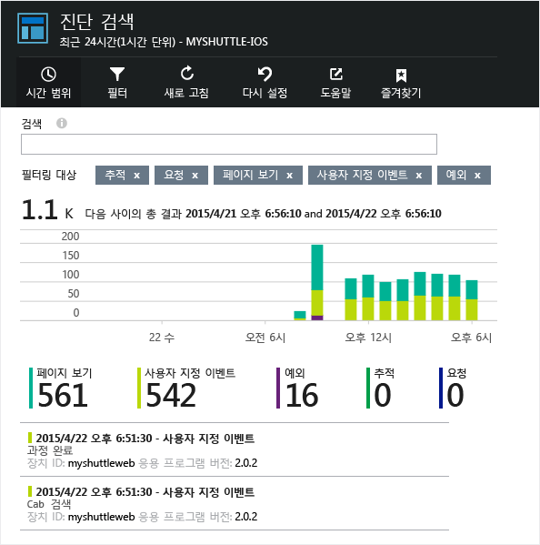
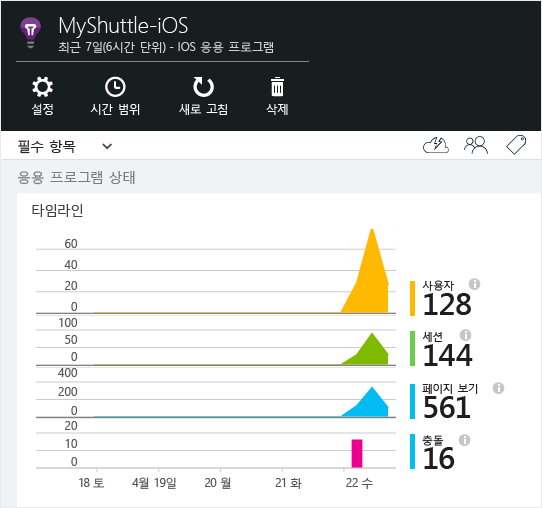
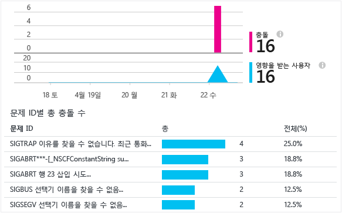

<properties 
    pageTitle="Android 앱용 Application Insights" 
    description="Application Insights를 사용하여 Android 앱의 사용 현황 및 성능을 분석할 수 있습니다." 
    services="application-insights" 
    documentationCenter="android"
    authors="alancameronwills" 
    manager="ronmart"/>

<tags 
    ms.service="application-insights" 
    ms.workload="mobile" 
    ms.tgt_pltfrm="mobile-android" 
    ms.devlang="na" 
    ms.topic="article" 
	ms.date="04/28/2015" 
    ms.author="awills"/>

# Android 앱용 Application Insights

Visual Studio Application Insights를 사용하여 모바일 응용 프로그램의 사용 현황, 이벤트 및 충돌을 모니터링할 수 있습니다.

## 요구 사항

필요한 사항:

* [Microsoft Azure](http://azure.com) 구독. Microsoft 계정으로 로그인합니다. Windows, XBox Live또는 기타 Microsoft 클라우드 서비스의 계정을 사용할 수 있습니다.
* Android Studio
* Android SDK 버전 9 이상.

## Application Insights 리소스 만들기

[Azure 포털][portal]에서 새 Application Insights 리소스를 만듭니다. Android 옵션을 선택합니다.


열리는 블레이드에서 앱의 성능 및 사용 데이터를 볼 수 있습니다. 다음에 Azure에 로그인할 때 다시 이 블레이드로 돌아가려면 시작 화면에서 해당 타일을 찾아야 합니다. 또는 찾아보기를 클릭하여 찾아야 합니다.

## Android Studio에 Application Insights 설치

(아직 설치하지 않은 경우)

1.  Android Studio를 시작하고 플러그 인을 구성합니다.

    

2.  Application Insights Android Studio 플러그 인을 선택하여 설치합니다.

    

## <a name="sdk"></a>응용 프로그램에 SDK를 설치합니다.


1.  도구-> Application Insights 통합을 선택합니다.

    
    
3.  구독에서 구성 요소를 만듭니다.

    

    Application Insights 리소스에서 얻은 계측 키를 사용합니다.

4.  gradle을 동기화하여 SDK를 다운로드하고 프로젝트와 통합합니다

    
    
    (추가 정보는 [사용 현황 페이지](http://go.microsoft.com/fwlink/?LinkID=533220)에 제공).
    
이 시점에서 다음 참조가 모듈 build.gradle에 추가되고 `INTERNET` 및 `ACCESS_NETWORK_STATE`에 대한 권한과 구성 요소의 계측 키를 포함하는 메타 데이터 태그가 모듈의 `AndroidManifest.xml`에 추가되었습니다.

```java

    dependencies {
    compile 'com.microsoft.azure:applicationinsights-android:+'
    }
```

```xml

    <manifest>
    <uses-permission android:name="android.permission.INTERNET" />
    <uses-permission android:name="android.permission.ACCESS_NETWORK_STATE" />
    
    <application>
        <meta-data
            android:name="com.microsoft.applicationinsights.instrumentationKey"
            android:value="${AI_INSTRUMENTATION_KEY}" />
    </application>
    </manifest>
```

#### 선택 사항: 코드에서 계측 키 설정

코드에서 계측 키를 설정할 수도 있습니다. 이 방법은 `AndroidManifest.xml`에서 설정한 계측 키를 재정의합니다.

```java

    AppInsights.setup(this, "<YOUR-IKEY-GOES-HERE>");
    AppInsights.start();
```


## SDK 사용

SDK를 초기화하고 원격 분석 추적을 시작합니다.

앱 루트 활동에 다음 가져오기를 추가합니다.

```java

     import com.microsoft.applicationinsights.TelemetryClient;
```

활동의 `onCreate` 콜백에 다음을 추가합니다.

```java

    AppInsights.setup(this);
    AppInsights.start();
```

`AppInsights.start()`가 호출되면 SDK가 android 수명 주기 활동 및 처리되지 않은 모든 예외를 추적하기 시작합니다.

> [AZURE.NOTE]응용 프로그램 수명 주기 이벤트는 Android SDK 버전 15 이상에서 수집됩니다(Ice Cream Sandwich+).

그 외에도 사용자 지정 이벤트, 추적, 메트릭 및 처리되는 예외를 수집할 수 있습니다. [Application Insights API][api] 중 하나를 사용하여 원격 분석을 보냅니다.

* 다른 사용자 동작에 대해서는 TrackEvent(eventName)
* [진단 로깅][diagnostic]에 대해서는 TrackTrace(logEvent)
* catch 절에는 TrackHandledException(exception)
* 특정 이벤트에 연결되지 않은 메트릭의 정기적인 보고서를 보내기 위한 배경 작업에서는 TrackMetric(name, value)

다음은 초기화 및 수동 원격 분석 수집의 예입니다.

```java

    public class MyActivity extends Activity {

      @Override
      protected void onCreate(Bundle savedInstanceState) {
        
        AppInsights.setup(this);
        //... other initialization code ...//
        AppInsights.start();
        
        // track telemetry data
        TelemetryClient client = TelemetryClient.getInstance();
        HashMap<String, String> properties = new HashMap<String, String>();
        properties.put("property1", "my custom property");
        client.trackEvent("sample event", properties);
        client.trackTrace("sample trace");
        client.trackMetric("sample metric", 3);
        client.trackHandledException(new Exception("sample exception"));
      }
    }
```

## <a name="run"></a> 프로젝트 실행

응용 프로그램을 실행(Windows는 Shift + F10, OS X은 Ctrl + R)를 실행하여 원격 분석을 생성합니다.

## Application Insights에서 데이터 보기

http://portal.azure.com으로 돌아가서 Application Insights 리소스를 찾습니다.

검색을 클릭하여 [진단 검색][diagnostic]을 엽니다. 여기에 첫 번째 이벤트가 표시됩니다. 아무 것도 표시되지 않으면 1-2분 정도 기다렸다가 새로 고침을 클릭합니다.



앱을 사용하면 데이터 개요 블레이드에 데이터가 표시됩니다.



원하는 차트를 클릭하여 자세한 내용을 봅니다. 예를 들어 충돌 차트를 클릭하면 다음 내용이 표시됩니다.




## <a name="usage"></a>다음 단계

[앱 사용량 추적][track]

[진단 검색][diagnostic]

[메트릭 탐색기][metrics]

[문제 해결][qna]


<!--Link references-->

[api]: app-insights-api-custom-events-metrics.md
[diagnostic]: app-insights-diagnostic-search.md
[metrics]: app-insights-metrics-explorer.md
[portal]: http://portal.azure.com/
[qna]: app-insights-troubleshoot-faq.md
[track]: app-insights-custom-events-metrics-api.md

<!---HONumber=58--> 