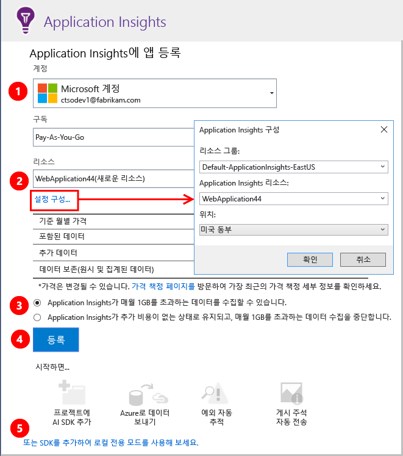
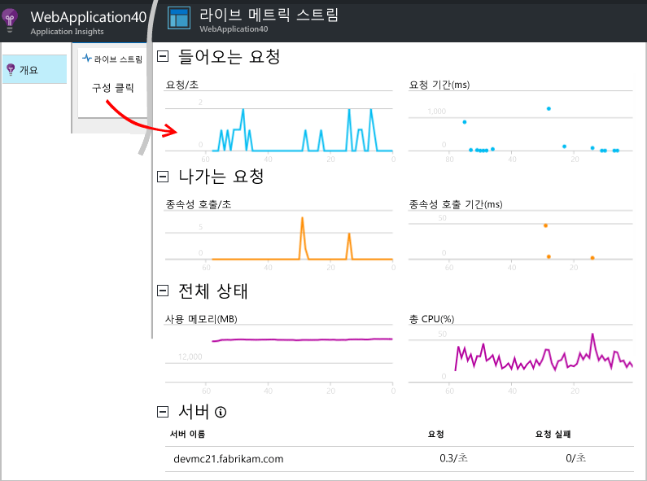
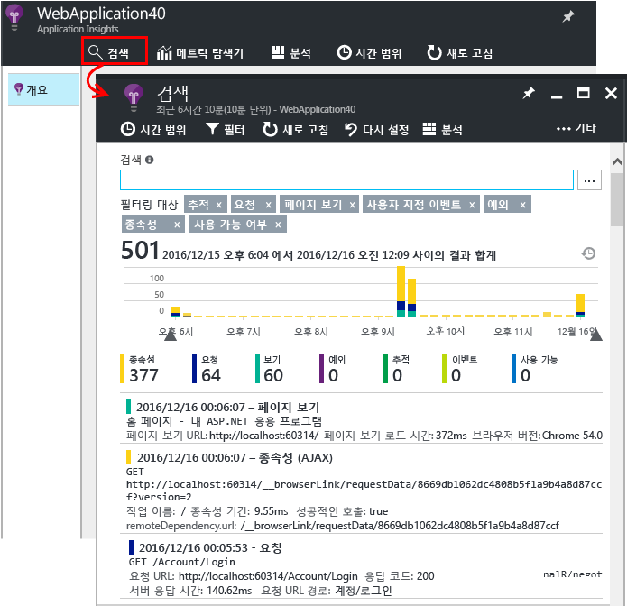
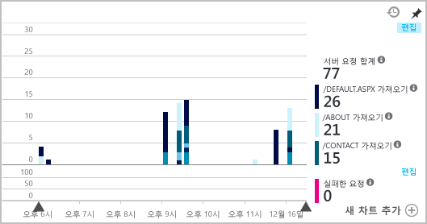
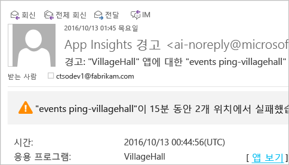
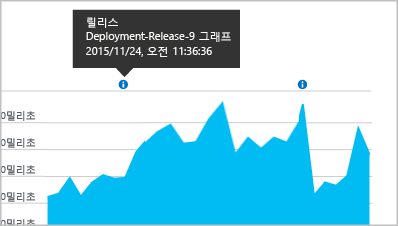

# <a name="set-up-application-insights-for-your-aspnet-website"></a>ASP.NET 웹 사이트용 Application Insights 설정
[Azure Application Insights](app-insights-overview.md)는 실시간 응용 프로그램을 모니터링하여 [성능 문제 및 예외 사항을 감지 및 진단](app-insights-detect-triage-diagnose.md)할 수 있도록 도와줍니다. 또한 [앱이 어떻게 사용되는지 검색](app-insights-overview-usage.md)할 수 있도록 도와줍니다. Azure App Service의 Web Apps 기능뿐 아니라 온-프레미스 IIS 서버 또는 클라우드 VM에서 호스트된 앱에서도 작동합니다.

## <a name="before-you-start"></a>시작하기 전에
다음 작업을 수행해야 합니다.

* Visual Studio 2013 업데이트 3 이상 나중일수록 좋습니다.
* [Microsoft Azure](http://azure.com)구독. 팀 또는 조직에 Azure 구독이 있는 경우 소유자가 [Microsoft 계정](http://live.com)을 사용하여 사용자를 추가할 수 있습니다.

관심이 있는 경우 살펴볼만한 다른 문서:

* [런타임 시 웹앱 계측](app-insights-monitor-performance-live-website-now.md)
* [Azure 클라우드 서비스](app-insights-cloudservices.md)

## <a name="a-nameidea-step-1-add-the-application-insights-sdk"></a><a name="ide"></a> 1단계: Application Insights SDK 추가

솔루션 탐색기에서 웹앱 프로젝트를 마우스 오른쪽 단추로 클릭하고 **추가**, **Application Insights 원격 분석...** 또는 **Application Insights 구성**을 선택합니다.


(Visual Studio 2015에는 새 프로젝트 대화 상자에도 Application Insights를 추가할 수 있는 옵션이 있습니다.)

Application Insights 구성 페이지로 계속 진행:



1. Azure에 액세스하는 데 사용할 계정 및 구독을 선택합니다.
2. Azure에서 앱의 데이터를 보려는 리소스를 선택합니다. 일반적으로 각 앱에 대해 별도의 리소스를 만듭니다. 데이터가 저장되는 위치나 리소스 그룹을 설정하려면 **설정 구성**을 클릭합니다. 리소스 그룹은 데이터에 대한 액세스를 제어하는 데 사용됩니다. 예를 들어, 동일한 시스템의 부분을 형성하는 몇 개의 앱이 있는 경우 해당 앱의 Application Insights 데이터를 동일한 리소스 그룹에 배치할 수 있습니다.
3. Application Insights는 원격 분석이 특정 볼륨까지 무료입니다. 청구를 방지하도록 해당 볼륨에 한도를 적용할 수 있습니다. 리소스가 만들어진 후 포털에서 **기능 및 가격**, **데이터 관리**, **일일 볼륨 상한**을 열어서 선택 항목을 변경할 수 있습니다.
4. **등록**을 클릭하여 계속 진행하여 웹앱에 대한 Application Insights를 구성합니다. 원격 분석이 디버깅 중 및 앱을 게시한 후에 [Azure Portal](https://portal.azure.com)로 전송됩니다.
5. 아니면 앱에 Application Insights SDK만 추가할 수 있습니다. 이런 경우 원격 분석을 Visual Studio에서 디버깅하는 동안 볼 수 있습니다. 나중에 이 구성 페이지로 돌아오거나 앱을 배포할 때까지 기다려서 [런타임에 원격 분석으로 전환할 수 있습니다](app-insights-monitor-performance-live-website-now.md).


## <a name="a-nameruna-step-2-run-your-app"></a><a name="run"></a> 2단계: 앱 실행
F5를 사용하여 앱을 실행합니다. 다른 페이지를 열어서 일부 원격 분석을 생성합니다.

Visual Studio에 로그된 이벤트 수가 표시됩니다.


## <a name="step-3-see-your-telemetry-in-visual-studio-or-application-insights"></a>3단계: Visual Studio 또는 Application Insights에서 원격 분석 보기
원격 분석은 Visual Studio 또는 Application Insights 웹 포털에서 볼 수 있습니다.

**Visual Studio**에서 Application Insights 창을 엽니다. **Application Insights** 단추를 클릭하거나 솔루션 탐색기에서 프로젝트를 마우스 오른쪽 단추로 클릭하고 **Application Insights**를 선택한 다음 **라이브 원격 분석 검색**을 클릭합니다.

Visual Studio Application Insights 검색 창에서 앱의 서버 쪽에서 생성된 원격 분석에 대한 **디버그 세션의 데이터** 보기를 봅니다. 필터를 테스트하고 이벤트를 클릭하여 자세한 정보를 확인합니다.


> [!NOTE]
> 데이터가 보이지 않으면 시간 범위가 올바른지 확인하고 검색 아이콘을 클릭하세요.

[Visual Studio의 Application Insights 도구에 대해 자세히 알아봅니다](app-insights-visual-studio.md).

<a name="monitor"></a>
### <a name="the-application-insights-web-portal"></a>Application Insights 웹 포털
SDK만 설치하도록 선택한 경우가 아니라면 **Application Insights 웹 포털**에서도 원격 분석을 볼 수 있습니다. 포털에는 Visual Studio 보다 많은 차트, 분석 도구 및 대시보드가 있습니다.

Application Insights 리소스를 엽니다. [Azure Portal](https://portal.azure.com/)에 로그인하여 해당 위치에서 찾거나 Visual Studio에서 프로젝트를 마우스 오른쪽 단추로 클릭하면 해당 위치로 이동됩니다.


> [!NOTE]
> 액세스 오류가 발생하는 경우 둘 이상의 Microsoft 자격 증명 집합이 있을 수 있으며 이 중 잘못된 자격 증명으로 로그인되어 있을 수 있습니다. 포털에서 로그아웃하고 다시 로그인하세요.

포털은 앱에서 원격 분석의 보기를 엽니다.


자세한 정보를 확인하려면 원하는 타일 또는 차트를 클릭합니다.

### <a name="more-details-in-the-application-insights-web-portal"></a>Application Insights 웹 포털의 자세한 내용
다음은 포털에 자세한 내용이 제공되는 방식의 몇 가지 예입니다.

* [**라이브 메트릭 스트림**](app-insights-live-stream.md)은 거의 즉시로 원격 분석을 표시합니다.

    

    앱이 실행되는 동시에 라이브 메트릭 스트림을 열어 연결을 허용합니다.

    라이브 메트릭 스트림은 전송된 후&1;분 동안의 원격 분석만 표시합니다. 자세한 기록 조사를 수행하려면 [검색], [메트릭 탐색기] 및 [분석]을 사용합니다. 이러한 위치에 데이터가 표시되려면 몇 분 정도 걸릴 수 있습니다.

* [**검색**](app-insights-diagnostic-search.md)에는 요청, 예외 및 페이지 보기와 같은 개별 이벤트가 표시됩니다. 이벤트 유형, 용어 일치 및 속성 값을 기준으로 필터링할 수 있습니다. 이벤트를 클릭하여 속성 및 관련 이벤트를 확인합니다.

    

 * 개발 모드에서는 종속성(AJAX) 이벤트를 많이 볼 수 있습니다. 이러한 이벤트는 브라우저와 서버 에뮬레이터 간의 동기화입니다. 이를 숨기려면 **종속성** 필터를 클릭합니다.
* [**집계된 메트릭**](app-insights-metrics-explorer.md)(예: 요청 및 실패율)이 차트에 표시됩니다. 차트를 클릭하여 자세한 내용이 있는 블레이드를 엽니다. 차트의 **편집** 태그를 클릭하여 필터 및 크기를 설정합니다.

    

[Azure 포털에서 Application Insights를 사용하는 방법에 대해 자세히 알아봅니다](app-insights-dashboards.md).

## <a name="step-4-publish-your-app"></a>4단계: 앱 게시
IIS 서버 또는 Azure에 앱을 게시합니다. [라이브 메트릭 스트림](app-insights-metrics-explorer.md#live-metrics-stream) 을 보고 모두 문제 없이 실행되고 있는지 확인합니다.

원격 분석이 Application Insights 포털에 구축되고, 이 곳에서 메트릭을 모니터링하고 원격 분석을 검색하고 [대시보드](app-insights-dashboards.md)를 설정할 수 있습니다. 또한 강력한 [분석 쿼리 언어](app-insights-analytics.md)를 사용하여 사용량 및 성능을 분석하거나 특정 이벤트를 찾을 수 있습니다.

[Visual Studio](app-insights-visual-studio.md)에서 진단 검색 및 [추세](app-insights-visual-studio-trends.md) 등의 도구를 사용하여 원격 분석을 계속 수행할 수도 있습니다.

> [!NOTE]
> 앱에서 너무 많은 원격 분석을 보내 [제한 한도](app-insights-pricing.md#limits-summary)에 도달할 경우 자동 [샘플링](app-insights-sampling.md)이 켜집니다. 샘플링은 앱에서 보내는 원격 분석의 양을 줄이고 진단을 위해 상호 관련된 데이터를 유지합니다.
>
>

## <a name="a-namelanda-what-does-the-add-application-insights-command-do"></a><a name="land"></a> Application Insights 추가 명령의 기능은 무엇인가요?
Application Insights는 앱에서 Application Insights 포털(Azure에서 호스팅됨)에 원격 분석을 보냅니다.


따라서 이 명령은 다음 세 가지를 수행합니다.

1. 프로젝트에 Application Insights 웹 SDK NuGet 패키지를 추가합니다. Visual Studio에서 보려면 프로젝트를 마우스 오른쪽 단추로 클릭하고 **NuGet 패키지 관리**를 선택합니다.
2. Application Insights 리소스를 [Azure Portal](https://portal.azure.com/)에서 만듭니다. 이곳에서 데이터를 볼 수 있습니다. 이것은 리소스를 식별하는 *계측 키* 를 검색합니다.
3. `ApplicationInsights.config`에 계측 키를 삽입하여 SDK가 포털에 원격 분석을 보낼 수 있습니다.

원하는 경우 [ASP.NET 4](app-insights-windows-services.md) 또는 [ASP.NET Core](https://github.com/Microsoft/ApplicationInsights-aspnetcore/wiki/Getting-Started)에 다음 단계를 수동으로 수행할 수 있습니다.

### <a name="upgrade-to-future-sdk-versions"></a>향후 SDK 버전으로 업그레이드
[SDK의 새 릴리스](https://github.com/Microsoft/ApplicationInsights-dotnet-server/releases)로 업그레이드하려면 **NuGet 패키지 관리자**를 다시 열고 설치된 패키지를 필터링합니다. **Microsoft.ApplicationInsights.Web**을 선택하고 **업그레이드**를 선택합니다.

ApplicationInsights.config에 대한 사용자 지정을 수행한 경우, 업그레이드 전에 복사본을 저장합니다. 그런 다음 변경 내용을 새 버전에 병합합니다.

## <a name="add-more-telemetry"></a>원격 분석 더 추가
다음은 추가할 수 있는 다른 유형의 원격 분석입니다.
### <a name="dependencies-exceptions-and-performance-counters"></a>종속성, 예외 및 성능 카운터

IIS 서버 컴퓨터 각각에 [상태 모니터를 설치](http://go.microsoft.com/fwlink/?LinkId=506648)하여 웹앱에 대한 추가 원격 분석을 가져옵니다. 이미 설치되어 있으면 아무 작업도 수행할 필요가 없습니다. (런타임 시 앱 모니터링을 시작하기 위해 상태 모니터를 이미 사용했을 수도 있습니다.)

빌드 시간 SDK외에 상태 모니터링을 사용하면 다음을 포함하는 보다 완전한 원격 분석 집합을 얻을 수 있습니다.

* [성능 카운터](app-insights-performance-counters.md): CPU, 메모리, 디스크 및 응용 프로그램에 관련된 다른 성능 카운터입니다.
* [예외](app-insights-asp-net-exceptions.md): 몇 가지 예외에 대한 자세한 원격 분석입니다.
* [종속성](app-insights-asp-net-dependencies.md): 반환 값이 포함됩니다.

### <a name="webpages-and-single-page-apps"></a>웹 페이지와 단일 페이지 앱
1. 웹 페이지에 [JavaScript 코드 조각을 추가](app-insights-javascript.md)하여 페이지 보기, 로드 시간, 브라우저 예외, AJAX 호출 성능, 사용자 및 세션 수에 대한 데이터를 표시합니다. 이러한 데이터는 브라우저 및 사용량 블레이드에 나타납니다.
2. [사용자 지정 이벤트를 코딩](app-insights-api-custom-events-metrics.md)하여 사용자 작업의 수와 시간을 측정하고 평가합니다.


### <a name="diagnostic-code"></a>진단 코드
문제가 있습니까? 문제를 진단하기 위해 앱에 코드를 삽입 하려는 경우 몇 가지 옵션이 있습니다.

* [로그 추적 캡처](app-insights-asp-net-trace-logs.md): Log4N, NLog 또는 System.Diagnostics.Trace를 사용하여 추적 이벤트를 이미 기록하고 있다면 출력을 Application Insights로 전송할 수 있습니다. 이러한 출력을 요청과 상호 연결하고 검색하고 분석할 수 있습니다.
* [사용자 지정 이벤트 및 메트릭](app-insights-api-custom-events-metrics.md): 서버 또는 웹 페이지 코드에 TrackEvent() 및 TrackMetric()을 사용합니다.
* [추가 속성이 있는 태그 원격 분석](app-insights-api-filtering-sampling.md#add-properties).

[Search](app-insights-diagnostic-search.md)를 사용하여 특정 이벤트를 찾아 상관 관계를 분석하고 [Analytics](app-insights-analytics.md)를 사용하여 더 강력한 쿼리를 수행합니다.

## <a name="alerts"></a>경고
응용 프로그램에 문제가 있는지 신속히 알려줍니다.

* [가용성 테스트](app-insights-monitor-web-app-availability.md): 웹 테스트를 만들어 사이트가 웹에 표시되는지 확인합니다.
* [스마트 진단](app-insights-proactive-diagnostics.md): 이 테스트는 자동으로 실행되므로 아무것도 설정할 필요가 없습니다. 앱이 실패한 요청으로 비정상적인 속도를 보일 경우 알려줍니다.
* [메트릭 경고](app-insights-alerts.md): 메트릭이 임계값을 초과할 경우 경고 메시지를 표시하도록 설정합니다. 앱에 코딩하는 사용자 지정 메트릭에 이러한 경고를 설정할 수 있습니다.

기본적으로 Azure 구독 소유자에게 경고 알림이 전송됩니다.



## <a name="version-and-release-tracking"></a>버전 및 릴리스 추적
응용 프로그램 버전을 추적하려면 `buildinfo.config`가 Microsoft Build Engine 프로세스에 의해 생성되도록 해야 합니다. .csproj 파일에서 다음을 추가합니다.  

```XML

    <PropertyGroup>
      <GenerateBuildInfoConfigFile>true</GenerateBuildInfoConfigFile>    <IncludeServerNameInBuildInfo>true</IncludeServerNameInBuildInfo>
    </PropertyGroup>
```

빌드 정보가 있는 경우 Application Insights 웹 모듈에서 원격 분석의 모든 항목에 **응용 프로그램 버전** 을 속성으로 자동으로 추가합니다. 이렇게 하면 [진단 검색](app-insights-diagnostic-search.md)을 수행하거나 [메트릭을 탐색](app-insights-metrics-explorer.md)할 때 버전을 기준으로 필터링할 수 있습니다.

그러나 빌드 버전 번호는 Visual Studio의 개발자 빌드가 아니라 Microsoft Build Engine에서만 생성된다는 점에 유의해야 합니다.

### <a name="release-annotations"></a>릴리스 주석
Visual Studio Team Services를 사용하는 경우 새 버전을 릴리스할 때마다 [주석 표식](app-insights-annotations.md)이 차트에 추가됩니다. 다음 이미지는 이러한 표식이 어떻게 나타나는지를 보여줍니다.



## <a name="next-steps"></a>다음 단계
**[Visual Studio Online에서 Application Insights로 작업](app-insights-visual-studio.md)**<br/>원격 분석, 진단 검색 및 코드 드릴스루를 통한 디버깅에 대한 정보가 포함되어 있습니다.

**[Application Insights 포털 사용](app-insights-dashboards.md)**<br/> 대시보드, 강력한 진단 및 분석 도구, 경고, 응용 프로그램의 라이브 종속성 맵 및 원격 분석 내보내기에 대한 정보가 포함되어 있습니다.

