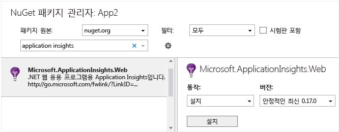

# <a name="application-insights-for-azure-cloud-services"></a>Azure Cloud Services용 Application Insights
[Application Insights][start]에서 Application Insights SDK의 데이터와 Cloud Services의 [Azure 진단](https://docs.microsoft.com/azure/monitoring-and-diagnostics/azure-diagnostics) 데이터를 결합하여 [Microsoft Azure Cloud Services 앱](https://azure.microsoft.com/services/cloud-services/)에 대한 가용성, 성능, 오류 및 사용량을 모니터링할 수 있습니다. 앱의 성능 및 효과에 대한 생생한 피드백을 통해 충분한 정보를 바탕으로 각 개발 수명 주기의 디자인 방향을 결정할 수 있습니다.


## <a name="before-you-start"></a>시작하기 전에
필요한 사항:

* [Microsoft Azure](http://azure.com)를 구독해야 합니다. Microsoft 계정으로 로그인합니다. Windows, XBox Live 또는 기타 Microsoft 클라우드 서비스의 계정을 사용할 수 있습니다. 
* Microsoft Azure 도구 2.9 이상
* 개발자 분석 도구 7.10 이상

## <a name="quick-start"></a>빠른 시작
Application Insights를 사용하여 클라우드 서비스를 모니터링하는 가장 쉽고 빠른 방법은 Azure에 서비스를 게시할 때 이 옵션을 선택하는 것입니다.


이 옵션은 런타임에 앱을 계측하여 웹 역할에서 요청, 예외 및 종속성을 모니터링하는 데 필요한 모든 원격 분석뿐 아니라 작업자 역할의 성능 카운터를 제공합니다. 앱에서 생성된 모든 진단 추적도 Application Insights로 전송됩니다.

필요한 항목을 모두 얻었으면 작업이 완료된 것입니다. 다음 단계에서는 [앱에서 메트릭을 보고](app-insights-metrics-explorer.md), [분석을 사용하여 데이터를 쿼리하고](app-insights-analytics.md), [대시보드](app-insights-dashboards.md)를 설정합니다. [가용성 테스트](app-insights-monitor-web-app-availability.md)를 설정하고 [웹 페이지에 코드를 추가](app-insights-javascript.md)하여 브라우저에서 성능을 모니터링할 수 있습니다.

하지만 더 많은 옵션을 얻을 수 있습니다.

* 여러 구성 요소에서 데이터를 보내고 개별 리소스에 대한 구성을 빌드합니다.
* 앱에서 사용자 지정 원격 분석을 추가합니다.

이러한 옵션에 관심이 있다면 계속 읽어보세요.

## <a name="sample-application-instrumented-with-application-insights"></a>Application Insights를 사용하여 계측하는 샘플 응용 프로그램
Application Insights가 Azure에서 두 작업자 역할이 호스팅되는 클라우드 서비스에 추가되는 이 [샘플 응용 프로그램](https://github.com/Microsoft/ApplicationInsights-Home/tree/master/Samples/AzureEmailService)을 살펴봅니다. 

동일한 방식으로 사용자 자신의 클라우드 서비스 프로젝트를 조정하는 방법을 알려줍니다.

## <a name="plan-resources-and-resource-groups"></a>리소스 및 리소스 그룹 계획
앱의 원격 분석은 Application Insights 형식의 Azure 리소스에 저장, 분석 및 표시됩니다. 

각 리소스는 리소스 그룹에 속합니다. 리소스 그룹은 비용을 관리하고, 팀 구성원에게 액세스 권한을 부여하고, 조정된 단일 트랜잭션에서 업데이트를 배포하는 데 사용됩니다. 예를 들어 한 번의 작업으로 Azure 클라우드 서비스와 해당 Application Insights 모니터링 리소스에 [배포할 스크립트를 작성](../azure-resource-manager/resource-group-template-deploy.md)할 수 있습니다.

### <a name="resources-for-components"></a>구성 요소에 대한 리소스
응용 프로그램의 각 구성 요소, 즉 각 웹 역할 및 작업자 역할에 대한 별도의 리소스를 만드는 것이 좋습니다. 각 구성 요소를 개별적으로 분석할 수 있지만 모든 구성 요소의 주요 차트를 함께 표시하는 [대시보드](app-insights-dashboards.md)를 만들어 이러한 차트를 비교하고 함께 모니터링할 수 있습니다. 

또 다른 방법은 둘 이상의 역할에서 동일한 리소스로 원격 분석을 전송하되, [각 원격 분석 항목에 해당 소스 역할을 식별하는 차원 속성을 추가](app-insights-api-filtering-sampling.md#add-properties-itelemetryinitializer)하는 것입니다. 이 방법에서는 예외와 같은 메트릭 차트에 일반적으로 여러 역할의 카운트 집계가 표시되지만 필요한 경우 역할 식별자별로 차트를 분할할 수 있습니다. 동일한 차원으로 검색을 필터링할 수도 있습니다. 이 방법을 사용하면 모든 항목을 보다 쉽게 동시에 볼 수 있지만 역할 간에 약간의 혼동이 발생할 수도 있습니다.

브라우저 원격 분석은 일반적으로 해당 서버 쪽 웹 역할과 동일한 리소스에 포함됩니다.

서로 다른 구성 요소에 대한 Application Insights 리소스를 하나의 리소스 그룹에 두세요. 이렇게 하면 함께 관리하기가 쉬워집니다. 

### <a name="separating-development-test-and-production"></a>개발, 테스트 및 프로덕션 구분
이전 버전을 사용하는 동안 다음 기능에 대한 사용자 지정 이벤트를 개발하는 경우 개발 원격 분석을 별도의 Application Insights 리소스에 전송할 수 있습니다. 그렇지 않으면 라이브 사이트의 모든 트래픽에서 테스트 원격 분석을 찾기가 어려워집니다.

이 상황을 방지하려면 각 빌드 구성 또는 시스템의 '스탬프'(개발, 테스트, 프로덕션 등)에 대한 별도 리소스를 만듭니다. 각 빌드 구성에 대한 리소스를 별도 리소스 그룹에 둡니다. 

원격 분석을 적절한 리소스에 전송하려면 빌드 구성에 따라 서로 다른 계측 키를 선택할 수 있도록 Application Insights SDK를 설정합니다. 

## <a name="create-an-application-insights-resource-for-each-role"></a>각 역할에 대한 Application Insights 리소스 만들기
각 역할에 대한 별도의 리소스(각 빌드 구성에 대한 별도의 집합)를 만들기로 결정한 경우 Application Insights 포털에서 모든 리소스를 만드는 것이 가장 간편합니다. 많은 리소스를 만드는 경우 [프로세스를 자동화](app-insights-powershell.md)할 수 있습니다.

1. [Azure Portal][portal]에서 새 Application Insights 리소스를 만듭니다. 응용 프로그램 유형으로 ASP.NET 앱을 선택합니다. 

    
2. 각 리소스는 해당 계측 키로 식별됩니다. 이는 나중에 SDK의 구성을 수동으로 구성하거나 확인하려는 경우에 필요할 수 있습니다.


## <a name="set-up-azure-diagnostics-for-each-role"></a>각 역할에 대한 Azure 진단 설정
Application Insights를 사용하여 앱을 모니터링하려면 이 옵션을 설정합니다. 웹 역할의 경우 성능 모니터링, 경고 및 진단과 함께 사용 현황 분석이 제공됩니다. 다른 역할의 경우 다시 시작, 성능 카운터 및 System.Diagnostics.Trace 호출과 같은 Azure 진단을 검색하고 모니터링할 수 있습니다. 

1. Visual Studio 솔루션 탐색기의 &lt;YourCloudService&gt; 역할에서 각 역할의 속성을 엽니다.
2. **구성**에서 **진단 데이터를 Application Insights로 보내기**를 설정하고 이전에 만든 적절한 Application Insights 리소스를 선택합니다.

각 빌드 구성에 대한 별도의 Application Insights 리소스를 사용하려면 먼저 구성을 선택합니다.


그러면 Application Insights 계측 키가 `ServiceConfiguration.*.cscfg` 파일에 삽입됩니다. ([샘플 코드](https://github.com/Microsoft/ApplicationInsights-Home/blob/master/Samples/AzureEmailService/AzureEmailService/ServiceConfiguration.Cloud.cscfg)).

Application Insights로 전송되는 진단 정보의 수준을 변경하려는 경우 [`.cscfg` 파일을 직접 편집](../monitoring-and-diagnostics/azure-diagnostics-configure-application-insights.md)할 수 있습니다.

## <a name="sdk"></a>각 프로젝트에 SDK 설치
이 옵션은 응용 프로그램의 사용 방식 및 성능에 대한 보다 세밀한 분석을 위해 사용자 지정 비즈니스 원격 분석을 역할에 추가하는 기능을 추가합니다.

Visual Studio에서 각 클라우드 앱 프로젝트에 Application Insights SDK를 구성합니다.

1. **웹 역할**: 프로젝트를 마우스 오른쪽 단추로 클릭하고 **Application Insights 구성** 또는 **추가 > Application Insights 원격 분석**을 선택합니다.

2. **작업자 역할**: 
 * 프로젝트를 마우스 오른쪽 단추로 클릭하고 **NuGet 패키지 관리**를 선택합니다.
 * [Windows 서버용 Application Insights](https://www.nuget.org/packages/Microsoft.ApplicationInsights.WindowsServer/)를 추가합니다.

    

3. Application Insights 리소스에 데이터를 보내도록 SDK를 구성합니다.

    적합한 시작 함수에서 ``.cscfg file``의 구성 설정에서 계측 키를 설정합니다.
 
    ```csharp
   
     TelemetryConfiguration.Active.InstrumentationKey = RoleEnvironment.GetConfigurationSettingValue("APPINSIGHTS_INSTRUMENTATIONKEY");
    ```
   
    응용 프로그램에서 각 역할에 대해 이 작업을 수행합니다. 예제 참조:
   
   * [웹 역할](https://github.com/Microsoft/ApplicationInsights-Home/blob/master/Samples/AzureEmailService/MvcWebRole/Global.asax.cs#L27)
   * [작업자 역할](https://github.com/Microsoft/ApplicationInsights-Home/blob/master/Samples/AzureEmailService/WorkerRoleA/WorkerRoleA.cs#L232)
   * [웹 페이지](https://github.com/Microsoft/ApplicationInsights-Home/blob/master/Samples/AzureEmailService/MvcWebRole/Views/Shared/_Layout.cshtml#L13) 
4. 항상 출력 디렉터리에 복사되도록 ApplicationInsights.config 파일을 설정합니다. 
   
    .config 파일에서 해당 위치에 계측 키를 배치할지 묻는 메시지가 표시됩니다. 그러나 클라우드 응용 프로그램의 경우에는 ``.cscfg file``에서 설정하는 것이 좋습니다. 그래야 포털에서 역할이 정확하게 식별됩니다.

#### <a name="run-and-publish-the-app"></a>앱 실행 및 게시
앱을 실행하고 Azure에 로그인합니다. 직접 만든 Application Insights 리소스를 열면 개별 데이터 요소가 [검색](app-insights-diagnostic-search.md)에 표시되고 집계 데이터가 [메트릭 탐색기](app-insights-metrics-explorer.md)에 표시됩니다. 

원격 분석을 더 추가한 다음(아래 섹션 참조) 앱을 게시하여 라이브 진단 및 사용 피드백을 가져옵니다. 

#### <a name="no-data"></a>데이터가 없나요?
* [검색][diagnostic] 타일을 열고 개별 이벤트를 봅니다.
* 응용 프로그램을 사용하여 여러 페이지를 열어 원격 분석을 생성해 봅니다.
* 몇 초 정도 기다렸다가 새로고침을 클릭합니다.
* [문제 해결][qna]을 참조하세요.

## <a name="view-azure-diagnostic-events"></a>Azure 진단 이벤트 보기
여기서 Application Insights의 [Azure 진단](https://docs.microsoft.com/azure/monitoring-and-diagnostics/azure-diagnostics) 정보를 확인합니다.

* 성능 카운터는 사용자 지정 메트릭으로 표시됩니다. 
* Windows 이벤트 로그는 추적 및 사용자 지정 이벤트로 표시됩니다.
* 응용 프로그램 로그, ETW 로그 및 진단 인프라 로그는 추적으로 표시됩니다.

성능 카운터 및 이벤트 개수를 보려면 [메트릭 탐색기](app-insights-metrics-explorer.md) 를 열고 새 차트를 추가합니다.


[Search](app-insights-diagnostic-search.md) 또는 [분석 쿼리](../log-analytics/query-language/get-started-analytics-portal.md)를 사용하여 Azure Diagnostics에서 보낸 다양한 추적 로그를 검색합니다. 예를 들어 역할이 충돌하게 만들고 따라서 역할을 재활용하게 만드는 처리되지 않은 예외가 있다고 가정해 봅시다. 해당 정보는 Windows 이벤트 로그의 응용 프로그램 채널에 표시됩니다. Search를 사용하여 Windows 이벤트 로그 오류를 살펴보고 예외에 대한 전체 스택 추적을 가져올 수 있습니다. 이 정보는 문제의 근본 원인을 찾는 데 도움이 됩니다.


## <a name="more-telemetry"></a>추가 원격 분석
다음 섹션에서는 응용 프로그램의 여러 측면에서 추가 원격 분석을 가져오는 방법을 보여 줍니다.

## <a name="track-requests-from-worker-roles"></a>작업자 역할의 요청 추적
웹 역할에서 요청 모듈은 자동으로 HTTP 요청에 대한 데이터를 수집합니다. 기본 컬렉션 동작을 재정의할 수는 방법에 대한 예제는 [샘플 MVCWebRole](https://github.com/Microsoft/ApplicationInsights-Home/tree/master/Samples/AzureEmailService/MvcWebRole)을 참조하세요. 

HTTP 요청과 같은 방법으로 요청을 추적하여 작업자 역할에 대한 호출의 성능을 캡처할 수 있습니다. Application Insights에서 요청 원격 분석 유형은 시간을 제한할 수 있고 독립적으로 성공 또는 실패할 수 있는 명명된 서버 쪽 작업의 단위를 측정합니다. HTTP 요청은 SDK에서 자동으로 캡처하지만 사용자 고유의 코드를 삽입하여 작업자 역할에 대한 요청을 추적할 수 있습니다.

보고서 요청에서 대해 계측된 두 샘플 작업자 역할: [WorkerRoleA](https://github.com/Microsoft/ApplicationInsights-Home/tree/master/Samples/AzureEmailService/WorkerRoleA) 및 [WorkerRoleB](https://github.com/Microsoft/ApplicationInsights-Home/tree/master/Samples/AzureEmailService/WorkerRoleB)를 참조하세요.

## <a name="exceptions"></a>예외
다른 웹 응용 프로그램 유형에서 처리되지 않은 예외를 수집할 수 있는 방법에 대한 자세한 내용은 [Application Insights에서 예외 모니터링](app-insights-asp-net-exceptions.md)을 참조하세요.

샘플 웹 역할에는 MVC5 및 Web API 2 컨트롤러에 있습니다. 2에서 처리되지 않은 예외는 다음 처리기를 통해 캡처됩니다.

* MVC5 컨트롤러에 대해 [여기](https://github.com/Microsoft/ApplicationInsights-Home/blob/master/Samples/AzureEmailService/MvcWebRole/App_Start/FilterConfig.cs#L12)에서 [AiHandleErrorAttribute](https://github.com/Microsoft/ApplicationInsights-Home/blob/master/Samples/AzureEmailService/MvcWebRole/Telemetry/AiHandleErrorAttribute.cs) 설정
* Web API 2 컨트롤러에 대해 [여기](https://github.com/Microsoft/ApplicationInsights-Home/blob/master/Samples/AzureEmailService/MvcWebRole/App_Start/WebApiConfig.cs#L25)에서 [AiWebApiExceptionLogger](https://github.com/Microsoft/ApplicationInsights-Home/blob/master/Samples/AzureEmailService/MvcWebRole/Telemetry/AiWebApiExceptionLogger.cs) 설정

작업자 역할의 경우 예외를 추적하는 두 가지 방법이 있습니다.

* TrackException(ex)
* Application Insights 추적 수신기 NuGet 패키지를 추가한 경우 **System.Diagnostics.Trace**를 사용하여 예외를 기록합니다. [코드 예제.](https://github.com/Microsoft/ApplicationInsights-Home/blob/master/Samples/AzureEmailService/WorkerRoleA/WorkerRoleA.cs#L107)

## <a name="performance-counters"></a>성능 카운터
다음 카운터가 기본적으로 수집됩니다.

    * \Process(??APP_WIN32_PROC??)\% Processor Time
    * \Memory\Available Bytes
    * \.NET CLR Exceptions(??APP_CLR_PROC??)\# of Exceps Thrown / sec
    * \Process(??APP_WIN32_PROC??)\Private Bytes
    * \Process(??APP_WIN32_PROC??)\IO Data Bytes/sec
    * \Processor(_Total)\% 프로세서 시간

웹 역할의 경우 이러한 카운터도 수집됩니다.

    * \ASP.NET Applications(??APP_W3SVC_PROC??)\Requests/Sec
    * \ASP.NET Applications(??APP_W3SVC_PROC??)\Request Execution Time
    * \ASP.NET Applications(??APP_W3SVC_PROC??)\Requests In Application Queue

[이 예제와 같이](https://github.com/Microsoft/ApplicationInsights-Home/blob/master/Samples/AzureEmailService/WorkerRoleA/ApplicationInsights.config#L14) ApplicationInsights.config를 편집하여 추가 사용자 지정 카운터 또는 기타 windows 성능 카운터를 지정할 수 있습니다.

  

## <a name="correlated-telemetry-for-worker-roles"></a>작업자 역할에 대한 상호 관련된 원격 분석
실패 또는 높은 대기 시간을 초래하는 것이 무엇인지 알 수 있다면 풍부한 진단 경험이 있는 것입니다. 웹 역할과 함께 SDK는 관련된 원격 분석 간의 상관관계를 자동으로 설정합니다. 작업자 역할의 경우, 사용자 지정 원격 분석 이니셜라이저를 사용하여 모든 원격 분석이 이를 설정하도록 공통 Operation.Id 컨텍스트 특성을 설정할 수 있습니다. 이렇게 하면 대기 시간/실패 문제가 종속성 때문에 발생했는지 아니면 코드 때문에 발생했는지 한 눈에 확인할 수 있습니다. 

방법은 다음과 같습니다.

* [여기](https://github.com/Microsoft/ApplicationInsights-Home/blob/master/Samples/AzureEmailService/WorkerRoleA/WorkerRoleA.cs#L36)에 표시된 것처럼 상관관계 ID를 CallContext로 설정합니다. 이 경우에 요청 ID를 상관관계 ID로 사용합니다.
* 사용자 지정 TelemetryInitializer 구현을 추가하여 Operation.Id를 위에서 설정된 correlationId로 설정합니다. 그 예로 [ItemCorrelationTelemetryInitializer](https://github.com/Microsoft/ApplicationInsights-Home/blob/master/Samples/AzureEmailService/WorkerRoleA/Telemetry/ItemCorrelationTelemetryInitializer.cs#L13)를 들 수 있습니다.
* 사용자 지정 원격 분석 이니셜라이저를 추가합니다. ApplicationInsights.config 파일 또는 [여기](https://github.com/Microsoft/ApplicationInsights-Home/blob/master/Samples/AzureEmailService/WorkerRoleA/WorkerRoleA.cs#L233)에 표시되는 코드에서 이 작업을 수행할 수 있습니다.

## <a name="client-telemetry"></a>클라이언트 원격 분석
[JavaScript SDK를 웹 페이지에 추가][client]하여 페이지 보기 수, 페이지 로드 시간, 스크립트 예외 사항과 같은 브라우저 기반 원격 분석을 가져오고 페이지 스크립트에서 사용자 지정 원격 분석을 작성합니다.

## <a name="availability-tests"></a>가용성 테스트
[웹 테스트를 설정][availability]하여 응용 프로그램이 라이브 상태로 유지되며 응답하는지 확인할 수 있습니다.

## <a name="display-everything-together"></a>모든 항목을 함께 표시
시스템에 대한 전반적인 정보를 얻기 위해 주요 모니터링 차트를 하나의 [대시보드](app-insights-dashboards.md)로 가져올 수 있습니다. 예를 들어 각 역할의 요청 및 실패 수를 고정할 수 있습니다. 

시스템에서 Stream Analytics와 같은 다른 Azure 서비스를 사용하는 경우 해당 모니터링 차트도 포함합니다. 

클라이언트 모바일 앱이 있는 경우 [App Center](app-insights-mobile-center-quickstart.md)를 사용합니다. [분석](app-insights-analytics.md)에서 이벤트 수를 표시하는 쿼리를 만들어 대시보드에 고정합니다.

## <a name="example"></a>예
[예제](https://github.com/Microsoft/ApplicationInsights-Home/tree/master/Samples/AzureEmailService) 는 웹 역할 및 두 작업자 역할이 포함되는 서비스를 모니터링합니다.

## <a name="exception-method-not-found-on-running-in-azure-cloud-services"></a>Azure Cloud Services에서 실행할 때의 "메서드를 찾을 수 없음" 예외
.NET 4.6용으로 빌드하셨나요? 4.6은 Azure Cloud Services 역할에서 자동으로 지원되지 않습니다. [각 역할에 4.6을 설치](../cloud-services/cloud-services-dotnet-install-dotnet.md) 합니다.

## <a name="video"></a>비디오

> [!VIDEO https://channel9.msdn.com/events/Connect/2016/100/player]

## <a name="next-steps"></a>다음 단계
* [Application Insights에 Azure 진단을 보내도록 구성](../monitoring-and-diagnostics/azure-diagnostics-configure-application-insights.md)
* [Application Insights 리소스 만들기 자동화](app-insights-powershell.md)
* [Azure 진단 자동화](app-insights-powershell-azure-diagnostics.md)
* [Azure 기능](https://github.com/christopheranderson/azure-functions-app-insights-sample)

[api]: app-insights-api-custom-events-metrics.md
[availability]: app-insights-monitor-web-app-availability.md
[azure]: app-insights-overview.md
[client]: app-insights-javascript.md
[diagnostic]: app-insights-diagnostic-search.md
[netlogs]: app-insights-asp-net-trace-logs.md
[portal]: http://portal.azure.com/
[qna]: app-insights-troubleshoot-faq.md
[redfield]: app-insights-monitor-performance-live-website-now.md
[start]: app-insights-overview.md 
