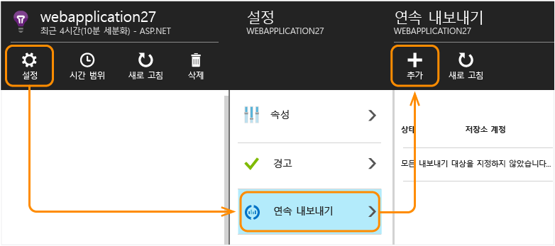
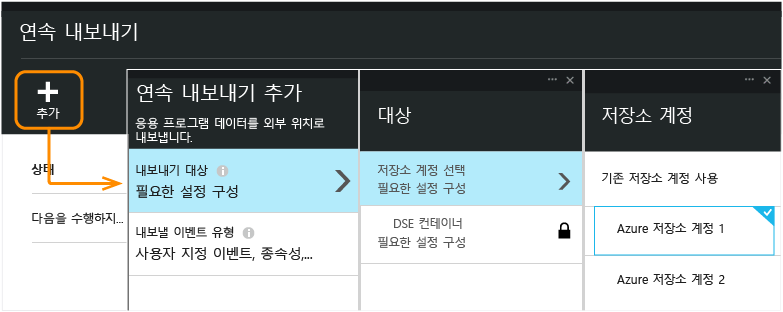
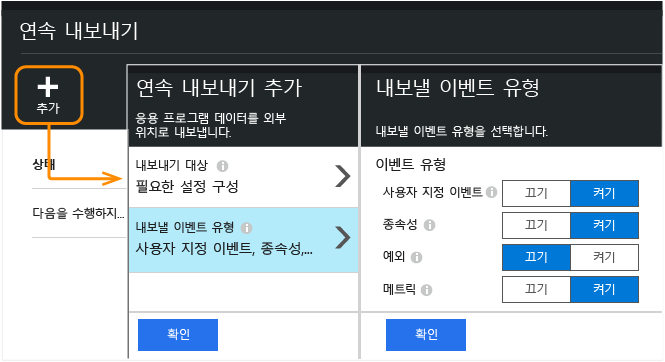
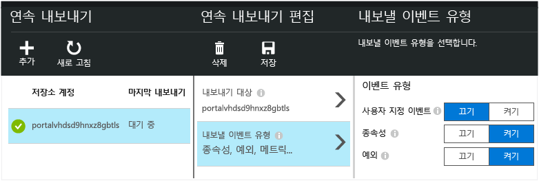
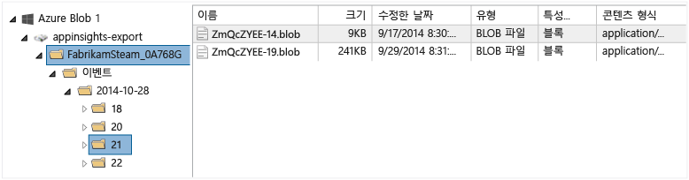
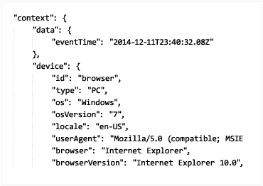
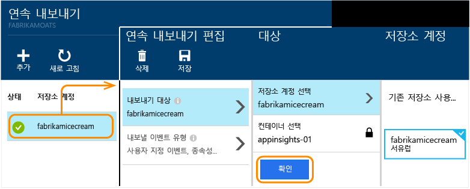

<properties 
	pageTitle="Application Insights에서 원격 분석 연속 내보내기" 
	description="Microsoft Azure에서 저장소에 진단 및 사용량 데이터를 내보내고 여기에서 다운로드합니다." 
	services="application-insights" 
    documentationCenter=""
	authors="alancameronwills" 
	manager="ronmart"/>

<tags 
	ms.service="application-insights" 
	ms.workload="tbd" 
	ms.tgt_pltfrm="ibiza" 
	ms.devlang="na" 
	ms.topic="article" 
	ms.date="04/27/2015" 
	ms.author="awills"/>
 
#Application Insights에서 원격 분석 내보내기

원격 분석에서 사용자 지정된 분석을 수행하시겠습니까? 또는 특정 속성으로 이벤트에 대한 이메일 경고를 받으시겠습니까? 그렇다면 연속 내보내기가 적합합니다. Application Insights 포털에 표시되는 이벤트는 JSON 형식으로 Microsoft Azure에서 저장소로 내보낼 수 있습니다. 여기에서 데이터를 다운로드하고 프로세스에 필요한 모든 코드를 작성할 수 있습니다.

## 연속 내보내기 설정

Application Insights 포털의 응용 프로그램 개요 블레이드에서 연속 내보내기를 엽니다.

내보내기를 추가하고 데이터를 넣으려는 [Azure 저장소 계정](../storage-introduction.md)을 선택합니다.

내보내려는 이벤트 유형을 선택합니다.

내보내기를 만들면 진행을 시작합니다. (내보내기를 만든 후에는 도착하는 데이터만 받습니다.)

나중에 이벤트 유형을 변경하려는 경우 내보내기를 편집하면 됩니다.

스트림을 중지하려면 사용 안함을 클릭합니다. 사용을 다시 클릭하면 새 데이터로 스트림이 다시 시작합니다. 내보내기를 사용하지 않는 동안 포털에 도착한 데이터는 받지 못합니다.

스트림을 영구적으로 중지하려면 내보내기를 삭제합니다. 이렇게 해도 저장소에서 데이터를 삭제하지 않습니다.
####내보내기를 추가 또는 변경할 수 있나요?

* 내보내기를 추가 또는 변경하려면 소유자, 참여자 또는 Application Insights 참여자 액세스 권한이 필요합니다. [역할에 대해 알아봅니다][roles].

## 어떤 이벤트를 얻나요?

내보낸 데이터는 다음을 제외하고 응용 프로그램에서 받은 원시 원격 분석입니다.

* 웹 테스트 결과는 현재 포함되지 않습니다. 
* 클라이언트 IP 주소에서 계산한 위치 데이터를 추가합니다.  

계산된 메트릭은 포함되지 않습니다. 예를들어 평균 CPU 사용률을 내보내지 않지만 평균이 계산된 곳에서 원시 원격 분석을 내보냅니다.

## 어떻게 해야 합니까?

[서버 탐색기](http://msdn.microsoft.com/library/azure/ff683677.aspx)와 같은 도구로 blob 저장소를 열면 blob 파일 집합이 포함된 컨테이너가 보입니다. 각 파일의 URI는 응용 프로그램-id/원격 분석-유형/날짜/시간입니다.

날짜 및 시간은 UTC이며 생성된 시간이 아니라 원격 분석이 저장소에 보관된 시기입니다. 따라서 데이터를 다운로드할 코드를 작성하는 경우 데이터를 선형으로 이동할 수 있습니다.

이 데이터를 프로그램 방식으로 다운로드하려면 [blob 저장소 REST API](../storage-dotnet-how-to-use-blobs.md#configure-access) 또는 [Azure PowerShell cmdlet](http://msdn.microsoft.com/library/azure/dn806401.aspx)을 사용합니다.

또는 데이터를 대규모로 관리하기 위해 파이프라인을 설정할 수 있는 [DataFactory](http://azure.microsoft.com/services/data-factory/)를 고려합니다.

매 시간마다 새 blob 작성을 시작합니다(이벤트를 받은 경우). 따라서 항상 이전 시간까지 처리해야 하지만 완료하도록 현재 시간 동안 대기해야 합니다.

[코드 샘플][exportcode]

## 데이터는 어떤 모양인가요?

* 각 blob은 다중 '\\n'-separated 행을 포함하는 텍스트 파일입니다.
* 각 행은 서식이 지정되지 않은 JSON 파일입니다. 가만히 앉아서 지켜보려는 경우 JSON 플러그인을 사용하여 메모장++과 같은 뷰어로 시도해 봅니다.

시간 기간은 틱 단위이며 10,000틱은 1ms입니다. 예를들어 이러한 값은 브라우저에서 요청을 보내는 데 10ms, 받는 데 30ms, 브라우저에서 페이지를 처리하는 데 1.8s를 보여줍니다.

	"sendRequest": {"value": 10000.0},
	"receiveRequest": {"value": 30000.0},
	"clientProcess": {"value": 17970000.0}

##어떻게 처리하나요?

작은 규모에서 데이터를 분리하고, 스프레드시트에서 읽는 등의 처리를 위한 코드를 작성할 수 있습니다. 예:

    private IEnumerable<T> DeserializeMany<T>(string folderName)
    {
      var files = Directory.EnumerateFiles(folderName, "*.blob", SearchOption.AllDirectories);
      foreach (var file in files)
      {
         using (var fileReader = File.OpenText(file))
         {
            string fileContent = fileReader.ReadToEnd();
            IEnumerable<string> entities = fileContent.Split('\n').Where(s => !string.IsNullOrWhiteSpace(s));
            foreach (var entity in entities)
            {
                yield return JsonConvert.DeserializeObject<T>(entity);
            }
         }
      }
    }

또는 SQL 데이터베이스로 이동할 수 있습니다([코드 샘플][exportcode] 참조).

더 큰 규모에서는 [HDInsight](http://azure.microsoft.com/services/hdinsight/)(클라우드의 Hadoop 클러스터)를 고려합니다. HDInsight는 빅 데이터를 관리 및 분석하는 다양한 기술을 제공합니다.

##이전 데이터 삭제
필요한 경우 스토리지 용량을 관리하고 오래된 데이터를 삭제해야 합니다.

##저장소 키를 다시 생성하는 경우...

저장소 키를 변경하는 경우 연속 내보내기 작업이 중지됩니다. Azure 계정에 알림이 표시됩니다.

연속 내보내기 블레이드를 열고 내보내기를 편집합니다. 내보내기 대상을 편집하되 선택한 것과 동일한 저장소는 그대로 둡니다. 확인을 클릭하여 확인합니다.

연속 내보내기가 다시 시작됩니다.

##코드 샘플

[SQL 데이터베이스로 내보낸 데이터 이동][exportcode]

##질문과 대답

* *하지만 원하는 모든 것은 차트의 일회성 다운로드입니다.*  
 
    별도록 하려고 작업 중입니다.

* *내보내기를 설정했지만 내 저장소에 데이터가 없습니다.*

    내보내기를 설정한 후 Application Insights가 앱에서 원격 분석을 받았나요? 새 데이터만 받게 됩니다.

* *내보내기를 설정하려 했지만 액세스가 거부되었습니다.*

    계정이 조직 소유인 경우 소유자 또는 참여자 그룹의 구성원이어야 합니다.

    <!-- Your account has to be either a paid-for account, or in the free trial period. -->

* *나만의 온-프레미스 저장소로 직접 내보낼 수 있나요?*

    아니요. 죄송합니다. 저희 내보내기 엔진은 데이터를 푸시하기 위해 크게 열린 목구멍에 의존할 수 밖에 없습니다.

* *내 저장소에 보관하는 데이터량에 제한이 있나요?*

    아니요. 내보내기를 삭제할 때까지 푸싱한 데이터를 유지합니다. blob 저장소에 대한 외부 제한에 도달하는 경우 중지하지만 제한은 상당히 큽니다. 사용자가 이용하는 저장소 크기는 사용자가 제어하기 나름입니다.

* *내 저장소 키를 다시 생성하거나 컨테이너의 이름을 변경한 경우에는 현재 내보내기가 동작하지 않습니다.*

    내보내기를 편집하고 내보내기 대상 블레이드를 엽니다. 이전과 마찬가지로 선택된 것과 동일한 저장소는 그대로 두고 확인을 클릭하여 확인합니다. 내보내기가 다시 시작됩니다. 지난 몇 일 이내에 변경된 경우 데이터가 손실됩니다.

* *내보내기를 일시 중지할 수 있나요?*

    예. 사용 안함을 클릭합니다.

<!--Link references-->

[exportcode]: app-insights-code-sample-export-telemetry-sql-database.md
[roles]: app-insights-resources-roles-access-control.md

<!--HONumber=54--> 