<properties 
	pageTitle="Application Insights를 시작합니다." 
	description="Application Insights를 사용하여 온-프레미스 또는 Microsoft Azure 웹 응용 프로그램의 사용량, 가용성 및 성능을 분석합니다." 
	services="application-insights" 
    documentationCenter=""
	authors="alancameronwills" 
	manager="ronmart"/>

<tags 
	ms.service="application-insights" 
	ms.workload="tbd" 
	ms.tgt_pltfrm="ibiza" 
	ms.devlang="na" 
	ms.topic="hero-article" 
	ms.date="04/26/2015" 
	ms.author="awills"/>

# Visual Studio Application Insights 시작하기

*Application Insights는 미리 보기 상태입니다.*

문제를 감지하고, 문제를 해결하고, 지속적으로 응용 프로그램을 개선합니다. 라이브 응용 프로그램의 모든 문제를 신속하게 진단합니다. 사용자가 어떤 작업을 하는지 확인합니다.

구성은 매우 간단하며 결과는 몇 분 내에 확인할 수 있습니다.

현재는 iOS, Android, Windows 앱과 J2EE 및 ASP.NET 웹 응용 프로그램, WCF 서비스를 지원합니다. 웹앱은 Azure 또는 고유한 온-프레미스 서버에서 실행될 수 있습니다. JavaScript SDK는 모든 웹 페이지에서 실행됩니다.

## 시작

이 맵 왼쪽에서 순서에 상관없이 어떤 조합의 진입점으로든 시작할 수 있습니다. 사용자에게 적합한 경로를 따릅니다.

Application Insights는 앱에 SDK를 추가하여 작동하며, [Azure 포털](http://portal.azure.com)에 원격 분석을 보냅니다. 지원되는 플랫폼, 언어, IDE의 다양한 조합에 대한 여러 SDK가 있습니다.

[Microsoft Azure](http://azure.com)의 계정이 필요합니다. 조직을 통해 이미 그룹 계정에 대한 액세스 권한이 있을 수 있습니다. 또는 종량제 계정을 만들 수 있습니다. Application Insights에는 무료 계층이 있으므로 앱이 많이 사용하게 될 때까지 지불할 필요가 없습니다. [가격 책정 페이지](https://azure.microsoft.com/pricing/details/application-insights/)를 검토합니다.

원하는 작업 | 수행할 작업 | 결과
---|---|---
 <a href="app-insights-start-monitoring-app-health-usage.md">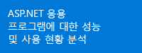</a> | <a href="app-insights-start-monitoring-app-health-usage.md">웹 프로젝트에 Application Insights SDK 추가</a>    | <a href="app-insights-start-monitoring-app-health-usage.md">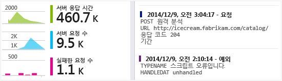</a>
<a href="app-insights-monitor-performance-live-website-now.md">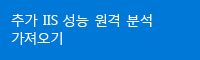</a> <a href="app-insights-monitor-performance-live-website-now.md">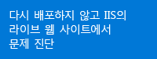</a>|<a href="app-insights-monitor-performance-live-website-now.md">IIS 서버에 상태 모니터 설치</a>    | <a href="app-insights-monitor-performance-live-website-now.md">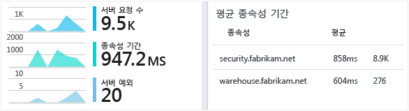</a>
<a href="insights-perf-analytics.md">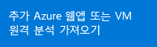</a>|<a href="insights-perf-analytics.md">Azure 웹앱 또는 VM에서 Insights 사용</a>    | 
<a href="app-insights-java-get-started.md">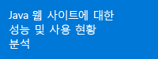</a>|<a href="app-insights-java-get-started.md">Java 프로젝트에 SDK 추가</a>  | <a href="app-insights-java-get-started.md">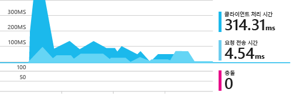</a>
|<a href="app-insights-web-track-usage.md">웹 페이지에 Application Insights 스크립트 삽입</a>  | <a href="app-insights-web-track-usage.md">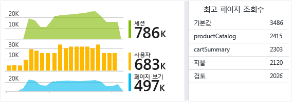</a>
|<a href="app-insights-monitor-web-app-availability.md">웹 테스트 만들기</a>  | <a href="app-insights-monitor-web-app-availability.md">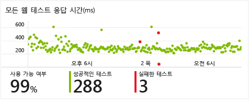</a>
<a href="app-insights-windows-get-started.md">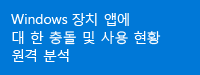</a>|<a href="app-insights-windows-get-started.md">장치 앱 프로젝트에 Application Insights 추가</a>  | <a href="app-insights-windows-get-started.md">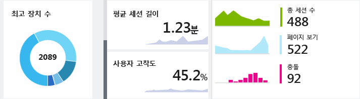</a>

## 지원 및 피드백

* 질문 및 문제:
 * [문제 해결][qna]
 * [MSDN 포럼](https://social.msdn.microsoft.com/Forums/vstudio/en-US/home?forum=ApplicationInsights)
 * [StackOverflow](http://stackoverflow.com/questions/tagged/ms-application-insights)
* 버그:
 * [연결](https://connect.microsoft.com/VisualStudio/Feedback/LoadSubmitFeedbackForm?FormID=6076)
* 제안:
 * [사용자 음성](http://visualstudio.uservoice.com/forums/121579-visual-studio/category/77108-application-insights)

## 동영상

> [AZURE.VIDEO 218]

> [AZURE.VIDEO usage-monitoring-application-insights]

> [AZURE.VIDEO performance-monitoring-application-insights]

<!--Link references-->

[qna]: app-insights-troubleshoot-faq.md

 

<!---HONumber=July15_HO3-->