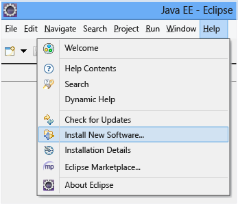
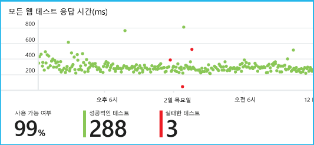

# <a name="get-started-with-application-insights-with-java-in-eclipse"></a>Eclipse에서 Java를 사용하여 Application Insights 시작하기
Application Insights SDK가 Java 웹 응용 프로그램에서 원격 분석을 전송하므로 사용량 및 성능을 분석할 수 있습니다. Application Insights용 Eclipse 플러그인이 프로젝트에 SDK를 자동으로 설치하므로 기본 원격 분석을 이용할 수 있을 뿐 아니라 사용자 지정 원격 분석 작성에 사용할 수 있습니다.   

## <a name="prerequisites"></a>필수 조건
현재 플러그 인은 Eclipse에서 Maven 프로젝트 및 동적 웹 프로젝트에 대해 작동합니다.
([다른 유형의 Java 프로젝트에 Application Insights를 추가합니다][java].)

필요한 사항:

* JRE 1.7 또는 1.8
* [Microsoft Azure](https://azure.microsoft.com/)구독.
* [Java EE Developers용 Eclipse IDE](http://www.eclipse.org/downloads/), Indigo 이상.
* Windows 7 이상 또는 Windows Server 2008 이상

Spring 프레임워크를 선호하는 경우 [Application Insights 가이드를 사용하도록 Spring Boot 이니셜라이저 앱을 구성](https://docs.microsoft.com/java/azure/spring-framework/configure-spring-boot-java-applicationinsights)해 보세요.

## <a name="install-the-sdk-on-eclipse-one-time"></a>Eclipse에 SDK를 설치합니다(한 번).
컴퓨터당 한 번씩만 수행해야 합니다. 이 단계는 SDK를 각 동적 웹 프로젝트에 추가할 수 있는 도구 키트를 설치합니다.

1. Eclipse에서 도움말, 새 소프트웨어 설치를 클릭합니다.

    
2. SDK는 Azure 도구 키트의 http://dl.microsoft.com/eclipse에 있습니다.
3. **모든 업데이트 사이트 문의...**

    

각 Java 프로젝트에 대한 나머지 단계를 따릅니다.

## <a name="create-an-application-insights-resource-in-azure"></a>Azure에서 Application Insights 리소스 만들기
1. [Azure Portal](https://portal.azure.com)에 로그인합니다.
2. 새 Application Insights 리소스를 만듭니다. Java 웹 응용 프로그램에 대한 응용 프로그램 종류를 설정합니다.  

      

4. 새 리소스의 계측 키를 찾습니다. 코드 프로젝트에 곧바로 붙여넣어야 합니다.  

      

## <a name="add-application-insights-to-your-project"></a>프로젝트에 Application Insights 추가
1. Java 웹 프로젝트의 상황에 맞는 메뉴에서 Application Insights를 추가합니다.

    
2. Azure 포털에서 가져온 계측 키를 붙여넣습니다.

    

키는 원격 분석의 모든 항목과 함께 전송되고 리소스에서 표시하도록 Application Insights에 알려줍니다.

## <a name="run-the-application-and-see-metrics"></a>응용 프로그램을 실행하고 메트릭을 참조하세요.
응용 프로그램을 실행합니다.

Microsoft Azure에서 Application Insights 리소스로 돌아갑니다.

HTTP 요청 데이터가 개요 블레이드에 표시됩니다. (없는 경우 몇 초 정도 기다린 다음 새로고침을 클릭합니다.)


차트를 클릭하면 더 자세한 메트릭을 볼 수 있습니다.


[메트릭에 대해 자세히 알아봅니다.][metrics]

또한 요청 속성 검토 시 요청 및 예외 사항과 관련된 원격 분석 이벤트를 볼 수 있습니다.


## <a name="client-side-telemetry"></a>클라이언트쪽 원격 분석
빠른 시작 블레이드에서 내 웹 페이지를 모니터링하는 코트 가져오기를 클릭합니다.


HTML 파일의 헤드에 있는 코드 조각을 삽입 합니다.

#### <a name="view-client-side-data"></a>클라이언트쪽 데이터 보기
업데이트 된 웹 페이지를 열고 사용 합니다. 1~2분 정도 기다린 후, Application Insights로 돌아가 사용량 블레이드를 엽니다. (개요 블레이드에서 아래로 스크롤하고 사용량을 클릭합니다.)

페이지 보기, 사용자 및 세션 메트릭이 사용량 블레이드에 표시됩니다.


[클라이언트 쪽 원격 분석 설정에 대해 자세히 알아봅니다.][usage]

## <a name="publish-your-application"></a>응용 프로그램 게시
이제 서버에 앱을 게시하고, 사람들이 사용하게 한 다음 포털에 표시되는 원격 분석을 확인합니다.

* 방화벽에서 응용 프로그램이 다음 포트에 원격 분석을 보내도록 허용하는지 확인합니다.

  * dc.services.visualstudio.com:443
  * dc.services.visualstudio.com:80
  * f5.services.visualstudio.com:443
  * f5.services.visualstudio.com:80
* Windows 서버에 다음을 설치합니다.

  * [Microsoft Visual C++ 재배포 가능 패키지](http://www.microsoft.com/download/details.aspx?id=40784)

    (이를 통해 성능 카운터를 사용할 수 있게 됩니다.)

## <a name="exceptions-and-request-failures"></a>예외 및 요청 실패
처리되지 않은 예외는 자동으로 수집됩니다.


다른 예외에 대한 데이터를 수집하려면 다음 두 옵션을 사용합니다.

* [사용자 코드에 TrackException에 대한 호출 삽입](app-insights-api-custom-events-metrics.md#trackexception)
* [서버에 Java 에이전트를 설치합니다](app-insights-java-agent.md). 감시 방법을 지정할 수 있습니다.

## <a name="monitor-method-calls-and-external-dependencies"></a>메서드 호출 및 외부 종속성 모니터링
[Java 에이전트를 설치](app-insights-java-agent.md) 하여 지정된 내부 메서드 및 JDBC를 통해 수행한 호출을 타이밍 데이터와 함께 기록합니다.

## <a name="performance-counters"></a>성능 카운터
개요 블레이드에서 아래로 스크롤하고 **서버** 타일을 클릭합니다. 다양한 성능 카운터가 표시됩니다.


### <a name="customize-performance-counter-collection"></a>성능 카운터 수집 사용자 지정
성능 카운터의 표준 집합 수집을 사용하지 않으려면 ApplicationInsights.xml 파일의 루트 노드 아래에 다음 코드를 추가합니다.

```XML

    <PerformanceCounters>
       <UseBuiltIn>False</UseBuiltIn>
    </PerformanceCounters>
```

### <a name="collect-additional-performance-counters"></a>추가 성능 카운터 수집
추가 성능 카운터가 수집되도록 지정할 수 있습니다.

#### <a name="jmx-counters-exposed-by-the-java-virtual-machine"></a>JMX 카운터(Java Virtual Machine을 통해 노출됨)

```XML

    <PerformanceCounters>
      <Jmx>
        <Add objectName="java.lang:type=ClassLoading" attribute="TotalLoadedClassCount" displayName="Loaded Class Count"/>
        <Add objectName="java.lang:type=Memory" attribute="HeapMemoryUsage.used" displayName="Heap Memory Usage-used" type="composite"/>
      </Jmx>
    </PerformanceCounters>
```

* `displayName` - Application Insights 포털에서 표시되는 이름입니다.
* `objectName` – JMX 개체 이름입니다.
* `attribute` - 가져올 JMX 개체 이름의 특성입니다.
* `type` (선택 사항) - JMX 개체 특성의 유형:
  * 기본값: int 또는 long과 같은 단순 유형입니다.
  * `composite`: 성능 카운터 데이터는 'Attribute.Data' 형식입니다.
  * `tabular`: 성능 카운터 데이터는 표 행 형식입니다.

#### <a name="windows-performance-counters"></a>Windows 성능 카운터
각 [Windows 성능 카운터](https://msdn.microsoft.com/library/windows/desktop/aa373083.aspx) 는 한 범주의 구성원입니다(필드가 클래스의 구성원인 것과 동일한 방식). 범주는 전역일 수 있으며, 번호 또는 이름이 지정된 인스턴스를 가질 수도 있습니다.

```XML

    <PerformanceCounters>
      <Windows>
        <Add displayName="Process User Time" categoryName="Process" counterName="%User Time" instanceName="__SELF__" />
        <Add displayName="Bytes Printed per Second" categoryName="Print Queue" counterName="Bytes Printed/sec" instanceName="Fax" />
      </Windows>
    </PerformanceCounters>
```

* displayName - Application Insights 포털에서 표시되는 이름입니다.
* categoryName – 이 성능 카운터와 관련된 성능 카운터 범주(성능 개체)입니다.
* counterName – 성능 카운터의 이름입니다.
* instanceName – 성능 카운터 범주 인스턴스입니다. 또는 범주가 단일 인스턴스를 포함하는 경우 빈 문자열("")의 이름입니다. categoryName이 프로세스이며 수입하려는 성능 카운터는 앱이 실행 중인 현재 JVM 프로세스에서 오는 경우, `"__SELF__"`을(를) 지정합니다.

성능 카운터에서가 [메트릭 탐색기][metrics]에서 사용자 지정 메트릭으로 보입니다.


### <a name="unix-performance-counters"></a>Unix 성능 카운터
* [Application Insights 플러그 인과 함께 collectd를 설치](app-insights-java-collectd.md) 하여 광범위한 시스템 및 네트워크 데이터를 얻을 수 있습니다.

## <a name="availability-web-tests"></a>가용성 웹 테스트
Application Insights는 일정한 간격으로 웹 사이트를 테스트하여 잘 실행되며 제대로 응답하는지 확인할 수 있습니다. [설정하려면][availability] 아래로 스크롤하여 가용성을 클릭합니다.


사이트가 다운되는 경우 응답 시간 차트는 물론 이메일 알림을 얻게 됩니다.



[가용성 웹 테스트에 대한 자세히 알아봅니다.][availability]

## <a name="diagnostic-logs"></a>진단 로그
추적에 Logback 또는 Log4J(v1.2 또는 v2.0)를 사용하는 경우 추적 로그를 탐색 및 검색할 수 있는 Application Insights에 추적 로그를 자동으로 전송할 수 있습니다.

[진단 로그에 대해 자세히 알아보기][javalogs]

## <a name="custom-telemetry"></a>사용자 지정 원격 분석
Java 웹 응용 프로그램에 몇 줄의 코드를 삽입하여 이를 사용하여 해당 작업을 수행하는 사용자를 확인하거나 진단 문제를 지원합니다.

웹 페이지 JavaScript와 서버쪽 Java에 모두 코드를 삽입할 수 있습니다.

[사용자 지정 원격 분석에 대해 자세히 알아보기][track]

## <a name="next-steps"></a>다음 단계
#### <a name="detect-and-diagnose-issues"></a>문제 감지 및 진단
* [웹 클라이언트 원격 분석을 추가][usage]하여 웹 클라이언트에서 성능 원격 분석을 가져올 수 있습니다.
* [웹 테스트를 설정][availability]하여 응용 프로그램이 라이브 상태로 유지되며 응답하는지 확인할 수 있습니다.
* [이벤트 및 로그를 검색][diagnostic]하여 문제를 진단할 수 있습니다.
* [Log4J 또는 Logback 추적 캡처][javalogs]

#### <a name="track-usage"></a>사용 현황 추적
* [웹 클라이언트 원격 분석을 추가][usage]하여 페이지 보기 및 기본 사용자 메트릭을 모니터링할 수 있습니다.
* [사용자 지정 이벤트 및 메트릭을 추적](app-insights-web-track-usage.md)하여 클라이언트와 서버에서 응용 프로그램이 어떻게 사용되는지 알아볼 수 있습니다.

<!--Link references-->

[availability]: app-insights-monitor-web-app-availability.md
[diagnostic]: app-insights-diagnostic-search.md
[java]: app-insights-java-get-started.md
[javalogs]: app-insights-java-trace-logs.md
[metrics]: app-insights-metrics-explorer.md
[track]: app-insights-api-custom-events-metrics.md
[usage]: app-insights-javascript.md
