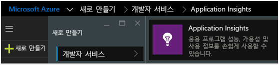
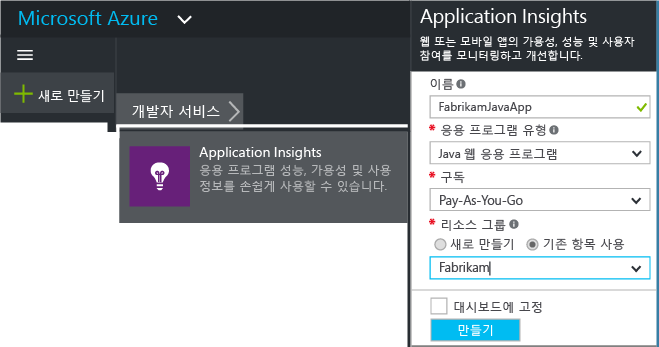
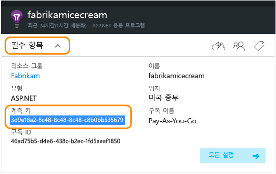
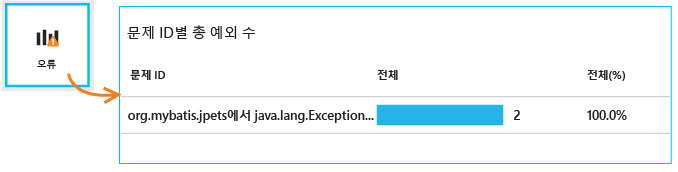
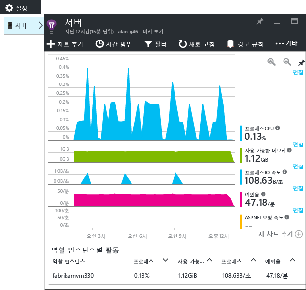

<properties
	pageTitle="Java 웹 프로젝트에서 Application Insights 시작 | Microsoft Azure"
	description="Application Insights로 Java 웹 사이트의 성능 및 사용량 모니터링"
	services="application-insights"
    documentationCenter="java"
	authors="alancameronwills"
	manager="douge"/>

<tags
	ms.service="application-insights"
	ms.workload="tbd"
	ms.tgt_pltfrm="ibiza"
	ms.devlang="na"
	ms.topic="get-started-article"
	ms.date="10/22/2015"
	ms.author="awills"/>

# Java 웹 프로젝트에서 Application Insights 시작하기

*Application Insights는 미리 보기 상태입니다.*

[AZURE.INCLUDE [app-insights-selector-get-started](../../includes/app-insights-selector-get-started.md)]

[Application Insights](https://azure.microsoft.com/services/application-insights/)는 라이브 응용 프로그램의 성능 및 사용을 이해하는 데 도움이 되는 확장 가능한 분석 서비스입니다. Application insights를 사용하여 [성능 문제 및 예외를 진단, 검색](app-insights-detect-triage-diagnose.md)하고 사용자가 수행할 작업을 추적하는 [코드를 작성][api]할 수 있습니다.

Application Insights는 Linux, Unix 또는 Windows 기반의 Java 앱을 지원합니다.

필요한 사항:

* Oracle JRE 1.6 이상 또는 Zulu JRE 1.6 이상
* [Microsoft Azure](http://azure.microsoft.com/) 구독. ([무료 평가판](http://azure.microsoft.com/pricing/free-trial/)으로 시작할 수 있음.)

*이미 라이브 상태인 웹앱이 있는 경우 다른 절차에 따라 [웹 서버에서 런타임으로 SDK를 추가](app-insights-java-live.md)할 수 있습니다. 해당 다른 절차는 코드를 다시 작성할 필요가 없지만 사용자 활동을 추적하는 코드를 작성하는 옵션이 없습니다.*

## 1\. Application Insights 계측 키 가져오기

1. [Microsoft Azure 포털](https://portal.azure.com)에 로그인합니다.
2. 새 Application Insights 리소스를 만듭니다.

    
3. Java 웹 응용 프로그램에 대한 응용 프로그램 종류를 설정합니다.

    
4. 새 리소스의 계측 키를 찾습니다. 코드 프로젝트에 곧바로 붙여넣어야 합니다.

    

## 2\. 프로젝트에 Java용 Aplication Insights SDK 추가

*프로젝트에 적합한 방법을 선택합니다.*

#### Eclipse에서 동적 웹 프로젝트를 만드는 경우...

[Java 플러그인용 Application Insights SDK][eclipse]를 사용합니다.

#### Maven을 사용하는 경우...

빌드에 Maven을 사용하도록 프로젝트가 이미 설정된 경우 pom.xml 파일에 다음 코드를 병합합니다.

그런 다음 프로젝트 종속성을 새로 고쳐 다운로드한 이진을 가져옵니다.

    <repositories>
       <repository>
          <id>central</id>
          <name>Central</name>
          <url>http://repo1.maven.org/maven2</url>
       </repository>
    </repositories>

    <dependencies>
      <dependency>
        <groupId>com.microsoft.azure</groupId>
        <artifactId>applicationinsights-web</artifactId>
        <!-- or applicationinsights-core for bare API -->
        <version>[1.0,)</version>
      </dependency>
    </dependencies>

* *빌드 또는 체크섬 유효성 검사 오류가 있는 경우* `<version>1.0.n</version>`과(와) 같은 특정 버전을 사용해 봅니다. [SDK 릴리스 정보](app-insights-release-notes-java.md) 또는 [Maven 아티팩트](http://search.maven.org/#search%7Cga%7C1%7Capplicationinsights)에서 최신 버전을 찾을 수 있습니다.
* *새 SDK로 업데이트해야 하는 경우* 프로젝트의 종속성을 새로 고칩니다.

#### Gradle을 사용하는 경우...

빌드에 Gradle을 사용하도록 프로젝트가 이미 설정된 경우 다음 코드를 build.gradle 파일에 병합합니다.

그런 다음 프로젝트 종속성을 새로 고쳐 다운로드한 이진을 가져옵니다.

    repositories {
      mavenCentral()
    }

    dependencies {
      compile group: 'com.microsoft.azure', name: 'applicationinsights-web', version: '1.+'
      // or applicationinsights-core for bare API
    }

* *빌드 또는 체크섬 유효성 검사 오류가 있나요? 다음과 같은 특정 버전을 사용해 봅니다.* `version:'1.0.n'`. *[SDK 릴리스 정보](app-insights-release-notes-java.md)에서 최신 버전을 찾을 수 있습니다.*
* *새 SDK로 업데이트하려면*
 * 프로젝트의 종속성을 새로 고칩니다.

#### 기타...

수동으로 SDK 추가:

1. [Java용 Application Insights SDK](https://azuredownloads.blob.core.windows.net/applicationinsights/sdk.html)를 다운로드합니다.
2. zip 파일에서 이진 파일을 추출하고 프로젝트에 추가합니다.

### 질문...

* *zip에서 `-core` 및 `-web` 구성 요소 간에는 어떤 관계가 있나요?*

 * `applicationinsights-core`는 최소한의 API를 제공합니다. 항상 필요합니다.
 * `applicationinsights-web`은 HTTP 요청 수와 응답 시간을 추적하는 메트릭을 제공합니다. 사용자가 원격 분석 자동 수집을 원하지 않는 경우 생략할 수 있습니다. 예를 들어 사용자 자신의 코드를 작성하려는 경우입니다.

* *변경 내용을 게시하는 경우 해당 SDK를 업데이트하려면*
 * 최신 버전의 [Java용 Application Insights SDK](http://dl.windowsazure.com/lib/applicationinsights/javabin/sdk.zip)를 다운로드하여 이전 버전을 대체합니다.
 * 변경 내용은 [SDK 릴리스 정보](app-insights-release-notes-java.md)에 설명되어 있습니다.

## 3\. Application Insights .xml 파일 추가

ApplicationInsights.xml을 프로젝트의 리소스 폴더에 추가하거나 ApplicationInsights.xml이 프로젝트의 배포 클래스 경로에 추가되었는지 확인합니다. 다음 XML을 복사합니다.

Azure 포털에서 가져온 계측 키를 대체합니다.

    <?xml version="1.0" encoding="utf-8"?>
    <ApplicationInsights xmlns="http://schemas.microsoft.com/ApplicationInsights/2013/Settings" schemaVersion="2014-05-30">

      <!-- The key from the portal: -->

      <InstrumentationKey>** Your instrumentation key **</InstrumentationKey>

      <!-- HTTP request component (not required for bare API) -->

      <TelemetryModules>
        <Add type="com.microsoft.applicationinsights.web.extensibility.modules.WebRequestTrackingTelemetryModule"/>
        <Add type="com.microsoft.applicationinsights.web.extensibility.modules.WebSessionTrackingTelemetryModule"/>
        <Add type="com.microsoft.applicationinsights.web.extensibility.modules.WebUserTrackingTelemetryModule"/>
      </TelemetryModules>

      <!-- Events correlation (not required for bare API) -->
      <!-- These initializers add context data to each event -->

      <TelemetryInitializers>
        <Add   type="com.microsoft.applicationinsights.web.extensibility.initializers.WebOperationIdTelemetryInitializer"/>
        <Add type="com.microsoft.applicationinsights.web.extensibility.initializers.WebOperationNameTelemetryInitializer"/>
        <Add type="com.microsoft.applicationinsights.web.extensibility.initializers.WebSessionTelemetryInitializer"/>
        <Add type="com.microsoft.applicationinsights.web.extensibility.initializers.WebUserTelemetryInitializer"/>
        <Add type="com.microsoft.applicationinsights.web.extensibility.initializers.WebUserAgentTelemetryInitializer"/>

      </TelemetryInitializers>
    </ApplicationInsights>

* 계측 키는 원격 분석의 모든 항목과 함께 전송되며 리소스에서 표시하도록 Application Insights에 알려줍니다.
* HTTP 요청 구성 요소는 선택 사항입니다. 자동으로 포털에 요청 및 응답 시간에 대한 원격 분석을 보냅니다.
* 이벤트 상관 관계는 HTTP 요청 구성 요소에 추가됩니다. 이는 서버가 수신하는 요청마다 식별자를 할당하며 'Operation.Id' 속성으로 원격 분석의 모든 항목에 이를 속성으로 추가합니다. [진단 검색][diagnostic]에서 필터를 설정하여 각 요청과 연결된 원격 분석의 상관 관계를 지정할 수 있습니다.

## 4\. HTTP 필터 추가

마지막 구성 단계는 HTTP 요청 구성 요소가 각 웹 요청을 로그하도록 허용합니다. (완전한 API를 원하는 경우에는 요청되지 않습니다.)

프로젝트에서 web.xml 파일을 찾아 열고, 응용 프로그램 필터가 구성된 웹앱 노드 아래에 다음 코드를 병합합니다.

가장 정확한 결과를 얻으려면 필터를 다른 모든 필터 전에 매핑해야 합니다.

    <filter>
      <filter-name>ApplicationInsightsWebFilter</filter-name>
      <filter-class>
        com.microsoft.applicationinsights.web.internal.WebRequestTrackingFilter
      </filter-class>
    </filter>
    <filter-mapping>
       <filter-name>ApplicationInsightsWebFilter</filter-name>
       <url-pattern>/*</url-pattern>
    </filter-mapping>

#### MVC 3.1 이상을 사용하는 경우

Application Insights 패키지를 포함하도록 이러한 요소 편집:

    <context:component-scan base-package=" com.springapp.mvc, com.microsoft.applicationinsights.web.spring"/>

    <mvc:interceptors>
        <mvc:interceptor>
            <mvc:mapping path="/**"/>
            <bean class="com.microsoft.applicationinsights.web.spring.RequestNameHandlerInterceptorAdapter" />
        </mvc:interceptor>
    </mvc:interceptors>

#### Struts 2를 사용하는 경우

Struts 구성 파일에 이 항목 추가(일반적으로 struts.xml 또는 struts-default.xml이라고 함):

     <interceptors>
       <interceptor name="ApplicationInsightsRequestNameInterceptor" class="com.microsoft.applicationinsights.web.struts.RequestNameInterceptor" />
     </interceptors>
     <default-interceptor-ref name="ApplicationInsightsRequestNameInterceptor" />

(기본 스택에 정의된 인터셉터가 있는 경우 해당 인터셉터를 스택에 추가하면 됩니다.)

## 5\. 응용 프로그램 실행

응용 프로그램을 디버그 모드로 개발 컴퓨터에서 실행하거나 서버에 게시합니다.

## 6\. Application Insights에서 원격 분석 보기

[Microsoft Azure 포털](https://portal.azure.com)의 Application Insights 리소스로 돌아갑니다.

HTTP 요청 데이터가 개요 블레이드에 표시됩니다. (없는 경우 몇 초 정도 기다린 다음 새로고침을 클릭합니다.)

차트를 클릭하면 더 자세한 메트릭을 볼 수 있습니다.

또한 요청 속성 검토 시 요청 및 예외 사항과 관련된 원격 분석 이벤트를 볼 수 있습니다.

[메트릭에 대해 자세히 알아봅니다.][metrics]

#### 스마트 주소 이름 계산

Application Insights는 MVC 응용 프로그램에 대한 HTTP 요청 형식을 다음과 같이 가정합니다. `VERB controller/action`

예를들어, `GET Home/Product/f9anuh81`, `GET Home/Product/2dffwrf5` 및 `GET Home/Product/sdf96vws`은(는) `GET Home/Product`(으)로 그룹화됩니다.

이를 통해 요청 수와 같은 의미 있는 집계 및 요청에 대한 평균 실행 시간을 사용할 수 있습니다.

## 5\. 서버에 앱 설치

이제 서버에 앱을 게시하고, 사람들이 사용하게 한 다음 포털에 표시되는 원격 분석을 확인합니다.

* 방화벽에서 응용 프로그램이 다음 포트에 원격 분석을 보내도록 허용하는지 확인합니다.

 * dc.services.visualstudio.com:443
 * dc.services.visualstudio.com:80
 * f5.services.visualstudio.com:443
 * f5.services.visualstudio.com:80

* Windows 서버에 다음을 설치합니다.

 * [Microsoft Visual C++ 재배포 가능 패키지](http://www.microsoft.com/download/details.aspx?id=40784)

    (이를 통해 성능 카운터를 사용할 수 있게 됩니다.)

## 예외 및 요청 실패

처리되지 않은 예외는 자동으로 수집됩니다.

다른 예외에 대한 데이터를 수집하려면 다음 두 옵션을 사용합니다.

* [사용자 코드에 trackException()에 대한 호출을 삽입합니다][apiexceptions]. 
* [서버에 Java 에이전트를 설치합니다](app-insights-java-agent.md). 감시 방법을 지정할 수 있습니다.

## 메서드 호출 및 외부 종속성 모니터링

[Java 에이전트를 설치](app-insights-java-agent.md)하여 지정된 내부 메서드 및 JDBC를 통해 수행한 호출을 타이밍 데이터와 함께 기록할 수 있습니다.

## 성능 카운터

**서버** 타일을 클릭하면 다양한 성능 카운터가 표시됩니다.

### 성능 카운터 수집 사용자 지정

성능 카운터의 표준 집합 수집을 사용하지 않으려면 ApplicationInsights.xml 파일의 루트 노드 아래에 다음 코드를 추가합니다.

    <PerformanceCounters>
       <UseBuiltIn>False</UseBuiltIn>
    </PerformanceCounters>

### 추가 성능 카운터 수집

추가 성능 카운터가 수집되도록 지정할 수 있습니다.

#### JMX 카운터(Java 가상 컴퓨터를 통해 노출됨)

    <PerformanceCounters>
      <Jmx>
        <Add objectName="java.lang:type=ClassLoading" attribute="TotalLoadedClassCount" displayName="Loaded Class Count"/>
        <Add objectName="java.lang:type=Memory" attribute="HeapMemoryUsage.used" displayName="Heap Memory Usage-used" type="composite"/>
      </Jmx>
    </PerformanceCounters>

*	`displayName` - Application Insights 포털에서 표시되는 이름입니다.
*	`objectName` – JMX 개체 이름입니다.
*	`attribute` - 가져올 JMX 개체 이름의 특성입니다.
*	`type` (선택 사항) - JMX 개체 특성의 유형:
 *	기본값: int 또는 long과 같은 단순 유형입니다.
 *	`composite`: 성능 카운터 데이터는 'Attribute.Data' 형식입니다.
 *	`tabular`: 성능 카운터 데이터는 표 행 형식입니다.

#### Windows 성능 카운터

각 [Windows 성능 카운터](https://msdn.microsoft.com/library/windows/desktop/aa373083.aspx)는 한 범주의 구성원입니다(필드가 클래스의 구성원인 것과 동일한 방식). 범주는 전역일 수 있으며, 번호 또는 이름이 지정된 인스턴스를 가질 수도 있습니다.

    <PerformanceCounters>
      <Windows>
        <Add displayName="Process User Time" categoryName="Process" counterName="%User Time" instanceName="__SELF__" />
        <Add displayName="Bytes Printed per Second" categoryName="Print Queue" counterName="Bytes Printed/sec" instanceName="Fax" />
      </Windows>
    </PerformanceCounters>

*	displayName - Application Insights 포털에서 표시되는 이름입니다.
*	categoryName – 이 성능 카운터와 관련된 성능 카운터 범주(성능 개체)입니다.
*	counterName – 성능 카운터의 이름입니다.
*	instanceName – 성능 카운터 범주 인스턴스입니다. 또는 범주가 단일 인스턴스를 포함하는 경우 빈 문자열("")의 이름입니다. categoryName이 프로세스이며 수입하려는 성능 카운터는 앱이 실행 중인 현재 JVM 프로세스에서 오는 경우, `"__SELF__"`을(를) 지정합니다.

성능 카운터에서가 [메트릭 탐색기][metrics]에서 사용자 지정 메트릭으로 보입니다.

### Unix 성능 카운터

* [Application Insights 플러그 인과 함께 collectd를 설치](app-insights-java-collectd.md)하여 광범위한 시스템 및 네트워크 데이터를 얻을 수 있습니다.

## 사용자 및 세션 데이터 가져오기

이제 웹 서버에서 원격 분석을 보내려 합니다. 응용 프로그램을 전체적으로 파악하기 위해 모니터링을 추가할 수 있습니다.

* [웹 페이지에 원격 분석을 추가][usage]하여 페이지 보기 및 사용자 메트릭을 모니터링합니다.
* [웹 테스트를 설정][availability]하여 응용 프로그램이 라이브 상태로 유지되며 응답하는지 확인할 수 있습니다.

## 로그 추적 캡처

Application Insights를 사용하여 Log4J, Logback 또는 다른 로깅 프레임 워크에서 분리 및 분할할 수 있습니다. HTTP 요청 및 기타 원격 분석과 로그를 연관지을 수 있습니다. [방법을 알아봅니다][javalogs].

## 사용자 고유의 원격 분석 전송

이제 SDK를 설치한 했으므로 API를 사용하여 사용자 고유의 원격 분석을 전송할 수 있습니다.

* [사용자 지정 이벤트 및 메트릭을 추적][api]하여 사용자가 응용 프로그램으로 수행하는 것을 알아볼 수 있습니다.
* [이벤트 및 로그를 검색][diagnostic]하여 문제를 진단할 수 있습니다.

## 가용성 웹 테스트

Application Insights는 일정한 간격으로 웹 사이트를 테스트하여 잘 실행되며 제대로 응답하는지 확인할 수 있습니다. 개요 블레이드에서 빈 웹 테스트 차트를 클릭하여 설치하면 공용 URL을 제공합니다.

사이트가 다운되는 경우 응답 시간 차트는 물론 이메일 알림을 얻게 됩니다.

[가용성 웹 테스트에 대한 자세히 알아봅니다.][availability]

## 질문이 있으십니까? 문제가 있습니까?

[Java 문제 해결](app-insights-java-troubleshoot.md)

## 다음 단계

자세한 내용은 [Java개발자 센터](/develop/java/)를 참조하세요.

<!--Link references-->

[api]: app-insights-api-custom-events-metrics.md
[apiexceptions]: app-insights-api-custom-events-metrics.md#track-exception
[availability]: app-insights-monitor-web-app-availability.md
[diagnostic]: app-insights-diagnostic-search.md
[eclipse]: app-insights-java-eclipse.md
[javalogs]: app-insights-java-trace-logs.md
[metrics]: app-insights-metrics-explorer.md
[usage]: app-insights-web-track-usage.md

<!---HONumber=Nov15_HO2-->