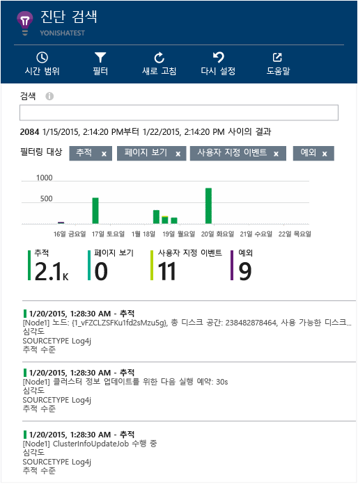

<properties 
	pageTitle="Application Insights에서 Java 추적 로그 탐색" 
	description="Application Insights에서 검색 Log4J 또는 Logback 추적 검색" 
	services="application-insights" 
    documentationCenter="java"
	authors="alancameronwills" 
	manager="kamrani"/>

<tags 
	ms.service="application-insights" 
	ms.workload="tbd" 
	ms.tgt_pltfrm="ibiza" 
	ms.devlang="na" 
	ms.topic="article" 
	ms.date="03/05/2015" 
	ms.author="awills"/>

#Application Insights에서 Java 추적 로그 탐색

추적에 Logback 또는 Log4J(v1.2 또는 v2.0)를 사용하는 경우 추적 로그를 탐색 및 검색할 수 있는 Application Insights에 추적 로그를 자동으로 전송할 수 있습니다.

아직 수행하지 않은 경우 [Java용 Application Insights SDK][java]를 설치합니다.

##프로젝트에 로깅 라이브러리 추가

*프로젝트에 적합한 방법을 선택합니다.*

####Maven을 사용하는 경우...

빌드에 Maven을 사용하도록 프로젝트가 이미 설정된 경우 pom.xml 파일에 다음 코드 조각을 추가합니다.

그런 다음 프로젝트 종속성을 새로 고쳐 다운로드한 이진을 가져옵니다.

*Logback*

    <dependencies>
       <dependency>
          <groupId>com.microsoft.azure</groupId>
          <artifactId>applicationinsights-logging-logback</artifactId>
          <version>[0.9,)</version>
       </dependency>
    </dependencies>

*Log4J v2.0*

    <dependencies>
       <dependency>
          <groupId>com.microsoft.azure</groupId>
          <artifactId>applicationinsights-logging-log4j2</artifactId>
          <version>[0.9,)</version>
       </dependency>
    </dependencies>

*Log4J v1.2*

    <dependencies>
       <dependency>
          <groupId>com.microsoft.azure</groupId>
          <artifactId>applicationinsights-logging-log4j1_2</artifactId>
          <version>[0.9,)</version>
       </dependency>
    </dependencies>

####Gradle을 사용하는 경우...

빌드에 Gradle을 사용하도록 프로젝트가 이미 설정된 경우 다음 줄 중 하나를 build.gradle 파일의 `dependencies` 그룹에 추가합니다.

그런 다음 프로젝트 종속성을 새로 고쳐 다운로드한 이진을 가져옵니다.

**Logback**

    compile group: 'com.microsoft.azure', name: 'applicationinsights-logging-logback', version: '0.9.+'

**Log4J v2.0**

    compile group: 'com.microsoft.azure', name: 'applicationinsights-logging-log4j2', version: '0.9.+'

**Log4J v1.2**

    compile group: 'com.microsoft.azure', name: 'applicationinsights-logging-log4j1_2', version: '0.9.+'

####기타...

적합한 어펜더를 다운로드 및 추출한 다음 적합한 라이브러리를 프로젝트에 추가합니다.

로거 | 다운로드 | 라이브러리
----|----|----
Logback|[Logback 어펜더를 사용한 SDK](http://dl.msopentech.com/applicationinsights/javabin/logbackAppender.zip)|applicationinsights-logging-logback
Log4J v2.0|[Log4J v2 어펜더를 사용한 SDK](http://dl.msopentech.com/applicationinsights/javabin/log4j2Appender.zip)|applicationinsights-logging-log4j2 
Log4j v1.2|[Log4J v1.2 어펜더를 사용한 SDK](http://dl.msopentech.com/applicationinsights/javabin/log4j1_2Appender.zip)|applicationinsights-logging-log4j1_2 

##로깅 프레임워크에 어펜더 추가

추적 가져오기를 시작하려면 관련 코드 조각을 Log4J 및 Logback 구성 파일과 병합합니다.

*Logback*

    <appender name="aiAppender" 
      class="com.microsoft.applicationinsights.logback.ApplicationInsightsAppender">
    </appender>
    <root level="trace">
      <appender-ref ref="aiAppender" />
    </root>

*Log4J v2.0*

    
    <Appenders>
      <ApplicationInsightsAppender name="aiAppender" />
    </Appenders>
    <Loggers>
      <Root level="trace">
        <AppenderRef ref="aiAppender"/>
      </Root>
    </Loggers>

*Log4J v1.2*

    <appender name="aiAppender" 
         class="com.microsoft.applicationinsights.log4j.v1_2.ApplicationInsightsAppender">
    </appender>
    <root>
      <priority value ="trace" />
      <appender-ref ref="aiAppender" />
    </root>

Application Insights 어펜더는 루트 로거만이 아니라 구성된 모든 로거에 의해 참조될 수 있습니다(위의 코드 샘플에 표시).

##Application Insights 포털에서 추적 탐색

이제 Application Insights에 추적을 전송하도록 프로젝트를 구성했으며 [진단 검색][diagnostic] 블레이드의 Application Insights 포털에서 이러한 추적을 보고 검색할 수 있습니다.

##다음 단계

[진단 검색][diagnostic]

<!--Link references-->

[diagnostic]: app-insights-diagnostic-search.md
[java]: app-insights-java-get-started.md

<!--HONumber=54--> 