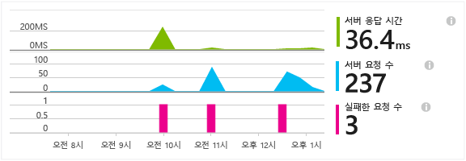
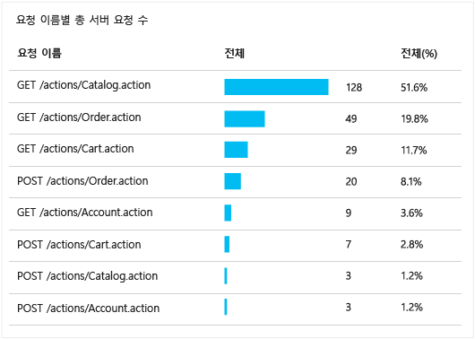
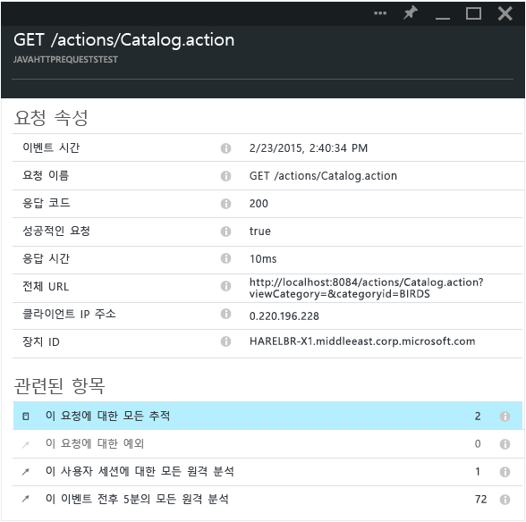

<properties 
	pageTitle="Java 웹 응용 프로그램에서 HTTP 요청 추적" 
	description="Application Insights를 사용하면 웹 Java 웹 응용 프로그램의 성능을 측정할 수 있습니다." 
	services="application-insights" 
    documentationCenter=""
	authors="alancameronwills" 
	manager="douge"/>

<tags 
	ms.service="application-insights" 
	ms.workload="tbd" 
	ms.tgt_pltfrm="ibiza" 
	ms.devlang="na" 
	ms.topic="article" 
	ms.date="10/21/2015" 
	ms.author="awills"/>
 
# Java 웹 응용 프로그램에서 HTTP 요청 추적

Java 웹 응용 프로그램을 실행하는 경우, 요청된 리소스, 실패한 리소스 및 응답 시간, Application Insights 포털의 모든 것과 같이 응용 프로그램에 보낸 HTTP 요청에 대한 정보를 볼 수 있습니다.

아직 수행하지 않은 경우 [Java용 Application Insights SDK][java]를 설치합니다.

## 프로젝트에 이진 파일 추가

*프로젝트에 적합한 방법을 선택합니다.*

### Maven을 사용하는 경우...

빌드에 Maven을 사용하도록 프로젝트가 이미 설정된 경우 pom.xml 파일에 다음 코드 조각을 병합합니다.

그런 다음 프로젝트 종속성을 새로 고쳐 다운로드한 이진을 가져옵니다.

    <dependencies>
      <dependency>
        <groupId>com.microsoft.azure</groupId>
        <artifactId>applicationinsights-web</artifactId>
        <version>[1.0,)</version>
      </dependency>
    </dependencies>

### Gradle을 사용하는 경우...

빌드에 Gradle을 사용하도록 프로젝트가 이미 설정된 경우 다음 코드 조각을 build.gradle 파일에 병합합니다.

그런 다음 프로젝트 종속성을 새로 고쳐 다운로드한 이진을 가져옵니다.

    dependencies {
      compile group: 'com.microsoft.azure', name: 'applicationinsights-web', version: '1.0.+'
    }

## 프로젝트에 Application Insights HTTP 필터 추가

프로젝트에서 web.xml 파일을 찾아 열고, 응용 프로그램 필터가 구성된 웹 앱 노드 아래 다음 코드 조각을 병합합니다.

가장 정확한 결과를 얻으려면 필터를 다른 모든 필터 전에 매핑해야 합니다.

    <filter>
      <filter-name>ApplicationInsightsWebFilter</filter-name>
      <filter-class>
        com.microsoft.applicationinsights.web.internal.WebRequestTrackingFilter
      </filter-class>
    </filter>
    <filter-mapping>
       <filter-name>ApplicationInsightsWebFilter</filter-name>
       <url-pattern>/*</url-pattern>
    </filter-mapping>

## 프로젝트에 HTTP 모듈 추가

프로젝트에서 ApplicationInsights.xml 파일을 찾아 열고 <TelemetryModules> 요소 아래 다음 코드 조각을 병합합니다.

이 파일에 <TelemetryModules> 요소가 없는 경우 <ApplicationInsights> 요소 아래에 추가합니다.

    <TelemetryModules>
      <Add type="com.microsoft.applicationinsights.web.extensibility.modules.WebRequestTrackingTelemetryModule"/>
      <Add type="com.microsoft.applicationinsights.web.extensibility.modules.WebSessionTrackingTelemetryModule"/>
      <Add type="com.microsoft.applicationinsights.web.extensibility.modules.WebUserTrackingTelemetryModule"/>
    </TelemetryModules>

## 이벤트 상관 관계에 대한 원격 분석 이니셜라이저 추가

이벤트 상관 관계와 함께, 이러한 원격 분석 이벤트 각각에 연결된 작업 ID 속성을 사용하여 요청 처리 중 전송된 모든 원격 분석 이벤트아 HTTP 요청 사이를 연결할 수 있습니다. 이를 통해 호출된 모든 이벤트와 함께 HTTP 요청을 탐색하고 진단 및 문제 해결을 용이하게 합니다.

프로젝트에서 ApplicationInsights.xml 파일을 찾아 열고 <TelemetryInitializers> 요소 아래 다음 코드 조각을 병합합니다.

이 파일에 < TelemetryInitializers> 요소가 없는 경우 <ApplicationInsights> 요소 아래에 추가합니다.

    <TelemetryInitializers>
     <Add  type="com.microsoft.applicationinsights.web.extensibility.initializers.WebOperationIdTelemetryInitializer"/>
     <Add type="com.microsoft.applicationinsights.web.extensibility.initializers.WebOperationNameTelemetryInitializer"/>
     <Add type="com.microsoft.applicationinsights.web.extensibility.initializers.WebSessionTelemetryInitializer"/>
     <Add type="com.microsoft.applicationinsights.web.extensibility.initializers.WebUserTelemetryInitializer"/>
     <Add type="com.microsoft.applicationinsights.web.extensibility.initializers.WebUserAgentTelemetryInitializer"/>
    </TelemetryInitializers>

## Application Insights에서 요청 정보 보기

응용 프로그램을 실행합니다.

Microsoft Azure에서 Application Insights 리소스로 돌아갑니다.

HTTP 요청 데이터가 개요 블레이드에 표시됩니다. (없는 경우 몇 초 정도 기다린 다음 새로고침을 클릭합니다.)

 

차트를 클릭하면 더 자세한 메트릭을 볼 수 있습니다.

[메트릭에 대해 자세히 알아봅니다.][metrics]

 

또한 요청 속성 검토 시 요청 및 예외 사항과 관련된 원격 분석 이벤트를 볼 수 있습니다.
 

## 다음 단계

* [이벤트 및 로그를 검색][diagnostic]하여 문제를 진단할 수 있습니다.
* [Log4J 또는 Logback 추적 캡처][javalogs]

<!--Link references-->

[diagnostic]: app-insights-diagnostic-search.md
[java]: app-insights-java-get-started.md
[javalogs]: app-insights-java-trace-logs.md
[metrics]: app-insights-metrics-explorer.md

 

<!---HONumber=Nov15_HO1-->