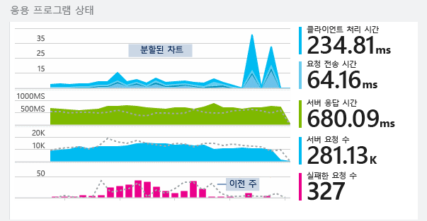
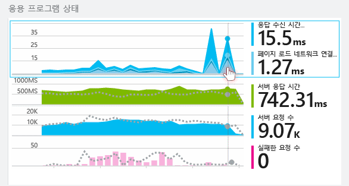
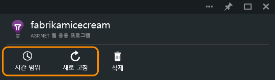
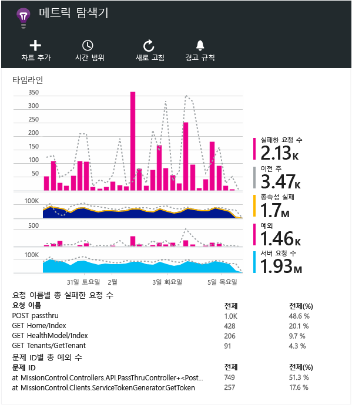
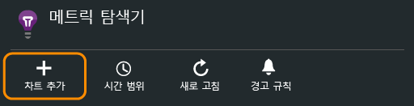
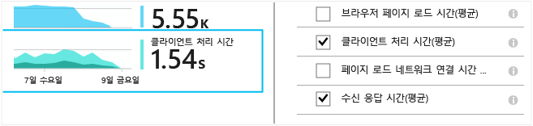
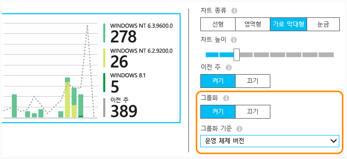
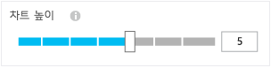
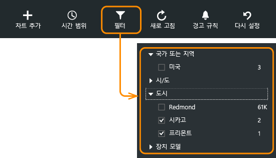
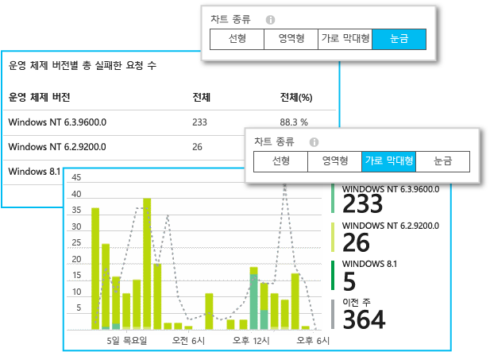

<properties 
	pageTitle="Application Insights에서 메트릭 탐색" 
	description="Application Insights를 사용하여 온-프레미스 또는 Microsoft Azure 웹 응용 프로그램의 사용량, 가용성 및 성능을 분석합니다." 
	services="application-insights" 
    documentationCenter=""
	authors="alancameronwills" 
	manager="douge"/>

<tags 
	ms.service="application-insights" 
	ms.workload="tbd" 
	ms.tgt_pltfrm="ibiza" 
	ms.devlang="na" 
	ms.topic="article" 
	ms.date="06/17/2015" 
	ms.author="awills"/>
 
# Application Insights에서 메트릭 탐색

[Application Insights][start]의 메트릭은 응용 프로그램의 원격 분석에서 전송된 측정된 값 및 이벤트 수입니다. 성능 문제를 감지하고 응용 프로그램 사용 방식의 추세를 볼 수 있습니다. 다양한 표준 메트릭이 있으며 사용자 고유의 사용자 지정 메트릭 및 이벤트를 만들 수도 있습니다.

메트릭 및 이벤트 수는 합계, 평균 또는 개수 등의 집계된 값에 대한 차트에 표시됩니다.

예를들어, 웹 응용 프로그램에 Application Insights를 추가하는 경우 다음은 개요 위쪽에서 보이는 내용입니다.

일부 차트는 다음과 같이 구분됩니다. 어떤 지점에서든 차트의 전체 높이는 표시되는 메트릭의 합계입니다. 기본적으로 범례는 가장 큰 수량을 표시합니다.

점선은 1주 전에 메트릭 값을 보여줍니다.

## 지점 값

해당 지점에서 메트릭 값을 표시하려면 차트 위로 마우스를 가져갑니다.

특정 지점에서 메트릭 값은 이전 샘플링 간격에 걸쳐 집계됩니다. 이는 전체 차트의 시간 범위에 따라 다를 수 있습니다.

샘플링 간격 또는 "단위"는 블레이드 위쪽에 표시됩니다.

## 시간 범위

모든 블레이드에서 대부분의 차트 또는 표에서 다루는 시간 범위를 변경할 수 있습니다.

아직 표시되지 않은 일부 데이터를 기대하는 경우 새로고침을 클릭합니다. 차트는 자동으로 업데이트되지 않습니다. 릴리스 모드에서 차트에 분석 파이프라인을 내놓기 위한 데이터에는 시간이 걸릴 수 있습니다.

개요 블레이드에서 차트의 일부를 드래그하여 새 차트에서 이를 확대할 수 있습니다.

## 메트릭 탐색기

개요 블레이드에서 차트를 클릭하여 보다 자세한 관련 차트 및 표 집합을 볼 수 있습니다. 이러한 차트 및 표를 편집하여 관심이 있는 세부 정보에 초점을 맞출 수 있습니다.

예를들어, 웹 앱의 실패한 요청 차트를 클릭합니다.

## 수치는 무엇을 의미하나요?

기본적으로 옆쪽의 범례는 차트의 기간에 걸쳐 집계된 값을 보여줍니다.

또한 차트에서 각 데이터 지점은 이전 샘플링 간격 또는 "눈금"으로 받은 데이터 값의 집계입니다. 눈금은 블레이드 위쪽에 표시되며 차트의 전체적인 시간 간격에 따라 달라집니다.

다양한 방식으로 다른 메트릭이 집계됩니다.

 * 응답 시간과 같은 메트릭의 경우 차트의 기간에 걸쳐 값의 **평균**을 냅니다.
 * 실패한 요청과 같은 이벤트 수의 경우 집계는 기간에 걸친 수의 **합**입니다.
 * 사용자 수의 경우 집계는 기간에 걸친 **고유한** 사용자 수입니다. (해당 기간에 사용자를 한 번 이상 추적한 경우에는 한 번만 셉니다.)

값의 합계, 평균이 있는지 또는 값이 고유한지 확인하려면 차트를 클릭하여 선택한 값까지 아래로 스크롤합니다. 메트릭에 대한 간략한 설명을 가져올 수도 있습니다.

 

## 차트 및 표 편집

블레이드에 새 차트를 추가하려면:

기존 또는 새 차트를 선택하여 보이는 내용 편집:

함께 표시할 수 있는 조합에 관한 제한이 있지만 차트에 하나 이상의 메트릭을 표시할 수 있습니다. 한 메트릭을 선택하면 일부 다른 메트릭을 사용할 수 없습니다.

[사용자 지정 메트릭][track]을 앱으로 코딩하는 경우(TrackMetric 및 TrackEvent 호출) 여기에 나열됩니다.

## 데이터 분할

차트 또는 표를 선택하고 그룹으로 전환하여 그룹별로 속성을 선택합니다.

[사용자 지정 메트릭][track]을 앱으로 코딩하고 속성 값을 포함하는 경우 목록에서 속성을 선택할 수 있게 됩니다.

데이터를 분할하기에 차트가 너무 작나요? 높이 조정:

## 데이터 필터링

속성 값의 선택한 집합에 대한 메트릭 보기:

특정 속성에 대한 값을 선택하지 않은 경우 모두 선택한 것과 동일합니다. 즉, 해당 속성에는 필터가 없습니다.

각 속성 값과 함께 이벤트 수를 확인합니다. 한 속성 값을 선택하면 다른 속성 값과 함께 수가 조정됩니다.

## 봇 및 웹 테스트 트래픽 제거

**실제 또는 가상 트래픽** 필터를 사용하여 **실제**를 선택합니다.

**가상 트래픽 소스**로 필터링할 수도 있습니다.

## 차트 종류 편집

특히, 표 및 그래프 사이에서 전환할 수 있습니다.

## 매트릭 블레이드 저장

차트를 만든 경우 즐겨찾기로 저장합니다. 조직 계정을 사용하는 경우 다른 팀 구성원과 이를 공유할지 선택할 수 있습니다.

블레이드를 다시 보려면 **개요 블레이드로 이동**하여 즐겨찾기를 엽니다.

저장했을 때 상대 시간을 선택한 경우 해당 블레이드가 최신 메트릭으로 업데이트됩니다. 절대 시간 범위를 선택한 경우 매번 동일한 데이터가 표시됩니다.

## 블레이드 다시 설정

블레이드를 편집하지만 저장된 원본 세트로 되돌아가려는 경우 재설정을 클릭하면 됩니다.

## 경고 설정

메트릭의 비정상적인 값에 대한 알림을 메일로 받으려면 경고를 추가합니다. 계정 관리자나 특정 메일 주소로 메일을 보내도록 선택할 수 있습니다.

[경고에 대해 알아봅니다][alerts].

## Excel로 내보내기

메트릭 탐색기에 표시된 메트릭 데이터를 Excel 파일로 내보낼 수 있습니다. 내보낸 데이터에는 포털에서 볼 수 있는 모든 차트와 테이블의 데이터가 포함되어 있습니다.

각 차트 또는 테이블에 대한 데이터는 Excel 파일의 별도 시트에 내보내집니다.

표시된 내용이 내보내지는 내용입니다. 내보내는 데이터의 범위를 변경하려면 시간 범위 또는 필터를 변경합니다. 테이블의 경우, **추가 로드** 명령이 표시되어 있으면 내보내기를 클릭하기 전에 이 명령을 클릭하여 내보낼 데이터를 더 지정할 수 있습니다.

*내보내기는 현재 Internet Explorer 및 Chrome에 대해서만 작동합니다. 우리는 다른 브라우저에 대한 지원 추가에 관하여 연구 중입니다.*

데이터를 외부에서 처리할 수 있도록 지속적으로 내보내려면 [연속 내보내기](app-insights-export-telemetry.md)를 사용하는 것이 좋습니다.

## 다음 단계

* [Application Insights를 사용하여 사용량 모니터링](app-insights-overview-usage.md)
* [진단 검색 사용](app-insights-diagnostic-search.md)

<!--Link references-->

[alerts]: app-insights-alerts.md
[start]: app-insights-get-started.md
[track]: app-insights-custom-events-metrics-api.md

 

<!---HONumber=62-->