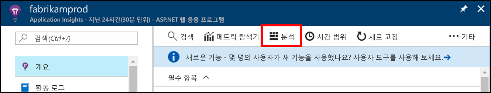
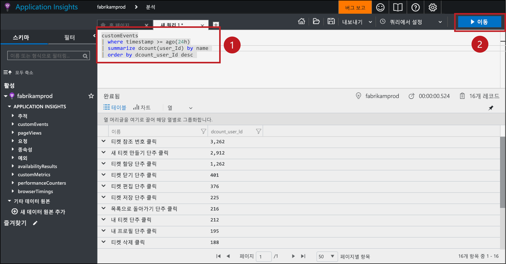
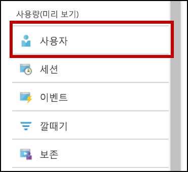
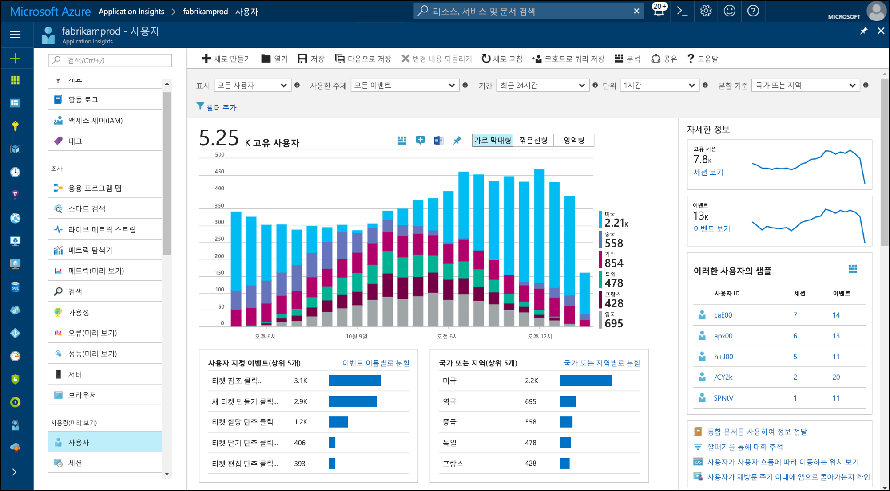
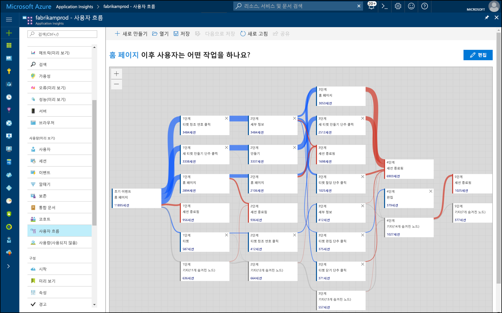

# <a name="start-analyzing-your-mobile-app-with-app-center-and-application-insights"></a>App Center 및 Application Insights를 사용하여 모바일 앱 분석 시작

이 빠른 시작은 Application Insights에 앱의 App Center 인스턴스를 연결하는 과정을 안내합니다. Application Insights를 사용하여, App Center의 [Analytics](https://docs.microsoft.com/mobile-center/analytics/) 서비스를 통해 제공되는 것보다 더 강력한 도구로 원격 분석을 쿼리하고 분할하며 필터링하고 분석할 수 있습니다.

## <a name="prerequisites"></a>필수 조건

이 빠른 시작을 완료하려면 다음이 필요합니다.

- Azure 구독.
- iOS, Android, Xamarin, Universal Windows 또는 React Native 앱.
 
Azure 구독이 아직 없는 경우 시작하기 전에 [체험](https://azure.microsoft.com/free/) 계정을 만듭니다.

## <a name="onboard-to-app-center"></a>App에 등록

모바일 앱으로 Application Insights를 사용하려면 앱을 [App Center](https://docs.microsoft.com/mobile-center/)에 등록해야 합니다. Application Insights는 모바일 앱에서 직접 원격 분석을 수신하지 않습니다. 앱이 사용자 지정 이벤트 원격 정보를 App Center로 보냅니다. 그런 다음, App Center는 이벤트가 수신되면 이러한 사용자 지정 이벤트의 사본을 Application Insights로 내보냅니다.

응용 프로그램을 등록하려면 앱에서 지원하는 각 플랫폼에 대한 App Center 빠른 시작을 따르세요. 각 플랫폼에 대해 별도의 App Center 인스턴스를 만듭니다.

* [iOS](https://docs.microsoft.com/mobile-center/sdk/getting-started/ios).
* [Android](https://docs.microsoft.com/mobile-center/sdk/getting-started/android).
* [Xamarin](https://docs.microsoft.com/mobile-center/sdk/getting-started/xamarin).
* [유니버셜 Windows](https://docs.microsoft.com/mobile-center/sdk/getting-started/uwp).
* [React Native](https://docs.microsoft.com/mobile-center/sdk/getting-started/react-native).

## <a name="track-events-in-your-app"></a>앱에서 이벤트 추적

앱을 App Center에 등록한 후에는 App Center SDK를 사용하여 사용자 지정 이벤트 원격 분석을 보내도록 수정해야 합니다. 사용자 지정 이벤트는 Application Insights로 내보낸 유일한 형식의 App Center 원격 분석입니다.

iOS 앱에서 사용자 지정 이벤트를 보내려면 App Center SDK에서 `trackEvent` 또는 `trackEvent:withProperties` 메서드를 사용하세요. [iOS 앱에서 추적 이벤트에 대해 자세히 알아보기](https://docs.microsoft.com/mobile-center/sdk/analytics/ios)

```Swift
MSAnalytics.trackEvent("Video clicked")
```

Android 앱에서 사용자 지정 이벤트를 보내려면 App Center SDK에서 `trackEvent` 메서드를 사용하세요. [Android 앱에서 추적 이벤트에 대해 자세히 알아보기](https://docs.microsoft.com/mobile-center/sdk/analytics/android)

```Java
Analytics.trackEvent("Video clicked")
```

다른 앱 플랫폼에서 사용자 지정 이벤트를 보내려면 해당 App Center SDK에서 `trackEvent` 메서드를 사용하세요.

사용자 지정 이벤트를 수신하고 있는지 확인하려면 App Center의 **Analytics** 섹션에서 **이벤트** 탭으로 이동하세요. 앱에서 보낸 이벤트가 표시되는 데 1~2분 정도 걸릴 수 있습니다.

## <a name="create-an-application-insights-resource"></a>Application Insights 리소스 만들기

앱에서 사용자 지정 이벤트를 보내고 App Center에서 이러한 이벤트를 수신하면 Azure Portal에서 App Center 유형의 Application Insights 리소스를 만들어야 합니다.

1. [Azure Portal](https://portal.azure.com/)에 로그인합니다.
2. **리소스 만들기** > **관리 도구** > **Application Insights**를 선택합니다.

    

    구성 상자가 표시됩니다. 아래 표를 사용하여 입력 필드를 채웁니다.

    | 설정        |  값           | 설명  |
   | ------------- |:-------------|:-----|
   | **Name**      | "myApp-iOS" 등의 일부 전역적으로 고유 값 | 모니터링하는 응용 프로그램을 식별하는 이름입니다. |
   | **응용 프로그램 유형** | App Center 애플리케이션 | 모니터링하는 응용 프로그램의 유형입니다. |
   | **리소스 그룹**     | 새 리소스 그룹, 또는 메뉴의 기존 리소스 그룹 | 새 Application Insights 리소스를 만들 리소스 그룹 |
   | **위치**: | 메뉴의 위치 | 가까운 위치 또는 응용 프로그램이 호스팅되는 위치 근처를 선택합니다. |

3. **만들기**를 클릭합니다.

앱에 여러 플랫폼(iOS, Android 등)을 지원하는 경우 각 플랫폼에 하나씩 별도의 Application Insights 리소스를 만드는 것이 가장 좋습니다.

## <a name="export-to-application-insights"></a>Application Insights로 내보내기

맨 위 **Essentials** 섹션에 있는 **개요** 페이지의 새 Application Insights 리소스에 이 리소스에 대한 계측 키를 복사합니다.

앱에 대한 App Center 인스턴스:

1. **설정** 페이지에서 **내보내기**를 클릭합니다.
2. **새 내보내기**, **Application Insights**를 차례로 선택한 다음 **사용자 지정**을 클릭합니다.
3. Application Insights 계측 키를 입력란에 붙여넣습니다.
4. Application Insights 리소스를 포함하는 Azure 구독 사용 증가에 동의합니다. 각 Application Insights 리소스는 매월 받은 데이터의 첫 1GB는 무료입니다. [Application Insights 가격 책정 자세히 알아보기](https://azure.microsoft.com/pricing/details/application-insights/)

앱에서 지원하는 각 플랫폼에 이 단계를 반복하세요.

[내보내기](https://docs.microsoft.com/mobile-center/analytics/export)가 설정되면 App Center에서 받은 각 사용자 지정 이벤트는 Application Insights로 복사됩니다. 이벤트가 Application Insights에 도달하는 데 몇 분이 소요될 수 있으므로, 즉시 나타나지 않아도 추가 진단을 수행하기 전에 잠시 기다려 주세요.

처음 연결 시 더 많은 데이터를 제공하기 위해 App Center에서 최근 48시간의 사용자 지정 이벤트는 Application Insights로 자동으로 내보내집니다.

## <a name="start-monitoring-your-app"></a>앱 모니터링 시작

Application Insights는 분석 도구인 App Center에서 제공하는 것 이상으로 앱에서 사용자 지정 이벤트 원격 분석을 쿼리, 분할, 필터링 및 분석할 수 있습니다.

1. **사용자 지정 이벤트 원격 분석을 쿼리합니다**. Application Insights **개요** 페이지에서 **Analytics**를 선택합니다. 

   

   사용자의 Application Insights 리소스와 연결된 Application Insights Analytics 포털이 열립니다. Analytics 포털을 통해 Log Analytics 로그 언어를 사용하여 데이터를 직접 쿼리할 수 있으므로, 앱과 해당 사용자에 대해 임의의 복잡한 질문을 할 수 있습니다.
   
   Analytics 포털에서 새 탭을 열고 다음 쿼리에 붙여넣습니다. 그러면 지난 24시간 동안 앱에서 각 사용자 지정 이벤트를 보낸 개별 사용자 수를, 개별 횟수로 정렬하여 반환합니다.

   ```AIQL
   customEvents
   | where timestamp >= ago(24h)
   | summarize dcount(user_Id) by name 
   | order by dcount_user_Id desc 
   ```

   

   1. 텍스트 편집기에서 쿼리의 아무 곳이나 클릭하여 해당 쿼리를 선택합니다.
   2. 그런 다음, **이동**을 클릭하여 쿼리를 실행합니다. 

   [Application Insights Analytics](app-insights-analytics.md) 및 [Log Analytics 쿼리 언어](https://aka.ms/LogAnalyticsLanguageReference)에 대해 자세히 알아봅니다.


2. **사용자 지정 이벤트 원격 분석을 필터링하고 분할합니다**. Application Insights **개요** 페이지의 목차에서 **사용자**를 선택합니다.

   

   사용자 도구는 얼마나 많은 앱 사용자가 특정 단추를 클릭하고 특정 화면을 방문했거나, App Center SDK를 통해 이벤트로 추적하고 있는 기타 작업을 수행했는지 보여줍니다. App Center 이벤트를 분할하고 필터링하는 방법을 찾고 있다면 사용자 도구는 적합한 옵션입니다.

    

   예를 들어, **분할 기준** 드롭다운 메뉴에서 **국가 또는 지역**을 선택하여 지리별로 사용률을 분할할 수 있습니다.

3. **앱에서 전환, 보존 및 탐색 패턴을 분석합니다.** Application Insights **개요** 페이지의 목차에서 **사용자 흐름**을 선택합니다.

   

   사용자 흐름 도구는 일부 시작 이벤트 후 사용자가 보낼 이벤트를 시각화합니다. 사용자가 앱을 통해 탐색하는 방법을 전반적으로 이해하는 데 유용하며, 많은 사용자가 앱에서 마음을 바꾸거나 같은 작업을 계속 반복하는 곳을 알아낼 수도 있습니다.

   사용자 흐름뿐만 아니라, Application Insights에는 구체적인 질문에 답변할 수 있는 다양한 다른 사용자 행동 분석 도구가 있습니다.

   * **깔대기** - 전환률을 분석하고 모니터링합니다.
   * **보존** - 시간에 따라 앱에서 사용자를 얼마나 잘 보존하고 있는지 분석합니다.
   * **통합 문서** - 시각화와 텍스트를 공유 가능한 보고서로 통합합니다.
   * **코호트** - 다른 분석 도구에서 쉽게 참조할 수 있도록 특정 사용자 또는 이벤트 그룹의 이름을 지정하고 저장합니다.

## <a name="clean-up-resources"></a>리소스 정리

App Center에서 Application Insights를 계속 사용하고 싶지 않다면 App Center에서 내보내기 기능을 해제하고 Application Insights 리소스를 삭제하세요. 그러면 이 리소스에 대해 Application Insights에서 추가로 청구하지 않습니다.

App Center에서 내보내기를 해제하려면:

1. App Center에서 **설정**으로 이동하여 **내보내기**를 선택합니다.
2. 삭제하려는 Application Insights 내보내기를 클릭한 다음, 맨 아래에서 **내보내기 삭제**를 클릭하고 확인합니다.

Application Insights 리소스를 삭제하려면:

1. Azure Portal의 왼쪽 메뉴에서 **리소스 그룹**을 클릭한 다음, Application Insights 리소스가 만들어진 리소스 그룹을 선택합니다.
2. 삭제하려는 Application Insights 리소스를 엽니다. 그런 다음, 리소스 맨 위 메뉴에서 **삭제**를 클릭하고 확인합니다. 그러면 Application Insights로 내보낸 데이터 복사본이 영구적으로 삭제됩니다.

## <a name="next-steps"></a>다음 단계

> [!div class="nextstepaction"]
> [고객이 앱을 사용하는 방법 이해](app-insights-usage-overview.md)
