<properties
	pageTitle="실행 중인 IIS 웹 사이트에서 성능 문제 진단 | Microsoft Azure"
	description="다시 배포하지 않고 웹 사이트의 성능을 모니터링합니다. 독립 실행형 또는 Application Insights SDK를 사용하여 종속성 원격 분석을 가져옵니다."
	services="application-insights"
    documentationCenter=".net"
	authors="alancameronwills"
	manager="douge"/>

<tags
	ms.service="application-insights"
	ms.workload="tbd"
	ms.tgt_pltfrm="ibiza"
	ms.devlang="na"
	ms.topic="get-started-article"
	ms.date="03/09/2016"
	ms.author="awills"/>

# Application Insights 상태 모니터를 설치하여 웹 사이트 성능 모니터링

*Application Insights는 미리 보기 상태입니다.*

Visual Studio Application Insights의 상태 모니터를 사용하여 ASP.NET 응용 프로그램의 예외 및 성능 문제를 진단할 수 있습니다.

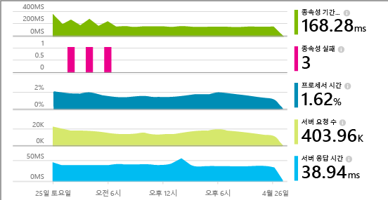

> [AZURE.TIP] [라이브 J2EE 웹앱](app-insights-java-live.md) 및 [Azure 클라우드 서비스](app-insights-cloudservices.md)를 계측하는 방법을 설명하는 별도의 문서가 있습니다.

Application Insights를 IIS 웹 응용 프로그램에 적용하는 세 가지 방법이 있습니다.

* **빌드 시간:** 웹앱 코드에 [Application Insights SDK를 추가][greenbrown]합니다. 그러면 다음 항목을 사용할 수 있습니다.
 * 다양한 표준 진단 및 사용 원격 분석입니다.
 * [Application Insights API][api]를 사용하여 세부 사용을 추적하거나 문제를 진단하는 자체 원격 분석을 작성할 수 있습니다.
* **런타임:** 상태 모니터를 사용하여 서버에서 웹앱을 계측할 수 있습니다.
 * 이미 실행 중인 웹앱 모니터링: 다시 작성하거나 다시 게시할 필요가 없습니다.
 * 다양한 표준 진단 및 사용 원격 분석입니다.
 * 종속성 진단&#151;앱이 데이터베이스, REST API 또는 다른 서비스 등의 다른 구성 요소를 사용하는 곳에서 오류 또는 성능 저하를 찾습니다.
 * 원격 분석 문제를 해결합니다.
* **둘 모두:** SDK를 웹앱 코드로 컴파일하고, 웹 서버에서 상태 모니터를 실행합니다. 두 가지 모두로부터 최상의 기능을 사용합니다.
 * 표준 진단 및 사용 원격 분석
 * 종속성 진단
 * API를 사용하면 사용자 지정 원격 분석을 작성할 수 있습니다.
 * SDK 및 원격 분석의 모든 문제 해결

## Application Insights 상태 모니터를 설치합니다.

[Microsoft Azure](http://azure.com) 구독이 필요합니다.

### 앱이 IIS 서버에서 실행되는 경우

1. IIS 웹 서버에서 관리자 자격 증명으로 로그인합니다.
2. [상태 모니터 설치 관리자](http://go.microsoft.com/fwlink/?LinkId=506648)를 다운로드하고 실행합니다.
4. 설치 마법사에서 Microsoft Azure에 로그인합니다.

    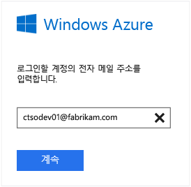

    *연결 오류? [문제 해결](#troubleshooting)을 참조하세요.*

5. 모니터링할 설치되어 있는 웹 응용 프로그램 또는 웹 사이트를 선택한 다음, Application Insights 포털의 결과를 볼 리소스를 구성합니다.

    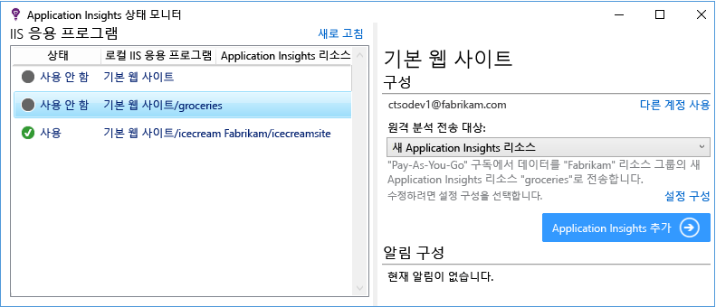

    일반적으로 새 리소스 및 [리소스 그룹][roles]을 구성하도록 선택합니다.

    그렇지 않으면 사이트에 대해 [웹 테스트][availability] 또는 [웹 클라이언트 모니터링][client]을 이미 설정한 경우 기존 리소스를 사용합니다.

6. IIS를 다시 시작합니다.

    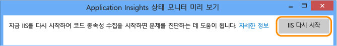

    웹 서비스가 잠시 중단됩니다.

6. ApplicationInsights.config가 모니터링할 웹앱에 삽입되었습니다.

    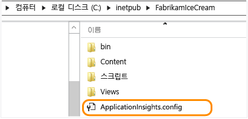

   web.config에 대한 변경 내용이 몇 가지 있습니다.

#### 나중에 다시 구성하시겠습니까?

마법사를 완료한 다음 원할 때마다 에이전트를 다시 구성할 수 있습니다. 에이전트를 설치했지만 초기 설정과 몇 가지 문제가 있는 경우에도 이를 사용할 수 있습니다.

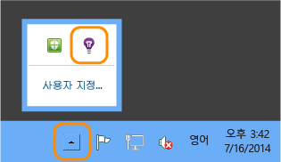

### 앱이 Azure 웹앱으로 실행되는 경우

Azure 웹앱의 제어판에서 Application Insights 확장을 추가합니다.

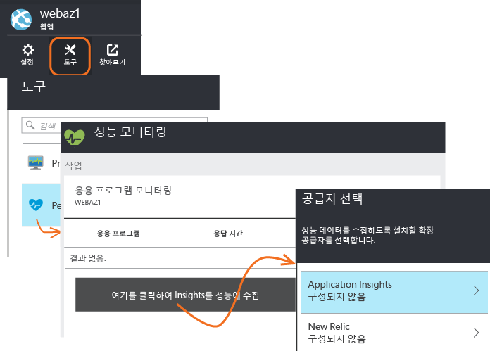

### Azure 클라우드 서비스 프로젝트 만들기인 경우

[웹 및 작업자 역할에 스크립트 추가](app-insights-cloudservices.md)

## 성능 원격 분석 보기

[Azure 포털](https://portal.azure.com)에 로그인하고 Application Insights를 찾아본 다음 만든 리소스를 엽니다.

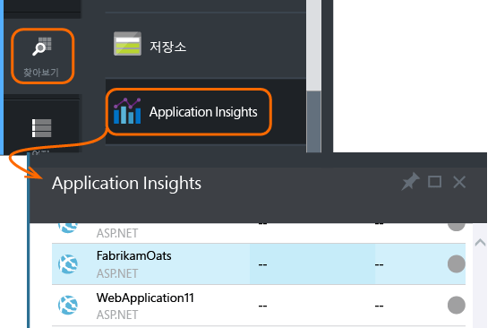

성능 블레이드를 열어 요청, 응답 시간, 종속성 및 기타 데이터를 확인합니다.

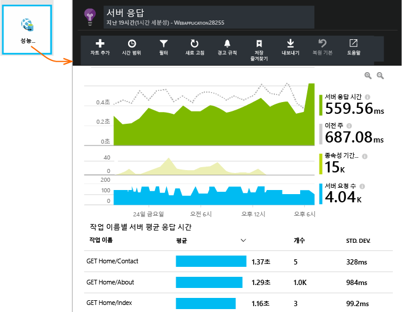

클릭하여 표시되는 내용의 세부 정보를 조정하거나 새 차트를 추가합니다.

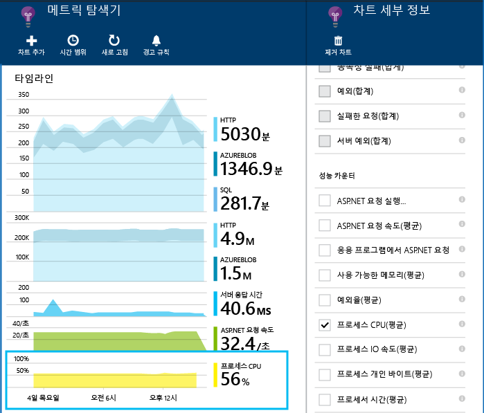

## 종속성

종속성 기간 차트에서는 앱에서 데이터베이스, REST API 또는 Azure BLOB 저장소와 같은 외부 구성 요소로의 호출에 걸린 시간을 보여 줍니다.

호출에 의한 차트를 다른 종속성으로 분할하려면 차트를 선택하고 그룹화를 설정한 다음 종속성, 종속성 유형 또는 종속성 성능을 선택합니다.

또한 차트를 필터링하여 특정 종속성, 유형 또는 성능 버킷을 살펴볼 수 있습니다. 필터를 클릭합니다.

## 성능 카운터

(Azure 웹앱용이 아님) 개요 블레이드에서 서버를 클릭하여 CPU 선점 및 메모리 사용과 같은 서버 성능 카운터의 차트를 확인합니다.

새 차트를 추가하거나 아무 차트나 클릭하여 표시되는 내용을 변경합니다.

또한 [SDK에서 보고된 성능 카운터 집합을 변경](app-insights-configuration-with-applicationinsights-config.md#nuget-package-3)할 수 있습니다.

## 예외

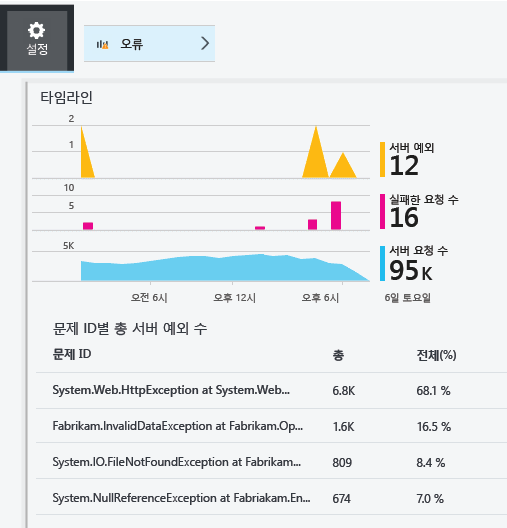

특정 예외로 드릴다운(지난 7일부터)하고 스택 추적 및 컨텍스트 데이터를 가져올 수 있습니다.

## 샘플링

응용 프로그램이 대량의 데이터를 전송하고 ASP.NET 버전 2.0.0-beta3 또는 그 이상에 대해 Application Insights SDK를 사용하는 경우 적응 샘플링 기능이 작동하여 원격 분석의 백분율만 보낼 수 있습니다. [샘플링에 대해 자세히 알아봅니다.](app-insights-sampling.md)

## 문제 해결

### 연결 오류

상태 모니터가 작동할 수 있도록 서버 방화벽에서 일부 나가는 포트를 열어야 합니다.

+ 원격 분석 - 항상 다음 항목이 필요합니다.
 +	`dc.services.visualstudio.com:80`
 +	`dc.services.visualstudio.com:443`
 +	`dc.applicationinsights.microsoft.com`
+ 구성 - 변경하는 경우에만 필요합니다.
 -	`management.core.windows.net:443`
 -	`management.azure.com:443`
 -	`login.windows.net:443`
 -	`login.microsoftonline.com:443`
 -	`secure.aadcdn.microsoftonline-p.com:443`
 -	`auth.gfx.ms:443`
 -	`login.live.com:443`
+ 설치:
 +	`packages.nuget.org:443`
 +	`appinsightsstatusmonitor.blob.core.windows.net:80`

이 목록은 수시로 변경될 수 있습니다.

### 원격 분석이 없나요?

  * 사이트를 사용하여 일부 데이터를 생성합니다.
  * 데이터가 들어올 때까지 몇 분 정도 기다린 다음 **새로 고침**을 클릭합니다.
  * 진단 검색(검색 타일)을 열어 개별 이벤트를 봅니다. 이벤트는 집계 데이터가 차트에 표시되기 전에 진단 검색에 종종 표시됩니다.
  * 상태 모니터를 열고 왼쪽 창에서 응용 프로그램을 선택합니다. "구성 알림" 섹션에 이 응용 프로그램에 대한 진단 메시지가 있는지 확인합니다.

  

  * 서버 방화벽이 위에 나열된 포트에서 나가는 트래픽을 허용하는지 확인합니다.
  * 서버에서 "권한 부족"에 대한 메시지가 표시되는 경우 다음을 시도합니다.
    * IIS 관리자에서 응용 프로그램 풀을 선택하고 **고급 설정**을 연 다음 **프로세스 모델**에서 ID를 확인합니다.
    * 컴퓨터 관리 제어판에서 성능 모니터 사용자 그룹에 이 ID를 추가합니다.
  * 서버에 MMA/SCOM이 설치된 경우 일부 버전이 충돌할 수 있습니다. SCOm과 상태 모니터를 제거한 다음 최신 버전을 다시 설치하세요.
  * [문제 해결][qna]을 참조하세요.

## 시스템 요구 사항

Server에서 Application Insights 상태 모니터에 대한 OS 지원:

- Windows Server 2008
- Windows Server 2008 R2
- Windows Server 2012
- Windows Server 2012 R2

최신 SP 및 .NET Framework 4.0, 4.5 포함

클라이언트 쪽 Windows 7, 8, 8.1에서, 역시 .NET Framework 4.0, 4.5 포함

IIS 지원: IIS 7, 7.5, 8, 8.5(IIS 필요)

## PowerShell을 사용한 자동화

PowerShell을 사용하여 모니터링을 시작하고 중지할 수 있습니다.

`Get-ApplicationInsightsMonitoringStatus [-Name appName]`

* `-Name` (선택 사항)웹앱의 이름입니다.
* 이 IIS 서버에서 각 웹앱(또는 명명된 앱)에 대한 상태를 모니터링하여 Application Insights를 표시합니다.

* 각 앱에 대해 `ApplicationInsightsApplication`을 반환합니다.
 * `SdkState==EnabledAfterDeployment`: 상태 모니터 도구 또는 `Start-ApplicationInsightsMonitoring`에서 앱을 모니터링하고 런타임 시 계측했습니다.
 * `SdkState==Disabled`: 앱이 Application insights에 대해 계측되지 않습니다. 앱을 계측하지 않았거나 상태 모니터 도구 또는 `Stop-ApplicationInsightsMonitoring`를 사용하여 런타임 모니터링을 비활성화되었습니다.
 * `SdkState==EnabledByCodeInstrumentation`: 소스 코드에 SDK를 추가하여 앱을 계측했습니다. 해당 SDK은 업데이트되거나 중지될 수 없습니다.
 * `SdkVersion`은 이 앱을 모니터링하는 데 사용하는 버전을 나타냅니다.
 * `LatestAvailableSdkVersion`은 NuGet 갤러리에서 현재 사용할 수 있는 버전을 나타냅니다. 앱을 이 버전으로 업그레이드하려면 `Update-ApplicationInsightsMonitoring`를 사용합니다.

`Start-ApplicationInsightsMonitoring -Name appName -InstrumentationKey 00000000-000-000-000-0000000`

* `-Name` IIS에서 앱의 이름
* `-InstrumentationKey` 결과를 표시하려는 Application Insights 리소스의 ikey입니다.

* 이 cmdlet은 아직 계측되지 않은 앱에만 영향을 줍니다. 즉, SdkState==NotInstrumented입니다.

    cmdlet은 빌드 시 코드에 SDK를 추가하거나 런타임 시 사전에 이 cmdlet을 사용하여 이미 계측된 앱에 영향을 주지 않습니다.

    앱을 계측하는 데 사용한 SDK 버전은 가장 최근에 이 서버에 다운로드된 버전입니다.

    최신 버전을 다운로드하려면 Update-ApplicationInsightsVersion을 사용합니다.

* 성공 시 `ApplicationInsightsApplication`을 반환합니다. 실패한 경우 stderr에 대한 추적을 기록합니다.

    
          Name                      : Default Web Site/WebApp1
          InstrumentationKey        : 00000000-0000-0000-0000-000000000000
          ProfilerState             : ApplicationInsights
          SdkState                  : EnabledAfterDeployment
          SdkVersion                : 1.2.1
          LatestAvailableSdkVersion : 1.2.3

`Stop-ApplicationInsightsMonitoring [-Name appName | -All]`

* `-Name` IIS에서 앱의 이름
* `-All` 이 IIS 서버에서 모든 앱에 대한 모니터링을 중지합니다 `SdkState==EnabledAfterDeployment`

* 지정된 앱의 모니터링을 중지하고 계측을 제거합니다. 실행 시 상태 모니터링 도구 또는 Start-ApplicationInsightsApplication을 사용하여 계측된 앱에서 작동합니다. (`SdkState==EnabledAfterDeployment`)

* ApplicationInsightsApplication을 반환합니다.

`Update-ApplicationInsightsMonitoring -Name appName [-InstrumentationKey "0000000-0000-000-000-0000"`]

* `-Name`: IIS에서 웹앱의 이름입니다.
* `-InstrumentationKey` (선택 사항.) 이를 사용하여 앱의 원격 분석이 전송되는 리소스를 변경합니다.
* 이 cmdlet은:
 * 최근에 이 컴퓨터에 다운로드된 SDK 버전으로 명명된 앱을 업그레이드합니다. (`SdkState==EnabledAfterDeployment`인 경우에만 작동)
 * 계측 키를 제공하는 경우 명명된 앱은 해당 키가 있는 리소스에 원격 분석을 전송하도록 다시 구성됩니다. (`SdkState != Disabled`인 경우 작동)

`Update-ApplicationInsightsVersion`

* 서버에 최신 Application Insights SDK를 다운로드합니다.

## Azure 템플릿

웹앱이 Azure에 있고 Azure Resource Manager 템플릿을 사용하여 리소스를 만드는 경우 리소스 노드에 이를 추가하여 Application Insights를 구성할 수 있습니다.

    {
      resources: [
        /* Create Application Insights resource */
        {
          "apiVersion": "2015-05-01",
          "type": "microsoft.insights/components",
          "name": "nameOfAIAppResource",
          "location": "centralus",
          "kind": "web",
          "properties": { "ApplicationId": "nameOfAIAppResource" },
          "dependsOn": [
            "[concat('Microsoft.Web/sites/', myWebAppName)]"
          ]
        }
       ]
     } 

* `nameOfAIAppResource` - Application Insights 리소스의 이름
* `myWebAppName` - 웹앱의 ID

## 다음 단계

* [웹 테스트를 만들어][availability] 사이트가 라이브 상태로 유지되고 있는지 확인합니다.
* [이벤트 및 로그를 검색][diagnostic]하여 문제를 진단할 수 있습니다.
* [웹 클라이언트 원격 분석을 추가][usage]하여 웹 페이지 코드에서 예외를 확인하고 추적 호출을 삽입합니다.
* [Application Insights SDK를 웹 서비스 코드에 추가][greenbrown]하여 서버 코드에 추적 및 로그 호출을 삽입할 수 있도록 합니다.

## 비디오

#### 성능 모니터링

[AZURE.VIDEO app-insights-performance-monitoring]

<!--Link references-->

[api]: app-insights-api-custom-events-metrics.md
[availability]: app-insights-monitor-web-app-availability.md
[client]: app-insights-javascript.md
[diagnostic]: app-insights-diagnostic-search.md
[greenbrown]: app-insights-asp-net.md
[qna]: app-insights-troubleshoot-faq.md
[roles]: app-insights-resources-roles-access-control.md
[usage]: app-insights-web-track-usage.md

<!---HONumber=AcomDC_0406_2016-->