<properties
	pageTitle="웹 사이트의 가용성 및 응답성 모니터링 | Microsoft Azure"
	description="Application Insights에서 웹 테스트를 설정합니다. 웹 사이트가 사용할 수 없게 되거나 느리게 응답하는 경우 알림이 제공됩니다."
	services="application-insights"
    documentationCenter=""
	authors="alancameronwills"
	manager="douge"/>

<tags
	ms.service="application-insights"
	ms.workload="tbd"
	ms.tgt_pltfrm="ibiza"
	ms.devlang="na"
	ms.topic="get-started-article"
	ms.date="09/07/2016"
	ms.author="awills"/>

# 웹 사이트의 가용성 및 응답성 모니터링

웹앱 또는 웹 사이트를 서버에 배포한 후에 가용성 및 응답성을 모니터하도록 웹 테스트를 설정할 수 있습니다. [Visual Studio Application Insights](app-insights-overview.md)는 전 세계에서 정기적으로 보내 응용 프로그램에 웹 요청을 보냅니다. 응용 프로그램이 응답하지 않거나 느리게 응답하는 경우 사용자에게 경고할 수 있습니다.

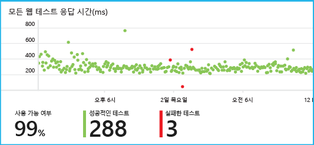

공용 인터넷에서 액세스 가능한 모든 HTTP 또는 HTTPS 끝점에 대해 웹 테스트를 설정할 수 있습니다.

웹 테스트에는 두 가지 유형이 있습니다:

* [URL ping 테스트](#create): Azure 포털에서 만들 수 있는 간단한 테스트입니다.
* [다단계 웹 테스트](#multi-step-web-tests): Visual Studio Ultimate 또는 Visual Studio Enterprise에서 만들고 포털에 업로드합니다.

응용 프로그램 리소스당 최대 10개의 웹 테스트를 만들 수 있습니다.

## 1. 테스트 보고서에 대한 리소스 만들기

이 응용 프로그램에 대한 [Application Insights 리소스를 이미 설정][start]했고 동일한 위치에서 가용성 보고서를 확인하려는 경우 이 단계를 건너뜁니다.

[Microsoft Azure](http://azure.com)에 등록하고 [Azure 포털](https://portal.azure.com)로 이동한 후 Application Insights 리소스를 만듭니다.

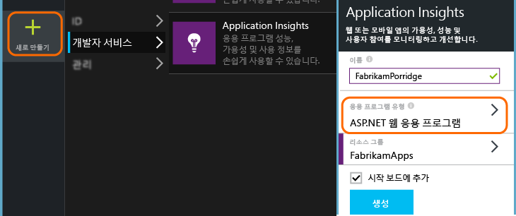

**모든 리소스**를 클릭하여 새 리소스에 대한 개요 블레이드를 엽니다.

## 2. URL ping 테스트 만들기

Application Insights 리소스에서 가용성 타일을 찾습니다. 이것을 클릭하여 응용 프로그램에 대한 웹 테스트 블레이드를 열고 웹 테스트를 추가합니다.

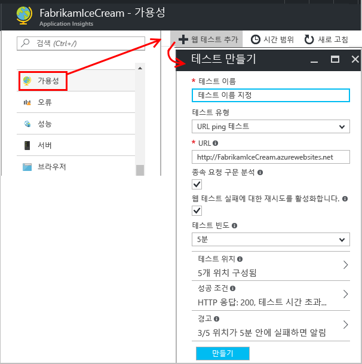

- **URL**은 공용 인터넷에서 볼 수 있어야 합니다. 여기에는 쿼리 문자열이 포함될 수 있으므로 데이터베이스 사용을 연습해 볼 수 있습니다. URL이 리디렉션으로 확인되면 최대 10개의 리디렉션을 따릅니다.
- **종속 요청 구문 분석**: 페이지의 이미지, 스크립트, 스타일 파일 및 기타 리소스는 테스트의 일부로 요청되며 기록된 응답 시간은 다음 시간을 포함합니다. 전체 테스트의 시간 제한 내에서 이러한 모든 리소스를 성공적으로 다운로드할 수 없는 경우 테스트에 실패합니다.
- **다시 시도 사용**: 테스트에 실패하면 잠시 후에 다시 시도합니다. 연속 된 세 번의 시도가 실패하는 경우에 실패가 보고됩니다. 후속 테스트는 일반적인 테스트 빈도로 수행됩니다. 다음 성공까지 다시 시도는 일시적으로 중단됩니다. 이 규칙은 각 테스트 위치에서 독립적으로 적용됩니다. (이 설정을 권장합니다. 평균 실패의 약 80%는 다시 시도에서 사라집니다.)
- **테스트 빈도**: 각 테스트 위치에서 테스트를 실행하는 빈도를 설정합니다. 5분에 5번의 테스트를 하는 빈도로 사이트를 평균 1분마다 테스트합니다.
- **테스트 위치**는 서버가 URL로 웹 요청을 보내는 곳입니다. 웹 사이트의 문제와 네트워크 문제를 구분할 수 있도록 한 가지 이상을 선택합니다. 최대 16 개의 위치를 선택할 수 있습니다.

- **성공 조건**:

    **테스트 시간 제한**: 느린 응답에 대한 알림을 받으려면 이 값을 감소시킵니다. 해당 기간 내에 사이트에서 응답을 받지 못한 경우 테스트는 실패로 계산됩니다. **종속 요청 구문 분석**을 선택한 경우 모든 이미지, 스타일 파일, 스크립트 및 다른 종속된 리소스도 해당 기간 내에 받아야 합니다.

    **HTTP 응답**: 성공으로 계산되어 반환된 상태 코드입니다. 200은 일반적인 웹 페이지의 반환을 나타내는 코드입니다.

    "Welcome!"과 같은 **콘텐츠 일치** 문자열. 이 문자열이 모든 응답에 나타나는지 테스트합니다. 와일드카드 없는 일반 문자열이어야 합니다. 페이지 내용이 변경되면 업데이트해야 할 수 있습니다.

- **경고**는 기본적으로 5분 동안 세 곳에서 오류가 발생하는 경우 사용자에게 전송됩니다. 한 곳에서 발생한 오류는 사이트의 문제가 아니라 네트워크에 문제가 있을 가능성이 높습니다. 그러나 다소 민감하게 작동하도록 임계값을 변경할 수 있으며 메일이 보내지는 주소도 변경할 수 있습니다.

    경고가 발생하면 호출되는 [webhook](../azure-portal/insights-webhooks-alerts.md)를 설정할 수 있습니다. 그러나 현재 쿼리 매개 변수는 속성으로 전달되지 않습니다.

### 더 많은 URL 테스트

테스트를 더 추가 합니다. 예를 들어 홈페이지를 테스트할 수 있을 뿐 아니라 검색을 위한 URL을 테스트하여 데이터베이스가 실행되고 있는지 확인할 수 있습니다.

## 3. 웹 테스트 결과를 참조하세요.

1-2분 후에 결과가 다음에 표시됩니다.

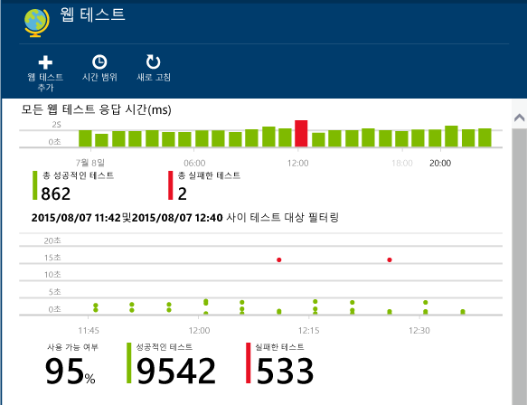

기간의 보다 자세한 정보를 보려면 요약 차트에서 아무 막대나 클릭합니다.

이 차트들은 이 응용 프로그램의 웹테스트에 대해나 결과들의 합입니다.

## 오류가 표시되는 경우

빨간 점을 클릭합니다.

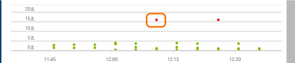

또는, 아래로 스크롤하여 100% 성공보다 작은 테스트를 클릭합니다.

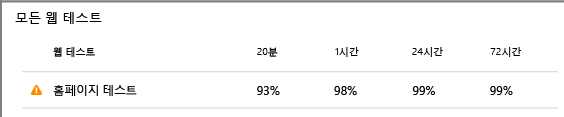

해당 테스트의 결과 창이 열립니다.

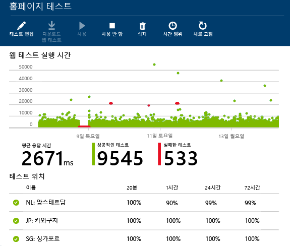

여러 위치에서 테스트를 실행합니다. 결과가 100% 미만인 위치를 하나 선택합니다.

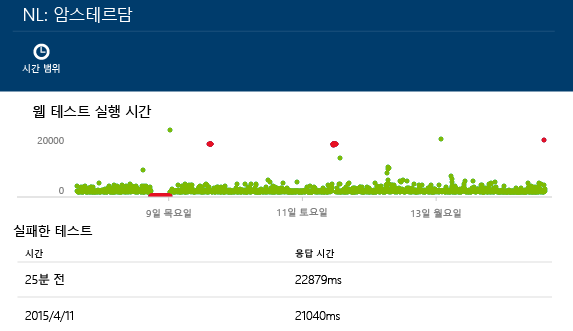

아래로 스크롤하여 **실패한 테스트**로 이동하고 결과를 선택합니다.

결과를 포털에서 평가하려면 클릭하고 실패한 이유를 참조하세요.

또는 결과 파일을 다운로드하여 Visual Studio에서 검사할 수 있습니다.

*정상으로 보이지만 실패로 보고되었습니까?* 모든 이미지, 스크립트, 스타일 시트 및 페이지에 의해 로드된 다른 파일을 확인합니다. 그 중 하나라도 실패하면, 기본 html 페이지가 확인을 로드하는 경우에도 테스트는 실패로 보고됩니다.

## 다중 단계 웹 테스트

URL 시퀀스를 포함하는 시나리오를 모니터링할 수 있습니다. 예를 들어 판매 웹 사이트를 모니터링하는 경우 장바구니에 항목을 제대로 추가할 수 있는지 테스트할 수 있습니다.

다단계 테스트를 만들려면 Visual Studio를 사용하여 시나리오를 기록한 다음 Application Insights에 기록을 업로드합니다. Application Insights는 지정된 간격에 따라 시나리오를 재생하고 응답을 확인합니다.

코딩된 함수는 테스트에 사용할 수 없습니다. 시나리오 단계를 .webtest 파일에 스크립트로 포함해야 합니다.

#### 1\. 시나리오 기록

Visual Studio Enterprise 또는 Ultimate를 사용하여 웹 세션을 기록합니다.

1. 웹 성능 테스트 프로젝트를 만듭니다.

    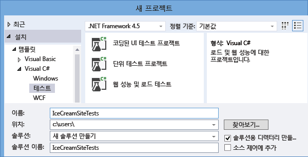

2. .webtest 파일을 열고 기록을 시작합니다.

    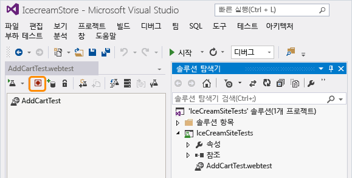

3. 웹사이트를 열고 장바구니에 제품을 추가하는 등 테스트에서 시뮬레이션 하려는 사용자 작업을 수행합니다. 테스트를 중지합니다.

    

    시나리오를 길게 만들지 마세요. 100개 단계와 2 분으로 제한됩니다.

4. 테스트를 다음과 같이 편집합니다.
 - 받은 텍스트 및 응답 코드를 확인하는 유효성 검사를 추가합니다.
 - 불필요한 상호 작용을 모두 제거합니다. 사진이나 광고 또는 추적 사이트에 대한 종속 요청을 제거할 수도 있습니다.

    테스트 스크립트만 편집할 수 있습니다. 사용자 지정 코드를 추가하거나 다른 웹 테스트를 호출할 수는 없습니다. 테스트에 루프를 삽입하지 마세요. 표준 웹 테스트 플러그 인을 사용할 수 있습니다.

5. Visual Studio에서 테스트를 실행하여 제대로 작동하는지 확인합니다.

    웹 test runner에서 웹 브라우저가 열리고 기록한 작업을 반복합니다. 예상대로 작동하는지 확인합니다.

    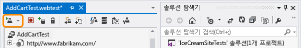

#### 2\. Application Insights에 웹 테스트를 업로드

1. Application Insights 포털에서 새 웹 테스트를 만듭니다.

    

2. 다단계 테스트를 선택하고 .webtest 파일을 업로드합니다.

    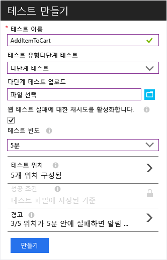

    ping 테스트와 같은 방식으로 테스트 위치, 빈도, 경고 매개 변수를 설정합니다.

단일 URL 테스트의 경우와 마찬가지로 테스트 결과 및 발생한 오류를 확인합니다.

실패의 일반적인 이유는 테스트를 너무 오래 실행하기 때문입니다. 2분 이내로 실행해야 합니다.

테스트가 성공하려면 스크립트, 스타일 시트, 이미지 등을 포함하는 페이지의 모든 리소스가 제대로 로드되어야 한다는 점을 잊지 마세요.

웹 테스트를 .webtest 파일에 완전히 포함해야 합니다. 코딩된 함수는 테스트에 사용할 수 없습니다.

### 다단계 테스트에 시간 및 난수 연결

외부 피드에서 주식과 같이 시간에 따라 변하는 데이터를 가져오는 도구를 테스트한다고 가정합니다. 웹 테스트를 기록할 때 특정 시간을 사용해야 하지만 테스트 매개 변수로 StartTime 및 EndTime을 설정할 수 있습니다.

테스트를 실행하면 EndTime이 항상 현재 시간이 되고 StartTime은 15분이 됩니다.

웹 테스트 플러그 인을 사용하여 시간을 매개 변수화할 수 있습니다.

1. 원하는 각 가변 매개 변수 값에 대한 웹 테스트 플러그 인을 추가합니다. 웹 테스트 도구 모음에서 **웹 테스트 플러그 인 추가**를 선택합니다.

    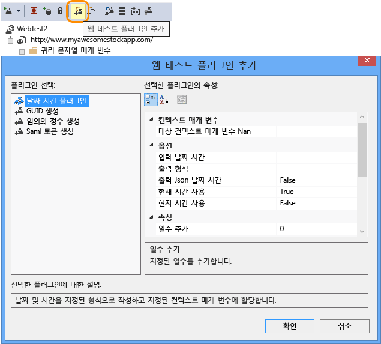

    이 예에서는 날짜 시간 플러그인의 두 인스턴스를 사용합니다. 한 인스턴스는 "15분 전"이고 다른 하나는 "지금"입니다.

2. 각 플러그인의 속성을 엽니다. 이름을 지정하고 현재 시간을 사용하도록 설정합니다. 둘 중 하나에 대해 Add Minutes = -15를 설정합니다.

    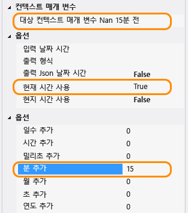

3. 웹 테스트 매개 변수에 {{플러그 인 이름}}을(를) 사용하여 플러그 인 이름을 참조합니다.

    

이제 테스트를 포털에 업로드합니다. 테스트의 모든 실행에 동적 값을 사용합니다.

## 로그인 처리

사용자가 앱에 로그인하면 로그인 뒤에 페이지를 테스트할 수 있도록 로그인을 시뮬레이션하기 위한 여러 옵션이 있습니다. 앱에서 제공하는 보안의 형식에 따라 사용하는 방법이 달라집니다.

모든 경우에 테스트하기 위해 응용 프로그램에 계정을 만들어야 합니다. 웹 테스트가 실제 사용자에 영향을 줄 가능성이 발생하지 않도록 가능하면 이 테스트 계정의 사용 권한을 제한합니다.

### 간단한 사용자 이름 및 암호

일반적인 방법으로 웹 테스트를 기록합니다. 우선 쿠키를 삭제합니다.

### SAML 인정

웹 테스트에 사용할 수 있는 SAML 플러그 인을 사용할 수 있습니다.

### 클라이언트 암호

앱에 클라이언트 암호를 포함하는 로그인 경로가 있는 경우 해당 경로를 사용합니다. AAD(Azure Active Directory)는 클라이언트 암호 로그인을 제공하는 서비스의 예입니다. AAD에서 클라이언트 암호는 앱 키입니다.

앱 키를 사용하는 Azure 웹앱의 샘플 웹 테스트는 다음과 같습니다.

1. 클라이언트 암호(AppKey)를 사용하여 AAD에서 토큰을 가져옵니다.
2. 응답에서 전달자 토큰을 추출합니다.
3. 인증 헤더에서 전달자 토큰을 사용하여 API를 호출합니다.

웹 테스트는 실제 클라이언트여야 합니다. 즉, AAD에 고유한 앱이 있고 clientId + appkey를 사용합니다. 테스트 대상 서비스는 AAD에 고유한 앱을 가집니다. 이 앱의 appID URI는 "리소스" 필드의 웹 테스트에 반영됩니다.

### 공개 인증

공개 인증의 예는 Microsoft 또는 Google 계정으로 로그인하는 것입니다. OAuth를 사용하는 많은 앱은 클라이언트 암호 대안을 제공하므로 첫 번째 방법으로 해당 가능성을 조사해야 합니다.

테스트가 OAuth를 사용하여 로그인해야 하는 경우 일반적인 방법은 다음과 같습니다.

 * Fiddler와 같은 도구를 사용하여 웹 브라우저, 인증 사이트 및 응용 프로그램 간의 트래픽을 검사합니다.
 * 다른 컴퓨터 또는 브라우저를 사용하거나 긴 간격으로 두 개 이상의 로그인을 수행합니다(토큰이 만료되도록 허용).
 * 다른 세션을 비교하여 인증 사이트에서 다시 전달된 토큰을 식별하고 이는 로그인한 후에 앱 서버에 전달됩니다.
 * Visual Studio Online을 사용하여 웹 테스트 기록
 * 토큰을 매개 변수화하고 토큰이 인증자에서 반환되면 매개 변수를 설정하고 사이트에 대한 쿼리에서 사용합니다. (Visual Studio는 테스트를 매개 변수화하려고 하지만 올바르게 토큰을 매개 변수화하지 않습니다.)

## 테스트 편집 또는 사용 안 함

개별 테스트를 열어서 편집하거나 사용하지 않도록 설정합니다.

서비스에 대한 유지 관리를 수행하는 동안 웹 테스트를 사용하지 않도록 설정할 수 있습니다.

## 성능 테스트

웹 사이트에 부하 테스트를 실행할 수 있습니다. 가용성 테스트와 같이 전 세계의 이 지점에서 간단한 요청 또는 다단계 요청을 보낼 수 있습니다. 가용성 테스트와는 달리 많은 요청이 전송되어 여러 동시 사용자를 시뮬레이션합니다.

개요 블레이드에서 **설정**, **성능 테스트**를 엽니다. 테스트를 만들 경우 Visual Studio Team Services 계정에 연결하거나 만들어야 합니다.

테스트가 완료되면 응답 시간 및 성공률이 표시됩니다.

## 자동화

* [PowerShell 스크립트를 사용하여 웹 테스트를 자동으로 설정](https://azure.microsoft.com/blog/creating-a-web-test-alert-programmatically-with-application-insights/)합니다.
* 경고가 발생하면 호출되는 [웹후크](../azure-portal/insights-webhooks-alerts.md)를 설정합니다.

## 질문이 있으십니까? 문제가 있습니까?

* *웹 테스트에서 코드를 호출할 수 있나요?*

    아니요. 테스트 단계는 .webtest 파일에 포함되어야 합니다. 또한 다른 웹 테스트를 호출하거나 루프를 사용할 수 없습니다. 그러나 몇 가지 유용한 플러그 인이 있습니다.

* *HTTPS가 지원됩니까?*

    TLS 1.1 및 TLS 1.2를 지원합니다.

* *"웹 테스트" 및 "가용성 테스트" 간의 차이가 있나요?*

    두 용어는 같은 의미로 사용됩니다.

* *방화벽 뒤에 실행되는 내부 서버에서 가용성 테스트를 사용하려 합니다.*

    [웹 테스트 에이전트의 IP 주소](app-insights-ip-addresses.md#availability)에서 요청을 허용하도록 방화벽을 구성합니다.

* *다중 단계 웹 테스트 업로드 실패*

    300K의 크기 제한이 있습니다.

    루프는 지원되지 않습니다.

    다른 웹 테스트에 대한 참조는 지원되지 않습니다.

    데이터 원본은 지원되지 않습니다.

    
* *다중 단계 테스트가 완료되지 않습니다.*

    테스트당 100개 요청의 제한이 있습니다.

    2분 이상 실행되는 경우 테스트가 중지됩니다.

* *클라이언트 인증서로 테스트를 실행하는 방법*

    죄송합니다만, 지원되지 않습니다.

## 동영상

> [AZURE.VIDEO monitoring-availability-with-application-insights]

## 다음 단계

[진단 로그 검색][diagnostic]

[문제 해결][qna]

[웹 테스트 에이전트의 IP 주소](app-insights-ip-addresses.md)

<!--Link references-->

[azure-availability]: ../insights-create-web-tests.md
[diagnostic]: app-insights-diagnostic-search.md
[qna]: app-insights-troubleshoot-faq.md
[start]: app-insights-overview.md

<!---HONumber=AcomDC_0907_2016-->