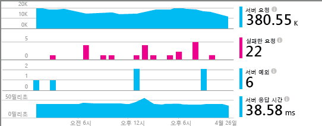
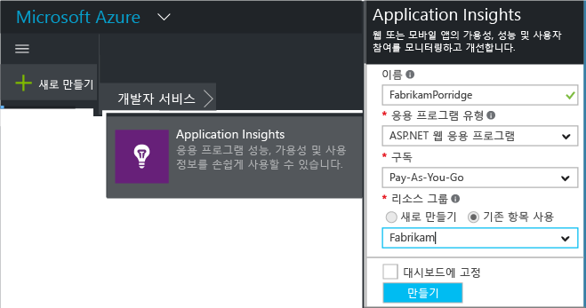
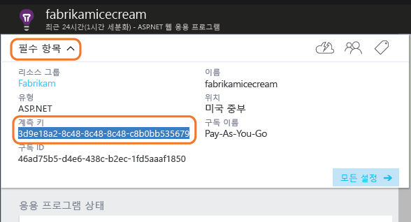
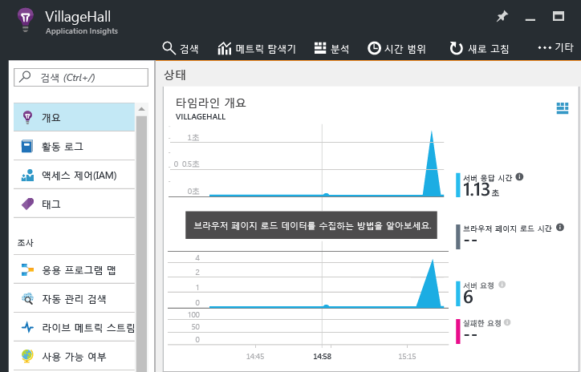

# <a name="add-application-insights-sdk-to-monitor-your-nodejs-app"></a>Application Insights SDK를 추가하여 Node.js 앱 모니터링


[Azure Application Insights](app-insights-overview.md)는 실시간 응용 프로그램을 모니터링하여 [성능 문제 및 예외 사항을 감지 및 진단](app-insights-detect-triage-diagnose.md)하고 [앱이 어떻게 사용되는지 검색](app-insights-overview-usage.md)할 수 있도록 돕습니다. Azure 웹앱뿐 아니라 온-프레미스 IIS 서버 또는 Azure VM에서 호스트된 앱에서도 작동합니다.

SDK는 들어오는 HTTP 요청 속도와 응답, 성능 카운터(CPU, 메모리, RPS) 및 처리되지 않은 예외의 자동 컬렉션을 제공합니다. 또한, 사용자 지정 호출을 추가하여 종속성, 메트릭, 또는 기타 이벤트를 추적할 수 있습니다.



#### <a name="before-you-start"></a>시작하기 전에
다음 작업을 수행해야 합니다.

* [Microsoft Azure](http://azure.com)구독. 팀 또는 조직에 Azure 구독이 있는 경우 소유자가 [Microsoft 계정](http://live.com)을 사용하여 사용자를 추가할 수 있습니다.

## <a name="a-nameaddacreate-an-application-insights-resource"></a><a name="add"></a>Application Insights 리소스 만들기
[Azure Portal][portal]에 로그인하여 새 Application Insights 리소스를 만듭니다. Azure에서 [리소스][roles]는 서비스의 인스턴스입니다. 이 리소스는 사용자에게 분석 및 제공되는 앱의 원격 분석을 하는 곳입니다.



응용 프로그램 유형으로 일반을 선택합니다. 선택하는 응용 프로그램 유형에 따라 [메트릭 탐색기][metrics]에 표시되는 리소스 블레이드 및 속성의 기본 콘텐츠가 설정됩니다.

#### <a name="copy-the-instrumentation-key"></a>계측 키 복사
키는 리소스를 식별하며, 데이터를 리소스로 보내기 위해 SDK에서 곧 설치합니다.



## <a name="a-namesdka-install-the-sdk-in-your-application"></a><a name="sdk"></a> 응용 프로그램에 SDK 설치
```
npm install applicationinsights --save
```

## <a name="usage"></a>사용 현황
이렇게 하면 요청을 모니터링하고 처리되지 않은 예외를 추적하며 시스템을 성능 모니터링(CPU/메모리/RP)할 수 있습니다.

```javascript

var appInsights = require("applicationinsights");
appInsights.setup("<instrumentation_key>").start();
```

환경 변수 APPINSIGHTS_INSTRUMENTATIONKEY에서 계측 키를 설정할 수도 있습니다. 이렇게 하는 경우 `appInsights.setup()` 또는 `appInsights.getClient()`를 호출할 때 인수가 필요하지 않습니다.

원격 분석을 전송하지 않고 SDK를 사용해 볼 수 있습니다. 계측 키를 비어 있지 않은 문자열로 설정합니다.

## <a name="a-nameruna-run-your-project"></a><a name="run"></a> 프로젝트 실행
응용 프로그램을 실행하고 여러 페이지를 열어 원격 분석을 생성해 봅니다.

## <a name="a-namemonitora-view-your-telemetry"></a><a name="monitor"></a> 원격 분석 보기
[Azure 포털](https://portal.azure.com) 로 돌아가서 Application Insights 리소스를 찾습니다.

개요 페이지에서 데이터를 찾습니다. 처음에는 요소가&1;~2개만 표시됩니다. 예:



차트를 클릭하면 더 자세한 메트릭을 볼 수 있습니다. [메트릭에 대해 자세히 알아봅니다.][perf]

#### <a name="no-data"></a>데이터가 없나요?
* 응용 프로그램을 사용하여 여러 페이지를 열어 원격 분석을 생성해 봅니다.
* [검색](app-insights-diagnostic-search.md) 타일을 열고 개별 이벤트를 봅니다. 경우에 따라 메트릭 파이프라인을 통해 들어오려면 이벤트가 약간 더 걸립니다.
* 몇 초 정도 기다렸다가 **새로고침**을 클릭합니다. 차트는 주기적으로 새로 고쳐지지만 일부 데이터가 표시되기를 기다리는 경우에는 수동으로 새로 고칠 수 있습니다.
* [문제 해결][qna]을 참조하세요.

## <a name="publish-your-app"></a>앱 게시
이제 응용 프로그램을 IIS 또는o Azure에 배포하고 누적되는 데이터를 관찰합니다.

#### <a name="no-data-after-you-publish-to-your-server"></a>서버에 게시한 후 데이터가 없나요?
서버 방화벽에서 나가는 트래픽에 대해 다음 포트를 엽니다.

* `dc.services.visualstudio.com:443`
* `f5.services.visualstudio.com:443`

#### <a name="trouble-on-your-build-server"></a>빌드 서버에 문제가 있나요?
[이 문제 해결 항목](app-insights-asp-net-troubleshoot-no-data.md#NuGetBuild)을 참조하세요.

## <a name="customized-usage"></a>사용자 지정한 사용 현황
### <a name="disabling-auto-collection"></a>자동 컬렉션 사용 안 함
```javascript
import appInsights = require("applicationinsights");
appInsights.setup("<instrumentation_key>")
    .setAutoCollectRequests(false)
    .setAutoCollectPerformance(false)
    .setAutoCollectExceptions(false)
    // no telemetry will be sent until .start() is called
    .start();
```

### <a name="custom-monitoring"></a>사용자 지정 모니터링
```javascript
import appInsights = require("applicationinsights");
var client = appInsights.getClient();

client.trackEvent("custom event", {customProperty: "custom property value"});
client.trackException(new Error("handled exceptions can be logged with this method"));
client.trackMetric("custom metric", 3);
client.trackTrace("trace message");
```

[원격 분석 API에 대해 자세히 알아봅니다](app-insights-api-custom-events-metrics.md).

### <a name="using-multiple-instrumentation-keys"></a>여러 계측 키 사용
```javascript
import appInsights = require("applicationinsights");

// configure auto-collection with one instrumentation key
appInsights.setup("<instrumentation_key>").start();

// get a client for another instrumentation key
var otherClient = appInsights.getClient("<other_instrumentation_key>");
otherClient.trackEvent("custom event");
```

## <a name="examples"></a>예
### <a name="tracking-dependency"></a>종속성 추적
```javascript
import appInsights = require("applicationinsights");
var client = appInsights.getClient();

var startTime = Date.now();
// execute dependency call
var endTime = Date.now();

var elapsedTime = endTime - startTime;
var success = true;
client.trackDependency("dependency name", "command name", elapsedTime, success);
```


### <a name="manual-request-tracking-of-all-get-requests"></a>모든 "GET" 요청의 수동 요청 추적
```javascript
var http = require("http");
var appInsights = require("applicationinsights");
appInsights.setup("<instrumentation_key>")
    .setAutoCollectRequests(false) // disable auto-collection of requests for this example
    .start();

// assign common properties to all telemetry sent from the default client
appInsights.client.commonProperties = {
    environment: process.env.SOME_ENV_VARIABLE
};

// track a system startup event
appInsights.client.trackEvent("server start");

// create server
var port = process.env.port || 1337
var server = http.createServer(function (req, res) {
    // track all "GET" requests
    if(req.method === "GET") {
        appInsights.client.trackRequest(req, res);
    }

    res.writeHead(200, { "Content-Type": "text/plain" });
    res.end("Hello World\n");
}).listen(port);

// track startup time of the server as a custom metric
var start = +new Date;
server.on("listening", () => {
    var end = +new Date;
    var duration = end - start;
    appInsights.client.trackMetric("StartupTime", duration);
});
```

## <a name="next-steps"></a>다음 단계
* [포털에서 원격 분석 모니터링](app-insights-dashboards.md)
* [원격 분석에 분석 쿼리 작성](app-insights-analytics-tour.md)

<!--Link references-->

[knowUsers]: app-insights-overview-usage.md
[metrics]: app-insights-metrics-explorer.md
[perf]: app-insights-web-monitor-performance.md
[portal]: http://portal.azure.com/
[qna]: app-insights-troubleshoot-faq.md
[roles]: app-insights-resources-roles-access-control.md

