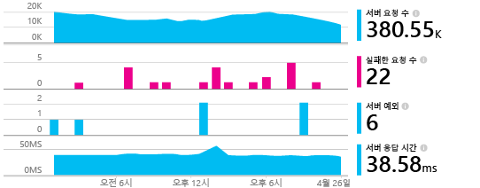
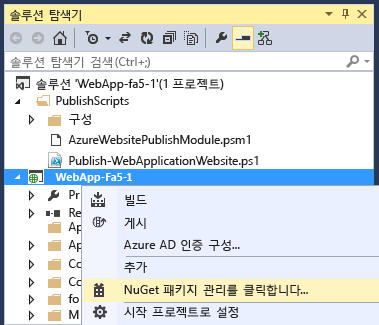
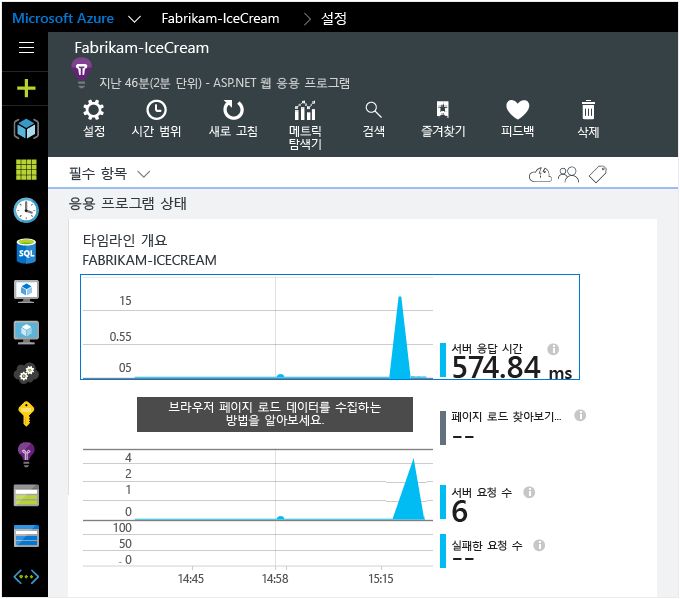
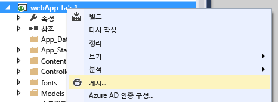
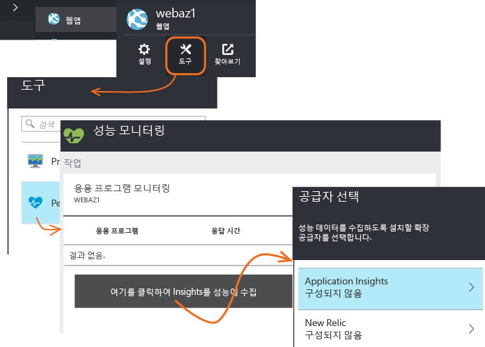

<properties
	pageTitle="Application Insights SDK를 추가하여 ASP.NET 앱 모니터링 | Microsoft Azure"
	description="Application Insights를 사용하여 온-프레미스 또는 Microsoft Azure 웹 응용 프로그램의 사용량, 가용성 및 성능을 분석합니다."
	services="application-insights"
    documentationCenter=".net"
	authors="alancameronwills"
	manager="douge"/>

<tags
	ms.service="application-insights"
	ms.workload="tbd"
	ms.tgt_pltfrm="ibiza"
	ms.devlang="na"
	ms.topic="get-started-article"
	ms.date="10/04/2015"
	ms.author="awills"/>


# Application Insights SDK를 추가하여 ASP.NET 앱 모니터링

*Application Insights는 미리 보기 상태입니다.*

[AZURE.INCLUDE [app-insights-selector-get-started](../../includes/app-insights-selector-get-started.md)]


Visual Studio Application Insights는 실시간 응용 프로그램을 모니터링하여 [성능 문제 및 예외 사항을 감지 및 진단][detect]하고 [앱이 어떻게 사용되는지 검색][knowUsers]할 수 있도록 돕습니다. 다양한 응용 프로그램 종류에서 사용할 수 있습니다. Azure 웹앱뿐 아니라 온-프레미스 IIS 서버 또는 Azure VM에서 호스트된 앱에서도 작동합니다.




*참고 항목:*

* [ASP.NET 5](app-insights-asp-net-five.md)
* [장치 앱 및 Java 서버][platforms]

#### 시작하기 전에

많은 응용 프로그램의 경우 대부분 공지 없이 [Visual Studio가 앱에 Application Insights를 추가할 수 있습니다](#ide). 하지만 무슨 일인지 더 잘 이해하기 위해 본 문서를 읽어 보면 수동으로 단계가 안내됩니다.


다음 작업을 수행해야 합니다.

* [Microsoft Azure](http://azure.com) 구독. 팀 또는 조직에 Azure 구독이 있는 경우 소유자가 [Microsoft 계정](http://live.com)을 사용하여 사용자를 추가할 수 있습니다.
* Visual Studio 2013 이상.

## <a name="add"></a> 1. Application Insights 리소스 만들기

[Azure 포털][portal]에 로그인한 다음 새 Application Insights 리소스를 만듭니다. 응용 프로그램 종류로 ASP.NET을 선택합니다.


Azure에서 [리소스][roles]는 서비스의 인스턴스입니다. 이 리소스는 사용자에게 분석 및 제공되는 앱의 원격 분석을 하는 곳입니다.

선택하는 응용 프로그램 종류에 따라 [메트릭 탐색기][metrics]에 표시되는 리소스 블레이드 및 속성의 기본 콘텐츠가 설정됩니다.

#### 계측 키 복사

키는 리소스를 식별하며, 데이터를 리소스로 보내기 위해 SDK에서 곧 설치합니다.


새 리소스르 만들기 위해 방금 수행한 단계는 모든 응용 프로그램을 모니터링하는 좋은 방법입니다. 이제 데이터를 보낼 수 있습니다.

## <a name="sdk"></a> 2. 응용 프로그램에 SDK 설치

Application Insights SDK의 설치 및 구성은 작업하는 플랫폼에 따라 달라 집니다. ASP.NET 앱의 경우, 쉽습니다.

1. Visual Studio에서 웹앱 프로젝트의 NuGet 패키지를 편집합니다.

    

2. 웹앱용 Application Insights SDK를 설치합니다.

    

3. ApplicationInsights.config(NuGet 설치에 의해 추가됨)를 편집합니다. 닫는 태그 바로 전에 삽입합니다.

    `<InstrumentationKey>` *복사한 계측 키* `</InstrumentationKey>`

    또는 앱에서 [일부 코드를 작성하여 키를 설정][apikey]할 수 있습니다.

#### SDK의 나중 버전으로 업그레이드하려면

종종 새 버전의 SDK가 릴리스됩니다.

[SDK의 새 릴리스](app-insights-release-notes-dotnet.md)로 업그레이드하려면, NuGet 패키지 관리자를 다시 열고 설치된 패키지를 필터링합니다. **Microsoft.ApplicationInsights.Web**을 선택하고 **업그레이드**를 선택합니다.

ApplicationInsights.config에 대한 사용자 지정을 변경한 경우, 업그레이드 전에 복사본을 저장하고 나중에 변경 내용을 새 버전에 병합합니다.


## <a name="run"></a> 3. 프로젝트 실행

**F5** 키를 사용하여 응용 프로그램을 실행하고 여러 페이지를 열어 원격 분석을 생성해 봅니다.

Visual Studio에 전송한 이벤트 수가 표시됩니다.


## <a name="monitor"></a> 4. 원격 분석 보기

[Azure 포털][portal]로 돌아가서 Application Insights 리소스를 찾습니다.


개요 차트에서 데이터를 찾습니다. 처음에는 요소가 1~2개만 표시됩니다. 예:



차트를 클릭하면 더 자세한 메트릭을 볼 수 있습니다. [메트릭에 대해 자세히 알아봅니다.][perf]

#### 데이터가 없나요?

* 응용 프로그램을 사용하여 여러 페이지를 열어 원격 분석을 생성해 봅니다.
* [검색][diagnostic] 타일을 열고 개별 이벤트를 봅니다. 경우에 따라 메트릭 파이프라인을 통해 들어오려면 이벤트가 약간 더 걸립니다.
* 몇 초 정도 기다렸다가 **새로고침**을 클릭합니다. 차트는 주기적으로 새로 고쳐지지만 일부 데이터가 표시되기를 기다리는 경우에는 수동으로 새로 고칠 수 있습니다.
* [문제 해결][qna]을 참조하세요.

## 응용 프로그램 게시

이제 응용 프로그램을 IIS 또는o Azure에 배포하고 누적되는 데이터를 관찰합니다.



디버그 모드에서 실행할 때는 파이프라인을 통해 원격 분석이 신속하게 수행되므로 데이터가 몇 초 내에 표시됩니다. 릴리스 구성에서 앱을 배포할 때는 데이터가 더 천천히 누적됩니다.

#### 서버에 게시한 후 데이터가 없나요?

서버 방화벽에서 나가는 트래픽에 대해 다음 포트를 엽니다.

+ `dc.services.visualstudio.com:443`
+ `f5.services.visualstudio.com:443`


#### 빌드 서버에 문제가 있나요?

[이 문제 해결 항목](app-insights-troubleshoot-faq.md#NuGetBuild)을 참조하세요.

> [AZURE.NOTE]앱에서 다양한 원격 분석을 생성하는 경우(ASP.NET SDK 버전 2.0.0-beta3 이상 사용), 적응 샘플링 모듈 이벤트의 대표적인 일부만 전송하여 포털에 전송되는 볼륨이 자동으로 줄어듭니다. 그러나, 동일한 요청과 관련된 이벤트가 그룹으로 선택되거나 선택 취소되므로 관련 이벤트 간을 이동할 수 있습니다. [샘플링에 대해 알아봅니다](app-insights-sampling.md).


## 5\. 종속성 추적(및 IIS 성능 카운터 추가)

SDK에는 일부 데이터에 액세스할 경우 다음과 같은 도움이 필요 합니다. 특히 자동으로 데이터베이스, REST Api 및 기타 외부 구성 요소를 앱에서 호출을 측정하기 위해 이 추가 단계가 필요합니다. 종속성 메트릭은 성능 문제 진단을 도와줄 때 매우 유용합니다.

또한 자체 IIS 서버에서 실행 중인 경우 이 단계에서 시스템 성능 카운터가 [메트릭 탐색기](app-insights-metrics-explorer.md)에 표시되도록 합니다.

#### 앱이 IIS 서버에서 실행되는 경우

관리자 권한으로 서버에 로그인하고 [Application Insights 상태 모니터](http://go.microsoft.com/fwlink/?LinkId=506648)를 설치합니다.

[방화벽에서 나가는 포트를 추가로 열어야](app-insights-monitor-performance-live-website-now.md#troubleshooting) 할 수도 있습니다.

이 단계를 수행하면 [성능 카운터의 보고](app-insights-web-monitor-performance.md#system-performance-counters)(예: CPU, 메모리, 네트워크 선점)도 가능합니다.

#### 앱이 Azure 웹앱인 경우

Azure 웹앱의 제어판에서 Application Insights 확장을 추가합니다.




#### Azure 클라우드 서비스 프로젝트 만들기인 경우

[웹 및 작업자 역할에 스크립트 추가](app-insights-cloudservices.md)


## 6\. 클라이언트쪽 모니터링을 추가 합니다.

응용 프로그램의 서버(백엔드)에서 원격 분석 데이터를 보내는 SDK를 설치 했습니다. 이제 클라이언트쪽 모니터링을 추가할 수 있습니다. 이 사용자, 세션, 페이지 보기 및 모든 예외 또는 브라우저에서 발생하는 충돌에 데이터를 제공합니다. 사용자는 응용 프로그램과 사용자의 고객이 함께 작동하는지 추적하는 코드를 오른쪽 아래의 클릭과 키 입력 세부 수준에서 작성할 수 있습니다.


모든 페이지에 JavaScript 코드 조각을 추가합니다. Application Insights 리소스에서 코드를 가져옵니다.


코드는 응용 프로그램 리소스를 식별하는 계측 키를 포함한다는 것을 참고하세요.

[웹 페이지 추적에 대해 더 알아보기](app-insights-web-track-usage.md)


## 응용 프로그램 버전 추적

MS 빌드 프로세스에서 `buildinfo.config`가 생성되도록 합니다. .csproj 파일에서 다음을 추가합니다.

```XML

    <PropertyGroup>
      <GenerateBuildInfoConfigFile>true</GenerateBuildInfoConfigFile>    <IncludeServerNameInBuildInfo>true</IncludeServerNameInBuildInfo>
    </PropertyGroup> 
```

빌드 정보가 있는 경우 Application Insights 웹 모듈에서 원격 분석의 모든 항목에 **응용 프로그램 버전**을 속성으로 자동으로 추가합니다. 이렇게 하면 [진단 검색][diagnostic]을 수행하거나 [메트릭을 탐색][metrics]할 때 버전을 기준으로 필터링할 수 있습니다.

그러나 빌드 버전 번호가 Visual Studio의 개발자 빌드가 아닌 MS 빌드에서 생성되도록 합니다.

## 7\. 설치 완료

응용 프로그램의 모든 부분을 완벽하게 살펴보려면 몇 가지 할 일이 더 있습니다.

* [웹 테스트를 설정][availability]하여 응용 프로그램이 라이브 상태로 유지되며 응답하는지 확인할 수 있습니다.
* 즐겨찾는 로깅 프레임워크에서 [로그 추적 캡처][netlogs]
* [사용자 지정 이벤트 및 메트릭을 추적][api]하여 클라이언트나 서버 또는 둘 다에서 응용 프로그램이 어떻게 사용되는지 알아볼 수 있습니다.

## <a name="ide"> </a>자동화된 방법

이 문서의 시작 부분에서 수동으로 Application Insights 리소스를 생성한 다음 SDK를 설치하는 방법을 설명하겠다고 말씀드렸습니다. 해당 절차의 두 부분을 이해하는 것이 좋습니다. 하지만 ASP.NET 앱(및 기타 다른 앱)의 경우 훨씬 더 빠른 자동화된 방법이 있습니다.

[Visual Studio](http://go.microsoft.com/fwlink/?linkid=397827&clcid=0x409)(2013 업데이트 3 이상) 및 [Microsoft Azure](http://azure.com) 계정이 필요합니다.

#### 새 프로젝트의 경우

Visual Studio에서 새 프로젝트를 만드는 경우 **Application Insights 추가**가 선택되었는지 확인합니다.


Visual Studio는 Application Insights에서 리소스를 만들고, SDK를 프로젝트에 추가하고, `.config` 파일에 키를 배치합니다.

프로젝트에 웹 페이지가 있는 경우에도 [JavaScript SDK][client]를 마스터 웹 페이지에 추가합니다.

#### ...기존 프로젝트의 경우

솔루션 탐색기에서 프로젝트를 마우스 오른쪽 단추로 클릭하고 **Application Insights 추가**를 선택합니다.


Visual Studio는 Application Insights에서 리소스를 만들고, SDK를 프로젝트에 추가하고, `.config` 파일에 키를 배치합니다.

이 경우에 [JavaScript SDK][client]는 웹 페이지에 추가하지 않습니다. 이는 다음 단계에서 수행하는 것이 좋습니다.

#### 설치 옵션

프로젝트를 처음 만드는 경우 Microsoft Azure Preview에 로그인하거나 등록하라는 메시지가 표시됩니다.

이 앱이 더 큰 응용 프로그램의 일부인 경우, **구성 설정**을 사용하여 다른 구성 요소와 동일한 리스소 그룹에 넣고자 할 수 있습니다.

*Application Insights 옵션이 표시되지 않는 경우 Visual Studio 2013 업데이트 3 이상을 사용 중이고, 확장 및 업데이트에서 Application Insights Tools를 사용하도록 설정되어 있는지 확인합니다.*

#### 프로젝트에서 Application Insights 열기


## <a name="video"></a>동영상

> [AZURE.VIDEO getting-started-with-application-insights]


<!--Link references-->

[api]: app-insights-api-custom-events-metrics.md
[apikey]: app-insights-api-custom-events-metrics.md#ikey
[availability]: app-insights-monitor-web-app-availability.md
[azure]: ../insights-perf-analytics.md
[client]: app-insights-javascript.md
[detect]: app-insights-detect-triage-diagnose.md
[diagnostic]: app-insights-diagnostic-search.md
[knowUsers]: app-insights-overview-usage.md
[metrics]: app-insights-metrics-explorer.md
[netlogs]: app-insights-asp-net-trace-logs.md
[perf]: app-insights-web-monitor-performance.md
[platforms]: app-insights-platforms.md
[portal]: http://portal.azure.com/
[qna]: app-insights-troubleshoot-faq.md
[redfield]: app-insights-monitor-performance-live-website-now.md
[roles]: app-insights-resources-roles-access-control.md
[start]: app-insights-overview.md

<!---HONumber=AcomDC_1203_2015-->